## PYTANIE 1: Automaty i klasy języków (AISDI)

**Porównać "siłę wyrazu" automatu skończonego, automatu ze stosem oraz maszyny Turinga. Jakie klasy języków rozpoznaje każdy z nich?**

---

### Tło pojęciowe — słowniczek

**Język (formalny)** — zbiór słów (ciągów symboli) nad ustalonym alfabetem Σ. Np. alfabet Σ = {a, b}, język L = {ab, aabb, aaabbb, ...} = {aⁿbⁿ | n ≥ 1}. Język formalny to nie język naturalny (polski, angielski) — to matematyczny zbiór napisów spełniających pewną regułę.

**Automat** — abstrakcyjny model maszyny obliczeniowej. Czyta wejście (słowo) symbol po symbolu i stwierdza, czy to słowo należy do danego języka. „Rozpoznaje" (akceptuje) język = akceptuje dokładnie te słowa, które do niego należą, i odrzuca pozostałe.

**Stan (state)** — chwilowa „konfiguracja" automatu. Automat przechodzi między stanami na podstawie odczytanego symbolu. Pomyśl o nim jak o pozycji na schemacie blokowym — automat „wie" tylko tyle, ile mówi mu aktualny stan.

**Pamięć** — dodatkowa struktura danych, którą automat może zapisywać i odczytywać poza samym stanem. FA nie ma żadnej pamięci (cała informacja to aktualny stan). PDA ma stos. TM ma taśmę.

**Stos (stack)** — struktura danych typu LIFO (Last In, First Out = ostatni włożony, pierwszy wyjęty). Jak stos talerzy: dokładasz na górę, zdejmujesz z góry. Jedyny dostęp to szczyt stosu — nie możesz zajrzeć na dno bez zdjęcia wszystkiego powyżej.

**LIFO** — Last In, First Out. Zasada działania stosu: element dodany jako ostatni jest usuwany jako pierwszy. Przeciwieństwo FIFO (First In, First Out = kolejka).

**Taśma (tape)** — nieskończona (lub ograniczona) linia komórek, z których każda przechowuje symbol. Głowica odczytująco-zapisująca (R/W) może się poruszać w lewo i prawo, odczytywać i nadpisywać symbole. To pamięć o swobodnym dostępie — w przeciwieństwie do stosu, możesz wrócić do dowolnego wcześniejszego miejsca.

**DFA i NFA** — DFA = Deterministic Finite Automaton (deterministyczny automat skończony): w każdym stanie, dla każdego symbolu, istnieje DOKŁADNIE jedno przejście — automat zawsze „wie", co robić. NFA = Nondeterministic Finite Automaton (niedeterministyczny): może mieć WIELE przejść dla jednego symbolu (lub żadne), a także przejścia ε (bez czytania symbolu). **DFA ≡ NFA** oznacza, że rozpoznają DOKŁADNIE te same języki — każdy NFA da się zamienić na równoważny DFA (konstrukcja podzbiorów, powerset construction). NFA bywa wygodniejszy do zapisu, ale nie jest „silniejszy".

**Wyrażenie regularne (regular expression, regex)** — wzorzec tekstowy opisujący zbiór ciągów znaków. Składa się z: symboli alfabetu, konkatenacji (ab), alternatywy (a|b), gwiazdki Kleene'ego (a* = zero lub więcej a). Np. `(a|b)*abb` opisuje wszystkie ciągi nad {a,b} kończące się na „abb". **Równoważne FA** = każde wyrażenie regularne opisuje język, który można rozpoznać automatem skończonym, i odwrotnie — to ten sam zbiór języków.

**Identyfikatory i podzielność (przykłady języków regularnych):**
- *Identyfikatory* — nazwy zmiennych w programowaniu, np. `[a-zA-Z_][a-zA-Z0-9_]*` (zaczyna się od litery lub _, potem litery/cyfry/_). To wyrażenie regularne → język regularny.
- *Podzielność* — np. „liczby binarne podzielne przez 3": automat z 3 stanami (reszta 0, 1, 2) śledzi resztę z dzielenia — nie potrzebuje pamięci, wystarczą stany.

**Nawiasy** — język poprawnie zagnieżdżonych nawiasów, np. `()`, `(())`, `(()())`. FA nie poradzi sobie z tym, bo musi „liczyć" głębokość zagnieżdżenia (potrzebuje pamięci) — PDA ze stosem to robi naturalnie (push na `(`, pop na `)`). To klasyczny język bezkontekstowy.

**Palindromy** — słowa czytane tak samo od przodu i od tyłu, np. `abba`, `aba`, `aabaa`. FA nie rozpoznaje palindromów, bo musiałby zapamiętać pierwszą połowę słowa. PDA rozpoznaje palindromy o nieparzystej długości (NPDA), ale nie deterministycznie — musi „zgadnąć" środek.

**DPDA i NPDA:**
- DPDA = Deterministic Pushdown Automaton — w każdej konfiguracji (stan + szczyt stosu + symbol) jest JEDNO możliwe przejście.
- NPDA = Nondeterministic Pushdown Automaton — może mieć WIELE przejść, „zgaduje" właściwą ścieżkę.
- **DPDA ⊂ NPDA** — w przeciwieństwie do FA, tutaj niedeterminizm DODAJE moc! NPDA rozpoznaje ściśle więcej języków niż DPDA. Np. palindromy nad {a,b} (wwᴿ) wymagają NPDA — DPDA nie potrafi „zgadnąć" środka słowa.

**Dlaczego aⁿbⁿ, nawiasy, wwᴿ pasują do Typu 2 (PDA), a aⁿbⁿcⁿ i ww nie:**
- **aⁿbⁿ** — stos zlicza: push a na stos, potem pop a przy każdym b. Jeśli stos pusty po przeczytaniu → akceptuj. Stos idealnie pasuje do „zliczenia jednej rzeczy, potem dopasowania drugiej".
- **Nawiasy ()** — push na `(`, pop na `)`. Stos śledzi głębokość.
- **wwᴿ** (słowo + jego odwrócenie, np. abba) — push pierwszą połowę, potem pop i porównuj z drugą. NPDA „zgaduje" środek.
- **aⁿbⁿcⁿ — NIE da się na stosie:** stos zużyje się przy dopasowaniu a↔b (push a, pop przy b), i już PUSTY przy c — nie ma czym liczyć c. Potrzeba dwóch niezależnych „liczników" jednocześnie → potrzebna taśma R/W.
- **ww (słowo powtórzone, np. abab) — NIE da się na stosie:** w przeciwieństwie do wwᴿ, druga połowa NIE jest odwrócona, więc porównanie „z góry stosu" nie działa. Stos odwraca kolejność — to pomaga przy palindromach, ale przeszkadza przy powtórzeniu.

**|w| w Typie 1** — |w| to długość słowa wejściowego w. Np. jeśli w = „aabbcc", to |w| = 6. LBA (Linear Bounded Automaton) to maszyna Turinga, której taśma jest ograniczona do co najwyżej |w| komórek (liniowo proporcjonalnie do długości wejścia). Nie może wydłużać taśmy ponad to.

**DLBA i NLBA:**
- DLBA = Deterministic Linear Bounded Automaton.
- NLBA = Nondeterministic Linear Bounded Automaton.
- **Czy DLBA = NLBA?** — to OTWARTY PROBLEM (nierozwiązany!). Nie wiemy, czy deterministyczny LBA rozpoznaje te same języki co niedeterministyczny. To jedno z wielkich otwartych pytań teorii złożoności.

**Dlaczego aⁿbⁿcⁿ i ww pasują do Typu 1 (LBA):**
- **aⁿbⁿcⁿ** — LBA z taśmą R/W może: (1) przejść przez a-ki zaznaczając jednego, (2) przejść przez b-ki zaznaczając jednego, (3) przejść przez c-ki zaznaczając jednego, (4) wrócić na początek i powtarzać. Taśma pozwala wielokrotnie przechodzić i „odznaczać" symbole — tego stos nie potrafi.
- **ww** — LBA porównuje i-ty symbol pierwszej połowy z i-tym symbolem drugiej, przeskakując po taśmie. Swobodny dostęp do taśmy umożliwia porównanie w dowolnej kolejności.

**DTM i NTM — dlaczego równoważne:**
- DTM = Deterministic Turing Machine, NTM = Nondeterministic Turing Machine.
- **DTM ≡ NTM** pod względem MOCY (rozpoznawanych języków) — DTM może symulować NTM, np. przez BFS po drzewie konfiguracji. Symulacja jest wykładniczo wolniejsza, ale DTM rozpoznaje DOKŁADNIE te same języki.
- Uwaga: czy symulacja musi być wolniejsza to osobne pytanie — to jest istota problemu P vs NP!

**Domknięcie ∩/¬ (closure under intersection and complement):**
- Klasa języków jest „domknięta" na operację, jeśli wynik tej operacji na językach z klasy ZAWSZE daje język z tej samej klasy.
- **∩ (przecięcie):** jeśli L₁ i L₂ należą do klasy, to L₁ ∩ L₂ też? Np. języki regularne: TAK (automat produktowy). Bezkontekstowe: NIE (kontrprzykład: {aⁿbⁿcᵐ} ∩ {aᵐbⁿcⁿ} = {aⁿbⁿcⁿ}, który nie jest bezkontekstowy).
- **¬ (dopełnienie/komplement):** jeśli L należy do klasy, to L̄ (wszystkie słowa NIE należące do L) też? Regularne: TAK (zamień stany akceptujące ↔ nieakceptujące). Bezkontekstowe: NIE. Rek. przeliczalne: NIE (komplement problemu stopu nie jest rek. przeliczalny).

**Zastosowania — co oznaczają:**
- **Leksery (lexers)** — pierwszy etap kompilacji: dzielą kod źródłowy na tokeny (słowa kluczowe, identyfikatory, liczby, operatory). Używają automatów skończonych / wyrażeń regularnych. Np. `if`, `123`, `"hello"`, `+` to tokeny.
- **Parsery (parsers)** — drugi etap: budują drzewo składniowe (parse tree) z tokenów, sprawdzając strukturę gramatyczną programu. Używają gramatyk bezkontekstowych / automatów ze stosem. Np. sprawdzają, czy `if (x) { y; }` ma poprawną strukturę.
- **Weryfikacja ograniczeń (constraint verification)** — sprawdzanie złożonych reguł kontekstowych, np. „zmienna musi być zadeklarowana przed użyciem", „typy muszą się zgadzać". Wykracza poza CFG, odpowiada gramatykom kontekstowym / LBA.
- **Obliczenia ogólne (general computation)** — dowolne obliczenia algorytmiczne: od sortowania, przez sztuczną inteligencję, po symulację fizyki. Maszyna Turinga modeluje KAŻDE możliwe obliczenie (teza Churcha-Turinga).

---

### Porównanie siły wyrazu

**Siła wyrazu** (expressive power) — klasa języków, które automat rozpoznaje. Im szersza klasa, tym większa siła:

    FA  ⊂  PDA  ⊂  LBA  ⊂  TM

- **FA < PDA:** FA nie rozpoznaje aⁿbⁿ (brak pamięci do liczenia), PDA tak (stos zlicza).
- **PDA < LBA:** PDA nie rozpoznaje aⁿbⁿcⁿ (stos zużyty po a/b), LBA tak (taśma ogr. R/W).
- **LBA < TM:** LBA ograniczona do |w| komórek, TM ma nieskończoną taśmę.

### Hierarchia Chomsky'ego (1956)

    Typ 0: Rek. przeliczalne (TM)
      ⊃ Typ 1: Kontekstowe (LBA)
      ⊃ Typ 2: Bezkontekstowe (PDA)
      ⊃ Typ 3: Regularne (FA)

### FA — Typ 3: Języki regularne

**Definicja formalna:** M = (Q, Σ, δ, q₀, F)

| Symbol | Nazwa | Znaczenie | Przykład |
|--------|-------|-----------|----------|
| **Q** | Zbiór stanów (States) | Skończony zbiór wszystkich stanów automatu — „pozycji" w schemacie | Q = {q₀, q₁, q₂} — trzy stany |
| **Σ** | Alfabet wejściowy (Sigma) | Skończony zbiór symboli, które automat czyta | Σ = {a, b} — alfabet dwuliterowy |
| **δ** | Funkcja przejścia (Delta) | Reguła: „w stanie q, czytając symbol a, przejdź do stanu q'" — δ: Q × Σ → Q (DFA) | δ(q₀, a) = q₁ — z q₀ po 'a' idź do q₁ |
| **q₀** | Stan początkowy | Stan, w którym automat zaczyna pracę | q₀ — zawsze startujemy tu |
| **F** | Stany akceptujące (Final) | Podzbiór Q — jeśli automat skończy w stanie z F, słowo jest AKCEPTOWANE | F = {q₂} — tylko q₂ akceptuje |

**Pamięć:** brak — cała informacja to aktualny stan. **DFA ≡ NFA.**
Równoważne wyrażeniom regularnym (regex).
Przykłady: identyfikatory, podzielność. Nie: aⁿbⁿ, nawiasy, palindromy.

**Przykład krok po kroku — FA rozpoznaje język L = {słowa nad {a,b} kończące się na "ab"}:**

Automat DFA: Q = {q₀, q₁, q₂}, Σ = {a, b}, F = {q₂}

    Tabela przejść:
    ┌───────┬───────┬───────┐
    │ Stan  │  a    │  b    │
    ├───────┼───────┼───────┤
    │  q₀   │  q₁   │  q₀   │   (q₀ = „nie widziałem 'a' na końcu")
    │  q₁   │  q₁   │  q₂   │   (q₁ = „ostatni symbol to 'a'")
    │  q₂*  │  q₁   │  q₀   │   (q₂ = „ostatnie dwa to 'ab'" ← AKCEPTUJ)
    └───────┴───────┴───────┘

    Wejście: w = "baab"

    Krok 1: stan = q₀, czytam 'b' → δ(q₀, b) = q₀     stan: q₀
    Krok 2: stan = q₀, czytam 'a' → δ(q₀, a) = q₁     stan: q₁
    Krok 3: stan = q₁, czytam 'a' → δ(q₁, a) = q₁     stan: q₁
    Krok 4: stan = q₁, czytam 'b' → δ(q₁, b) = q₂     stan: q₂ ✓

    Końcowy stan q₂ ∈ F → słowo "baab" AKCEPTOWANE ✓

    Wejście: w = "ba"

    Krok 1: stan = q₀, czytam 'b' → δ(q₀, b) = q₀     stan: q₀
    Krok 2: stan = q₀, czytam 'a' → δ(q₀, a) = q₁     stan: q₁

    Końcowy stan q₁ ∉ F → słowo "ba" ODRZUCONE ✗

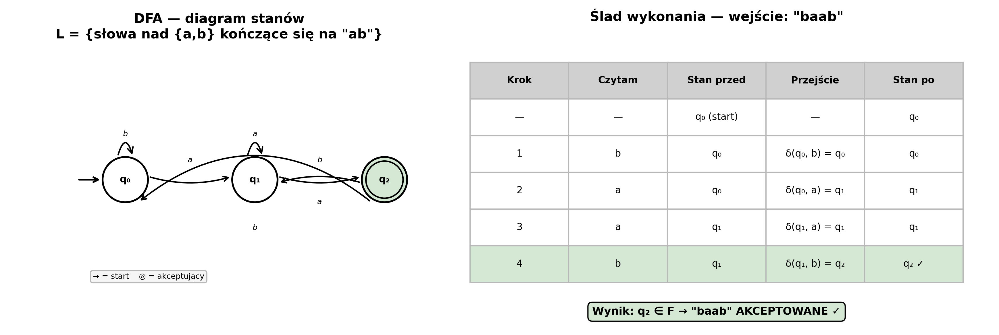

### PDA — Typ 2: Języki bezkontekstowe

**Definicja formalna:** M = (Q, Σ, Γ, δ, q₀, Z₀, F)

| Symbol | Nazwa | Znaczenie | Przykład |
|--------|-------|-----------|----------|
| **Q** | Zbiór stanów | Jak w FA — skończony zbiór stanów | Q = {q₀, q₁, q₂} |
| **Σ** | Alfabet wejściowy | Symbole czytane z wejścia | Σ = {a, b} |
| **Γ** | Alfabet stosowy (Gamma) | Symbole, które mogą być na stosie — INNE niż alfabet wejściowy! | Γ = {Z₀, A} — Z₀ = dno stosu, A = znacznik |
| **δ** | Funkcja przejścia | Teraz zależy od TRZECH rzeczy: stan + symbol wejściowy + szczyt stosu → nowy stan + operacja na stosie | δ(q₀, a, Z₀) = (q₀, AZ₀) — „push A" |
| **q₀** | Stan początkowy | Jak w FA | q₀ |
| **Z₀** | Symbol dna stosu | Początkowy symbol na stosie — pozwala wykryć, że stos jest „pusty" | Z₀ — stos zaczyna z jednym Z₀ |
| **F** | Stany akceptujące | Jak w FA (alternatywnie: akceptacja przez pusty stos) | F = {q₂} |

**Pamięć:** stos LIFO — ostatni włożony, pierwszy wyjęty. **DPDA ⊂ NPDA!**
Przykłady: aⁿbⁿ, nawiasy, wwᴿ. Nie: aⁿbⁿcⁿ, ww.

**Przykład krok po kroku — PDA rozpoznaje język L = {aⁿbⁿ | n ≥ 1}:**

Automat PDA: Q = {q₀, q₁, q₂}, Σ = {a, b}, Γ = {Z₀, A}, F = {q₂}

    Reguły przejścia:
    δ(q₀, a, Z₀) = (q₀, AZ₀)    ← czytam 'a', stos pusty → push A
    δ(q₀, a, A)  = (q₀, AA)      ← czytam 'a', na stosie A → push jeszcze A
    δ(q₀, b, A)  = (q₁, ε)       ← czytam 'b', na stosie A → pop A, przejdź do q₁
    δ(q₁, b, A)  = (q₁, ε)       ← czytam 'b', na stosie A → pop A
    δ(q₁, ε, Z₀) = (q₂, Z₀)     ← brak wejścia, stos = Z₀ → akceptuj!

    Wejście: w = "aabb" (a²b², n=2)

    Krok 1: stan=q₀, czytam 'a', stos=[Z₀]
            δ(q₀, a, Z₀) = (q₀, AZ₀) → push A
            stan=q₀, stos=[A, Z₀]

    Krok 2: stan=q₀, czytam 'a', stos=[A, Z₀]
            δ(q₀, a, A) = (q₀, AA) → push A
            stan=q₀, stos=[A, A, Z₀]

    Krok 3: stan=q₀, czytam 'b', stos=[A, A, Z₀]
            δ(q₀, b, A) = (q₁, ε) → pop A
            stan=q₁, stos=[A, Z₀]

    Krok 4: stan=q₁, czytam 'b', stos=[A, Z₀]
            δ(q₁, b, A) = (q₁, ε) → pop A
            stan=q₁, stos=[Z₀]

    Krok 5: stan=q₁, brak wejścia, stos=[Z₀]
            δ(q₁, ε, Z₀) = (q₂, Z₀) → akceptuj!
            stan=q₂ ∈ F → "aabb" AKCEPTOWANE ✓

    Intuicja: Push A za każde 'a', pop A za każde 'b'.
    Jeśli stos pusty po przeczytaniu → równo a i b → akceptuj!

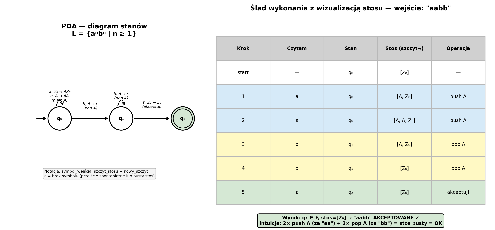

### LBA — Typ 1: Języki kontekstowe

**Definicja formalna:** M = (Q, Σ, Γ, δ, q₀, q_acc, q_rej) — jak TM, ale z ograniczeniem taśmy

| Symbol | Nazwa | Znaczenie | Przykład |
|--------|-------|-----------|----------|
| **Q** | Zbiór stanów | Skończony zbiór stanów — może być większy niż w FA/PDA | Q = {q₀, q₁, q₂, q₃, q₄, q_acc, q_rej} |
| **Σ** | Alfabet wejściowy | Symbole na taśmie na początku (BEZ markera pustego) | Σ = {a, b, c} |
| **Γ** | Alfabet taśmowy (Gamma) | Wszystkie symbole dozwolone na taśmie, Σ ⊂ Γ, zawiera marker pusty ⊔ | Γ = {a, b, c, X, Y, Z, ⊔} — X,Y,Z = zaznaczone |
| **δ** | Funkcja przejścia | δ(stan, symbol_na_taśmie) = (nowy_stan, symbol_do_zapisania, kierunek_głowicy) | δ(q₀, a) = (q₁, X, R) — zaznacz 'a' jako X, idź w prawo |
| **q₀** | Stan początkowy | Głowica na pierwszym symbolu taśmy | q₀ |
| **q_acc** | Stan akceptujący | Akceptacja — automat się ZATRZYMUJE | q_acc |
| **q_rej** | Stan odrzucający | Odrzucenie — automat się ZATRZYMUJE | q_rej |

**Ograniczenie LBA:** Głowica NIE może wyjść poza |w| komórek (długość wejścia). To jedyna różnica od TM!
**DLBA =? NLBA** — problem otwarty!
Przykłady: aⁿbⁿcⁿ, ww.

**Przykład krok po kroku — LBA rozpoznaje język L = {aⁿbⁿcⁿ | n ≥ 1}:**

Strategia: wielokrotnie przejdź taśmę, za każdym razem zaznacz jedno 'a', jedno 'b', jedno 'c'.

    Wejście: w = "aabbcc" (n=2), taśma = [a, a, b, b, c, c]

    === Runda 1: zaznacz po jednym z każdego ===
    Krok 1: stan=q₀, głowica→'a', zaznacz a→X, idź w prawo
            taśma = [X, a, b, b, c, c]  głowica na 'a'

    Krok 2: stan=q₁, przeskocz pozostałe 'a' (idź prawo)
            głowica na 'b'

    Krok 3: zaznacz b→Y, idź w prawo
            taśma = [X, a, Y, b, c, c]  głowica na 'b'

    Krok 4: stan=q₂, przeskocz pozostałe 'b' (idź prawo)
            głowica na 'c'

    Krok 5: zaznacz c→Z, wróć na początek
            taśma = [X, a, Y, b, Z, c]

    === Runda 2: zaznacz kolejne ===
    Krok 6: od początku, znajdź pierwsze niezaznaczone 'a' → zaznacz X
            taśma = [X, X, Y, b, Z, c]

    Krok 7: znajdź pierwsze niezaznaczone 'b' → zaznacz Y
            taśma = [X, X, Y, Y, Z, c]

    Krok 8: znajdź pierwsze niezaznaczone 'c' → zaznacz Z
            taśma = [X, X, Y, Y, Z, Z]

    === Sprawdzenie: nie ma niezaznaczonych symboli → AKCEPTUJ ✓ ===

    Gdyby "aabcc" (2a, 1b, 2c): po zaznaczeniu a,b,c w rundzie 1
    w rundzie 2 zaznaczamy drugie 'a', ale NIE MA drugiego 'b' → ODRZUĆ ✗

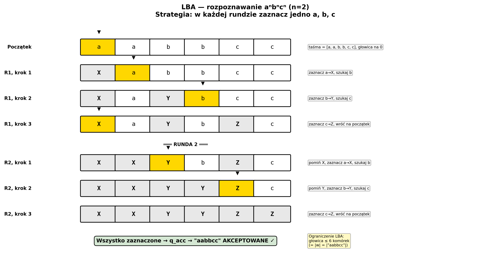

### TM — Typ 0: Rekurencyjnie przeliczalne

**Definicja formalna:** M = (Q, Σ, Γ, δ, q₀, q_acc, q_rej)

| Symbol | Nazwa | Znaczenie | Przykład |
|--------|-------|-----------|----------|
| **Q** | Zbiór stanów | Skończony zbiór stanów — jak LBA | Q = {q₀, q₁, q₂, q₃, q_acc, q_rej} |
| **Σ** | Alfabet wejściowy | Symbole wejścia (nie zawiera ⊔) | Σ = {0, 1} |
| **Γ** | Alfabet taśmowy | Σ ⊂ Γ, zawiera marker pusty ⊔ (blank) | Γ = {0, 1, X, ⊔} |
| **δ** | Funkcja przejścia | Identyczna forma jak LBA: δ(q, a) = (q', b, L/R) | δ(q₀, 0) = (q₁, X, R) |
| **q₀** | Stan początkowy | Głowica na pierwszym symbolu | q₀ |
| **q_acc** | Stan akceptujący | Wejście do q_acc → słowo AKCEPTOWANE, stop | q_acc |
| **q_rej** | Stan odrzucający | Wejście do q_rej → słowo ODRZUCONE, stop | q_rej |

**Kluczowa różnica od LBA:** Taśma jest **nieskończona** w prawo — głowica może wyjść poza wejście i pisać na pustych komórkach. To daje NIEOGRANICZONĄ pamięć roboczą.

**Pamięć:** taśma ∞ R/W. **DTM ≡ NTM** (równoważne pod względem mocy).
Teza Churcha-Turinga: TM modeluje każde obliczenie. Nie: komplement problemu stopu.

**Przykład krok po kroku — TM rozpoznaje język L = {0ⁿ1ⁿ | n ≥ 1} (jak aⁿbⁿ, ale z 0 i 1):**

Strategia: zaznacz jedno '0' i jedno '1' w każdej rundzie, powtarzaj aż do wyczerpania.

    Wejście: w = "0011", taśma = [0, 0, 1, 1, ⊔, ⊔, ⊔, ...]
                                                    ↑ nieskończona!

    === Runda 1 ===
    Krok 1: stan=q₀, głowica→'0', zaznacz 0→X, idź w prawo
            taśma = [X, 0, 1, 1, ⊔, ...]  stan=q₁

    Krok 2: stan=q₁, przeskocz '0' w prawo, znajdź '1'
            głowica na pierwszym '1'

    Krok 3: zaznacz 1→Y, wróć na początek (idź w lewo do X)
            taśma = [X, 0, Y, 1, ⊔, ...]  stan=q₃

    === Runda 2 ===
    Krok 4: znajdź pierwsze niezaznaczone '0' → zaznacz X
            taśma = [X, X, Y, 1, ⊔, ...]

    Krok 5: znajdź pierwsze niezaznaczone '1' → zaznacz Y
            taśma = [X, X, Y, Y, ⊔, ...]

    === Sprawdzenie ===
    Krok 6: od początku szukam niezaznaczonych — nie ma → q_acc
            "0011" AKCEPTOWANE ✓

    TM może też WYJŚĆ poza wejście (czego LBA nie może):
    Np. "011" — po zaznaczeniu 0↔1, zostaje '1' bez pary → q_rej ✗

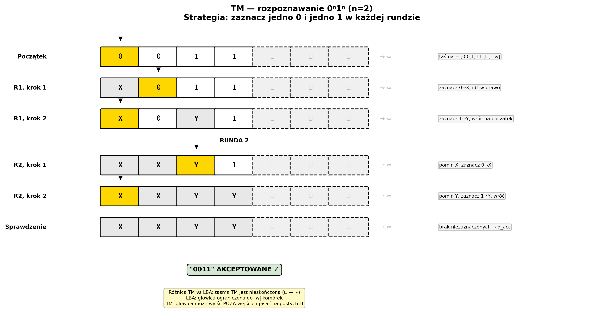

### Porównanie definicji formalnych

| Element | FA | PDA | LBA | TM |
|---------|----|----|-----|-----|
| **Stany Q** | ✓ mało | ✓ mało | ✓ więcej | ✓ więcej |
| **Alfabet Σ** | ✓ | ✓ | ✓ | ✓ |
| **Alfabet stosu/taśmy Γ** | ✗ brak | ✓ stosowy | ✓ taśmowy | ✓ taśmowy |
| **Przejście δ** | q × Σ → q | q × (Σ∪ε) × Γ → q × Γ* | q × Γ → q × Γ × {L,R} | q × Γ → q × Γ × {L,R} |
| **Dodatkowa pamięć** | brak | stos (LIFO) | taśma ogr. do \|w\| | taśma ∞ |
| **Akceptacja** | stan ∈ F | stan ∈ F lub pusty stos | stan = q_acc | stan = q_acc |
| **Może się zapętlić?** | NIE (skończone) | TAK (ε-przejścia) | TAK | TAK (problem stopu!) |

### Tabela porównawcza

| Cecha          | FA         | PDA            | LBA              | TM                |
|----------------|------------|----------------|------------------|-------------------|
| Pamięć         | Brak       | Stos (LIFO)    | Taśma ogr. (R/W) | Taśma ∞ (R/W)     |
| Klasa języków  | Regularne  | Bezkontekstowe | Kontekstowe      | Rek. przeliczalne |
| DET = NIEDET?  | TAK        | NIE            | Otwarte!         | TAK (moc)         |
| Domknięcie ∩/¬ | TAK/TAK    | NIE/NIE        | TAK/TAK          | TAK/NIE           |
| Zastosowanie   | Leksery    | Parsery        | Weryfikacja ogr. | Obliczenia ogólne |

### Etymologia nazw

**Automaty:** *Finite Automaton* — „skończony" = skończona liczba stanów (cała pamięć to stan). *Pushdown Automaton* — „pushdown" od spring-loaded tray dispenser (dozownik tac w stołówce: push down = zepchnij na stos). *LBA* — taśma liniowo proporcjonalna do wejścia (Myhill 1960, Kuroda 1964). *Maszyna Turinga* — Alan Turing (1936, „On Computable Numbers"), formalizacja obliczalności; odpowiedź na Entscheidungsproblem Hilberta; złamał Enigmę w WWII. *Hierarchia Chomsky'ego* — Noam Chomsky (MIT, 1956), lingwista; hierarchia gramatyk dla języków naturalnych okazała się fundamentem informatyki.

**Języki:** *Regularne* — od „regular expressions" (Kleene 1956); „regular" = podlegające stałej regule (łac. regula). *Bezkontekstowe (Context-Free)* — produkcje A → α stosowane BEZ patrzenia na kontekst wokół A; nieterminal przepisywany niezależnie od otoczenia. *Kontekstowe (Context-Sensitive)* — produkcje αAβ → αγβ: przepisanie A ZALEŻY od kontekstu α i β. *Rekurencyjnie przeliczalne (Recursively Enumerable)* — istnieje TM wyliczająca (enumerate) wszystkie słowa języka; „rekurencyjnie" = przez procedurę obliczeniową (ale może nie zatrzymać się na nie-członkach).

### Jak zapamiętać

- **„Raz Bardzo Kolorowy Rekin"** — Regularny ⊂ Bezkontekstowy ⊂ Kontekstowy ⊂ Rek.przeliczalny
- **Pamięć:** Brak → Stos → Taśma ogr. → Taśma ∞
- **Kontrprzykłady:** aⁿbⁿ łamie FA, aⁿbⁿcⁿ łamie PDA
- **Kontekst nazw:** Context-Free = A przepisywane bez kontekstu; Context-Sensitive = kontekst αAβ decyduje

\newpage

## PYTANIE 2: Algorytmy najkrótszej ścieżki (AISDI)

**Omówić i porównać algorytmy: Dijkstry, Bellmana-Forda, A*.**

---

### Tło pojęciowe — słowniczek

**Graf** — struktura danych składająca się z **wierzchołków** (vertices/nodes) połączonych **krawędziami** (edges). Np. mapa miast: miasta = wierzchołki, drogi = krawędzie.

**Wierzchołek (vertex, node)** — punkt w grafie. Oznaczany jako v, u, n, m itp. **V** = zbiór wszystkich wierzchołków; |V| = ich liczba.

**Krawędź (edge)** — połączenie między dwoma wierzchołkami. **E** = zbiór krawędzi; |E| = ich liczba. Krawędź może być skierowana (A→B ≠ B→A) lub nieskierowana (A↔B).

**Waga (weight)** — liczba przypisana do krawędzi, oznaczająca „koszt" przejścia. Np. odległość w km, czas podróży, opłata za przejazd. Graf z wagami = graf ważony.

**Koszt (cost)** — ogólne pojęcie „ceny" przejścia ścieżką. Koszt ścieżki = suma wag krawędzi na tej ścieżce. Cel algorytmów: znaleźć ścieżkę o **minimalnym koszcie**.

**SSSP (Single-Source Shortest Path)** — problem: mając JEDEN wierzchołek startowy (źródło), znajdź najkrótsze ścieżki do WSZYSTKICH pozostałych wierzchołków. Dijkstra i Bellman-Ford rozwiązują SSSP. **Single-Pair** — prostszy problem: znajdź najkrótszą ścieżkę z A do B (jednej konkretnej pary). A* rozwiązuje Single-Pair.

**d[v]** — tablica odległości. **d** = tablica (array), **v** = wierzchołek. d[v] przechowuje aktualnie najlepsze znane oszacowanie odległości od źródła do wierzchołka v. Na początku d[start] = 0, d[wszystko inne] = ∞. Algorytm stopniowo poprawia te wartości.

**Zachłanny (greedy)** — strategia algorytmiczna: w każdym kroku wybierz opcję, która TERAZ wygląda najlepiej (lokalnie optymalna), bez cofania się. Dijkstra jest zachłanny: zawsze bierze wierzchołek o najmniejszym d[v] i nigdy go nie rewiduje.

**Relaksacja krawędzi (edge relaxation)** — kluczowa operacja. Sprawdza: „czy droga do v przez u jest krótsza niż dotychczas znana?" Jeśli d[u] + waga(u,v) < d[v], to zaktualizuj d[v]. Nazwa od „rozluźniania" — górne ograniczenie na odległość się „rozluźnia" (maleje) w stronę prawdziwej wartości.

**Tablica (array)** — najprostsza struktura danych: ciągły blok pamięci. W Dijkstrze z tablicą: szukanie minimum d[v] wymaga przejrzenia WSZYSTKICH wierzchołków → O(V) na szukanie × V razy = **O(V²)**.

Przykład — graf z 4 wierzchołkami (A, B, C, D), start = A:

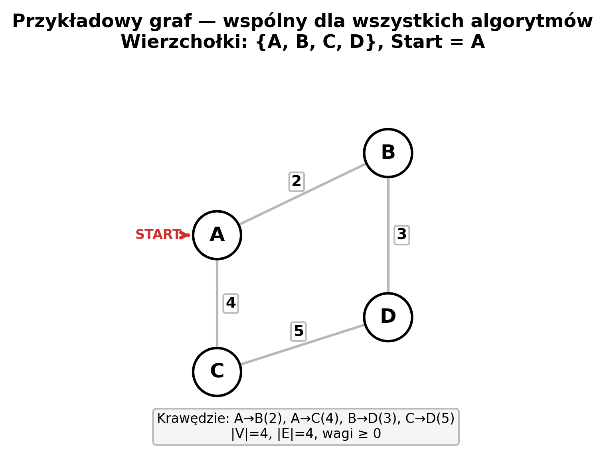

    d = [ A:0,  B:∞,  C:∞,  D:∞ ]     ← tablica na starcie
         odwiedzone = {}

    Krok 1: przeszukaj CAŁĄ tablicę d → min = A (0)
            d = [ A:0, B:2, C:4, D:∞ ]   odw = {A}
                        ↑    ↑
                    A→B=2  A→C=4  (relaksacja sąsiadów A)

    Krok 2: przeszukaj CAŁĄ tablicę d (poza odw.) → min = B (2)
            d = [ A:0, B:2, C:4, D:5 ]   odw = {A,B}
                                  ↑
                            B→D=2+3=5 (relaksacja)

    Krok 3: przeszukaj tablicę → min = C (4)
            d = [ A:0, B:2, C:4, D:5 ]   odw = {A,B,C}
                                  ↑
                            C→D=4+5=9 > 5, nie zmieniaj

    Krok 4: min = D (5). Koniec! d = [A:0, B:2, C:4, D:5]

    Każdy krok = przejrzyj V elementów → 4 kroki × 4 elementy = 16 operacji = O(V²)

**Kopiec (heap)** — drzewiasta struktura danych, w której element minimalny jest zawsze na szczycie. Wyciąganie minimum: O(log n). W Dijkstrze z kopcem: szukanie min d[v] to O(log V) zamiast O(V) → **O((V+E) log V)**.

Przykład — ten sam graf, ale z kopcem (min-heap):

    Kopiec na starcie:      (0,A)          ← min zawsze na szczycie
                                           (reszta to ∞)

    Krok 1: pop (0,A) — O(log 4)=O(2), relaksuj sąsiadów:
            push (2,B), push (4,C)

            Kopiec:    (2,B)
                      /     \
                   (4,C)   ...

    Krok 2: pop (2,B) — O(log 4), relaksuj:
            push (5,D)

            Kopiec:    (4,C)
                      /
                   (5,D)

    Krok 3: pop (4,C) — O(log 4). C→D: 9 > 5, nie zmieniaj.
    Krok 4: pop (5,D) — O(log 4). Koniec!

    Każdy pop = O(log V), każdy push = O(log V)
    V popów + E pushów = O((V+E) log V)

**Kopiec Fibonacciego** — zaawansowany kopiec, w którym operacja „zmniejsz klucz" (decrease-key) działa w zamortyzowanym O(1) zamiast O(log V). Dijkstra robi decrease-key dla każdej krawędzi → z kopcem Fib: **O(V log V + E)** — E operacji po O(1) + V wyciągnięć po O(log V).

Przykład — kluczowa różnica: decrease-key:

    Zwykły kopiec — gdy znajdziesz krótszą drogę do D:
        d[D] zmienia się z 9 na 5
        Trzeba „naprawić" kopiec: przesuwaj D w górę → O(log V)

    Kopiec Fibonacciego — ta sama sytuacja:
        d[D] zmienia się z 9 na 5
        Po prostu odetnij D od rodzica i wstaw do listy korzeni → O(1)!
        (naprawienie struktury odłożone na później — „zamortyzowane")

    Różnica ma znaczenie przy GĘSTYCH grafach (E >> V):
    - Zwykły kopiec: E × O(log V) = O(E log V) na decrease-key
    - Kopiec Fib:    E × O(1)     = O(E)       na decrease-key
    Razem: O(V log V) [pop] + O(E) [decrease-key] = O(V log V + E)

**Złożoność — dlaczego takie wartości:**
- **O(V²)** z tablicą: V razy szukaj minimum (O(V) każdy) = V × V.
- **O((V+E) log V)** z kopcem: V wyciągnięć min (O(log V)) + E relaksacji z decrease-key (O(log V)).
- **O(V log V + E)** z kopcem Fib: V wyciągnięć min (O(log V)) + E decrease-key (O(1) zamortyzowane).

**Programowanie dynamiczne (DP)** — technika rozwiązywania problemów przez rozbicie na mniejsze podproblemy i zapamiętywanie wyników (żeby nie liczyć tego samego dwa razy). Bellman-Ford jest DP: podproblem = „najkrótsza ścieżka do v używająca ≤ k krawędzi"; rozwiązuje dla k = 1, 2, ..., V−1.

**Cykl** — ścieżka w grafie, która wraca do punktu wyjścia (A → B → C → A). **Cykl ujemny** — cykl, w którym suma wag < 0. Problem: za każdym obejściem cyklu „odległość" maleje — można iść w nieskończoność → najkrótsza ścieżka nie istnieje (= −∞).

**Dlaczego O(V·E) w Bellman-Ford:** Algorytm wykonuje |V|−1 iteracji (bo najdłuższa najkrótsza ścieżka bez cykli ma co najwyżej V−1 krawędzi). W każdej iteracji relaksuje WSZYSTKIE |E| krawędzi. Razem: (V−1) × E ≈ O(V·E).

**Heurystyczny** — wykorzystujący przybliżone oszacowanie (heurystykę) zamiast dokładnych obliczeń. A* jest heurystyczny: używa funkcji h(n) do zgadywania „ile jeszcze do celu".

**f(n), g(n), h(n) — co oznacza n i każda funkcja:**
- **n** = aktualnie rozpatrywany wierzchołek.
- **g(n)** = dotychczasowy koszt dotarcia od startu do n (znany, dokładny).
- **h(n)** = heurystyka: OSZACOWANIE kosztu od n do celu (przybliżone, „zgadywane"). Np. odległość w linii prostej do celu.
- **f(n) = g(n) + h(n)** = oszacowanie CAŁKOWITEGO kosztu ścieżki przez n. A* zawsze rozwija wierzchołek o najniższym f(n).

**Dopuszczalna (admissible)** — heurystyka h jest dopuszczalna, jeśli NIGDY nie przeszacowuje: h(n) ≤ prawdziwy koszt od n do celu. Gwarantuje, że A* znajdzie optymalną ścieżkę. Np. odległość w linii prostej jest dopuszczalna (nie da się dojechać krócej niż prosto).

**Rzeczywisty koszt** — prawdziwa najkrótsza odległość (nie oszacowanie). Np. faktyczna najkrótsza droga od n do celu, uwzględniając wszystkie krawędzie.

**n → cel** — od wierzchołka n do wierzchołka docelowego (cel = destination = target).

**Spójna (consistent / monotone)** — silniejszy warunek na heurystykę: h(n) ≤ w(n,m) + h(m) dla każdej krawędzi n→m. Tu **w(n,m)** = waga krawędzi z n do m, a **m** = sąsiad n. Spójność oznacza: oszacowanie z n nie jest „dużo lepsze" niż to co uzyskasz idąc jeden krok do m. Spójna ⇒ dopuszczalna (ale nie odwrotnie).

**Dlaczego O(V) w najlepszym przypadku A*:** Jeśli heurystyka jest idealna (h(n) = prawdziwy koszt), A* idzie prosto do celu, nie eksplorując zbędnych wierzchołków — odwiedza tylko te na optymalnej ścieżce ≈ O(V) jeśli ścieżka krótka. **Najgorszy przypadek** = h(n) = 0 dla wszystkich n → A* degeneruje się do Dijkstry.

### Pseudokod (Python)

**Dijkstra** (graph = słownik sąsiedztwa, np. `{'A': [('B',2), ('C',4)]}`):

    def dijkstra(graph, source):
        dist = {v: float('inf') for v in graph}
        dist[source] = 0
        visited = set()
        for _ in range(len(graph)):
            current = None  # szukaj nieodwiedzonego wierzchołka o min dist — O(V)
            for v in graph:
                if v not in visited and (current is None or dist[v] < dist[current]):
                    current = v
            if dist[current] == float('inf'):
                break  # reszta nieosiągalna
            visited.add(current)  # zamknij — NIE wracamy (zachłanność)
            for neighbor, weight in graph[current]:  # relaksacja sąsiadów
                if dist[current] + weight < dist[neighbor]:
                    dist[neighbor] = dist[current] + weight
        return dist  # O(V²) z tablicą

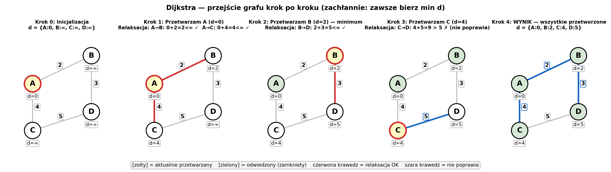

**Bellman-Ford** (vertices = lista wierzchołków, edges = lista krotek (src, dst, weight)):

    def bellman_ford(vertices, edges, source):
        dist = {v: float('inf') for v in vertices}
        dist[source] = 0
        for _ in range(len(vertices) - 1):  # V−1 iteracji (najdłuższa ścieżka = V−1 krawędzi)
            for src, dst, weight in edges:  # relaksuj WSZYSTKIE krawędzie
                if dist[src] + weight < dist[dst]:
                    dist[dst] = dist[src] + weight
        for src, dst, weight in edges:  # V-ta iteracja: wykrywanie cyklu ujemnego
            if dist[src] + weight < dist[dst]:
                return None  # cykl ujemny!
        return dist  # O(V·E)

Przykład — graf z ujemnymi wagami (Dijkstra daje ZŁY wynik, B-F poprawny):

    Graf: S→A(2), A→C(3), S→B(5), B→A(−4)

    Dijkstra:
      1. S(0): dist[A]=2, dist[B]=5
      2. A(2) zamknięty: dist[C]=5
      3. B(5): B→A = 5−4 = 1 < 2, ALE A już zamknięty → POMIJA!
      Wynik: A=2, C=5  ← BŁĄD (prawidłowe: A=1, C=4)

    Bellman-Ford — relaksuje WSZYSTKIE krawędzie, V−1 = 3 razy:
      Start: dist = [S:0, A:∞, B:∞, C:∞]

      Iteracja 1:
        S→A: 0+2=2  < ∞ → A=2
        A→C: 2+3=5  < ∞ → C=5
        S→B: 0+5=5  < ∞ → B=5
        B→A: 5−4=1  < 2 → A=1  ← ujemna waga poprawia!

      Iteracja 2:
        A→C: 1+3=4 < 5 → C=4  ← propagacja poprawionego A

      Iteracja 3: brak zmian → stabilne.
      Wynik: [S:0, A:1, B:5, C:4]  ← POPRAWNE

    Wykrywanie cyklu ujemnego — dodaj krawędź C→B(−3):
      Cykl B→A→C→B = −4 + 3 + (−3) = −4 < 0.
      Po V−1 iteracjach dist nadal maleje → V-ta iteracja:
        dist[src] + weight < dist[dst] → return None

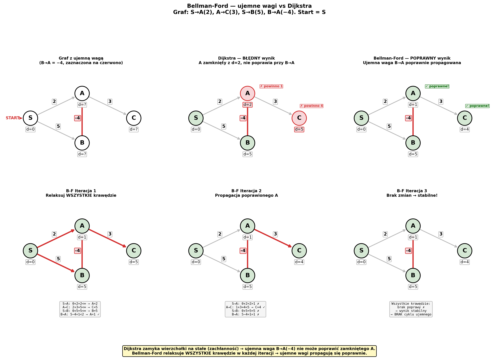

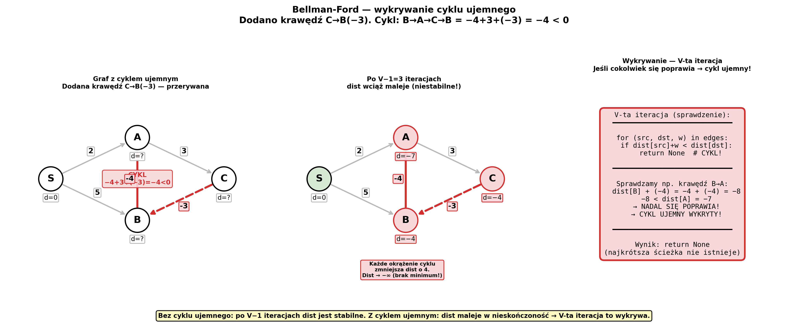

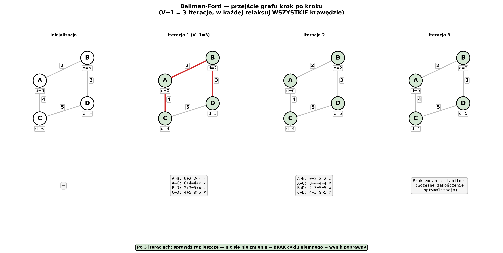

**A\*** (graph jak Dijkstra; heuristic = h(v) → oszacowanie odl. do celu):

    def a_star(graph, source, goal, heuristic):
        cost_so_far = {source: 0}  # g(n) — faktyczny koszt dotarcia
        priority = {source: heuristic(source)}  # f(n) = g(n) + h(n)
        came_from = {}  # do odtworzenia ścieżki
        visited = set()
        while priority:
            current = min(priority, key=priority.get)  # wierzchołek o min f(n)
            del priority[current]
            if current == goal:
                break  # dotarliśmy — A* kończy (Dijkstra przetworzyłby wszystko)
            visited.add(current)
            for neighbor, weight in graph[current]:
                if neighbor in visited:
                    continue
                new_cost = cost_so_far[current] + weight
                if neighbor not in cost_so_far or new_cost < cost_so_far[neighbor]:
                    cost_so_far[neighbor] = new_cost
                    priority[neighbor] = new_cost + heuristic(neighbor)
                    came_from[neighbor] = current
        return came_from, cost_so_far.get(goal)  # ścieżka + koszt

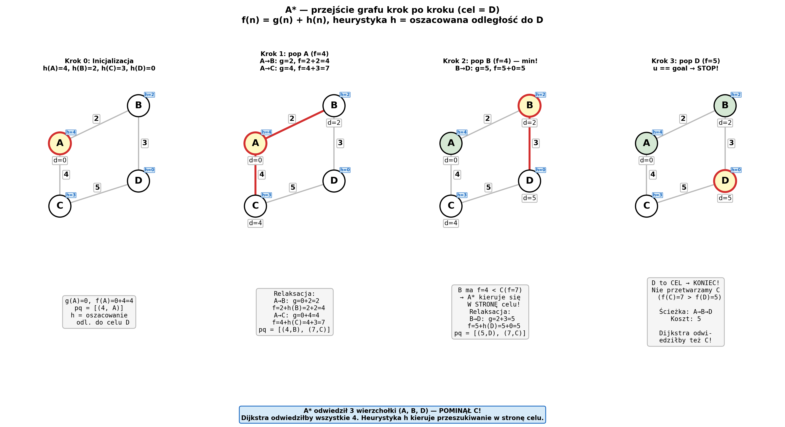

---

### Dijkstra — zachłanny, SSSP

**Ograniczenie:** wagi ≥ 0.
**Idea:** Relaksacja krawędzi; zawsze przetwarzaj wierzchołek o najmniejszym d[v].
**Złożoność:** O(V²) z tablicą, O((V+E) log V) z kopcem, O(V log V + E) z kopcem Fibonacciego.
**Dlaczego nie ujemne wagi?** Raz oznaczony wierzchołek nie jest rewidowany — ujemna krawędź może go poprawić.

### Bellman-Ford — programowanie dynamiczne, SSSP

**Zaleta:** obsługuje ujemne wagi + **wykrywa cykle ujemne**.
**Idea:** |V|−1 iteracji relaksacji WSZYSTKICH krawędzi. Jeśli w iteracji V nadal można poprawić → cykl ujemny.
**Złożoność:** O(V·E) — zawsze.

### A* — heurystyczny, Single-Pair

**Rozszerzenie Dijkstry:** f(n) = g(n) + h(n), gdzie h(n) to heurystyka.
**Wymóg:** h dopuszczalna (admissible): h(n) ≤ rzeczywisty koszt n→cel. Jeśli h spójna (consistent): h(n) ≤ w(n,m) + h(m) — optymalne.
**Złożoność:** zależy od h; najlepszy przypadek O(V), najgorszy jak Dijkstra.

### Porównanie

| Cecha           | Dijkstra         | Bellman-Ford    | A*                |
|-----------------|------------------|-----------------|-------------------|
| Typ             | Zachłanny        | Prog. dynamiczne| Heurystyczny      |
| Problem         | SSSP             | SSSP            | Single-pair       |
| Ujemne wagi     | NIE              | TAK             | NIE               |
| Wykrywa cykle-  | NIE              | TAK             | NIE               |
| Złożoność       | O((V+E)log V)    | O(VE)           | Zależy od h       |

### Etymologia

**Dijkstra** — Edsger W. Dijkstra (Holandia, 1959); pionier informatyki (Turing Award 1972). **Bellman-Ford** — Richard Bellman (twórca programowania dynamicznego) + Lester Ford Jr. (1956). **A*** — Hart, Nilsson, Raphael (Stanford, 1968); „A*" = ulepszona wersja algorytmu „A". **Zachłanny (Greedy)** — algorytm „chciwie" bierze lokalnie najlepszą opcję. **SSSP** — Single-Source Shortest Path. **Programowanie dynamiczne** — Bellman wybrał „dynamic" by brzmiało imponująco dla polityków (nie miało związku z dynamiką!). **Heurystyka** — grec. „heuriskein" = znajdować (to samo co „Eureka!" Archimedesa). **Relaksacja** — „rozluźnianie" górnego ograniczenia na odległość d[v].

### Jak zapamiętać

- **Dijkstra = chciwy**, bierze minimum — ale „nie patrzy wstecz" (stąd problem z ujemnymi wagami)
- **Bellman-Ford = brute force x (V−1)** — relaksuj wszystko, V−1 razy, bo najdłuższa ścieżka ma V−1 krawędzi
- **A* = Dijkstra + „GPS"** — heurystyka mówi w którą stronę jest cel

\newpage

## PYTANIE 3: Redundancja i normalizacja (BD2)

**Omówić zagadnienia redundancji i normalizacji w relacyjnej bazie danych.**

---

### Tło pojęciowe — słowniczek

**Relacja (tabela)** — w bazie danych: tabela z kolumnami (atrybutami) i wierszami (krotkami/rekordami). Np. tabela Studenci z kolumnami: StudentID, Imię, Nazwisko, WydziałID.

**Atrybut (attribute)** — kolumna w tabeli. Np. „Imię", „WydziałID", „NazwaKursu". Każdy atrybut ma nazwę i typ danych (tekst, liczba, data itp.).

**Klucz główny (primary key, PK)** — kolumna (lub zestaw kolumn), której wartość JEDNOZNACZNIE identyfikuje każdy wiersz. Np. StudentID = 12345 → dokładnie jeden student. Nie może się powtarzać, nie może być NULL.

**Klucz złożony (composite key)** — klucz główny składający się z WIĘCEJ NIŻ JEDNEJ kolumny. Np. klucz (StudentID, KursID) — jeden student na jednym kursie to unikalny zapis. Sam StudentID ani sam KursID nie wystarczą, bo student ma wiele kursów, a kurs ma wielu studentów.

**Atrybut wtórny (non-prime attribute)** — kolumna, która NIE jest częścią żadnego klucza kandydującego. Np. w tabeli z kluczem (StudentID, KursID): NazwaKursu, Ocena, NazwaWydziału — to atrybuty wtórne (nie identyfikują wiersza). **Atrybut pierwszy (prime)** — kolumna, która JEST częścią jakiegoś klucza (np. StudentID).

**Nadklucz (superkey)** — dowolny zbiór kolumn, który JEDNOZNACZNIE identyfikuje wiersz. Każdy klucz główny jest nadkluczem, ale nadklucz może mieć „nadmiarowe" kolumny. Np. {StudentID} to klucz i nadklucz; {StudentID, Imię} to nadklucz (ale nie minimalny klucz).

**Redundancja** — powtarzanie tych samych danych w wielu miejscach. Nie chodzi o kopie zapasowe — chodzi o niepotrzebne duplikowanie informacji w tabeli.

Przykład — tabela „Rejestr" (ZŁEJ konstrukcji, BEZ normalizacji) — ta sama tabela będzie normalizowana krok po kroku od 0NF do 5NF w dalszej części:

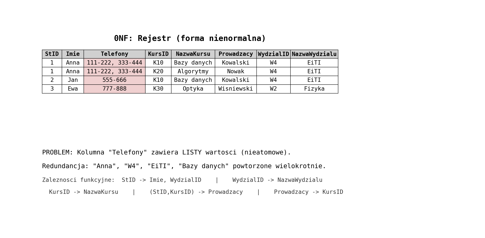

Problem: „Anna", „W4", „EiTI", „Bazy danych" powtórzone wielokrotnie! Kolumna „Telefony" zawiera listy (nieatomowe wartości).

**Anomalia** — niepożądany efekt uboczny operacji na redundantnych danych. Trzy typy:

**Anomalia wstawiania** — nie możesz dodać danych bez podania niepotrzebnych powiązań.
- Przykład: chcesz dodać nowy wydział W5 „Chemia" do systemu, ale nie ma jeszcze żadnego studenta na tym wydziale. W tej tabeli NIE DA SIĘ — bo StudentID (część klucza) nie może być NULL.

**Anomalia usuwania** — usuwając jeden fakt, tracisz niezwiązany inny.
- Przykład: Ewa (jedyny student Fizyki) rezygnuje → usuwasz jej wiersz → tracisz informację, że wydział W2 to „Fizyka" i istnieje kurs „Optyka". Dane o wydziale i kursie znikają razem ze studentem!

**Anomalia modyfikacji** — zmiana jednego faktu wymaga aktualizacji wielu wierszy.
- Przykład: wydział W4 zmienia nazwę z „EiTI" na „Informatyka". Trzeba zaktualizować KAŻDY wiersz, w którym jest NazwaWydziału = „EiTI" (tu: 3 wiersze). Jeśli pominiesz jeden → niespójność.

**Zależność funkcyjna (FD — Functional Dependency):** X → Y oznacza: „znając wartość X, ZAWSZE mogę jednoznacznie wyznaczyć Y". Jak funkcja matematyczna: f(x) daje dokładnie jedno y. Np. StudentID → Imię (jeden student = jedno imię), KursID → NazwaKursu (jeden kurs = jedna nazwa). **X → Y NIE oznacza Y → X!** (StudentID → WydziałID, ale WydziałID → StudentID NIE — na wydziale jest wielu studentów).

**Zależność przechodnia (transitive dependency):** A → B i B → C, więc A → C „przez pośrednika B". Np. StudentID → WydziałID → NazwaWydziału. StudentID nie określa bezpośrednio NazwaWydziału — robi to pośrednio przez WydziałID. Problem: NazwaWydziału „zależy od czegoś, co nie jest kluczem" → redundancja.

**Nietrywialna FD:** X → A, gdzie A nie jest częścią X. Np. StudentID → Imię (nietrywialna: Imię ≠ StudentID). Ale {StudentID, Imię} → StudentID jest TRYWIALNA (StudentID jest częścią lewej strony — oczywiste). W BCNF sprawdzamy tylko nietrywialne FD.
P
**Wielowartościowa zależność (MVD — Multi-Valued Dependency):** X →→ Y oznacza: dla jednej wartości X istnieje ZBIÓR wartości Y, niezależny od reszty. Np. Student →→ Hobby i Student →→ Kurs: hobby Ani nie zależą od jej kursów i odwrotnie, ale ich połączenie tworzy iloczyn kartezjański (niepotrzebne powtórzenia).

**Dekompozycja** — rozbicie jednej dużej tabeli na kilka mniejszych, połączonych kluczami obcymi. Cel: każda tabela przechowuje JEDEN fakt. **Normalizacja eliminuje redundancję** właśnie przez dekompozycję — informacja zamiast być powtarzana w wielu wierszach, przechowywana jest RAZ w osobnej tabeli i łączona przez JOIN.

**Atomowe wartości (1NF)** — każda komórka zawiera JEDNĄ niepodzielną wartość. NIE listy, NIE zbiory, NIE tabele w komórce.

**Zależność złączenia (JD — Join Dependency):** Tabela R spełnia JD *{R₁, R₂, ..., Rₙ} jeśli R = R₁ ⨝ R₂ ⨝ ... ⨝ Rₙ (bezstratna dekompozycja na n projekcji). Każda MVD implikuje JD, ale JD jest OGÓLNIEJSZA — obejmuje dekompozycje na 3+ tabele, których MVD nie wyraża. 5NF eliminuje takie „ukryte" redundancje.

### Pełny przykład: od 0NF do 5NF krok po kroku

Używamy JEDNEJ tabeli „Rejestr" i normalizujemy ją przez WSZYSTKIE postacie normalne. W każdym kroku pokazujemy: (1) jaki problem istnieje, (2) jaką regułę łamie, (3) jak go naprawić dekompozycją.

**Zależności funkcyjne w tabeli Rejestr:**
- StID → Imię, WydziałID (jeden student = jedno imię, jeden wydział)
- WydziałID → NazwaWydziału (jeden wydział = jedna nazwa)
- KursID → NazwaKursu (jeden kurs = jedna nazwa)
- (StID, KursID) → Prowadzący (student na kursie ma jednego prowadzącego)
- Prowadzący → KursID (jeden prowadzący uczy dokładnie jednego kursu)
- StID →→ Telefon (wielowartościowa — student ma ZBIÓR telefonów)

---

### KROK 1: 0NF → 1NF (atomowość wartości)

**Problem:** Kolumna „Telefony" zawiera listy wartości (np. „111-222, 333-444") — to NIE jest atomowe.

**Reguła 1NF:** Każda komórka = JEDNA niepodzielna wartość + istnieje klucz główny.

**Naprawa:** Wydziel wielowartościowy atrybut do osobnej tabeli.

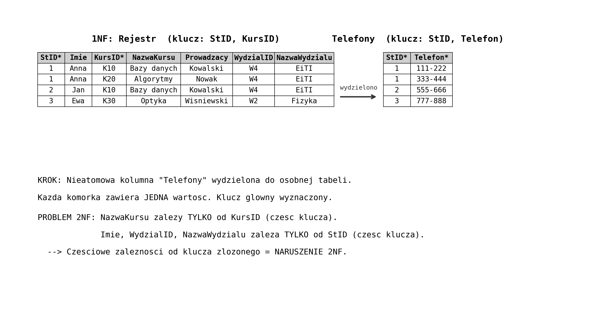

**Wynik:** Dwie tabele — Rejestr1NF (klucz: StID, KursID) i Telefony (klucz: StID, Telefon). Wszystkie komórki atomowe ✓.

---

### KROK 2: 1NF → 2NF (pełna zależność od klucza)

**Problem:** Klucz złożony (StID, KursID), ale wiele atrybutów zależy tylko od CZĘŚCI klucza:
- StID → Imię, WydziałID, NazwaWydziału — zależy TYLKO od StID (częściowa zależność!)
- KursID → NazwaKursu — zależy TYLKO od KursID (częściowa zależność!)
- (StID, KursID) → Prowadzący — zależy od PEŁNEGO klucza ✓

**Reguła 2NF:** Każdy atrybut wtórny (non-prime) zależy od CAŁEGO klucza, nie od jego części.

**Naprawa:** Wydziel atrybuty częściowo zależne do osobnych tabel.

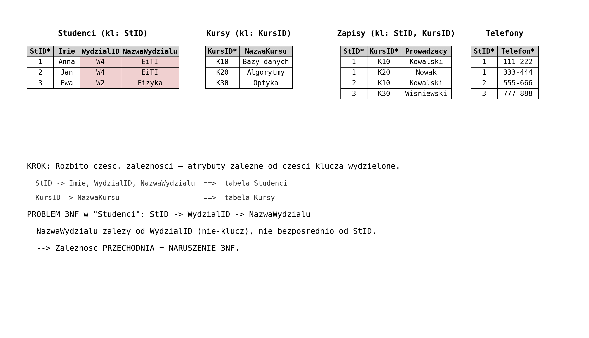

**Wynik:** Studenci (StID → Imię, WydziałID, NazwaWydziału), Kursy (KursID → NazwaKursu), Zapisy (StID, KursID → Prowadzący), Telefony.

**Dlaczego to ważne:** Bez 2NF: dodanie nowego kursu wymaga podania studenta. Z 2NF: dodajesz kurs do tabeli Kursy niezależnie.

---

### KROK 3: 2NF → 3NF (brak zależności przechodnich)

**Problem w tabeli Studenci:** StID → WydziałID → NazwaWydziału — zależność PRZECHODNIA!
- NazwaWydziału nie zależy bezpośrednio od klucza (StID) — zależy od WydziałID, który sam zależy od StID.
- WydziałID NIE jest kluczem tabeli Studenci → NazwaWydziału zależy od nie-klucza → redundancja „EiTI" powtórzone.

**Reguła 3NF:** 2NF + żaden atrybut wtórny nie zależy od innego atrybutu wtórnego (brak zależności przechodnich). Formalnie: dla każdej nietrywialnej FD X → A, albo X jest nadkluczem, ALBO A jest atrybutem pierwszym (prime).

**Naprawa:** Wydziel WydziałID → NazwaWydziału do osobnej tabeli Wydziały.

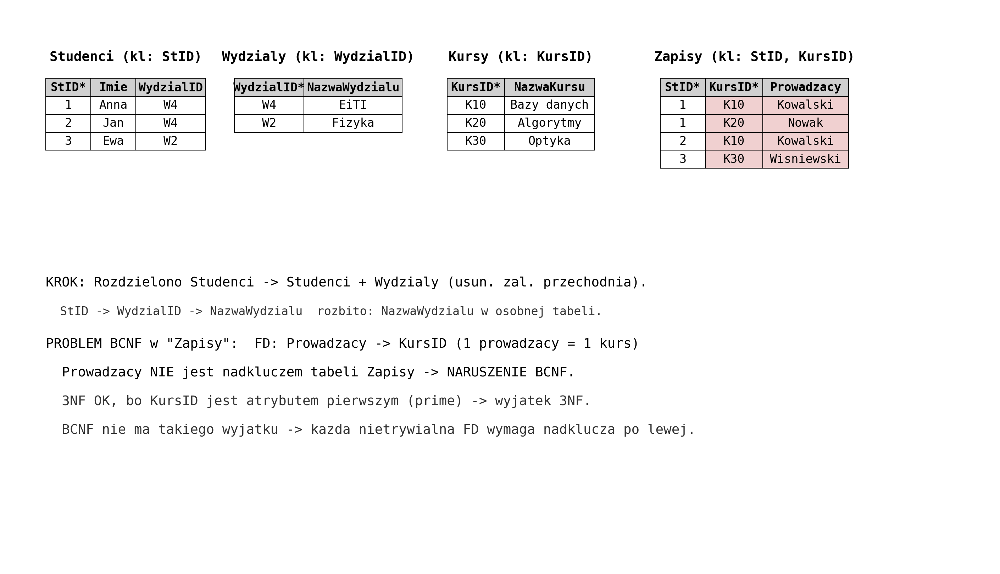

**Wynik:** Studenci (StID → Imię, WydziałID), Wydziały (WydziałID → NazwaWydziału), Kursy, Zapisy, Telefony.

**Dlaczego to ważne:** Bez 3NF: zmiana nazwy wydziału wymaga aktualizacji WIELU wierszy w Studenci. Z 3NF: zmiana nazwy = 1 wiersz w tabeli Wydziały.

---

### KROK 4: 3NF → BCNF (każdy determinant = nadklucz)

**Problem w tabeli Zapisy(StID, KursID, Prowadzący):**
- Klucz: (StID, KursID)
- FD: Prowadzący → KursID (jeden prowadzący uczy jednego kursu)
- Prowadzący NIE jest nadkluczem tabeli Zapisy → **NARUSZENIE BCNF!**
- ALE: KursID JEST atrybutem pierwszym (prime — część klucza) → wyjątek 3NF → **3NF jest spełnione!**

**Reguła 3NF vs BCNF — kluczowa różnica:**
- **3NF:** Dla FD X → A: X jest nadkluczem **LUB** A jest prime. (Wyjątek dla atrybutów pierwszych!)
- **BCNF:** Dla FD X → A: X **MUSI** być nadkluczem. Kropka. (Bez wyjątków!)
- Dlatego BCNF jest SILNIEJSZA — eliminuje anomalie, które 3NF dopuszcza.

**Kiedy 3NF ≠ BCNF?** Dokładnie wtedy, gdy istnieje nietrywialna FD, w której lewa strona nie jest nadkluczem, ale prawa strona jest atrybutem pierwszym. To się zdarza tylko przy kluczach złożonych z nakładającymi się zależnościami.

**Naprawa:** Rozbij Zapisy na dwie tabele wg FD Prowadzący → KursID.

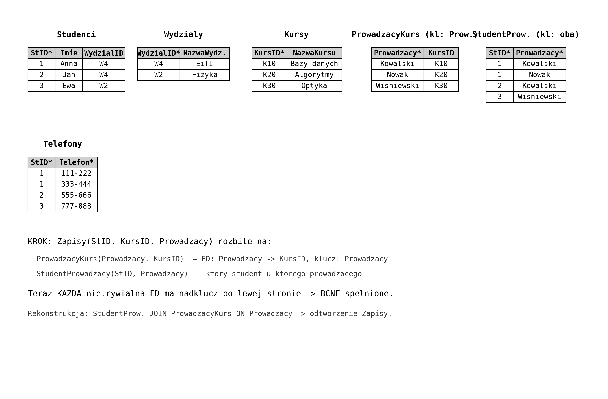

**Wynik:** ProwadzącyKurs (Prowadzący → KursID), StudentProwadzący (StID, Prowadzący).

**Rekonstrukcja:** StudentProwadzący ⨝ ProwadzącyKurs ON Prowadzący = oryginalne Zapisy (bezstratnie!).

**Uwaga:** Dekompozycja BCNF może utracić pewne FD (tu: (StID, KursID) → Prowadzący nie jest wymuszona przez żadną z dwóch tabel z osobna). To cena za eliminację anomalii — czasem 3NF jest „wystarczająco dobra" w praktyce.

---

### KROK 5: BCNF → 4NF (brak wielowartościowych zależności)

**Nowy scenariusz:** Chcemy przechowywać hobby i umiejętności studentów. Tworzymy tabelę:
StudentAktywności(StID, Hobby, Umiejętność) — klucz: (StID, Hobby, Umiejętność).

**Problem:** Student 1 (Anna) ma 2 hobby (Szachy, Bieganie) i 2 umiejętności (Python, SQL). Te zbiory są NIEZALEŻNE od siebie, ale w jednej tabeli tworzą **iloczyn kartezjański** → 2 × 2 = 4 wiersze!

**MVD:** StID →→ Hobby i StID →→ Umiejętność — dwie niezależne wielowartościowe zależności.

**Reguła 4NF:** BCNF + dla każdej nietrywialnej MVD X →→ Y, X jest nadkluczem. Niezależne zbiory wartości nie mogą być w jednej tabeli.

**Naprawa:** Rozdziel do: StudentHobby(StID, Hobby) + StudentUmiejętność(StID, Umiejętność).

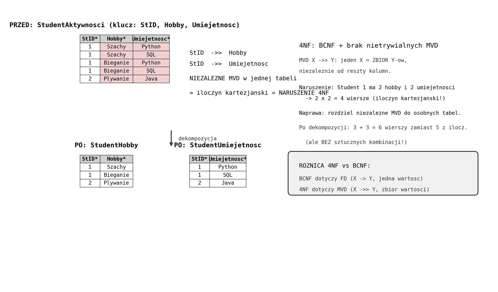

**Dlaczego to ważne:** Bez 4NF: dodanie nowego hobby Anny wymaga dodania TYLE wierszy, ile ma umiejętności (i odwrotnie). Z 4NF: dodanie hobby = 1 wiersz.

**Jak rozpoznać naruszenie 4NF:**
1. Czy tabela ma klucz złożony z 3+ kolumn? (StID, Hobby, Umiejętność)
2. Czy istnieją dwa niezależne zbiory wartości dla tego samego klucza? (Hobby niezależne od Umiejętności)
3. Czy widać „iloczyn kartezjański" w danych? (każde hobby × każda umiejętność)
→ Jeśli TAK na wszystkie → naruszenie 4NF.

---

### KROK 6: 4NF → 5NF (brak zależności złączenia)

**Nowy scenariusz:** Tabela Dostawy(Dostawca, Część, Projekt) — rejestr kto dostarcza co do którego projektu. Klucz: (Dostawca, Część, Projekt) — cała krotka.

**Problem:** Tabela jest w 4NF (brak nietrywialnych MVD), ale może zawierać ukrytą redundancję wynikającą z **zależności złączenia** (JD — Join Dependency).

**Reguła cykliczna:** Jeśli zachodzi ograniczenie biznesowe:
- Dostawca dostarcza Część, I
- Dostawca dostarcza do Projektu, I
- Część jest używana w Projekcie
- → TO Dostawca dostarcza tę Część do tego Projektu

...to tabela Dostawy jest redundantna — można ją bezstratnie rozłożyć na TRZY tabele binarne.

**Reguła 5NF (PJNF — Project-Join Normal Form):** Każda zależność złączenia jest implikowana przez klucze kandydujące. Innymi słowy: tabela NIE DA SIĘ dalej rozłożyć bezstratnie (bez utraty informacji) na mniejsze tabele.

**Naprawa:** Dekomponuj na trzy tabele: DostawcaCzęść, DostawcaProjekt, CzęśćProjekt.

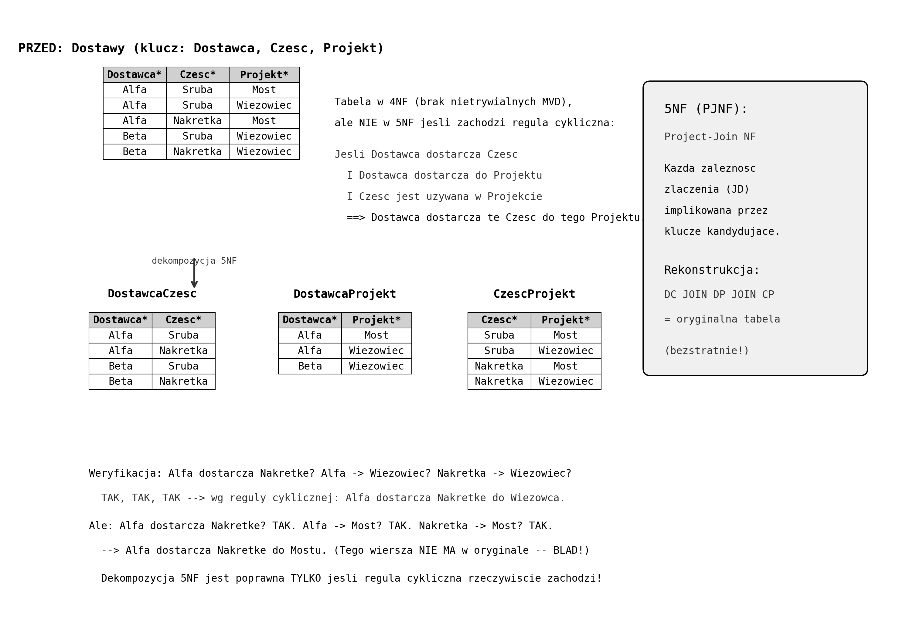

**Rekonstrukcja:** DostawcaCzęść ⨝ DostawcaProjekt ⨝ CzęśćProjekt = oryginalna tabela Dostawy.

**UWAGA:** Dekompozycja 5NF jest poprawna TYLKO jeśli reguła cykliczna rzeczywiście zachodzi w domenie biznesowej! Jeśli nie zachodzi, JOIN wygeneruje fałszywe krotki (spurious tuples).

**Kiedy 5NF ma znaczenie praktyczne?**
- Rzadko w typowych aplikacjach (większość zatrzymuje się na 3NF/BCNF)
- Głównie w złożonych relacjach ternary/n-ary z ograniczeniami cyklicznymi
- Np. systemy logistyczne, harmonogramowanie, konfiguracje produktów

**Jak rozpoznać naruszenie 5NF:**
1. Tabela ma klucz = cała krotka (brak atrybutów nie-kluczowych)
2. Tabela jest w 4NF (brak MVD)
3. ALE da się ją rozłożyć na 3+ mniejszych tabel i bezstratnie złożyć JOINem
4. To rozkładalność wynika z ograniczenia biznesowego (reguły cyklicznej), nie z MVD

---

### Podsumowanie normalizacji 0NF → 5NF

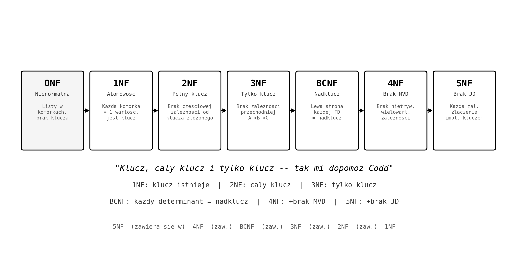

| Postać | Co eliminuje | Kluczowa reguła | Typ zależności |
|--------|-------------|-----------------|----------------|
| **1NF** | Nieatomowe wartości | Każda komórka = 1 wartość, jest klucz | — |
| **2NF** | Częściowe zależności | Atrybut wtórny zależy od CAŁEGO klucza | FD częściowa |
| **3NF** | Zależności przechodnie | Atrybut wtórny nie zależy od nie-klucza (z wyjątkiem prime) | FD przechodnia |
| **BCNF** | Determinanty nie-nadkluczowe | Lewa strona KAŻDEJ FD = nadklucz (bez wyjątków) | FD nietrywialna |
| **4NF** | Wielowartościowe zależności | Lewa strona każdej MVD = nadklucz | MVD |
| **5NF** | Zależności złączenia | Każda JD implikowana przez klucze | JD |

### Denormalizacja

Świadome wprowadzanie redundancji dla wydajności (mniej JOIN-ów). Stosowane w systemach analitycznych (OLAP), data warehousing.

### Etymologia

**Redundancja** — łac. „redundantia" = nadmiar/przelewanie się. **Normalizacja** — Edgar F. Codd (IBM, 1970, „A Relational Model of Data"); 1NF–3NF w oryginalnej pracy. **BCNF** — Raymond Boyce + Codd (1974). **4NF** — Ronald Fagin (1977). **5NF (PJNF)** — Ronald Fagin (1979); PJNF = Project-Join Normal Form. **Anomalia** — grec. „anomalia" = nieregularność. **„Klucz, cały klucz i tylko klucz"** — parafraza przysięgi sądowej; przypisywana Coddowi. **Zależność funkcyjna** — jak funkcja mat.: X jednoznacznie wyznacza Y. **MVD** — Multi-Valued Dependency; Fagin udowodnił, że 4NF eliminuje redundancje z MVD. **JD** — Join Dependency; Fagin udowodnił, że 5NF jest „ostateczną" postacią normalną dla relacyjnych baz danych.

### Jak zapamiętać

- **„Klucz, cały klucz i tylko klucz — tak mi dopomóż Codd"** — 1NF (klucz), 2NF (cały klucz), 3NF (tylko klucz)
- **3 anomalie:** Wstawianie, Usuwanie, Modyfikacja — „WUM"
- **3NF vs BCNF:** 3NF pozwala determinantowi nie-nadkluczowemu JEŚLI zależny jest prime; BCNF nie pozwala w ogóle
- **BCNF:** jak 3NF, ale lewa strona FD zawsze nadklucz (bez wyjątku dla atrybutów pierwszych)
- **4NF:** Czy widzisz iloczyn kartezjański? Niezależne zbiory w jednej tabeli? → rozdziel!
- **5NF:** Czy tabela „rozpadalna" na 3+ części bezstratnie? Reguła cykliczna? → dekomponuj!
- **Hierarchia typów zależności:** FD (jedna wartość) → MVD (zbiór wartości) → JD (złączenie n tabel)
- **Praktyka:** 90% systemów normalizuje do 3NF/BCNF. 4NF/5NF = egzotyka, ale egzamin wymaga

\newpage

## PYTANIE 4: Baza danych jako fundament systemów (BD2)

**Dlaczego baza danych stanowi dobry fundament do budowy wielu systemów informatycznych?**

---

### Tło pojęciowe — słowniczek

**System informatyczny** — oprogramowanie realizujące jakąś funkcję: sklep internetowy, system bankowy, CRM, system rezerwacji. Każdy taki system potrzebuje PRZECHOWYWAĆ dane i OPEROWAĆ na nich. Baza danych daje gotowe, sprawdzone mechanizmy do tego — nie trzeba ich pisać od zera.

**Dlaczego DB to „dobry fundament"?** — Bez bazy danych każdy system musi SAM rozwiązywać: „co jeśli prąd padnie w trakcie zapisu?", „co jeśli dwóch użytkowników edytuje to samo?", „jak chronić dane?". Baza dostarcza to wszystko „z pudełka" → programista skupia się na logice biznesowej, nie na infrastrukturze.

---

**Transakcja** — logiczna jednostka pracy: zestaw operacji, które MUSZĄ wykonać się razem jako całość. Np. przelew bankowy = (1) odejmij 100 zł od Ani + (2) dodaj 100 zł Janowi. Nie może być tak, że tylko (1) się wykona, a (2) nie — pieniądze by „zniknęły".

**ACID** — cztery właściwości, które baza gwarantuje dla każdej transakcji:

**Atomicity (Atomowość)** — „albo cała, albo nic" (all-or-nothing). Jeśli COKOLWIEK w transakcji się nie powiedzie (błąd, crash, brak pamięci), WSZYSTKIE zmiany tej transakcji są cofane (rollback). Jakby nic się nie stało. Np. przelew: jeśli krok (2) się nie uda, krok (1) jest automatycznie cofany — saldo Ani wraca do stanu sprzed przelewu.

**Jak to odpowiada na pytanie:** Bez atomowości system bankowy mógłby tracić pieniądze przy każdym crashu. Baza gwarantuje, że KAŻDA operacja jest bezpieczna → solidny fundament.

**Consistency (Spójność)** — transakcja przeprowadza bazę ze SPÓJNEGO stanu w inny SPÓJNY stan. **Stan** = aktualna zawartość wszystkich tabel w bazie (wszystkie dane w danym momencie). **Spójny stan** = stan, w którym WSZYSTKIE reguły (constraints) są spełnione. Np. „saldo ≥ 0", „każde zamówienie ma klienta", „PESEL ma 11 cyfr". **Spójny → spójny** = transakcja NIE MOŻE zostawić bazy w stanie łamiącym reguły. Np. przelew: suma pieniędzy w systemie przed = suma po (nie da się „stworzyć" pieniędzy).

**Jak to odpowiada na pytanie:** Dane w systemie ZAWSZE mają sens. Nie będzie zamówienia bez klienta, produktu z ceną −5 zł, ani studenta z oceną 7.

**Isolation (Izolacja)** — równoległe (jednoczesne) transakcje nie widzą nawzajem swoich niedokończonych zmian. Każda transakcja „myśli", że jest jedyną operacją na bazie. Np. Ania przelewa 100 zł a Jan sprawdza saldo — Jan widzi ALBO stan przed przelewem, ALBO po, NIGDY stan pośredni (np. „Ania odjęła, ale Jan jeszcze nie dostał").

**Jak to odpowiada na pytanie:** System może obsługiwać TYSIĄCE użytkowników jednocześnie bez chaosu. Każdy widzi spójne dane.

**Durability (Trwałość)** — po zatwierdzeniu transakcji (COMMIT), jej efekty przetrwają KAŻDĄ awarię: crash serwera, awaria dysku, przerwa w zasilaniu. Baza zapisuje zmiany do trwałego magazynu (dysk, WAL — Write-Ahead Log). Nawet jeśli serwer padnie 1 ms po COMMIT, dane są bezpieczne.

**Jak to odpowiada na pytanie:** System nie traci danych. Klient płaci za zamówienie → zamówienie jest zapisane NA ZAWSZE, nawet jeśli serwer zaraz potem się wyłączy.

---

**ANSI** — American National Standards Institute: amerykańska organizacja normalizacyjna (odpowiednik polskiego PKN). Ustala standardy techniczne.

**SPARC** — Standards Planning And Requirements Committee: komitet przy ANSI, który w 1975 zaproponował 3-poziomową architekturę baz danych.

**3-poziomowa architektura ANSI/SPARC:**

    Poziom zewnętrzny  — CO widzi użytkownik/aplikacja (widoki, podzbiory danych)
    Poziom konceptualny — JAKA jest struktura danych (tabele, kolumny, relacje)
    Poziom wewnętrzny  — JAK dane są fizycznie przechowywane (pliki, indeksy, bloki)

Dzięki tym 3 poziomom zmiany na jednym poziomie NIE wymuszają zmian na innych.

**Niezależność fizyczna** — zmiana SPOSOBU przechowywania (np. dodanie indeksu, zmiana partycjonowania) nie wymaga zmiany aplikacji.

**Indeks (index)** — struktura pomocnicza przyspieszająca wyszukiwanie (jak indeks w książce — nie czytasz całej książki, szukasz po indeksie). Np. indeks na kolumnie „Nazwisko" pozwala szybko znaleźć studenta po nazwisku, bez przeszukiwania milionów wierszy. Dodanie/usunięcie indeksu NIE zmienia danych ani zapytań SQL — aplikacja działa tak samo, tylko szybciej.

**Partycjonowanie (partitioning)** — podział dużej tabeli na mniejsze kawałki (partycje). Np. tabela Zamówienia podzielona na partycje wg roku: 2024, 2025, 2026. Zapytanie o 2025 przeszukuje TYLKO tę partycję. Zmiana partycjonowania jest przezroczysta dla aplikacji.

**Niezależność logiczna** — zmiana struktury tabel minimalizuje wpływ na aplikacje. Np. rozdzielasz tabelę StudentKursy na Studenci + Zapisy, ale tworzysz **widok (view)** = „wirtualna tabela" symulująca starą strukturę. Aplikacja dalej pyta o ten sam widok — dla niej nic się nie zmieniło.

**Jak to odpowiada na pytanie:** System może EWOLUOWAĆ (rosnąć, zmieniać strukturę, optymalizować) BEZ przepisywania aplikacji. Baza oddziela „co" od „jak" → elastyczny fundament.

---

**Współbieżność (concurrency)** — wielu użytkowników/procesów operuje na bazie JEDNOCZEŚNIE. Np. 1000 osób kupuje bilety w tym samym momencie. Baza musi zapewnić, że nie sprzedadzą dwóch biletów na to samo miejsce.

**Blokady (locks)** — najprostszy mechanizm: transakcja „blokuje" wiersz/tabelę, inne muszą CZEKAĆ. Np. transakcja aktualizuje saldo Ani → saldo jest zablokowane → Jan nie może go modyfikować, czeka aż Ania skończy. Typy: shared lock (wiele odczytów jednocześnie) vs exclusive lock (tylko jedna transakcja pisze).

**MVCC (Multi-Version Concurrency Control)** — zamiast blokować, baza trzyma WIELE WERSJI danych. Transakcja czyta wersję z momentu swojego startu — nie jest blokowana przez zapis. Np. Jan czyta saldo (wersja sprzed przelewu), Ania jednocześnie przelewa (tworzy nową wersję). Nikt nie czeka!

**Snapshot Isolation** — wariant MVCC: każda transakcja widzi „migawkę" (snapshot) bazy z momentu swojego startu. Nawet jeśli inne transakcje zmieniają dane, ta widzi SPÓJNY obraz z przeszłości. Eliminuje większość problemów z współbieżnym czytaniem.

**Jak to odpowiada na pytanie:** Baza automatycznie zarządza dostępem wielu użytkowników → system może obsługiwać setki/tysiące jednoczesnych połączeń bez ręcznego pisania mechanizmów synchronizacji.

---

**Integralność (integrity)** — dane w bazie ZAWSZE spełniają zdefiniowane reguły. Baza SAMA pilnuje reguł — nie trzeba ich sprawdzać w kodzie aplikacji.

**Klucze obce (foreign keys, FK)** — wiersz w tabeli MUSI odnosić się do istniejącego wiersza w innej tabeli. Np. Zamówienia.KlientID MUSI wskazywać na istniejącego klienta w tabeli Klienci. Nie możesz wstawić zamówienia dla klienta „999" jeśli nie ma klienta o ID 999. NIE możesz usunąć klienta, który ma zamówienia.

**CHECK** — ograniczenie na wartości kolumny. Np. `CHECK (wiek >= 0 AND wiek <= 150)` — baza ODRZUCI próbę wstawienia osoby z wiekiem −5 lub 200. `CHECK (status IN ('aktywny', 'nieaktywny'))` — nie wpiszesz statusu „cokolwiek".

**Trigger (wyzwalacz)** — fragment kodu uruchamiany AUTOMATYCZNIE, gdy coś się dzieje w bazie. Np. `AFTER INSERT ON Zamówienia` → automatycznie zmniejsz stan magazynowy produktu. Trigger „pilnuje" reguł, których nie da się wyrazić samym CHECK-iem.

**Procedura składowana (stored procedure)** — funkcja zapisana W BAZIE (nie w aplikacji), wywoływana z SQL. Np. `CALL przelejPieniadze(101, 102, 500)` — cała logika przelewu w jednym miejscu, współdzielona przez wszystkie aplikacje.

**Jak to odpowiada na pytanie:** Reguły biznesowe (np. „nie sprzedawaj produktu z zerowym stanem") wymuszane PRZEZ bazę, nie PRZEZ aplikację → nawet jeśli ktoś napisze błędną aplikację, baza nie pozwoli złamać reguł.

---

**Optymalizator zapytań (query optimizer)** — moduł bazy, który automatycznie wybiera NAJSZYBSZY sposób wykonania zapytania SQL. Programista pisze CO chce (`SELECT ... WHERE ...`), a optymalizator decyduje JAK to zrobić (np. użyć indeksu czy przeszukać całą tabelę, w jakiej kolejności łączyć tabele). **Plan wykonania (execution plan)** — sekwencja kroków, którą baza wykona. Np. „użyj indeksu na Nazwisko → odfiltruj wiersze → posortuj".

**Jak to odpowiada na pytanie:** Programista nie musi znać struktury fizycznej danych. Pisze prosty SQL, a baza SAMA optymalizuje → szybkość „za darmo".

---

**Bezpieczeństwo (security):**

**GRANT/REVOKE** — polecenia SQL do nadawania/odbierania uprawnień. Np. `GRANT SELECT ON Studenci TO Dziekanat` — dziekanat może CZYTAĆ studentów, ale nie modyfikować. `REVOKE INSERT ON Zamówienia FROM Praktykant` — praktykant nie może dodawać zamówień.

**Role** — grupy uprawnień. Zamiast nadawać uprawnienia każdemu użytkownikowi osobno, tworzysz rolę (np. „Kasjer") i przypisujesz ją użytkownikom. Kasjer = SELECT + INSERT na Zamówienia, ale bez dostępu do tabeli Pracownicy.

**Szyfrowanie (encryption)** — dane na dysku i w transmisji zamienione na nieczytelny ciąg, który wymaga klucza do odszyfrowania. TDE (Transparent Data Encryption) = szyfrowanie „przezroczyste" — aplikacja nie wie, że dane są szyfrowane.

**Audyt (audit)** — baza rejestruje KTO, KIEDY, CO zrobił. Np. „użytkownik Kowalski zmodyfikował saldo klienta 123 o 15:42". Niezbędne dla zgodności z prawem (RODO, SOX, PCI-DSS).

**Jak to odpowiada na pytanie:** Baza chroni dane przez kontrolę dostępu, szyfrowanie i śledzenie zmian → fundament bezpieczeństwa systemu.

---

**Skalowalność (scalability)** — zdolność systemu do ROŚNIĘCIA (więcej danych, więcej użytkowników) bez utraty wydajności.

**Replikacja (replication)** — kopia bazy na wielu serwerach. Np. master (zapis) + 3 repliki (odczyt). 80% zapytań to odczyty → rozkładasz je na repliki. Jeśli master padnie, replika przejmuje rolę.

**Sharding (fragmentacja)** — podział danych na kawałki (shardy) na RÓŻNYCH serwerach. Np. klienci A–M na serwerze 1, N–Z na serwerze 2. Każdy serwer przechowuje i obsługuje MNIEJSZY zbiór danych → szybciej.

**Klaster (cluster)** — grupa serwerów pracujących RAZEM jako jeden system. Np. klaster PostgreSQL Citus albo MySQL NDB Cluster — z zewnątrz wygląda jak jedna baza, ale fizycznie to wiele maszyn.

**Jak to odpowiada na pytanie:** System może obsłużyć od 10 do 10 000 000 użytkowników bez zmiany architektury aplikacji → baza rośnie razem z systemem.

---

**SQL (Structured Query Language)** — standardowy język zapytań do baz relacyjnych. TEN SAM SQL działa (z drobnymi różnicami) w PostgreSQL, MySQL, Oracle, SQL Server, SQLite. Programista, który zna SQL, może pracować z KAŻDĄ z tych baz.

**Jak to odpowiada na pytanie:** Jeden uniwersalny interfejs → łatwość wymiany bazy danych, łatwe znalezienie programistów, bogactwo narzędzi, ORM-ów i bibliotek. Nie trzeba uczyć się osobnego języka dla każdego systemu.

---

### 1. Transakcyjność ACID

| Właściwość | Znaczenie |
|------------|-----------|
| **A**tomicity | Transakcja — albo cała, albo nic |
| **C**onsistency | Spójny stan → spójny stan |
| **I**solation | Równoległe transakcje nie interferują |
| **D**urability | Zatwierdzone zmiany przetrwają awarię |

### 2. Niezależność danych (3-poziomowa architektura ANSI/SPARC)

- **Fizyczna:** zmiana indeksów/partycjonowania nie wpływa na aplikacje
- **Logiczna:** zmiana schematu minimalizuje wpływ na aplikacje (widoki)

### 3. Współbieżność — mechanizmy: blokady, MVCC, snapshot isolation

### 4. Integralność — klucze obce, CHECK, triggery, procedury składowane

### 5. Optymalizator zapytań — automatyczny wybór planu wykonania

### 6. Bezpieczeństwo — GRANT/REVOKE, role, szyfrowanie, audyt

### 7. Skalowalność — replikacja, sharding, klastry

### 8. Standardowy interfejs — SQL jako uniwersalny język zapytań

### Etymologia

**ACID** — akronim: Reuter & Härder (1983); celowo łatwy do zapamiętania. **ANSI/SPARC** — American National Standards Institute / Standards Planning And Requirements Committee (1975). **SQL** — oryginalnie SEQUEL (Structured English Query Language, Chamberlin & Boyce, IBM 1974); zmieniono na SQL przez konflikt znaku towarowego. **MVCC** — Multi-Version Concurrency Control. **Transakcja** — łac. „transactio" = doprowadzenie do końca.

### Jak zapamiętać

- **ACID** — zapamiętaj przelew bankowy: bez A tracisz pieniądze, bez C saldo < 0, bez I widać stan pośredni, bez D znika po crashu
- **„DB = centralne źródło prawdy"** — jedna baza vs. pliki rozproszone po systemach
- Kluczowe słowa: trwałość, współbieżność, integralność, niezależność

\newpage

## PYTANIE 5: Kategorie STL (PROI)

**Omówić główne kategorie elementów biblioteki STL.**

---

### Tło pojęciowe — słowniczek

**STL (Standard Template Library)** — część standardowej biblioteki C++ zawierająca gotowe struktury danych i algorytmy. „Template" = szablonowa: działa z DOWOLNYM typem danych (int, string, własna klasa) dzięki mechanizmowi templates (generyczność). Zamiast pisać osobno „sortuj tablicę intów" i „sortuj tablicę stringów", piszesz RAZ `sort<T>` i działa dla WSZYSTKIEGO.

**Template (szablon)** — mechanizm C++: piszesz kod raz z „placeholder-em" na typ, a kompilator generuje wersję dla każdego użytego typu. Np. `vector<int>`, `vector<string>` — ten sam kod wewnętrznie, ale dla różnych typów.

---

### Cztery filary — dlaczego akurat te cztery?

**Kontener (container)** — struktura danych przechowująca kolekcję elementów. „CO przechowujemy". Jak pudełko na dane: vector to tablica, map to słownik, set to zbiór.

**Iterator** — obiekt wskazujący na element w kontenerze, umożliwiający przechodzenie (iterowanie) po elementach. „JAK się poruszamy po danych". Jak kursor/wskaźnik, który może iść do przodu, do tyłu, lub skoczyć na dowolną pozycję (zależy od typu iteratora).

**Algorytm (algorithm)** — gotowa OPERACJA na danych: sortowanie, wyszukiwanie, kopiowanie, zliczanie itp. „CO ROBIMY z danymi". STL daje ~100 gotowych algorytmów.

**Funktor (function object)** — obiekt, który zachowuje się jak funkcja (ma operator `()`). Służy do PARAMETRYZACJI algorytmów = mówi algorytmowi JAK porównywać, JAK przekształcać. Np. `sort` domyślnie sortuje rosnąco, ale funktor `greater<int>` zmieni to na malejąco.

**Operacje i parametryzacja** — algorytmy to operacje (sort, find, copy), a funktory to parametryzacja (JAK sortować? według jakiego kryterium? jaką transformację zastosować?).

**Dlaczego właśnie te 4 to filary?** — Razem pozwalają wyrażać KAŻDĄ operację na danych:
1. Kontener = gdzie dane leżą
2. Iterator = jak się do nich dobrać
3. Algorytm = co z nimi zrobić
4. Funktor = jak dostosować algorytm

Klucz: algorytmy NIE znają kontenerów. Komunikują się TYLKO przez iteratory. Dzięki temu M kontenerów + N algorytmów wymaga M+N implementacji (nie M×N). To się nazywa **architektura ortogonalna**.

---

### Kontenery — szczegóły

**Kontenery sekwencyjne** — elementy mają POZYCJĘ (kolejność ma znaczenie). Jak tablica, lista, kolejka.

**vector (tablica dynamiczna)** — ciągły blok pamięci, jak tablica C, ale automatycznie rośnie. Dostęp do i-tego elementu: O(1) (bo pamięć ciągła). Dodawanie na końcu: zamortyzowane O(1). Wstawianie w środku: O(n) (trzeba przesunąć elementy). **Domyślny wybór** — najszybszy dzięki ciągłej pamięci (cache-friendly).

    vector<int> v = {10, 20, 30, 40};
    v[2];          // 30 — dostęp O(1)
    v.push_back(50); // dodaj na końcu O(1)
    // Pamięć: [10|20|30|40|50] — ciągły blok

**Co to jest „pamięć ciągła" (contiguous memory)?**

Elementy leżą OBOK SIEBIE w RAM, jeden za drugim, bez przerw:

    Adres:  1000  1004  1008  1012  1016
    Dane:   [10]  [20]  [30]  [40]  [50]
            ↑ baza

    Adres i-tego elementu = baza + i × rozmiar_elementu
    v[0] = adres 1000 + 0×4 = 1000 → 10
    v[2] = adres 1000 + 2×4 = 1008 → 30
    v[99]= adres 1000 + 99×4= 1396 → ???

    To JEDNO mnożenie i JEDNO dodawanie — zawsze tyle samo,
    niezależnie czy tablica ma 5 czy 5 000 000 elementów → O(1).

W liście NIE MA ciągłej pamięci — węzły rozrzucone po całym RAM:

    Adres:  1000       5040       2200
    Dane:   [10]→5040  [20]→2200  [30]→null
    Żeby znaleźć element 2: 1000→5040→2200 = 2 skoki → O(n)

Dodatkowo ciągła pamięć jest **cache-friendly**: CPU ładuje pamięć blokami (cache lines, 64B). Przy vector cały blok to przydatne dane. Przy list każdy skok to potencjalny cache miss → ~10-100× wolniej.

**deque (Double-Ended QUEue)** — kolejka dwustronna. Szybkie dodawanie/usuwanie NA OBU KOŃCACH: O(1). Wewnętrznie: tablica wskaźników do bloków pamięci (nie jeden ciągły blok). Dostęp O(1) ale nieco wolniejszy niż vector (extra pośredniość).

    deque<int> d = {10, 20, 30};
    d.push_front(5);  // O(1) — dodaj z przodu
    d.push_back(40);  // O(1) — dodaj z tyłu
    // [5|10|20|30|40]

**list (lista dwukierunkowa)** — każdy element to węzeł z wskaźnikami do POPRZEDNIEGO i NASTĘPNEGO. Wstawianie/usuwanie w dowolnym miejscu: O(1) (jeśli masz iterator na to miejsce). Brak dostępu po indeksie! Żeby dostać 5. element, musisz przejść 5 kroków od początku.

    list<int> l = {10, 20, 30};
    // 10 ↔ 20 ↔ 30  (dwukierunkowe wskaźniki)
    auto it = l.begin(); advance(it, 1); // idź na pozycję 1
    l.insert(it, 15);   // O(1): 10 ↔ 15 ↔ 20 ↔ 30

**Dlaczego wstawianie to O(1)?** Bo wystarczy „przepiąć" 2 wskaźniki:

    PRZED: ... ↔ [A|→B] ↔ [B|→C] ↔ ...
    Wstaw X między A i B:
    1. X.next = B
    2. X.prev = A
    3. A.next = X
    4. B.prev = X
    POTEM: ... ↔ [A|→X] ↔ [X|→B] ↔ [B|→C] ↔ ...
    4 operacje — zawsze tyle samo, niezależnie od rozmiaru listy → O(1).

**forward_list (lista jednokierunkowa)** — jak list, ale każdy węzeł ma wskaźnik TYLKO do NASTĘPNEGO (nie do poprzedniego). Mniej pamięci niż list, ale nie da się cofać. Iteracja tylko DO PRZODU.

    forward_list<int> fl = {10, 20, 30};
    // 10 → 20 → 30  (tylko w przód)

**array (tablica stała)** — tablica o STAŁYM rozmiarze (znanym w czasie kompilacji). Jak tablica C, ale z interfejsem STL. Rozmiar nie może się zmienić. Najszybsza — zero narzutu.

    array<int, 4> a = {10, 20, 30, 40};  // rozmiar 4, stały

---

**Kontenery asocjacyjne** — elementy przechowywane w POSORTOWANEJ kolejności. Wyszukiwanie po kluczu: O(log n). Wewnętrznie: **drzewo czerwono-czarne (R-B tree)** — zbalansowane drzewo binarne.

**Dlaczego O(log n)?** Drzewo binarne dzieli dane na pół przy każdym kroku:

    set z 1000 elementów → drzewo głębokości ~10
    Szukam 42: idę lewo/prawo 10 razy → znalezione
    set z 1 000 000 elementów → głębokość ~20
    Szukam 42: 20 kroków → znalezione
    log₂(1000)≈10, log₂(1000000)≈20 — to jest O(log n)

**set** — zbiór UNIKALNYCH wartości, posortowany. Dodanie, usunięcie, wyszukiwanie: O(log n).

    set<int> s = {30, 10, 20, 10};
    // Przechowuje: {10, 20, 30} — posortowane, bez duplikatów

**multiset** — jak set, ale POZWALA na duplikaty.

    multiset<int> ms = {30, 10, 20, 10};
    // Przechowuje: {10, 10, 20, 30} — posortowane, z duplikatami

**Po co multiset? Czym różni się od vector?**

multiset to posortowany zbiór Z duplikatami. Zastosowania:
- zliczanie wystąpień: ms.count(10) → 2 (ile razy 10 się pojawia) — O(log n)
- zakresowe zapytania: ms.lower_bound(15) → iterator na 20 — O(log n)
- mediana, percentyle: dane zawsze posortowane

Porównanie z vector:

    Operacja              vector    multiset
    ──────────────────────────────────────────
    Szukanie elementu     O(n)      O(log n)  ← vector musi przejrzec cały
    Wstawianie w porz.    O(n)      O(log n)  ← vector musi przesunąć el.
    Dostęp po indeksie    O(1)      BRAK      ← multiset nie ma []
    Pamięć                ciągła    rozrzucona ← vector jest cache-friendly
    Automatyczne sort.    NIE       TAK

Kiedy multiset: dane napływają strumieniowo, chcesz je mieć ZAWSZE posortowane i szybko szukać. Kiedy vector: potrzebujesz indeksu [] i iterujesz sekwencyjnie.

**map** — słownik: pary (klucz → wartość), klucze UNIKALNE i posortowane. Dostęp po kluczu: O(log n).

    map<string, int> m = {{"Anna", 5}, {"Jan", 4}};
    m["Anna"];   // 5 — wyszukiwanie O(log n)

**multimap** — jak map, ale jeden klucz może mieć WIELE wartości.

---

**Kontenery nieuporządkowane (hash)** — wewnętrznie: **tablica haszująca**. Funkcja haszująca zamienia klucz na indeks w tablicy → dostęp O(1) ŚREDNIO. Najgorszy przypadek (kolizje): O(n). Elementy NIE są posortowane.

**Dlaczego O(1)?** Hash to „adres kalkulowany":

    Mamy tablicę 8 kubełków [0..7]:
    hash("Anna") = 5 → idź od razu do kubełka 5 → znalezione
    hash("Jan")  = 2 → idź od razu do kubełka 2 → znalezione
    
    Nie trzeba przeszukiwać niczego — JEDNO obliczenie → JEDEN skok.
    Kolizja: hash("Ola") = 5 = ten sam co Anna → O(n) w najgorszym przypadku.

**unordered_set** — zbiór unikalnych wartości, BEZ sortowania. Szukanie O(1) średnio.

**unordered_map** — słownik, BEZ sortowania kluczy. Dostęp O(1) średnio.

    unordered_map<string, int> um = {{"Anna", 5}, {"Jan", 4}};
    um["Anna"];  // 5 — O(1) średnio (hash)

Kiedy set/map, kiedy unordered? Posortowane dane lub iteracja w kolejności → set/map (O(log n)). Szybkie wyszukiwanie bez porządku → unordered (O(1)).

---

**Adaptery kontenerów** — NIE są „prawdziwymi" kontenerami — opakowują inny kontener i ograniczają jego interfejs.

**stack (stos)** — LIFO (Last In, First Out). Dostęp TYLKO do szczytu: push (wrzuć), pop (zdejmij), top (popatrz na szczyt). Domyślnie opakowuje deque.

    stack<int> s;
    s.push(10); s.push(20); s.push(30);
    s.top();   // 30 (ostatni dodany)
    s.pop();   // usuwa 30

**queue (kolejka)** — FIFO (First In, First Out). Dodajesz z tyłu, zdejmujesz z przodu. Jak kolejka w sklepie.

    queue<int> q;
    q.push(10); q.push(20); q.push(30);
    q.front();  // 10 (pierwszy dodany)
    q.pop();    // usuwa 10

**priority_queue (kolejka priorytetowa)** — zawsze wyciąga element o NAJWYŻSZYM priorytecie (domyślnie największy). Wewnętrznie: heap (kopiec). Push/pop: O(log n).

    priority_queue<int> pq;
    pq.push(10); pq.push(30); pq.push(20);
    pq.top();   // 30 (największy)
    pq.pop();   // usuwa 30, teraz top = 20

---

### Iteratory — szczegóły

**Wskaźnik (pointer)** — zmienna przechowująca adres w pamięci. Iterator to UOGÓLNIONY wskaźnik: działa jak wskaźnik (de-referencja `*it`, inkrementacja `++it`), ale może obsługiwać dowolną strukturę danych, nie tylko tablice.

**Hierarchia iteratorów** — każdy kolejny typ DODAJE możliwości:

**Input Iterator** — jednokrotny odczyt, tylko do przodu. Jak czytanie ze strumienia: raz odczytane, nie wrócisz. Np. `istream_iterator`.

**Output Iterator** — jednokrotny zapis, tylko do przodu. Np. `ostream_iterator`.

**Forward Iterator** — odczyt/zapis, do przodu, WIELOKROTNE przejścia. Np. `forward_list::iterator`.

**Bidirectional Iterator** — jak Forward + cofanie (`--it`). Np. `list::iterator`, `set::iterator`.

**Random Access Iterator** — jak Bidirectional + skok na DOWOLNĄ pozycję (`it + 5`, `it[3]`). Np. `vector::iterator`, `deque::iterator`.

**Contiguous Iterator** (C++17) — jak Random Access + gwarantowane SĄSIEDZTWO w pamięci. Np. `vector::iterator`, `array::iterator`.

**Dlaczego vector = Random Access?** — Pamięć ciągła: adres i-tego elementu = baza + i × rozmiar. Skok na pozycję 1000 to jedno dodanie — O(1). `vec.begin() + 1000` działa natychmiast.

**Dlaczego list = Bidirectional?** — Lista dwukierunkowa: węzły połączone wskaźnikami prev/next. Możesz iść do przodu (`++it`) i do tyłu (`--it`). Ale NIE możesz „skoczyć" na pozycję 1000 — musisz przejść 1000 kroków, bo nie ma ciągłej pamięci.

**Dlaczego forward_list = Forward?** — Lista jednokierunkowa: każdy węzeł ma TYLKO wskaźnik „next". Możesz iść TYLKO do przodu (`++it`). Nie da się cofnąć (`--it`) — brak wskaźnika wstecz.

**Dlaczego hierarchia ma znaczenie?** — Algorytmy WYMAGAJĄ minimalnej kategorii iteratora:
- `find` potrzebuje Input (wystarczy jeden przebieg)
- `reverse` potrzebuje Bidirectional (musi cofać się)
- `sort` potrzebuje Random Access (musi skakać po pozycjach)

Dlatego NIE MOŻNA `sort(mylist.begin(), mylist.end())` — list daje Bidirectional, a sort wymaga Random Access. Lista ma własny `mylist.sort()`.

---

### Algorytmy — szczegóły

**Zakres [begin, end)** — algorytmy operują na PARZE iteratorów: begin = pierwszy element, end = JEDEN ZA OSTATNIM (nie sam ostatni!). Pozwala elegancko wyrażać puste zakresy i podzakresy.

**sort** — sortuje elementy. Wymaga Random Access. Złożoność: O(n log n). Domyślnie rosnąco.

**find** — szuka pierwszego elementu równego wartości. Wymaga Input. O(n).

**transform** — przekształca każdy element (jak map w Pythonie). Np. pomnóż każdy × 2.

**copy** — kopiuje elementy z jednego zakresu do drugiego.

**accumulate** — „zwijanie" zakresu do jednej wartości (jak fold/reduce). Np. suma, iloczyn.

**count_if** — zlicza elementy spełniające warunek (predykat).

**remove_if** — przenosi elementy niespełniające warunku na początek (nie usuwa fizycznie!).

    vector<int> v = {3, 1, 4, 1, 5};
    sort(v.begin(), v.end());             // {1, 1, 3, 4, 5}
    find(v.begin(), v.end(), 4);          // iterator na 4
    count_if(v.begin(), v.end(),
             {return x > 2;});  // 3 (bo: 3, 4, 5)
    accumulate(v.begin(), v.end(), 0);    // 14 (suma)

**Kluczowa cecha:** algorytmy nie wiedzą, CZY dane leżą w vector, list, deque — widzą TYLKO iteratory. Dlatego TEN SAM `find` działa na vector, na set, na deque.

---

### Funktory i lambdy — szczegóły

**Funktor (obiekt funkcyjny)** — klasa/struct z overloadowanym `operator()`. Można ją „wywoływać" jak funkcję.

    struct Podwoj {
        int operator()(int x) { return x * 2; }
    };
    Podwoj f;
    f(5);    // 10 — wygląda jak wywołanie funkcji, ale to obiekt

**Wbudowane funktory STL:**
- `less<int>` — porównuje `a < b` (domyślne sortowanie rosnące)
- `greater<int>` — porównuje `a > b` (sortowanie malejące)
- `plus<int>` — oblicza `a + b`

    sort(v.begin(), v.end(), greater<int>());  // sortuj MALEJĄCO

**Lambda (C++11)** — anonimowa (bezimienна) funkcja definiowana w miejscu użycia. Zastępuje ręczne pisanie funktorów.

    [capture](parametry) { ciało }

    sort(v.begin(), v.end(), { return a > b; });
    // To samo co greater<int>(), ale inline

**Parametryzacja** = funktor/lambda mówi algorytmowi JAK działać:
- sort + less → sortuj rosnąco
- sort + greater → sortuj malejąco
- sort + custom lambda → sortuj po dowolnym kryterium (np. długość stringa)

---

### Architektura ortogonalna — szczegóły

**Ortogonalność** — komponenty są NIEZALEŻNE. Kontenery nie wiedzą o algorytmach. Algorytmy nie wiedzą o kontenerach. Łącznikiem są iteratory.

Bez ortogonalności: M kontenerów × N algorytmów = **M×N** implementacji (sort dla vector, sort dla list, sort dla deque, find dla vector...). Z ortogonalnością: **M + N** implementacji — każdy kontener daje iteratory, każdy algorytm operuje na iteratorach.

    // TEN SAM algorytm, RÓŻNE kontenery:
    sort(vec.begin(), vec.end());        // vector
    sort(deq.begin(), deq.end());        // deque
    // (list ma własny sort, bo sort wymaga Random Access)

    // TEN SAM kontener, RÓŻNE algorytmy:
    sort(vec.begin(), vec.end());
    find(vec.begin(), vec.end(), 42);
    reverse(vec.begin(), vec.end());

---

### Etymologia

**STL** — Standard Template Library; Alexander Stepanov + Meng Lee (HP, 1994); Stepanov od lat 70. marzył o programowaniu generycznym. **Iterator** — łac. „iter" = podróż/ścieżka; ten, kto przemierza kolekcję. **Funktor** — z teorii kategorii (matematyka); obiekt zachowujący się jak funkcja. **Deque** — Double-Ended QUEue. **Vector** — łac. „vector" = nośnik; tablica dynamiczna. **Lambda** — od greckiej litery λ; Alonzo Church, rachunek lambda (1930s).

### Jak zapamiętać

- **„KIAF"** — Kontenery, Iteratory, Algorytmy, Funktory
- **Ortogonalność:** algorytmy + kontenery połączone iteratorami
- **vector** — domyślny wybór; list gdy dużo insert/erase w środku; map/set gdy potrzebne sortowanie i wyszukiwanie

\newpage

## PYTANIE 6: Reużywalność kodu w OOP (PROI)

**Omówić metody reużywalności kodu i struktur danych w obiektowych językach programowania.**

---

### Tło pojęciowe — słowniczek

**OOP (Object-Oriented Programming / Programowanie obiektowe)** — paradygmat, w którym program składa się z obiektów łączących dane (pola) i zachowanie (metody). Cztery filary: enkapsulacja, dziedziczenie, polimorfizm, abstrakcja. W kontekście pytania — to OOP wprowadza mechanizmy ponownego użycia kodu omawiane poniżej.

**Klasa (class)** — „wzorzec" (blueprint) obiektu. Definiuje pola i metody. Obiekt to konkretna instancja klasy.

    class Dog {          // klasa
        string name;
        void bark();
    };
    Dog rex;             // obiekt (instancja)

**Reużywalność kodu (code reuse)** — możliwość wykorzystania raz napisanego kodu w wielu miejscach bez kopiowania. Zmniejsza ilość duplikatów, ułatwia utrzymanie i redukuje błędy. To główny temat pytania.

---

### Cztery filary OOP

**1. Enkapsulacja (encapsulation)** — ukrywanie szczegółów implementacji za interfejsem publicznym. Obiekt kontroluje dostęp do swoich danych przez modyfikatory dostępu: `private` (tylko klasa), `protected` (klasa + pochodne), `public` (wszyscy).

    class BankAccount {
    private:
        double balance;          // ukryte — nikt z zewnątrz nie zmieni bezpośrednio
    public:
        void deposit(double amt) { if (amt > 0) balance += amt; }  // kontrolowany dostęp
        double getBalance() const { return balance; }
    };

**Jak enkapsulacja wspiera reużywalność?** Klasa z dobrze zdefiniowanym publicznym interfejsem jest jak „czarna skrzynka" — można ją użyć w DOWOLNYM projekcie bez znajomości implementacji. Zmiana wewnętrznej implementacji (np. zmiana struktury danych z tablicy na drzewo) NIE łamie kodu, który tej klasy używa. Dzięki temu klasa jest bezpiecznie reużywalna — użytkownik zależy od interfejsu, nie od szczegółów.

**2. Abstrakcja (abstraction)** — wyodrębnianie ISTOTNYCH cech obiektu i pomijanie szczegółów nieistotnych z perspektywy użytkownika. Abstrakcja odpowiada na pytanie „CO obiekt robi?", nie „JAK to robi?".

    // Abstrakcja: "kształt ma pole powierzchni" — szczegóły ukryte
    class Shape {
    public:
        virtual double area() = 0;  // CO: oblicz pole. JAK? — to zależy od kształtu
    };
    class Circle : public Shape {
        double r;
    public:
        double area() override { return 3.14159 * r * r; }  // JAK: π·r²
    };

**Jak abstrakcja wspiera reużywalność?** Kod operujący na abstrakcji (np. `void printArea(Shape& s)`) działa z KAŻDYM kształtem — kołem, prostokątem, trójkątem — bez modyfikacji. Nowy kształt = nowa klasa implementująca `Shape`, zero zmian w istniejącym kodzie. Abstrakcja tworzy stabilne „punkty podłączenia" (extension points), do których można dołączać nowe implementacje.

**Różnica enkapsulacja vs abstrakcja:** Enkapsulacja = UKRYWANIE wnętrza (mechanizm ochrony). Abstrakcja = UPRASZCZANIE interfejsu (mechanizm projektowania). Enkapsulacja chroni dane, abstrakcja modeluje pojęcia. Często współdziałają: klasa abstrakcyjna (abstrakcja) z polami prywatnymi (enkapsulacja).

**3. Dziedziczenie (inheritance)** — mechanizm, w którym klasa pochodna (child) przejmuje pola i metody klasy bazowej (parent). Relacja „jest" (is-a): Dog **jest** Animal.

    class Animal { void eat(); };
    class Dog : public Animal { void bark(); };
    // Dog ma eat() + bark()

**Klasa bazowa / pochodna (base class / derived class)** — bazowa = rodzic, pochodna = dziecko. Pochodna dziedziczy interfejs i implementację bazowej, może dodawać własne lub nadpisywać istniejące metody.

**Jak dziedziczenie wspiera reużywalność?** Klasa pochodna otrzymuje CAŁY kod bazowej „za darmo" — wystarczy napisać to, co się różni. Hierarchia klas pozwala współdzielić wspólną logikę w jednym miejscu zamiast kopiować ją do wielu klas.

**Dziedziczenie wielokrotne (multiple inheritance)** — klasa dziedziczy po więcej niż jednym rodzicu. Dostępne w C++, ale nie w Java/C# (tam tylko interfejsy). Powoduje ryzyko konfliktu nazw i problem diamentu.

**Problem diamentu (diamond problem)** — gdy klasa D dziedziczy po B i C, a oba dziedziczą po A, D ma dwie kopie A. Pytanie: której użyć?

         A
        / \
       B   C
        \ /
         D     ← dwie kopie A!

Rozwiązanie w C++: dziedziczenie wirtualne (`class B : virtual public A`), dzięki czemu istnieje jedna kopia A.

**4. Polimorfizm (polymorphism)** — grec. „wiele form". Możliwość traktowania obiektów różnych klas przez wspólny interfejs. Kluczowy dla reużywalności — piszesz kod raz, działa z wieloma typami.

    Animal* a = new Dog();
    a->speak();  // woła Dog::speak(), nie Animal::speak()
    // To samo wywołanie, różne zachowanie — polimorfizm

Realizacja: funkcje wirtualne (`virtual` + `override`) — tablica vtable wskazuje na właściwą implementację.

**Jak polimorfizm wspiera reużywalność?** Funkcja `void feed(Animal& a)` działa z Dog, Cat, Parrot — KAŻDĄ klasą pochodną. Nowy typ zwierzęcia NIE wymaga zmiany funkcji `feed`. Kod wywołujący jest reużywalny, bo operuje na abstrakcji (bazowa klasa/interfejs), nie na konkretnym typie.

---

**Kompozycja (composition)** — obiekt zawiera inne obiekty jako pola. Relacja „ma" (has-a). Stack **ma** wektor (nie **jest** wektorem). Silniejsza enkapsulacja niż dziedziczenie, bo wnętrze komponentu jest ukryte.

    class Engine { int hp; };
    class Car {
        Engine engine;   // kompozycja: Car "ma" Engine
    };

**„Favor composition over inheritance"** — zasada GoF: preferuj kompozycję nad dziedziczenie. Dziedziczenie tworzy silne wiązanie (zmiana bazowej łamie pochodne). Kompozycja pozwala wymieniać części w runtime.

**Agregacja (aggregation)** — słabsza forma kompozycji: obiekt „używa" innego, ale go nie posiada. Samochód ma kierowcę, ale kierowca istnieje niezależnie. W UML: pusty romb (◇).

**Luźne wiązanie (loose coupling)** — komponenty mają minimum zależności między sobą. Zmiana jednego nie wymusza zmian w drugim. Kompozycja daje luźniejsze wiązanie niż dziedziczenie.

---

**Programowanie generyczne (generic programming)** — pisanie kodu niezależnego od konkretnego typu danych. Jedna implementacja działa dla int, float, string itd.

**Template (szablon, C++)** — mechanizm generyczny w C++. Kompilator generuje osobną wersję kodu dla każdego użytego typu (monomorfizacja).

    template<typename T>
    T max(T a, T b) { return a > b ? a : b; }
    max(3, 5);       // T = int
    max(1.5, 2.7);   // T = double

**Generics (Java/C#)** — odpowiednik templates, ale z type erasure (Java) lub reifikacją (C#). `List<String>` — lista przechowująca tylko stringi; bezpieczeństwo typów bez duplikowania kodu.

**STL (Standard Template Library)** — biblioteka C++ oparta na templates: kontenery (`vector`, `map`), algorytmy (`sort`, `find`), iteratory. Przykład reużywalności: jeden `sort()` sortuje dowolny kontener.

---

**Interfejs (interface)** — kontrakt: zbiór metod bez implementacji. Klasa implementująca interfejs musi dostarczyć ciała wszystkich metod. W C++ → czysto wirtualne metody (`= 0`); w Java/C# → `interface`.

    // C++
    class Drawable {
    public:
        virtual void draw() = 0;  // pure virtual = interfejs
    };

**Klasa abstrakcyjna (abstract class)** — klasa, której nie można instancjonować; może mieć zarówno metody abstrakcyjne, jak i z implementacją. Interfejs = 100% abstrakcyjna.

**Wzorce projektowe (design patterns)** — sprawdzone, reużywalne rozwiązania typowych problemów projektowych. Opisane jako: Nazwa + Problem + Rozwiązanie + Konsekwencje.

**GoF (Gang of Four)** — Gamma, Helm, Johnson, Vlissides — autorzy książki „Design Patterns" (1994) z 23 wzorcami w trzech kategoriach: kreacyjne, strukturalne, behawioralne.

**Strategy** — wzorzec: wymień algorytm w runtime przez interfejs. Np. różne strategie sortowania.
**Observer** — wzorzec: obiekt powiadamia subskrybentów o zmianach stanu (pub/sub w OOP).
**Factory** — wzorzec: tworzenie obiektów bez określania dokładnej klasy (decyzja w runtime).
**Decorator** — wzorzec: dodaj zachowanie do obiektu dynamicznie, opakowując go.

**Biblioteka (library)** — zbiór reużywalnego kodu wywoływanego przez nasz program (my code calls library).
**Framework** — odwrotność: framework wywołuje nasz kod (Inversion of Control). Np. Unity, Django.
**Trait / Mixin** — mechanizm współdzielenia kodu między klasami bez dziedziczenia. Trait (Rust, Scala) = zbiór metod do „wmixowania". Mixin (Ruby, Python) = klasa dodająca funkcjonalność przez wielodziedziczenie.

---

### Główne metody

### 1. Dziedziczenie (Inheritance) — relacja „jest" (is-a)
- Klasa pochodna przejmuje atrybuty i metody bazowej
- Typy: pojedyncze, wielokrotne, wielopoziomowe
- Problem diamentu → dziedziczenie wirtualne w C++
- Polimorfizm (virtual, override)

### 2. Kompozycja (Composition) — relacja „zawiera" (has-a)
- **„Favor composition over inheritance"**
- Stack nie JEST wektorem → Stack ZAWIERA wektor
- Silniejsza enkapsulacja, luźne wiązanie
- Typy: kompozycja (owns), agregacja (uses), asocjacja (knows)

### 3. Programowanie generyczne (Templates/Generics)
- Kod niezależny od typu: `template<typename T> T max(T a, T b)`
- STL jest oparta na templates
- Java/C#: Generics (`List<T>`)

### 4. Interfejsy i klasy abstrakcyjne
- Kontrakt bez implementacji (pure virtual w C++, interface w Java)
- Umożliwiają multiple inheritance bez diamond problem

### 5. Wzorce projektowe (Design Patterns)
- Strategy, Observer, Factory, Decorator — reużywalne rozwiązania
- GoF (Gang of Four) — 23 wzorce

### 6. Biblioteki, frameworki, traity/mixiny

### Etymologia

**OOP** — Alan Kay (Smalltalk, 1970s), sam ukuł termin „object-oriented". **GoF** — Gang of Four: Gamma, Helm, Johnson, Vlissides (1994). **Polimorfizm** — grec. „poly" (wiele) + „morphē" (forma) = wiele postaci. **Enkapsulacja** — łac. „capsula" = pudełeczko. **Abstrakcja** — łac. „abstrahere" = odciągać, oddzielać (oddzielanie istoty od szczegółów). **Design Pattern** — z architektury: Christopher Alexander „A Pattern Language" (1977); GoF zaadaptowali do IT. **Kompozycja > Dziedziczenie** — zasada z GoF: „favor object composition over class inheritance".

### Jak zapamiętać

- **4 filary OOP:** Enkapsulacja (ukrywanie) → Abstrakcja (upraszczanie) → Dziedziczenie (przejmowanie) → Polimorfizm (wielopostaciowość)
- Enkapsulacja = czarna skrzynka → bezpieczna reużywalność. Abstrakcja = punkty rozszerzenia → otwarta reużywalność
- **„Kompozycja > Dziedziczenie"** — najważniejsza zasada
- Dziedziczenie: silne wiązanie, krucha klasa bazowa, diamond problem
- Kompozycja: elastyczna, testowalna, preferowana
- Granica: dziedziczenie dla prawdziwego „is-a" z polimorfizmem; kompozycja dla reszty

\newpage

## PYTANIE 7: DNS i caching (SKM)

**Które serwery DNS zyskują najwięcej na cachingu? Jakie znasz rodzaje serwerów DNS?**

---

### Tło pojęciowe — słowniczek

**DNS (Domain Name System)** — rozproszony system tłumaczący nazwy domenowe (np. `google.com`) na adresy IP (np. `142.250.74.206`). Bez DNS musielibyśmy zapamiętywać ciągi liczb zamiast nazw. Struktura hierarchiczna: root → TLD → domeny → subdomeny.

    google.com.        ← końcowa kropka = root
    │      │
    │      └── TLD (.com)
    └── domena II poziomu (google)

**Serwer DNS** — komputer odpowiadający na zapytania o adresy IP. Istnieje kilka typów o różnych rolach w hierarchii (root, TLD, authoritative, recursive, stub, forwarding).

**Cache (pamięć podręczna)** — szybki bufor przechowujący niedawne odpowiedzi. Zamiast pytać hierarchię DNS od zera, resolver sprawdza cache. Trafienie w cache = odpowiedź w <1 ms zamiast ~50-200 ms podróży przez internet.

**Caching DNS** — mechanizm zapisywania odpowiedzi DNS na określony czas (TTL). Kluczowy dla wydajności — bez caching root servers byłyby przeciążone miliardami zapytań dziennie.

---

**Root server (serwer główny)** — najwyższy poziom hierarchii DNS. 13 logicznych serwerów (a.root-servers.net … m.root-servers.net), ale setki fizycznych instancji rozproszonych po świecie (anycast). Nie znają adresów konkretnych domen — odsyłają (referral) do serwerów TLD.

**TLD server (Top-Level Domain)** — serwer obsługujący domeny najwyższego poziomu: .com, .pl, .org, .net itd. Zarządzane przez rejestry (np. Verisign dla .com, NASK dla .pl). Odsyłają do serwerów authoritative konkretnych domen.

**Authoritative NS (serwer autorytatywny)** — serwer znający ostateczne odpowiedzi dla danej domeny. Primary (master) — zawiera oryginalne rekordy (edytowalny); Secondary (slave) — kopia do nadmiarowości. To „źródło prawdy" dla danej domeny.

**Recursive resolver (resolver rekurencyjny)** — serwer wykonujący pełne rozwiązywanie: pyta root → TLD → authoritative, zbiera odpowiedź i zwraca klientowi. Przykłady: Google 8.8.8.8, Cloudflare 1.1.1.1, resolver ISP. To ON głównie korzysta z cache.

**Stub resolver** — prosty klient DNS wbudowany w system operacyjny. Nie rozwiązuje sam — wysyła zapytanie do recursive resolvera i czeka na odpowiedź.

**Forwarding server** — serwer DNS, który nie rozwiązuje sam, lecz przekazuje zapytania do innego resolvera (np. firmowy DNS przekazuje do ISP).

---

**TTL (Time To Live)** — czas w sekundach, przez który odpowiedź DNS może być przechowywana w cache. Po upływie TTL wpis jest usuwany i trzeba zapytać ponownie. Root referrals mają TTL 48h–7 dni; TLD referrals 24h–48h; typowe domeny 300–3600s.

    Przykład: TTL = 3600 → resolver pamięta odpowiedź przez 1 godzinę

**Referral (odesłanie)** — odpowiedź DNS mówiąca „nie wiem, ale zapytaj tamten serwer". Root referral → „zapytaj serwer TLD .com"; TLD referral → „zapytaj NS domeny google.com".

**Anycast** — technika routingu: ten sam adres IP jest ogłaszany z wielu lokalizacji na świecie. Klient automatycznie trafia do najbliższego serwera (routing BGP kieruje do najbliższego). Root servers używają anycast — dlatego 13 adresów obsługuje cały internet.

**ISP (Internet Service Provider)** — dostawca internetu. Zwykle udostępnia własny recursive resolver, z którego korzystają klienci domyślnie.

**Dlaczego ROOT i TLD zyskują NAJWIĘCEJ na cachingu?** Root servers to tylko 13 logicznych adresów dla CAŁEGO internetu. Bez cache każde zapytanie o dowolną domenę musi przejść przez root. Z cache: resolver pyta root RAZ o .com, cachuje referral na 48h+, i przez ten czas miliardy zapytań o domeny .com omijają root. Redukcja ruchu: z ~100% do ~0.01% zapytań.

    Bez cache:     klient → resolver → ROOT → TLD → Auth (za każdym razem!)
    Z cache:       klient → resolver → cache hit! (odpowiedź w <1ms)

---

### Rodzaje serwerów DNS

1. **Root Servers** (.) — 13 logicznych (a..m.root-servers.net), setki fizycznych (anycast)
2. **TLD Servers** (.com, .pl, .org) — zarządzane przez rejestry
3. **Authoritative NS** — Primary (master, edytowalny) i Secondary (slave, kopia)
4. **Recursive Resolvers** — wykonują pełne rozwiązywanie (ISP, Google 8.8.8.8, Cloudflare 1.1.1.1)
5. **Stub Resolvers** — prosty klient w OS, wysyła do recursive
6. **Forwarding Servers** — przekazują zapytania dalej

### Proces rozwiązywania

    Klient → Recursive Resolver → Root → TLD → Authoritative → odpowiedź

### ODPOWIEDŹ: ROOT i TLD zyskują NAJWIĘCEJ na cachingu

**Dlaczego:**
- 13 root servers vs miliardy zapytań dziennie
- BEZ cache: każde zapytanie o DOWOLNĄ domenę musi przejść przez root i TLD
- Z cache: resolver pyta root RAZ o .com, cachuje referral na 48h+
- Root referrals: TTL 48h–7 dni (!); TLD referrals: TTL 24h–48h
- Redukcja ruchu do root: z ~100% do ~0.01% zapytań

### Etymologia

**DNS** — Domain Name System; Paul Mockapetris (1983, RFC 882/883). **Cache** — fr. „cacher" = ukrywać; ukryte szybkie przechowywanie. **TTL** — Time To Live. **Anycast** — ten sam IP z wielu lokalizacji; klient dostaje odpowiedź od najbliższego serwera. **Root servers** — 13 logicznych identyfikatorów (a–m); infrastruktura krytyczna internetu. **Recursive resolver** — „rekurencyjny" bo iteracyjnie pyta kolejne poziomy hierarchii aż do odpowiedzi.

### Jak zapamiętać

- **„Piramida DNS"** — root (wierzchołek, najmniej serwerów) → TLD → Auth (podstawa, miliony)
- Im mniej serwerów na poziomie, tym większy zysk z cache
- **TTL** = Time To Live — im dłuższy, tym rzadziej odświeżany cache

\newpage

## PYTANIE 8: TCP Three-Way Handshake (SKM)

**Cel, interpretacja numerów sekwencyjnych, wartość początkowa ISN.**

---

### Tło pojęciowe — słowniczek

**TCP (Transmission Control Protocol)** — protokół warstwy transportowej zapewniający niezawodne, uporządkowane dostarczanie danych. W przeciwieństwie do UDP, TCP gwarantuje: brak utraty, poprawną kolejność, brak duplikatów. Ceną jest większy narzut (handshake, potwierdzenia, retransmisje).

    Warstwa aplikacji:    HTTP, FTP, SMTP
    Warstwa transportowa: TCP / UDP       ← tu TCP
    Warstwa sieciowa:     IP
    Warstwa łącza:        Ethernet, WiFi

**Połączenie (connection)** — TCP jest protokołem połączeniowym (connection-oriented). Zanim dane popłyną, obie strony muszą ustanowić połączenie — to właśnie robi three-way handshake.

**Segment** — jednostka danych w TCP. Nagłówek TCP (20+ bajtów) + dane. Nagłówek zawiera m.in. porty, numery sekwencyjne, flagi (SYN, ACK, FIN…), window size.

---

**Handshake (uścisk dłoni)** — procedura nawiązywania połączenia. „Three-way" = trzy kroki: SYN → SYN-ACK → ACK. Metafora: „Hej!" → „Hej, słyszę!" → „OK, gadamy!". Cel: obie strony potwierdzają gotowość i synchronizują numery sekwencyjne.

**SYN (Synchronize)** — flaga w nagłówku TCP. Segment z flagą SYN inicjuje połączenie i przekazuje początkowy numer sekwencyjny (ISN) nadawcy.

**ACK (Acknowledge)** — flaga potwierdzenia. Numer ACK = numer następnego oczekiwanego bajtu. Gdy serwer wysyła SYN-ACK, jednocześnie potwierdza odbiór SYN klienta (ACK=x+1) i wysyła swój SYN (ISN serwera = y).

---

**Numer sekwencyjny (Sequence Number, SEQ)** — 32-bitowa liczba identyfikująca pozycję pierwszego bajtu danych w segmencie w strumieniu bajtów. Funkcje: zapewnia kolejność, wykrywa duplikaty i braki, umożliwia potwierdzenia.

    Klient wysyła 100 bajtów od pozycji 1000:
    SEQ = 1000, dane = bajty 1000–1099
    Następny segment: SEQ = 1100

**Numer potwierdzenia (Acknowledgment Number, ACK number)** — mówi: „odebrałem wszystko do bajtu X-1, teraz czekam na bajt X". Jest kumulatywny — jedno ACK potwierdza wszystkie dane do tej pozycji.

    Klient wysłał SEQ=1000, 100 bajtów
    Serwer odpowiada: ACK=1100 → „dostałem do 1099, czekam na 1100"

**SACK (Selective ACK)** — rozszerzenie TCP. Pozwala potwierdzać niesąsiednie bloki danych, co przyspiesza retransmisję. Bez SACK: utrata jednego segmentu wymaga retransmisji wszystkiego od niego.

---

**ISN (Initial Sequence Number)** — początkowy numer sekwencyjny wybierany przy nawiązywaniu połączenia. Każda strona wybiera swój ISN niezależnie.

**Dlaczego ISN nie zaczyna od 0?**
1. **Bezpieczeństwo** — losowy ISN utrudnia atakującemu zgadnięcie numerów i przejęcie sesji (TCP hijacking).
2. **Unikanie kolizji** — gdyby ISN=0, segmenty z poprzedniego połączenia między tymi samymi portami mogłyby zostać błędnie zaakceptowane.
3. RFC 793 (oryg.): ISN = timer inkrementowany co 4μs mod 2³².
4. RFC 6528 (współcz.): ISN = M + F(adresy, porty, secret_key) — kryptograficznie losowy.

**Rozbicie formuły RFC 6528:**

    ISN = M + F(srcIP, dstIP, srcPort, dstPort, secret_key)

- **M** — globalny timer (zegar). Licznik inkrementowany co ~4 μs przez jądro OS, niezależnie od połączeń. Zapewnia, że ISN „płyną do przodu" w czasie — dwa połączenia otwarte w odstępie 1 sekundy dostaną M różniące się o ~250 000.
- **F** — funkcja kryptograficzna (np. MD5, SHA-256, SipHash). Bierze dane połączenia i zwraca pseudolosowy offset. Atakujący nie może odgadnąć wyniku F, bo nie zna klucza.
- **srcIP, dstIP (adresy)** — adres IP źródłowy i docelowy (np. 192.168.1.5, 93.184.216.34). Dzięki nim ISN jest różny DLA KAŻDEJ PARY hostów.
- **srcPort, dstPort (porty)** — port źródłowy i docelowy (np. 49152, 443). Ten sam klient łączący się z tym samym serwerem, ale na inny port, dostanie inny ISN.
- **secret_key** — losowy klucz znany TYLKO jądru OS. Generowany przy starcie systemu, nigdy nie ujawniony na zewnątrz. Bez niego atakujący musi zgadywać F — co przy 2³² możliwych wartości jest praktycznie niemożliwe.

Przykład liczbowy:

    M = 1 000 000 (wartość timera w danej chwili)
    F(192.168.1.5, 93.184.216.34, 49152, 443, 0xDEAD...) = 2 738 491 203
    ISN = 1 000 000 + 2 738 491 203 = 2 739 491 203

    Inna para (srcIP, dstIP) → F daje zupełnie inną wartość → inny ISN

**Dlaczego to bezpieczne?** Atakujący widzi ISN (bo jest w nagłówku SYN), ale nie może z niego wyliczyć secret_key ani przewidzieć ISN innego połączenia, bo F jest jednokierunkowa (one-way function).

**MSS (Maximum Segment Size)** — maksymalny rozmiar danych w jednym segmencie TCP. Uzgadniana w handshake (zwykle 1460 bajtów dla Ethernetu = MTU 1500 − 20 IP − 20 TCP).

**Window Scale** — opcja TCP negocjowana w handshake. Pozwala zwiększyć okno odbiorcze ponad 65535 bajtów (do ~1 GB), co jest konieczne dla szybkich łączy.

**RFC (Request For Comments)** — dokumenty standaryzacyjne internetu. Nazwa historyczna z ARPANET — „prośba o komentarze" — ale w praktyce to obowiązujące standardy. TCP = RFC 793 (1981).

**Bajt (byte)** — 8 bitów. TCP numeruje strumień po bajtach, nie po segmentach. Dlatego SEQ to numer bajtu, a nie numer pakietu.

---

### Cel handshake'u
1. Nawiązanie połączenia — obie strony się zgadzają
2. Synchronizacja ISN (Initial Sequence Number)
3. Uzgodnienie parametrów (MSS, Window Scale, SACK)

### Przebieg

    Klient                          Serwer
      |  (1) SYN, seq=x              |
      |-----------------------------→|
      |  (2) SYN+ACK, seq=y, ack=x+1 |
      |←-----------------------------|
      |  (3) ACK, seq=x+1, ack=y+1   |
      |-----------------------------→|
      |     [POŁĄCZENIE NAWIĄZANE]    |

### Numery sekwencyjne (SEQ)
- SEQ = numer pierwszego bajtu danych w segmencie
- Funkcje: kolejność, duplikaty, braki, potwierdzenia

### Numery potwierdzenia (ACK)
- ACK = numer **następnego oczekiwanego** bajtu (kumulatywne)
- SACK — opcja potwierdzania niesąsiednich bloków

### Wartość początkowa ISN
- **NIE zaczyna od 0** — bezpieczeństwo + unikanie kolizji z poprzednimi połączeniami
- RFC 793: ISN = timer 4μs mod 2³²
- RFC 6528: ISN = M + F(adresy, porty, secret_key) — kryptograficznie

### Etymologia

**TCP** — Transmission Control Protocol; Vint Cerf + Bob Kahn (1974, „A Protocol for Packet Network Intercommunication"). **Handshake** — metafora uścisku dłoni = wzajemna zgoda na komunikację. **SYN** — Synchronize. **ACK** — Acknowledge. **ISN** — Initial Sequence Number. **MSS** — Maximum Segment Size. **SACK** — Selective ACK. **RFC** — Request For Comments; tradycja ARPANET (1969).

### Jak zapamiętać

- **„SYN, SYN-ACK, ACK"** — 3 kroki, jak potwierdzenie rozmowy: „Hej!" „Hej, słyszę!" „OK, gadamy!"
- **SEQ = numer bajtu**, ACK = „czekam na bajt numer..."
- **ISN losowy** — bo inaczej atakujący może zgadnąć i przejąć sesję

\newpage

## PYTANIE 9: Procesy i wątki (SOI)

**Budowa, szybkość, zastosowanie. Problemy komunikacji i synchronizacji.**

---

### Tło pojęciowe — słowniczek

**Proces (process)** — program w trakcie wykonania. Każdy proces ma własną, izolowaną przestrzeń adresową. System operacyjny zarządza procesami — tworzy, planuje (scheduling), kończy. Np. przeglądarka i edytor to osobne procesy.

**Wątek (thread)** — lekka jednostka wykonania wewnątrz procesu. Wątki jednego procesu współdzielą pamięć (kod, dane, heap), ale mają własny stos i rejestry CPU. Tworzenie wątku jest ~100x szybsze niż procesu.

    Proces = mieszkanie (własny adres, izolacja)
    Wątek  = pokój w mieszkaniu (współdzielona kuchnia = heap)

    Cecha              Proces         Wątek
    ─────────────────────────────────────────
    Pamięć             własna         współdzielona
    Tworzenie          ~1-10 ms       ~10-100 μs
    Przełączanie       wolne (TLB)    szybkie (rejestry)
    Komunikacja        IPC/pipe       bezpośrednia
    Awaria             izolowana      może zabić proces

---

**Przestrzeń adresowa (address space)** — zakres adresów pamięci wirtualnej dostępnych procesowi. Każdy proces widzi swoją „prywatną" pamięć, nawet jeśli fizycznie jest mapowana gdzieś indziej.

**Segmenty pamięci procesu:**
- **TEXT** — kod maszynowy (read-only)
- **DATA** — zainicjalizowane zmienne globalne/statyczne
- **BSS** — niezainicjalizowane zmienne globalne (zerowane)
- **HEAP** — pamięć alokowana dynamicznie (malloc/new), rośnie w górę
- **STACK** — zmienne lokalne, adresy powrotu, rośnie w dół

        ┌──────────┐ wysoki adres
        │  STACK ↓ │
        │   ...    │
        │  HEAP  ↑ │
        │  BSS     │
        │  DATA    │
        │  TEXT    │
        └──────────┘ niski adres

**PCB (Process Control Block)** — struktura danych w jądrze OS opisująca proces: PID, stan, rejestry CPU, tablice stron, otwarte pliki, priorytety. Przełączenie kontekstu = zapisanie PCB starego procesu i wczytanie nowego.

**PID (Process ID)** — unikalny identyfikator procesu w systemie. Np. `PID 1` = init/systemd w Linux.

**TID (Thread ID)** — unikalny identyfikator wątku.

**Stany procesu:** NEW (tworzony) → READY (gotowy, czeka na CPU) ↔ RUNNING (wykonywany) → BLOCKED (czeka na I/O), TERMINATED (zakończony). Scheduler decyduje, który READY staje się RUNNING.

---

**Przełączanie kontekstu (context switch)** — zapisanie stanu aktualnego procesu/wątku i wczytanie stanu następnego. Dla procesów kosztowne (wymaga TLB flush = unieważnienie cache translacji adresów). Dla wątków tańsze (ta sama przestrzeń adresowa = brak TLB flush).

**TLB (Translation Lookaside Buffer)** — sprzętowy cache translacji adres wirtualny → fizyczny. Przy zmianie procesu TLB trzeba wyczyścić (flush), bo nowy proces ma inne mapowania. Koszt: ~1000 ns. Przy zmianie wątku — TLB zostaje (ten sam proces).

---

**IPC (Inter-Process Communication)** — mechanizmy komunikacji między procesami. Konieczne, bo procesy mają izolowane przestrzenie adresowe i nie mogą czytać wzajemnej pamięci bezpośrednio.

- **Pipe** — jednokierunkowy strumień bajtów (ls | grep foo). Anonimowy, tylko między spokrewnionymi procesami.
- **Named Pipe (FIFO)** — pipe z nazwą w systemie plików, mogą go używać niespokrewnione procesy.
- **Message Queue** — kolejka wiadomości w jądrze; asynchroniczna komunikacja.
- **Shared Memory** — wspólny region pamięci; najszybszy IPC (brak kopiowania), ale wymaga synchronizacji.
- **Socket** — komunikacja sieciowa lub lokalna (Unix domain socket). Uniwersalny, działa między maszynami.
- **Signal** — asynchroniczne powiadomienie (np. SIGKILL, SIGTERM). Ograniczony — przesyła tylko numer sygnału.

---

**Wyścig (race condition)** — sytuacja, gdy wynik programu zależy od kolejności wykonania operacji przez wątki. Przykład: dwa wątki zwiększają x=0 o 1 → wynik może być 1 zamiast 2, bo oba czytają 0 zanim zapiszą.

    Wątek A:  czytaj x(=0) → dodaj 1 → zapisz x(=1)
    Wątek B:  czytaj x(=0) → dodaj 1 → zapisz x(=1)
    Wynik: x = 1 zamiast oczekiwanego 2!

**Sekcja krytyczna (critical section)** — fragment kodu, który może być wykonywany przez najwyżej jeden wątek naraz. Chroni współdzielone zasoby przed race condition.

**Zakleszczenie (deadlock)** — sytuacja, w której dwa lub więcej wątków czekają na siebie nawzajem i żaden nie może kontynuować. Jak dwa samochody na skrzyżowaniu — oba czekają, nikt nie jedzie.

    Wątek A: trzyma mutex1, czeka na mutex2
    Wątek B: trzyma mutex2, czeka na mutex1
    → Zakleszczenie! Żaden nie puści swojego.

**Warunki Coffmana** — 4 warunki konieczne deadlocka (wszystkie muszą zachodzić jednocześnie):
1. **Mutual exclusion** — zasób jest wyłączny (tylko jeden wątek)
2. **Hold and wait** — trzymaj zasób, czekaj na kolejny
3. **No preemption** — nie można zabrać zasobu siłą
4. **Circular wait** — cykliczne oczekiwanie (A→B→C→A)
Złam jeden = brak deadlocka.

**Zagłodzenie (starvation)** — wątek nigdy nie dostaje zasobu, bo inni ciągle go wyprzedzają (np. nisko priorytetowy wątek przy high-priority scheduling).

---

**Mutex (MUTual EXclusion)** — zamek na sekcję krytyczną. Tylko jeden wątek może go „zamknąć" (lock); reszta czeka (sleep). Tryb: lock → sekcja krytyczna → unlock.

**Semafor (semaphore)** — uogólniony mutex z licznikiem. Semafor binarny (0/1) = mutex. Semafor zliczający (n) — pozwala n wątkom jednocześnie. P() = probeer (zmniejsz), V() = verhoog (zwiększ).

    semafor(3):  3 wątki mogą wejść naraz
    P() → counter-- (jeśli 0 → czekaj)
    V() → counter++ (obudź czekającego)

**Monitor** — wysokopoziomowy mechanizm synchronizacji. Obiekt z mutexem wbudowanym — tylko jeden wątek może wykonywać metody monitora. Java: `synchronized`.

**Condition Variable** — pozwala wątkowi czekać (wait) na spełnienie warunku i być obudzonym (signal/notify) przez inny wątek. Używane z mutexem.

**Spinlock** — zamek, w którym wątek aktywnie czeka w pętli (busy-wait) zamiast zasypiać. Szybki dla bardzo krótkich sekcji krytycznych (~ns), marnotrawny dla dłuższych.

**Read-Write Lock** — pozwala wielu czytelnikom jednocześnie LUB jednemu pisarzowi. Optymalizacja dla scenariuszy z dużo odczytów i rzadkimi zapisami.

**Barrier** — punkt synchronizacji: wszystkie wątki muszą dotrzeć do bariery, zanim którykolwiek może kontynuować. Użyteczna w obliczeniach równoległych (np. po każdej iteracji).

---

### Budowa procesu

Proces = program w trakcie wykonania + cały jego kontekst. Składa się z:

**Pamięć (oddzielna przestrzeń adresowa):**

    ┌──────────┐ wysoki adres
    │  STACK ↓ │  zmienne lokalne, adresy powrotu (każdy wątek ma WŁASNY)
    │   ...    │
    │  HEAP  ↑ │  malloc/new — dynamiczna alokacja (współdzielony między wątkami)
    │  BSS     │  zmienne globalne niezainicjalizowane (zerowane)
    │  DATA    │  zmienne globalne zainicjalizowane
    │  TEXT    │  kod maszynowy (read-only, współdzielony)
    └──────────┘ niski adres

**PCB (Process Control Block)** — struktura w jądrze OS opisująca proces:

    PCB = { PID, stan (READY/RUNNING/BLOCKED), rejestry CPU,
            tablice stron, otwarte pliki, priorytety, statystyki }

Przełączenie kontekstu = zapisanie PCB starego procesu → wczytanie PCB nowego.

**Stany procesu:** NEW → READY ↔ RUNNING → BLOCKED → TERMINATED.
Scheduler decyduje, który READY staje się RUNNING.

### Budowa wątku

Wątek = lekka jednostka wykonania WEWNĄTRZ procesu.

**Współdzielone** z innymi wątkami procesu: TEXT, DATA, BSS, HEAP, otwarte pliki, PID.
**Prywatne** (każdy wątek ma własne): stos (stack), rejestry CPU, program counter (PC), TID.

    Proces P (PID=42)
    ┌────────────────────────────────────────┐
    │  TEXT  │  DATA  │  BSS  │  HEAP        │  ← współdzielone
    ├────────┴────────┴───────┴──────────────┤
    │  Wątek 1: [stos₁] [rejestry₁] [PC₁]   │  ← prywatne
    │  Wątek 2: [stos₂] [rejestry₂] [PC₂]   │
    │  Wątek 3: [stos₃] [rejestry₃] [PC₃]   │
    └────────────────────────────────────────┘

Kluczowa różnica: proces ma CAŁĄ przestrzeń adresową, wątek to tylko kontekst wykonania (stos + rejestry) w ramach tej przestrzeni.

### Szybkość — porównanie ilościowe

| Operacja          | Proces           | Wątek              | Dlaczego różnica?                    |
|-------------------|------------------|---------------------|--------------------------------------|
| Tworzenie         | ~1–10 ms         | ~10–100 μs (100x)  | Proces: nowa przestrzeń adresowa, tablice stron, kopiowanie struktur jądra. Wątek: tylko nowy stos + wpis w schedulerze. |
| Przełączanie      | ~1000–5000 ns    | ~100–500 ns (10x)  | Proces: TLB flush (unieważnienie cache adresów). Wątek: te same tablice stron, TLB zostaje. |
| Komunikacja       | ~μs (IPC)        | ~ns (pamięć)        | Proces: kopiowanie przez jądro (pipe/socket). Wątek: bezpośredni zapis/odczyt heapu. |
| Zakończenie       | wolne            | szybkie             | Proces: zwolnienie przestrzeni adresowej, zamknięcie plików. Wątek: zwolnienie stosu. |

Konkretny przykład tworzenia (Linux):

    fork() (nowy proces):   ~1-5 ms  → kopiowanie tablic stron (copy-on-write)
    pthread_create() (wątek): ~50 μs → alokacja stosu (~8 MB) + wpis w schedulerze

Przełączanie kontekstu (benchmarki):

    Proces → Proces:  ~3000 ns (TLB flush + cache cold)
    Wątek  → Wątek:   ~300 ns  (TLB ciepły, ta sama pamięć)
    Zysk: ~10x szybciej

### Zastosowanie — kiedy proces, kiedy wątek?

**Procesy — stosuj gdy:**
- **Izolacja jest krytyczna** — awaria jednego nie zabija reszty
  - Przeglądarka Chrome: każda karta = osobny proces. Crash Flash w jednej karcie nie zabija reszty.
  - Serwer: każde połączenie = fork() → klient nie może uszkodzić serwera (Apache pre-fork MPM)
- **Bezpieczeństwo** — procesy nie widzą nawzajem pamięci
  - Sandboxing: proces renderujący PDFa nie ma dostępu do pamięci procesu z hasłami
- **Wieloprogramowość** — różne programy (edytor + kompilator + przeglądarka)
- **Fork-exec** — klasyczny model Unix: fork() + exec() → nowy program

**Wątki — stosuj gdy:**
- **Współdzielenie danych** — wątki czytają/piszą ten sam heap bez kopiowania
  - Serwer WWW: wątki obsługujące requesty współdzielą cache w pamięci (nginx worker threads)
  - Gra: wątek renderujący i wątek fizyki czytają ten sam świat gry
- **Szybkość tworzenia/przełączania** — potrzeba wielu lekkich zadań
  - Thread pool: 8 wątków obsługuje tysiące zadań (zamiast tysiąca procesów)
- **Obliczenia równoległe** — podział pracy na rdzenie CPU
  - Mnożenie macierzy: każdy wątek liczy fragment wyniku
  - Rendering: każdy wątek renderuje część klatki
- **Responsywność UI** — wątek główny obsługuje interfejs, wątek tła liczy/pobiera dane

**Typowe scenariusze w praktyce:**

    Scenariusz                    Proces czy wątek?    Dlaczego?
    ──────────────────────────────────────────────────────────────
    Serwer WWW (Apache pre-fork)  Proces               izolacja klientów
    Serwer WWW (nginx)            Wątek/async           szybkość, cooperacja
    Przeglądarka (karty)          Proces               crash isolation
    Przeglądarka (JS + rendering) Wątek                współdzielony DOM
    Gra (fizyka + rendering)      Wątek                współdzielony świat
    Kompilacja wieloplikowa       Proces (make -j8)    izolacja, prostota
    Baza danych (zapytania)       Wątek                współdzielony cache
    Microservices                 Proces (kontener)    izolacja, deployment

### Porównanie zbiorcze

| Cecha           | Proces           | Wątek               |
|-----------------|------------------|----------------------|
| Przestrzeń addr | Własna, izolowana| Współdzielona        |
| Tworzenie       | ~1-10 ms         | ~10-100 μs           |
| Przełączanie    | Wolne (TLB flush)| Szybkie (rejestry)   |
| Komunikacja     | IPC (pipe, shm)  | Współdzielona pamięć |
| Izolacja        | Pełna            | Brak                 |
| Awaria          | Nie zabija innych | Może zabić cały proces|
| Zastosowanie    | Izolacja, bezpieczeństwo | Wydajność, współdzielenie |

### Problemy komunikacji

Procesy mają **izolowane** przestrzenie adresowe — nie mogą bezpośrednio czytać/pisać wzajemnej pamięci. Komunikacja wymaga pośrednictwa jądra OS (IPC). Wątki mają odwrotny problem: współdzielą pamięć, więc komunikacja jest trywialna, ale wymaga synchronizacji.

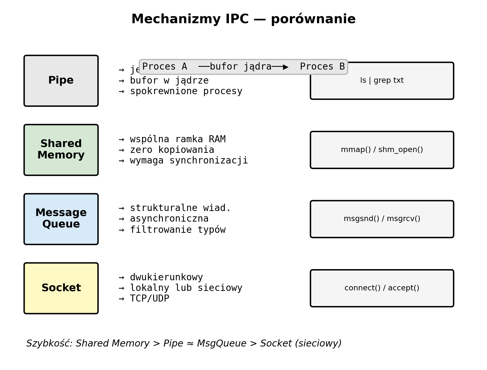

**Problem 1 — Overhead kopiowania (procesy).** Większość mechanizmów IPC wymaga kopiowania danych: proces A → jądro → proces B (2 kopie!). Przy dużych danych (np. klatki wideo 4K = 24 MB) to kosztowne.

**Problem 2 — Synchronizacja dostępu (wątki).** Wątki komunikują się przez wspólny heap, ale muszą pilnować, by nie pisać jednocześnie w to samo miejsce (race condition).

**Problem 3 — Blokowanie.** IPC może być synchroniczne (blokujące — nadawca czeka aż odbiorca przeczyta) lub asynchroniczne (nieblokujące — nadawca idzie dalej). Wybór wpływa na wydajność i złożoność kodu.

#### Mechanizmy IPC z przykładami

**Pipe (potok anonimowy)** — jednokierunkowy strumień bajtów w pamięci jądra. Tylko między procesem-rodzicem a potomkiem (fork). Klasyczny przykład Unix:

    $ ls -la | grep ".txt" | wc -l

    Jak to działa wewnętrznie:
    ┌────────┐  write()  ┌─────────────┐  read()  ┌────────┐
    │  ls    │──────────→│ bufor jądra │──────────→│  grep  │
    │ stdout │  fd[1]    │  (4 KB)     │  fd[0]    │ stdin  │
    └────────┘           └─────────────┘           └────────┘
    Proces A pisze do fd[1], Proces B czyta z fd[0].
    Jądro buforuje dane. Gdy bufor pełny → write() blokuje.

    Kod C:
    int fd[2];
    pipe(fd);               // tworzy potok: fd[0]=read, fd[1]=write
    if (fork() == 0) {      // potomek
        close(fd[1]);        // zamknij pisanie
        read(fd[0], buf, n); // czytaj od rodzica
    } else {                // rodzic
        close(fd[0]);        // zamknij czytanie
        write(fd[1], "hello", 5); // pisz do potomka
    }

**Named Pipe (FIFO)** — jak pipe, ale ma nazwę w systemie plików. Niespokrewnione procesy mogą go używać:

    $ mkfifo /tmp/moj_potok                   # stwórz FIFO
    $ echo "dane" > /tmp/moj_potok &          # proces A pisze
    $ cat /tmp/moj_potok                       # proces B czyta → "dane"

**Shared Memory (pamięć współdzielona)** — najszybszy IPC. OS mapuje ten sam region pamięci fizycznej do obu procesów. Zero kopiowania — oba procesy czytają/piszą bezpośrednio. ALE: wymaga synchronizacji (semafor/mutex).

    ┌───────────┐           ┌───────────┐
    │ Proces A  │           │ Proces B  │
    │           │           │           │
    │ strona 7 ─┼──→ RAM ←─┼─ strona 3 │  ← ta sama ramka fizyczna!
    │           │  ramka 42 │           │
    └───────────┘           └───────────┘
    Bez kopiowania — A pisze, B widzi od razu.

    Kod C (POSIX):
    int fd = shm_open("/my_shm", O_CREAT|O_RDWR, 0666);
    ftruncate(fd, 4096);
    char *ptr = mmap(NULL, 4096, PROT_READ|PROT_WRITE, MAP_SHARED, fd, 0);
    sprintf(ptr, "dane z procesu A"); // Proces A pisze
    // Proces B: shm_open + mmap → czyta ptr → "dane z procesu A"

**Message Queue (kolejka wiadomości)** — strukturalne wiadomości w jądrze. Asynchroniczna: nadawca wrzuca, odbiorca pobiera z kolejki kiedy chce. Typ wiadomości pozwala filtrować.

    Proces A: msgsnd(qid, &msg, size, 0)    // wyślij wiadomość
    Proces B: msgrcv(qid, &msg, size, typ, 0) // odbierz (filtruj typ)

    Przewaga nad pipe: wiele nadawców/odbiorców, filtrowanie typów,
    wiadomość ma granice (pipe to surowy strumień bajtów).

**Socket** — dwukierunkowa komunikacja, działa lokalnie (Unix domain) i przez sieć (TCP/UDP). Najbardziej uniwersalny mechanizm IPC.

    ┌──────────┐  TCP/IP  ┌──────────┐
    │ Klient   │←────────→│ Serwer   │    sieciowy (różne maszyny)
    └──────────┘          └──────────┘

    ┌──────────┐  Unix    ┌──────────┐
    │ Proces A │←────────→│ Proces B │    lokalny (ten sam host)
    └──────────┘  socket  └──────────┘    /tmp/app.sock

**Signal (sygnał)** — asynchroniczne powiadomienie od jądra/procesu. Przesyła TYLKO numer (nie dane). Użycie: obsługa Ctrl+C (SIGINT), zabijanie procesów (SIGKILL), powiadomienie o zdarzeniu.

    kill(pid, SIGUSR1);    // wyślij sygnał SIGUSR1 do procesu
    $ kill -9 1234         // wyślij SIGKILL (nie do przechwycenia)
    signal(SIGINT, handler); // zarejestruj handler dla Ctrl+C

#### Porównanie mechanizmów IPC

    Mechanizm        Kierunek     Szybkość       Zastosowanie
    ──────────────────────────────────────────────────────────
    Pipe             jednokier.   średnia        ls | grep
    Named Pipe       jednokier.   średnia        demon → klient
    Shared Memory    dwukier.     najszybsza     video, bazy danych
    Message Queue    dwukier.     średnia        wieloproducentowe
    Socket           dwukier.     wolna (sieć)   klient-serwer
    Signal           jednokier.   natychmiast.   powiadomienia

---

### Problemy synchronizacji

Gdy wątki (lub procesy z shared memory) współdzielą dane, pojawiają się 4 fundamentalne problemy:

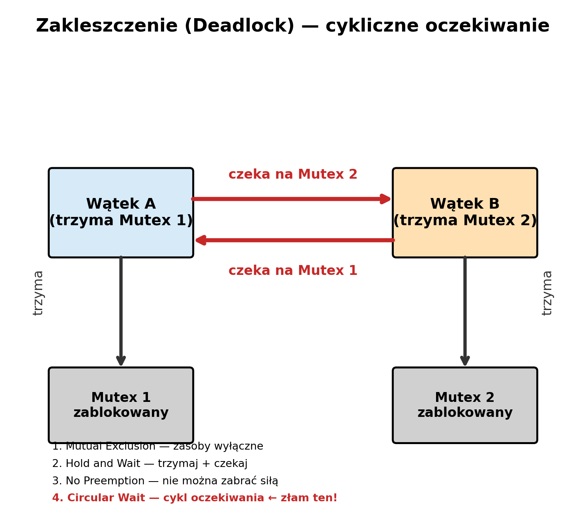

#### Problem 1 — Wyścig (Race Condition)

Wynik programu zależy od losowej kolejności operacji wątków. Źródło: operacja „czytaj-modyfikuj-zapisz" nie jest atomowa.

    Przykład: konto bankowe, saldo = 1000 zł
    Wątek A: wpłata 500 zł          Wątek B: wypłata 200 zł

    BEZ synchronizacji (błąd!):
    ─────────────────────────────────────────────────────────
    Czas  Wątek A                   Wątek B
    ─────────────────────────────────────────────────────────
    t1    czytaj saldo → 1000
    t2                              czytaj saldo → 1000
    t3    saldo = 1000 + 500 = 1500
    t4                              saldo = 1000 - 200 = 800
    t5    zapisz saldo ← 1500
    t6                              zapisz saldo ← 800
    ─────────────────────────────────────────────────────────
    Wynik: 800 zł (powinno być 1300!)  ← wypłata nadpisała wpłatę!

    Poprawka — mutex:
    lock(mutex);
    saldo = saldo + kwota;  // sekcja krytyczna
    unlock(mutex);

    Z mutex: A blokuje → czyta 1000 → pisze 1500 → B blokuje → czyta 1500 → pisze 1300. ✓

#### Problem 2 — Zakleszczenie (Deadlock)

Dwa lub więcej wątków czekają na siebie nawzajem — żaden nie może kontynuować. System „zamiera".

    Klasyczny scenariusz: 2 wątki, 2 mutexy
    ─────────────────────────────────────────────────────────
    Wątek A:                      Wątek B:
      lock(mutex1) ✓  ←trzyma       lock(mutex2) ✓  ←trzyma
      lock(mutex2) ⏳ ←czeka!       lock(mutex1) ⏳ ←czeka!
    ─────────────────────────────────────────────────────────
    A czeka na mutex2 (B go trzyma), B czeka na mutex1 (A go trzyma).
    → DEADLOCK — żaden nie odpuści!

    Diagram cyklu:
          ┌──────────┐  czeka na  ┌──────────┐
          │ Wątek A  │───────────→│ Mutex 2  │
          │ trzyma   │            │ trzyma   │
          │ Mutex 1  │←───────────│ Wątek B  │
          └──────────┘  czeka na  └──────────┘

**Warunki Coffmana** — 4 warunki konieczne deadlocka (WSZYSTKIE muszą zachodzić):

    1. Mutual Exclusion  — zasób wyłączny (tylko 1 wątek)
    2. Hold and Wait     — trzymaj zasób, czekaj na kolejny
    3. No Preemption     — nie można zabrać zasobu siłą
    4. Circular Wait     — cykliczne oczekiwanie (A→B→...→A)

    Strategie zapobiegania (złam jeden warunek):
    ────────────────────────────────────────────────────
    Warunek            Jak złamać                  Przykład
    ────────────────────────────────────────────────────
    Mutual Exclusion   Zrób zasób współdzielony    Read-write lock
    Hold and Wait      Bierz WSZYSTKIE naraz       lock(m1, m2) atomowo
    No Preemption      Pozwól na timeout/trylock   pthread_mutex_trylock()
    Circular Wait      Porządek liniowy zamków     Zawsze m1 przed m2
    ────────────────────────────────────────────────────

    Najczęstsza strategia: PORZĄDEK LINIOWY (Circular Wait).
    Zasada: numeruj mutexy, zawsze blokuj w rosnącej kolejności.
    Jeśli mutex1 < mutex2 → ZAWSZE lock(mutex1) przed lock(mutex2).

#### Problem 3 — Zagłodzenie (Starvation)

Wątek nigdy nie dostaje zasobu, bo inni ciągle go wyprzedzają. Nie jest deadlockiem (inni się wykonują). Przykład: 10 wątków, wątek niskopriorytetowy nigdy nie dostaje CPU bo wysoko priorytetowe ciągle dominują.

    Rozwiązanie: aging (starzenie) — priorytet rośnie z czasem oczekiwania.
    Po 100 ms bez CPU: priorytet +1, po 200 ms: +2, itd.
    W końcu nawet najniższy wątek dostanie CPU.

#### Problem 4 — Inwersja priorytetów (Priority Inversion)

Wątek wysokopriorytetowy (H) czeka na mutex trzymany przez niskopriorytetowy (L), a średniopriorytetowy (M) blokuje L. Efekt: H czeka na M (mimo wyższego priorytetu!).

    Priorytet: H > M > L
    ─────────────────────────────────────────────────
    Czas   L             M           H
    ─────────────────────────────────────────────────
    t1     lock(mutex)
    t2                   (gotowy, wypycha L!)
    t3                   pracuje...     (czeka na mutex!)
    t4                   pracuje...     (CZEKA — bo M blokuje L)
    t5                   gotowy
    t6     unlock(mutex)                (wreszcie!)
    ─────────────────────────────────────────────────
    H czekał, dopóki M nie skończył, mimo że H > M!

    Rozwiązanie: Priority Inheritance Protocol.
    L dziedziczy priorytet H (tymczasowo L=H), więc M nie może wypchać L.
    Mars Pathfinder (1997) — klasyczny bug priority inversion w kosmosie!

---

### Klasyczne problemy synchronizacji

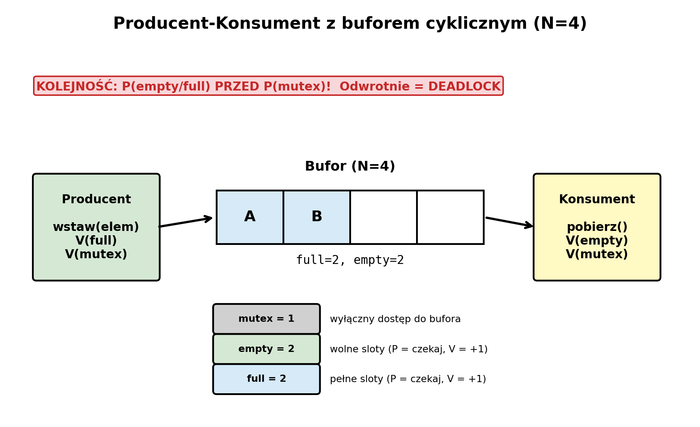

#### Producent-Konsument (Bounded Buffer)

n producentów wrzuca elementy do bufora o ograniczonej pojemności, m konsumentów pobiera. Bufor pełny → producent czeka. Bufor pusty → konsument czeka.

    Rozwiązanie z semaforami:
    ─────────────────────────────────────────────────
    semaphore mutex = 1;       // wyłączny dostęp do bufora
    semaphore empty = N;       // ile wolnych slotów (początkowo N)
    semaphore full  = 0;       // ile pełnych slotów (początkowo 0)

    Producent:                  Konsument:
      P(empty)  // czekaj na   P(full)   // czekaj na
                // wolny slot            // pełny slot
      P(mutex)  // wejdź do    P(mutex)  // wejdź do
                // sek. kryt.            // sek. kryt.
      wstaw(elem)              elem = pobierz()
      V(mutex)  // wyjdź       V(mutex)  // wyjdź
      V(full)   // +1 pełny    V(empty)  // +1 wolny
    ─────────────────────────────────────────────────

    Bufor (N=4):
    ┌────┬────┬────┬────┐
    │ A  │ B  │    │    │  ← full=2, empty=2
    └────┴────┴────┴────┘
      ↑                 ↑
    konsument        producent

    BŁĄD jeśli zamienimy kolejność P(empty) i P(mutex) w producencie:
    Producent: P(mutex) → P(empty) ← bufor pełny → czeka z mutexem!
    Konsument: P(full) → P(mutex) ← mutex zajęty → DEADLOCK!

#### Czytelnicy-Pisarze (Readers-Writers)

Wielu czytelników może czytać jednocześnie. Pisarz wymaga wyłącznego dostępu (ani czytelnicy, ani inni pisarze).

    Rozwiązanie (first readers-writers):
    ─────────────────────────────────────────────────
    int readers = 0;
    mutex rw_mutex;    // pisarz LUB pierwszy/ostatni czytelnik
    mutex count_mutex; // ochrona zmiennej readers

    Czytelnik:                    Pisarz:
      lock(count_mutex)             lock(rw_mutex)
      readers++                     // PISZ (wyłączny)
      if (readers == 1)             unlock(rw_mutex)
        lock(rw_mutex)  // 1. czytelnik blokuje pisarzy
      unlock(count_mutex)
      // CZYTAJ (wielu jednocześnie!)
      lock(count_mutex)
      readers--
      if (readers == 0)
        unlock(rw_mutex) // ostatni odblokowuje pisarzy
      unlock(count_mutex)
    ─────────────────────────────────────────────────

    Problem: pisarze mogą głodować (readers=0 nigdy nie zachodzi).
    Rozwiązanie: fairness — kolejka FIFO czytelników i pisarzy.

#### Ucztujący filozofowie (Dining Philosophers)

5 filozofów siedzi przy okrągłym stole, między każdą parą 1 widelec. Filozofowie myślą lub jedzą. Jedzenie wymaga 2 widelców (lewego i prawego). Naiwne rozwiązanie: każdy bierze lewy → prawy → deadlock (wszyscy trzymają lewy, czekają na prawy).

    Rozwiązanie — złamanie cyklu:
    Filozofowie 0-3: bierz lewy, potem prawy.
    Filozof 4: bierz PRAWY, potem lewy. ← łamie circular wait!

    Alternatywa: semafor(4) — max 4 filozofów próbuje jeść naraz
    → jeden widelec zawsze wolny → brak deadlocka.

---

### Mechanizmy synchronizacji — porównanie

    Mechanizm         Opis                           Kiedy używać
    ──────────────────────────────────────────────────────────────────
    Mutex             Zamek: 1 wątek w sekcji        Sekcja krytyczna
    Semafor(n)        Licznik: max n wątków          Ograniczone zasoby
    Monitor           Obiekt z wbudowanym mutex      Java synchronized
    Cond. Variable    wait()/signal() na warunek     Producent-konsument
    Spinlock          Aktywne czekanie (busy-wait)   Bardzo krótkie sekcje
    RW Lock           Wielu czytelników LUB 1 pisarz Bazy danych, cache
    Barrier           Czekaj aż wszyscy dotrą        Obliczenia równoległe

    Mutex vs Semafor:
    ┌────────────────────────────────────────────────────────────┐
    │  Mutex = klucz do łazienki (1 osoba)                      │
    │  Semafor(3) = parking na 3 miejsca (3 samochody naraz)    │
    │  Semafor(1) = mutex (szczególny przypadek)                │
    └────────────────────────────────────────────────────────────┘

    Mutex vs Spinlock:
    ┌────────────────────────────────────────────────────────────┐
    │  Mutex: wątek ZASYPIA gdy czeka → OS go obudzi (koszt ~μs)│
    │  Spinlock: wątek KRĘCI się w pętli → marnuje CPU          │
    │  Spinlock lepszy gdy sekcja < 1 μs (koszt uśpienia > spin)│
    │  Mutex lepszy gdy sekcja > 1 μs (nie marnuje CPU)         │
    └────────────────────────────────────────────────────────────┘

### Etymologia

**Proces** — łac. „processus" = posuwanie się naprzód. **Wątek (Thread)** — metafora nitki wykonania (jak nić Ariadny). **Mutex** — portmanteau MUTual EXclusion. **Semafor** — Dijkstra (1965); od semaforów kolejowych; P() = hol. „proberen" (próbować), V() = hol. „verhogen" (podnosić). **Coffman** — Edward Coffman Jr. et al. (1971): 4 warunki konieczne deadlocka. **Deadlock (zakleszczenie)** — jak zablokowane koła zębate. **IPC** — Inter-Process Communication.

### Jak zapamiętać

- **„Proces = mieszkanie, Wątek = pokój"** — każde mieszkanie ma adres (przestrzeń), pokoje dzielą kuchnię (heap)
- Wątki szybsze bo nie trzeba zmieniać „mieszkania" (TLB flush)
- **4 warunki Coffmana** zakleszczenia: złam jeden → brak deadlocka

\newpage

## PYTANIE 10: Zarządzanie pamięcią (SOI)

**Problemy i mechanizmy. Stronicowanie vs segmentacja.**

---

### Tło pojęciowe — słowniczek

**Pamięć operacyjna (RAM)** — szybka pamięć ulotna, z której procesor odczytuje i zapisuje dane. Ograniczona ilościowo (np. 8–64 GB). Zadanie OS: rozdzielić ją sprawiedliwie i bezpiecznie między procesy.

**Pamięć wirtualna (virtual memory)** — abstrakcja: każdy proces „widzi" własną, ciągłą przestrzeń adresową, niezależnie od fizycznego rozmieszczenia danych w RAM. OS + MMU (sprzęt) tłumaczą adresy wirtualne na fizyczne. Dzięki temu programy mogą używać więcej pamięci niż fizycznie dostępne (reszta na dysku = swap).

    Program widzi:    [0x0000 ... 0xFFFF]  ← wirtualne, ciągłe
    RAM fizyczny:     [ramka 5][ramka 12][ramka 3]  ← rozproszone

**MMU (Memory Management Unit)** — dedykowany układ sprzętowy (część procesora) odpowiedzialny za translację adresów wirtualnych na fizyczne. Każdy dostęp do pamięci przechodzi przez MMU — program podaje adres wirtualny, MMU sprawdza tablicę stron (lub TLB) i przekształca go na adres fizyczny.

    CPU: "chcę bajt pod adresem wirtualnym 0x1234"
      ↓
    MMU: sprawdza tablicę stron → strona 1 → ramka 7
      ↓
    Magistrala: odczyt z adresu fizycznego 0x7234

MMU sprawdza też uprawnienia (bity R/W/X) — jeśli proces próbuje pisać do strony read-only, MMU generuje wyjątek (page fault / segmentation fault). Bez MMU nie ma pamięci wirtualnej — każdy program musiałby zarządzać fizycznymi adresami ręcznie (tak było w MS-DOS).

---

**Fragmentacja (fragmentation)** — marnowanie pamięci z powodu sposobu alokacji.

**Fragmentacja zewnętrzna (external)** — wolna pamięć jest rozproszona w małych kawałkach między zajętymi. Suma wolnych kawałków wystarczy, ale żaden pojedynczy nie jest wystarczająco duży.

    [ZAJĘTE][wolne 2KB][ZAJĘTE][wolne 3KB][ZAJĘTE]
    Razem 5KB wolne, ale nie zmieści się blok 4KB!

**Fragmentacja wewnętrzna (internal)** — przydzielony blok jest większy niż potrzebny. Pozostała różnica jest zmarnowana. Np. strona 4KB przydzielona dla 100 bajtów danych — 3996 bajtów zmarnowane.

**Ochrona pamięci (memory protection)** — mechanizm uniemożliwiający procesowi dostęp do pamięci innego procesu. Realizowana przez tablice stron (bity R/W/X) i MMU. Bez ochrony: crash jednego procesu mógłby zepsuć cały system.

**Dlaczego crash bez ochrony zabija cały system?** Bez ochrony pamięci wszystkie procesy widzą tę samą, płaską przestrzeń fizyczną. Wadliwy program może nadpisać dowolny adres — w tym:
- **Kod jądra OS** — nadpisanie instrukcji jądra = kernel crash = restart.
- **Dane innego procesu** — np. baza danych traci spójność.
- **Tablice systemowe** — np. tablica przerwań (IDT) — procesor nie wie, co robić przy przerwaniu → zawieszenie.

    Bez ochrony (MS-DOS, lata 80.):
    [jądro OS | program A | program B | wolne]
    0x0000     0x1000      0x5000      0x8000

    Program A ma bug → pisze pod adres 0x0500 (pamięć jądra!)
    → nadpisuje tablicę przerwań → system się zawiesza

    Z ochroną (Windows/Linux):
    Program A widzi:  [0x0000 ... 0xFFFF]  ← wirtualne
    Program B widzi:  [0x0000 ... 0xFFFF]  ← wirtualne, ALE inne ramki!
    Program A pisze pod 0x0500 → trafia do SWOJEJ ramki, nie jądra.
    Próba dostępu do cudzej pamięci → MMU: Segmentation Fault → OS zabija TYLKO ten proces.

**Bity R/W/X (Read / Write / eXecute)** — flagi ochrony w każdym wpisie tablicy stron, określające co wolno robić ze stroną:
- **R (Read)** — można czytać dane ze strony.
- **W (Write)** — można zapisywać dane na stronę. Bez W próba zapisu → page fault.
- **X (eXecute)** — procesor może wykonywać kod ze strony. Bez X próba skoku → fault.

Przykłady zastosowań:

    Rodzaj pamięci    R  W  X   Wyjaśnienie
    ──────────────────────────────────────────
    Kod programu      ✓  ✗  ✓   czytaj i wykonuj, nie modyfikuj
    Dane globalne     ✓  ✓  ✗   czytaj/pisz, nie wykonuj (DEP)
    Stos              ✓  ✓  ✗   zmienne lokalne, brak wykonania
    Stałe (const)     ✓  ✗  ✗   tylko do odczytu
    Guard page        ✗  ✗  ✗   brak dostępu → wykrywanie przepełnienia stosu

**DEP (Data Execution Prevention)** — mechanizm bezpieczeństwa: strony z danymi nie mają bitu X. Atakujący wstrzykuje kod do bufora (dane), ale procesor odmawia wykonania → ochrona przed atakami buffer overflow.

**Relokacja (relocation)** — program musi działać pod różnymi adresami fizycznymi (nie wie z góry, gdzie zostanie załadowany). Pamięć wirtualna rozwiązuje to automatycznie — program zawsze widzi te same adresy wirtualne.

**Dlaczego program nie wie, pod jakim adresem fizycznym będzie?** Przy uruchamianiu OS decyduje, które ramki RAM są wolne. To zależy od tego, co innego aktualnie działa.

    Scenariusz 1: uruchom program A jako jedyny
    RAM: [jądro][....A....][wolne...........]
    Program A fizycznie pod adresem 0x1000

    Scenariusz 2: uruchom A gdy B i C już działają
    RAM: [jądro][..B..][..C..][..A..][wolne]
    Program A fizycznie pod adresem 0x5000

    Problem: program ma instrukcję "skocz do adresu 0x2000" (swojej funkcji)
    W scenariuszu 1: 0x2000 to poprawne miejsce w A
    W scenariuszu 2: 0x2000 to fragment B → CRASH!

    Rozwiązanie — pamięć wirtualna:
    A ZAWSZE widzi siebie pod adresami 0x0000–0xFFFF (wirtualne)
    MMU tłumaczy: wirtualne 0x2000 → fizyczne 0x6000 (scenariusz 2)
    Program nie musi wiedzieć, gdzie fizycznie leży — abstrahuje od tego.

**COW (Copy-on-Write)** — optymalizacja: przy fork() (tworzenie procesu) dziecko współdzieli strony z rodzicem. Kopia fizyczna następuje dopiero gdy któryś pisze. Oszczędność: jeśli procesy tylko czytają, nie kopiujemy nic.

    fork()
    Rodzic: strona 7 → ramka 42 [R-only]  ─┐
                                             ├─ ta sama ramka fizyczna!
    Dziecko: strona 7 → ramka 42 [R-only] ─┘

    Dziecko pisze do strony 7:
    → page fault (ochrona zapisu) → OS kopiuje ramkę 42 → nowa ramka 58
    Rodzic: strona 7 → ramka 42 [R/W]
    Dziecko: strona 7 → ramka 58 [R/W]   ← kopia powstała dopiero teraz

Zysk w praktyce: `fork()` + `exec()` (typowy wzorzec Unix) — dziecko natychmiast zastępuje obraz procesu, więc żadna strona nie jest kopiowana. Bez COW: fork() kopiowałby setki MB niepotrzebnie.

---

**Współdzielenie pamięci (memory sharing)** — mechanizm pozwalający wielu procesom korzystać z tych samych ramek fizycznych. To jeden z kluczowych problemów zarządzania pamięcią — bez współdzielenia każdy proces musiałby mieć własną kopię wszystkiego, co drastycznie zwiększyłoby zużycie RAM.

**Formy współdzielenia:**

1. **Biblioteki współdzielone (shared libraries / .so / .dll)** — kod biblioteki (np. libc) jest ładowany do RAM raz i mapowany do przestrzeni adresowej wielu procesów. Każdy proces widzi tę samą ramkę fizyczną z kodem, ale pod własnym adresem wirtualnym.

        RAM fizyczny:
        [ramka 100: kod libc] ← załadowana RAZ

        Proces A: strona 50 → ramka 100 (read-only)
        Proces B: strona 80 → ramka 100 (read-only)
        Proces C: strona 30 → ramka 100 (read-only)

        Bez współdzielenia: 3 kopie × 2 MB = 6 MB
        Ze współdzieleniem: 1 kopia × 2 MB = 2 MB
        Przy 100 procesach: 200 MB vs 2 MB — oszczędność 99%!

    Sekcje biblioteki: TEXT (kod, read-only) — współdzielona; DATA (zmienne globalne) — każdy proces ma własną kopię (COW).

2. **COW (Copy-on-Write)** — opisany wyżej. Współdzielenie stron po fork() do momentu zapisu.

3. **Shared Memory (pamięć współdzielona IPC)** — region RAM jawnie współdzielony między procesami (np. `shmget()`/`shmat()` w POSIX, `mmap()` z `MAP_SHARED`). Najszybszy mechanizm IPC — brak kopiowania, bezpośredni dostęp. Wymaga synchronizacji (semafory, muteksy).

        Proces A                 Proces B
        strona 20 ──┐       ┌── strona 45
                     ↓       ↓
                  [ramka 200: wspólne dane]
        A pisze „hello" → B natychmiast widzi „hello"

4. **Memory-mapped files (pliki mapowane w pamięci)** — plik z dysku mapowany do przestrzeni adresowej procesu (`mmap()`). Wiele procesów może mapować ten sam plik — zmiany jednego są widoczne dla innych.

**Realizacja sprzętowa:** Współdzielenie działa dzięki tablicom stron — wiele procesów ma wpisy wskazujące na tę samą ramkę fizyczną. Bity ochrony (R/W/X) kontrolują, kto może czytać, pisać, wykonywać.

    Tablica stron procesu A:  strona 50 → ramka 100 [R--]
    Tablica stron procesu B:  strona 80 → ramka 100 [R--]
    Tablica stron procesu C:  strona 30 → ramka 100 [R--]
    → 3 procesy, 1 ramka fizyczna, różne adresy wirtualne

**Dlaczego to ważne dla zarządzania pamięcią?** Typowy system Linux ma dziesiątki procesów korzystających z tych samych bibliotek (libc, libpthread, libm…). Bez współdzielenia zapotrzebowanie na RAM byłoby wielokrotnie większe. Współdzielenie to kluczowa optymalizacja pozwalająca uruchamiać wiele procesów jednocześnie.

**Czy ochrona pamięci i współdzielenie nie są sprzeczne?** Nie — one współpracują dzięki tablicom stron. Ochrona to **domyślna odmowa** — tablica stron procesu A po prostu nie zawiera wpisów wskazujących na ramki procesu B, więc A nie może nawet zaadresować pamięci B (MMU blokuje). Współdzielenie to **jawny, kontrolowany wyjątek** — OS celowo mapuje tę samą ramkę fizyczną w tablicach stron obu procesów, ustawiając bity ochrony (R/W/X) niezależnie dla każdego.

    Bez współdzielenia (domyślnie — ochrona):
    Proces A: strona 5 → ramka 10 [R/W]
    Proces B: strona 5 → ramka 77 [R/W]   ← inna ramka, A nie widzi B

    Ze współdzieleniem (jawna decyzja OS):
    Proces A: strona 5 → ramka 10 [R]     ← ta sama ramka!
    Proces B: strona 8 → ramka 10 [R]     ← ale może read-only

Kluczowy punkt: tylko jądro OS może modyfikować tablice stron. Proces nie może sam sobie dodać mapowania do cudzej ramki. Dlatego:
- **libc**: OS mapuje tę samą ramkę z kodem jako read-only do 50 procesów. Bezpieczne, bo nikt nie pisze.
- **shmget/mmap**: proces prosi OS „daj mi i procesowi B wspólny region." OS tworzy mapowanie. To opt-in, nie luka.
- **COW**: OS mapuje strony rodzica do dziecka jako read-only. Przy zapisie → page fault → OS kopiuje → dopiero wtedy zapis.

Analogia: blok mieszkalny z ochroną — każde mieszkanie ma własny zamek (ochrona), ale dwóch lokatorów może wybrać współdzielenie sali konferencyjnej (współdzielenie) — administrator budynku (OS) daje im obu klucz. To nie znaczy, że mogą wchodzić do swoich mieszkań nawzajem.

---

**Strona (page)** — jednostka pamięci wirtualnej o stałym rozmiarze (zwykle 4 KB). Pamięć wirtualna jest podzielona na strony.

**Ramka (frame)** — jednostka pamięci fizycznej o tym samym rozmiarze co strona. Strona wirtualna mapowana jest na ramkę fizyczną.

**Tablica stron (page table)** — struktura danych tłumacząca numer strony → numer ramki. Każdy proces ma własną tablicę stron.

    Adres wirtualny = [numer strony | offset]
    Tablica stron:    strona 5 → ramka 12
    Adres fizyczny  = [12 | offset]

**Wpis tablicy stron (page table entry, PTE)** — każdy wpis opisuje jedną stronę i zawiera:
- **Numer ramki (frame number)** — wskazuje, w której ramce fizycznej leży ta strona.
- **Bit Present (P)** — czy strona jest aktualnie w RAM? P=1 → w RAM, P=0 → na dysku (swap) lub nieprzydzielona. Dostęp do strony z P=0 → page fault → OS ładuje stronę z dysku.
- **Bit Dirty (D)** — czy strona była modyfikowana od załadowania? D=1 → przy wymianie trzeba zapisać ją na dysk (bo dane się zmieniły). D=0 → można po prostu wyrzucić (kopia na dysku jest aktualna). Oszczędza czas I/O.
- **Bit R (Read)** — pozwala na odczyt strony.
- **Bit W (Write)** — pozwala na zapis. W=0 → strona read-only (próba zapisu = fault). Używane przez COW i ochronę kodu.
- **Bit X (eXecute)** — pozwala na wykonanie kodu ze strony (NX bit). X=0 → strona z danymi, próba wykonania = fault (DEP).
- **Bit User/Supervisor (U/S)** — U=1 → dostępna dla kodu użytkownika; U=0 → tylko jądro OS.

Przykład wpisu:

    Strona 5: [ramka=12 | P=1 | D=0 | R=1 | W=0 | X=1 | U=1]
    → strona w RAM, nienaruszona, read+execute, dostępna dla usera
    → to wygląda jak segment TEXT (kod programu)

    Strona 8: [ramka=-- | P=0 | D=- | R=- | W=- | X=- | U=-]
    → strona NIE w RAM (P=0), dostęp = page fault

**Wielopoziomowe tablice stron** — oszczędność pamięci. Zamiast jednej ogromnej tablicy, drzewo tablic. Nieużywane gałęzie nie istnieją.

**Problem jednopoziomowej tablicy:** W 32-bitowym systemie z 4KB stronami: 2³² / 4096 = 1 048 576 wpisów × 4 bajty = **4 MB tablicy per proces**. Przy 100 procesach = 400 MB samych tablic! A większość stron jest nieużywana (typowy proces używa ułamek przestrzeni adresowej).

**Rozwiązanie — drzewo tablic:** Dzielimy tablicę na poziomy. Tylko gałęzie odpowiadające faktycznie używanym stronom muszą istnieć w pamięci.

**32-bit: 2 poziomy (x86)**

    Adres wirtualny (32 bity):
    [10 bitów: nr w Page Directory | 10 bitów: nr w Page Table | 12 bitów: offset]

    Page Directory (1024 wpisy) → każdy wskazuje na Page Table (1024 wpisy) → ramka

    Jeśli proces używa tylko 4 MB pamięci (1024 stron):
    - 1 Page Directory = 4 KB
    - 1 Page Table = 4 KB
    - Razem: 8 KB zamiast 4 MB! (oszczędność 500x)
    Pozostałe 1023 wpisy Page Directory = NULL (Page Table nie istnieje)

**64-bit: 4 poziomy (x86-64)** — każdy poziom to tablica 512 wpisów:

    PML4 → PDPT → PD → PT → ramka fizyczna

- **PML4 (Page Map Level 4)** — najwyższy poziom, 512 wpisów. Każdy wpis wskazuje na jedną tablicę PDPT. Pokrywa 512 × 512 GB = 256 TB przestrzeni.
- **PDPT (Page Directory Pointer Table)** — 512 wpisów, każdy wskazuje na PD. Jeden wpis PDPT pokrywa 1 GB.
- **PD (Page Directory)** — 512 wpisów, każdy wskazuje na PT. Jeden wpis PD pokrywa 2 MB.
- **PT (Page Table)** — 512 wpisów, każdy wskazuje na ramkę fizyczną 4 KB.

Schemat:

    Adres wirtualny (48 bitów używanych z 64):
    [9b PML4 | 9b PDPT | 9b PD | 9b PT | 12b offset]

    Translacja: CPU bierze adres wirtualny i „schodzi" po 4 tablicach:
    rejestr CR3 → PML4[idx1] → PDPT[idx2] → PD[idx3] → PT[idx4] → ramka

**Dlaczego nieużywane gałęzie nie istnieją?** W drzewie wielopoziomowym tablicę niższego poziomu tworzymy TYLKO gdy proces faktycznie odwołuje się do adresów z tego zakresu. Jeśli wpis w PML4 ma P=0 (present=0), to odpowiadające mu PDPT, PD i PT w ogóle nie zajmują pamięci.

    Typowy proces 64-bit (100 MB kodu + danych):
    - 1 PML4                          = 4 KB
    - 1-2 PDPT (max 2 GB zakresy)     = 4-8 KB
    - ~50 PD                          = ~200 KB
    - ~25600 PT (100 MB / 4 KB)       = ~100 KB
    Razem: ~310 KB zamiast pełnych tablic pokrywających 256 TB

    Puste regiony (np. 99.99% przestrzeni 256 TB):
    PML4[5] = NULL → żadna PDPT, PD ani PT nie istnieje
    → 0 bajtów kosztu za nieużywany region 512 GB!

---

**Cache (pamięć podręczna)** — mała, bardzo szybka pamięć przechowująca kopie często używanych danych z wolniejszej pamięci. Zasada: jeśli dane są w cache (hit), odczyt jest szybki; jeśli nie (miss), trzeba sięgnąć do wolniejszej pamięci i skopiować dane do cache na przyszłość.

**Hierarchia pamięci i czasy dostępu:**

    Poziom         Rozmiar     Czas dostępu    Przykład
    ──────────────────────────────────────────────────────
    Rejestry CPU   ~1 KB       ~0.3 ns         RAX, RBX
    L1 cache       32-64 KB    ~1 ns           per rdzeń
    L2 cache       256 KB-1MB  ~3-5 ns         per rdzeń
    L3 cache       8-64 MB     ~10-20 ns       współdzielony
    RAM            8-64 GB     ~50-100 ns      DDR4/DDR5
    SSD            256GB-4TB   ~50-100 μs      NVMe
    HDD            1-16 TB     ~5-10 ms        mechaniczny

    Różnica RAM vs HDD: ~100 000x wolniej!
    Dlatego swap (pamięć wirtualna na dysku) jest ostatecznością.

**Cache translacji adresów = TLB.** Translacja adresu wirtualnego wymaga przejścia 4 poziomów tablic stron (4 odczyty RAM × 100 ns = 400 ns). TLB przechowuje wynik translacji (strona→ramka) — trafienie w TLB skraca to do ~1 ns. Bez TLB każdy dostęp do pamięci byłby 4-5x wolniejszy.

**TLB (Translation Lookaside Buffer)** — sprzętowy cache translacji adresów. Przechowuje ostatnio używane mapowania strona→ramka. Trafienie w TLB: ~1 ns; pudło: ~10-100 ns (trzeba chodzić po tablicy stron). Hit rate: typowo >99%.

    Dostęp do pamięci wirtualnej adres 0x12345:
    1. CPU pyta TLB: "masz stronę 0x12?"
       → TLB hit: od razu ramka 42, koszt ~1 ns
       → TLB miss: przejdź PML4→PDPT→PD→PT, koszt ~400 ns
    2. Wynik miss zapisywany w TLB na przyszłość

    TLB ma ~64-1024 wpisów (mały, ale wystarczający)
    99% trafień × 1 ns + 1% pudło × 400 ns = śr. ~5 ns
    Bez TLB: zawsze 400 ns = 80x wolniej!

**Page fault (brak strony)** — wyjątek sprzętowy gdy strona nie jest aktualnie w RAM. OS ładuje ją z dysku (swap). Nie jest „błędem" programisty — to normalna część zarządzania pamięcią wirtualną.

    Koszt: ~1-10 ms (bo dysk!) vs ~100 ns dla dostępu do RAM
    Różnica ~10 000x — dlatego minimalizacja page faults jest krytyczna

---

**Algorytmy wymiany stron (page replacement):**
- **FIFO** — usuń najstarszą stronę (tę, która weszła do RAM jako pierwsza). Prosty, ale podatny na anomalię Bélády'ego.
- **LRU (Least Recently Used)** — usuń najdawniej używaną. Dobry, ale kosztowna implementacja (trzeba śledzić czas użycia każdej strony).
- **Clock (Second Chance)** — przybliżenie LRU. Wskazówka zegara + bit odwołania. Jeśli bit=1, daj drugą szansę (zeruj bit i idź dalej). Jeśli bit=0, wymień.
- **Optimal** — usuń stronę, która nie będzie potrzebna najdłużej. Idealny, ale nierealizowalny (wymaga znajomości przyszłości). Benchmark do porównań.

**Anomalia Bélády'ego** — paradoks specyficzny dla FIFO: zwiększenie liczby ramek (więcej pamięci!) może ZWIĘKSZYĆ liczbę page faults. Jest to kontraintuicyjne — więcej pamięci powinno pomóc, ale FIFO nie bierze pod uwagę tego, jak często strona jest używana.

Klasyczny przykład (ciąg odwołań: 1, 2, 3, 4, 1, 2, 5, 1, 2, 3, 4, 5):

    3 ramki → 9 page faults:
    Odw.: 1  2  3  4  1  2  5  1  2  3  4  5
    R1:   1  1  1  4  4  4  5  5  5  5  5  5
    R2:   -  2  2  2  1  1  1  1  1  3  3  3
    R3:   -  -  3  3  3  2  2  2  2  2  4  4
    Fault: F  F  F  F  F  F  F  -  -  F  F  -  = 9 faults

    4 ramki → 10 page faults (WIĘCEJ!):
    Odw.: 1  2  3  4  1  2  5  1  2  3  4  5
    R1:   1  1  1  1  1  1  5  5  5  5  4  4
    R2:   -  2  2  2  2  2  2  1  1  1  1  5
    R3:   -  -  3  3  3  3  3  3  2  2  2  2
    R4:   -  -  -  4  4  4  4  4  4  3  3  3
    Fault: F  F  F  F  -  -  F  F  F  F  F  F  = 10 faults

    3 ramki: 9 faults
    4 ramki: 10 faults ← ANOMALIA! więcej pamięci = gorzej!

**Dlaczego FIFO to powoduje?** FIFO wybiera ofiarę wyłącznie na podstawie czasu wejścia do RAM, ignorując czy strona jest wciąż potrzebna. Dodanie ramki zmienia kolejność wyrzucania tak nieszczęśliwie, że strony potrzebne w przyszłości są wyrzucane wcześniej niż przy mniejszej liczbie ramek.

**LRU i Optimal NIE mają tej anomalii** — należą do tzw. algorytmów stosowych (stack algorithms): zbiór stron w pamięci przy n ramkach jest ZAWSZE podzbiorem stron przy n+1 ramkach. FIFO nie ma tej własności.

---

**Segment logiczny (logical segment)** — fragment programu o spójnym, logicznym znaczeniu. Programista (i kompilator) myśli o programie jako o kilku częściach, z których każda ma inną rolę i inne reguły dostępu.

**Typowe segmenty programu:**

- **Segment kodu (TEXT / Code Segment)** — skompilowane instrukcje maszynowe programu. Read-only + Execute. Współdzielony między procesami uruchamiającymi ten sam program (po co trzymać 10 kopii tego samego kodu?).

        int main() { return add(2, 3); }  // ← po kompilacji to segment TEXT
        Rozmiar: zależy od programu (np. 50 KB prosty, 100+ MB gra)
        Ochrona: R-X (czytaj + wykonuj, NIE pisz)

- **Segment danych (DATA Segment)** — zainicjalizowane zmienne globalne i statyczne. Read + Write.

        int counter = 42;          // ← DATA (zainicjalizowana)
        static char name[] = "Jan"; // ← DATA
        Ochrona: RW- (czytaj + pisz, NIE wykonuj)

- **Segment BSS (Block Started by Symbol)** — niezainicjalizowane zmienne globalne. OS zeruje ten segment przy starcie. Nie zajmuje miejsca w pliku wykonywalnym (wiadomo, że będą same zera).

        int table[10000];  // ← BSS, 40 KB, ale w pliku .exe: 0 bajtów
        // OS alokuje 40 KB i zeruje przy starcie

- **Segment stosu (Stack Segment)** — zmienne lokalne, adresy powrotu z funkcji, parametry. Rośnie w dół (od wysokich adresów). Każdy wątek ma własny stos.

        void foo() {
            int x = 5;    // ← na stosie
            int arr[100];  // ← na stosie (400 bajtów)
        }  // ← po powrocie z funkcji: zwolnione automatycznie
        Typowy rozmiar: 1-8 MB per wątek

- **Segment sterty (Heap Segment)** — pamięć alokowana dynamicznie (malloc/new). Rośnie w górę. Programista zarządza ręcznie (lub garbage collector).

        int* p = malloc(1000);  // ← na stercie
        free(p);                // ← ręczne zwolnienie

Układ w pamięci:

    Wysoki adres
    ┌──────────┐
    │  STOS ↓  │ zmienne lokalne, rośnie w dół
    │    ...   │
    │  HEAP ↑  │ malloc/new, rośnie w górę
    │   BSS    │ niezainicjalizowane globalne (zerowane)
    │   DATA   │ zainicjalizowane globalne
    │   TEXT   │ kod maszynowy (read-only)
    └──────────┘
    Niski adres

---

**Segmentacja (segmentation)** — model zarządzania pamięcią, w którym przestrzeń adresowa procesu jest podzielona na segmenty logiczne o **zmiennych** rozmiarach. Każdy segment odpowiada jednej logicznej części programu (kod, dane, stos).

**Adresowanie w segmentacji:** Adres = (numer segmentu, offset). CPU szuka wpisu w **tablicy segmentów** i sprawdza bazę + limit.

**Baza (base)** — adres fizyczny początku segmentu w RAM. Mówi: „ten segment zaczyna się pod adresem fizycznym X".

**Limit** — maksymalny offset (rozmiar segmentu). Mówi: „ten segment ma Y bajtów". Jeśli offset ≥ limit → wyjątek (Segmentation Fault) → próba wyjścia poza segment.

    Tablica segmentów:
    Segment   Baza      Limit     Ochrona
    ──────────────────────────────────────
    0 (TEXT)  0x4000    8 KB      R-X
    1 (DATA)  0x6000    4 KB      RW-
    2 (STOS)  0xA000    2 KB      RW-

    Adres logiczny: (segment=1, offset=500)
    Sprawdź: 500 < limit(4096)? TAK
    Adres fizyczny: baza(0x6000) + offset(500) = 0x61F4

    Adres logiczny: (segment=1, offset=5000)
    Sprawdź: 5000 < limit(4096)? NIE → Segmentation Fault!

    Cecha              Stronicowanie         Segmentacja
    ─────────────────────────────────────────────────────
    Jednostka          strona (stały, 4KB)   segment (zmienny)
    Fragmentacja       wewnętrzna            zewnętrzna
    Widok programisty  niewidoczne           logiczne (kod, dane)
    Adresowanie        (strona, offset)      (segment, offset)
    Co definiuje rozmiar  sprzęt (4KB)       program (dowolny)
    Współczesne OS     dominuje (x86-64)     prawie zniknęła

**Dlaczego stronicowanie wygrało?** Stałe rozmiary stron = brak fragmentacji zewnętrznej, prostsze zarządzanie, łatwiejsze w sprzęcie. Zmienne rozmiary segmentów powodują fragmentację zewnętrzną (trzeba kompaktować pamięć, co jest kosztowne). Intel porzucił pełną segmentację w x86-64 (flat segments + paging).

**Swap** — przestrzeń na dysku używana gdy RAM się wyczerpie. OS przenosi rzadko używane strony na swap (swap out) i wczytuje je z powrotem gdy potrzebne (swap in). Wolne (dysk!), ale pozwala uruchamiać więcej niż RAM.

---

### Problemy
1. **Fragmentacja** — zewnętrzna (wolna pamięć rozproszona) i wewnętrzna (przydzielony blok > potrzebny)
2. **Ochrona** — procesy nie mogą czytać cudzej pamięci
3. **Relokacja** — program musi działać pod różnymi adresami
4. **Współdzielenie** — biblioteki, COW (Copy-on-Write)
5. **Ograniczona pamięć** — więcej procesów niż RAM

### Stronicowanie (Paging)

- Pamięć wirtualna → **strony** (pages, np. 4KB), fizyczna → **ramki** (frames)
- **Tablica stron** mapuje strony na ramki
- Translacja: adres = (numer strony | offset) → (numer ramki | offset)
- **Wielopoziomowe tablice** — oszczędność pamięci (32-bit: 2-level, 64-bit: 4-level)
- **TLB** (Translation Lookaside Buffer) — cache translacji
- **Page fault** — strona nie w RAM → ładuj z dysku (swap)
- **Algorytmy wymiany:** FIFO, LRU, Clock (Second Chance), Optimal

### Segmentacja (Segmentation)

- Pamięć dzielona na **segmenty logiczne** (kod, dane, stos) o różnych rozmiarach
- Adres = (numer segmentu, offset), tablica segmentów: (baza, limit)
- Ochrona per-segment (R, W, X)

### Porównanie

| Cecha             | Stronicowanie          | Segmentacja             |
|-------------------|------------------------|-------------------------|
| Jednostka         | Strona (stały rozmiar) | Segment (zmienny)       |
| Fragmentacja      | Wewnętrzna             | Zewnętrzna              |
| Widok programisty | Niewidoczne            | Widoczne (logiczne)     |
| Ochrona           | Per-strona             | Per-segment             |
| Współdzielenie    | Per-strona             | Per-segment (naturalne) |
| Współczesne OS    | Dominuje (x86-64)      | Rzadko (Intel porzucił) |

### Etymologia

**Stronicowanie (Paging)** — pamięć dzielona na „strony" jak w książce. **TLB** — Translation Lookaside Buffer; „lookaside" = sprawdź z boku (cache) zanim sięgniesz do tablicy. **Segmentacja** — łac. „segmentum" = odcięty kawałek. **COW** — Copy-on-Write: kopiuj dopiero przy modyfikacji. **LRU** — Least Recently Used. **FIFO** — First In, First Out. **Page fault** — „fault" to wyjątek sprzętowy, nie błąd programisty.

### Jak zapamiętać

- **Stronicowanie = szuflady jednakowej wielkości** (proste, mała fragmentacja wewnętrzna)
- **Segmentacja = pudełka różnej wielkości** (logiczne, ale fragmentacja zewnętrzna)
- Współcześnie: **stronicowanie wygrało** — segmentacja prawie zniknęła (x86-64 = flat segments + paging)

\newpage

## PYTANIE 11: Modelowanie procesów biznesowych (WSYZ)

**Scharakteryzować standardy i narzędzia do modelowania procesów biznesowych.**

---

### Tło pojęciowe — słowniczek

**Proces biznesowy (business process)** — uporządkowany zbiór czynności, które transformują dane wejściowe (np. zamówienie klienta) w wynik (np. dostarczony produkt). Przykład: „obsługa reklamacji" = przyjmij zgłoszenie → zweryfikuj → zatwierdź/odrzuć → poinformuj klienta. Modelowanie to graficzne przedstawienie takich procesów.

**Modelowanie procesów** — tworzenie wizualnych diagramów opisujących KTO, CO, KIEDY i W JAKIEJ KOLEJNOŚCI wykonuje w organizacji. Cel: zrozumienie, dokumentacja, optymalizacja, automatyzacja.

---

**BPMN (Business Process Model and Notation)** — najpopularniejszy standard notacji graficznej dla procesów biznesowych. Utrzymywany przez OMG (Object Management Group). Wersja 2.0 ma format XML, dzięki czemu diagramy mogą być bezpośrednio wykonywane przez silnik procesów (BPMS).

**Elementy BPMN:**
- **Zdarzenia (Events):** ○ start, ◎ pośrednie, ◉ końcowe — co wyzwala lub kończy proces.
- **Czynności (Activities):** prostokąty — praca do wykonania (task, subprocess).
- **Bramki (Gateways):** ◇ kontrola przepływu — decyzje i rozgałęzienia.

**Bramki BPMN (gateways):**
- **XOR (Exclusive):** dokładnie JEDNA ścieżka (jak if/else). Np. „Czy kwota > 1000? → Tak/Nie".
- **AND (Parallel):** WSZYSTKIE ścieżki jednocześnie. Np. „Wyślij e-mail I zaktualizuj bazę".
- **OR (Inclusive):** JEDNA LUB WIĘCEJ ścieżek. Np. „Powiadom SMS i/lub e-mail zależnie od preferencji."

    ○─→[Przyjmij zamówienie]─→◇XOR─→[Zapłata kartą]─→◉
                                  └→[Zapłata przelewem]─→◉

**Łączniki BPMN:**
- **Sequence Flow (→)** — kolejność czynności
- **Message Flow (- - →)** — komunikacja między uczestnikami (poolami)
- **Association (···→)** — powiązanie z danymi/komentarzami

**Swimlane** — element organizacyjny: **Pool** = organizacja/uczestnik, **Lane** = dział/rola w organizacji. Jak tory na basenie — każdy „pływa" na swoim torze.

---

**UML (Unified Modeling Language)** — uniwersalny język modelowania w inżynierii oprogramowania. 14 typów diagramów. W kontekście procesów używa się **Activity Diagrams** — rozszerzenie flowchartów z fork/join (współbieżność), decision nodes, object flow. Lepszy dla procesów technicznych/software niż BPMN.

**UML Activity Diagram vs BPMN:**

    Cecha          BPMN                 UML Activity
    ─────────────────────────────────────────────────
    Cel            Procesy biznesowe    Przepływ sterowania
    Odbiorcy       Biznes + IT          Głównie IT
    Komunikacja    Pools + Msg Flow     Partitions
    Automatyzacja  Tak (XML)            Ograniczona

**EPC (Event-driven Process Chain)** — notacja procesowa: naprzemienne zdarzenia i funkcje, połączone łącznikami logicznymi (AND/OR/XOR). Popularny w środowisku SAP (framework ARIS). Mniej uniwersalny niż BPMN.

**ARIS (Architecture of Integrated Information Systems)** — framework i narzędzie prof. Scheera do modelowania procesów. Bazuje na EPC. Używany głównie w dużych firmach z SAP.

---

**OMG (Object Management Group)** — organizacja standaryzacyjna odpowiedzialna za BPMN, UML, CORBA. Non-profit, członkowie to firmy IT (IBM, Oracle, SAP...).

**BPMS (Business Process Management System/Suite)** — oprogramowanie do automatyzacji procesów BPMN. Diagram BPMN 2.0 XML jest interpretowany i wykonywany przez silnik (np. Camunda, jBPM). Zmiana procesu = zmiana diagramu, nie kodu.

**IDEF0 (Integration DEFinition)** — notacja modelowania funkcji z US Air Force (1970s). Skupia się na WEJŚCIach, WYJŚCIach, mechanizmach i kontrolach. Rzadko używana współcześnie.

**VSM (Value Stream Map)** — narzędzie Lean Manufacturing. Mapuje przepływ materiałów i informacji od dostawcy do klienta, identyfikuje marnotrawstwo (waste). Stosowane w fabrykach i IT (DevOps).

**Flowchart (schemat blokowy)** — najprostszy sposób modelowania: prostokąty (czynności), romby (decyzje), strzałki (przepływ). Prekursor BPMN, ale brak standardów dla komunikacji międzyprocesowej.

---

### Porównanie notacji — diagramy tego samego procesu

Poniżej ten sam proces „Obsługa reklamacji" zamodelowany w 4 różnych notacjach. Wszystkie diagramy znajdują się w katalogu `pytania/img/`.

**BPMN 2.0** — z poolem, lane'ami (BOK, Jakość, Magazyn), bramkami XOR, zdarzeniami start/end:

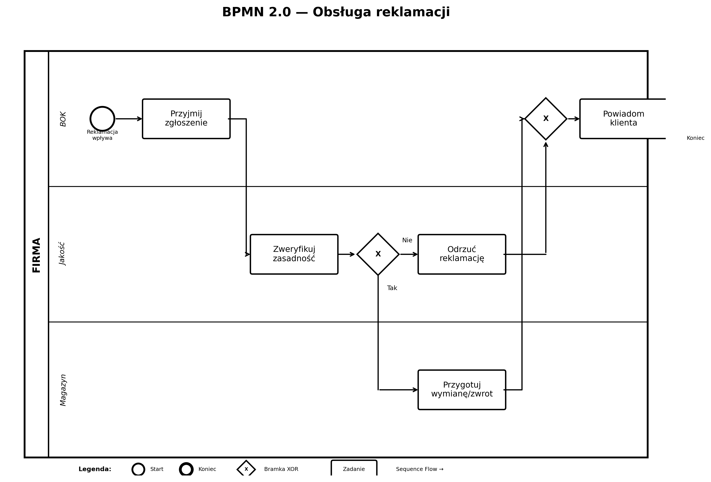

**UML Activity Diagram** — z węzłami decyzji, merge, initial/final nodes:

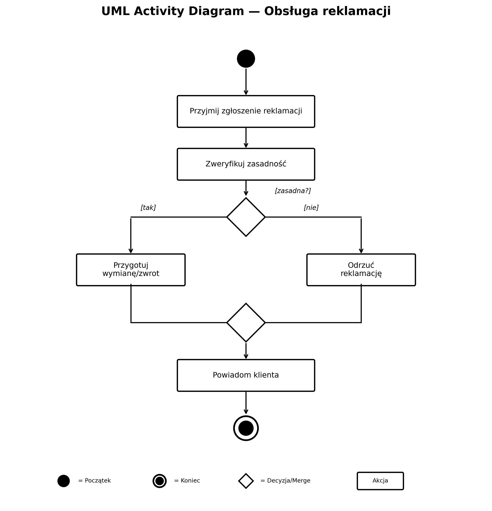

**EPC (Event-driven Process Chain)** — naprzemienne zdarzenia (szare) i funkcje (białe), łączniki XOR:

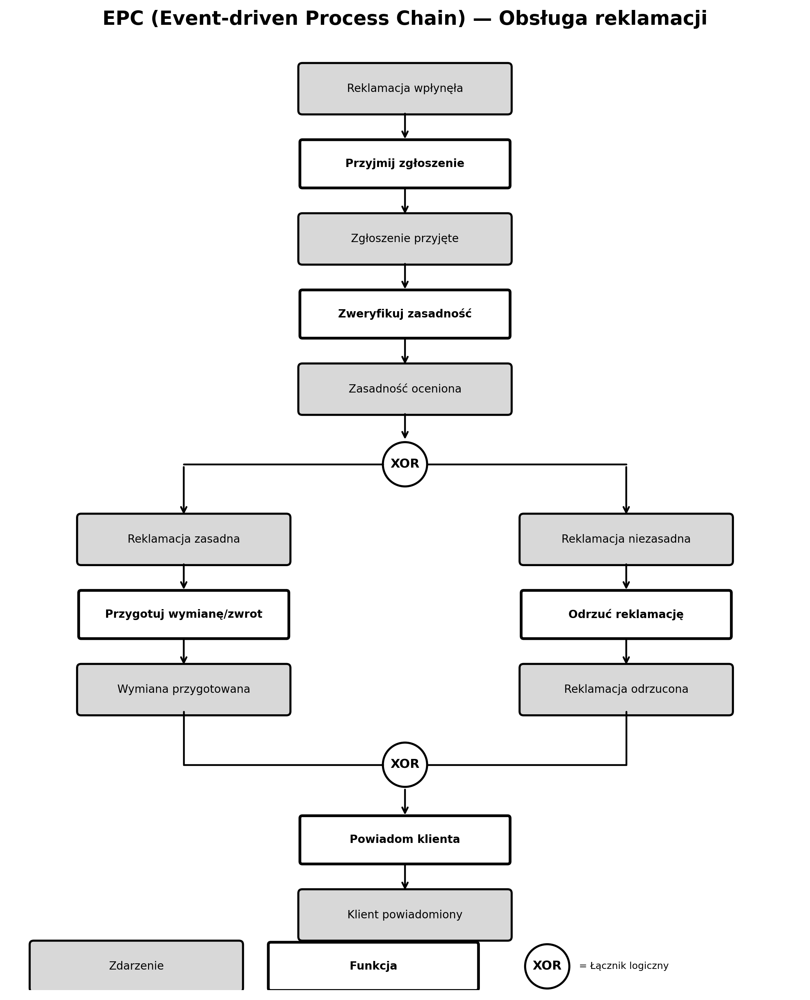

**Schemat blokowy (Flowchart)** — prostokąty (procesy), romby (decyzje), równoległoboki (we/wy):

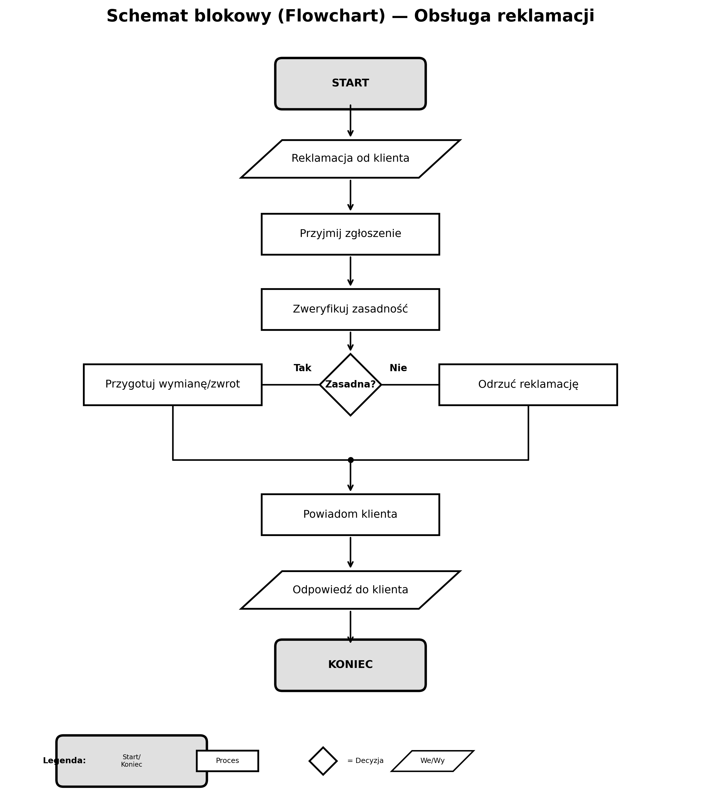

---

### Główne standardy

### BPMN 2.0 (Business Process Model and Notation) — OMG
- **Uniwersalny standard** — dla analityków, architektów, programistów
- Elementy: Zdarzenia (○ start, ◎ pośrednie, ◉ końcowe), Czynności (prostokąty), Bramki (◇ XOR, ◆ AND, ○◇ OR)
- Łączniki: Sequence Flow (→), Message Flow (- - →), Association (···→)
- Swimlanes: Pool (organizacja) / Lane (dział)
- Format XML → automatyzacja (BPMS)

### UML Activity Diagrams
- Część UML 2.x — rozszerzenie flowchartów + sieci Petriego
- Elementy: akcje, decyzje (◇), fork/join (▬), pin (object flow)
- Lepsze dla procesów technicznych/software

### EPC (Event-driven Process Chain)
- Naprzemienne zdarzenia i funkcje, łączniki AND/OR/XOR
- Popularny w SAP (ARIS framework)

### Inne: IDEF0 (modelowanie funkcji), VSM (Value Stream Map, Lean), Flowcharty

### BPMN vs UML Activity

| Cecha        | BPMN               | UML Activity       |
|--------------|---------------------|---------------------|
| Cel          | Procesy biznesowe   | Przepływ sterowania |
| Odbiorcy     | Biznes + IT         | Głównie IT          |
| Komunikacja  | Pools + Message Flow| Partitions          |
| Automatyzacja| Tak (BPMN 2.0 XML) | Ograniczona         |

### Narzędzia do modelowania procesów biznesowych

**Bizagi Modeler** — darmowe narzędzie desktopowe (Windows) do modelowania BPMN 2.0. Intuicyjny interfejs drag-and-drop, walidacja poprawności diagramów, eksport do PDF/Word/PNG. Wersja płatna (Bizagi Automation Server) pozwala na automatyzację i wykonywanie procesów. Popularny w edukacji i małych firmach — zerowa bariera wejścia.

**Camunda** — platforma open-source do automatyzacji procesów BPMN 2.0 i DMN (Decision Model and Notation). Składa się z:
- **Camunda Modeler** — desktopowy edytor diagramów BPMN/DMN
- **Camunda Engine** — silnik wykonawczy (Java) — interpretuje XML BPMN i realizuje proces krok po kroku
- **Camunda Cockpit** — panel monitoringu uruchomionych instancji procesów
Stosowany w bankach, ubezpieczeniach, e-commerce. Unikalna cecha: diagram BPMN = kod wykonywalny (nie tylko dokumentacja).

**Signavio (SAP Signavio)** — chmurowe narzędzie do modelowania i analizy procesów. Przejęte przez SAP w 2021. Obsługuje BPMN 2.0, EPC, DMN. Wyróżnik: **Process Intelligence** — automatyczne odkrywanie procesów z logów systemów IT (process mining). Integracja z SAP ERP. Stosowane w dużych korporacjach.

**ARIS (Software AG)** — zaawansowany framework i narzędzie do modelowania architektury przedsiębiorstwa. Bazuje na EPC, ale obsługuje też BPMN 2.0. Pięć widoków architektury (organizacja, dane, funkcje, procesy, produkty/usługi). Dominuje w środowiskach SAP. Główni odbiorcy: duże organizacje z rozbudowanymi strukturami.

**Enterprise Architect (Sparx Systems)** — komercyjne narzędzie do modelowania UML, BPMN, ArchiMate, SysML i wielu innych notacji. Jednolite środowisko dla architektów IT i analityków. Silne wsparcie dla generowania kodu z modeli i inżynierii odwrotnej (reverse engineering). Stosowane głównie w projektach software'owych.

**Lucidchart** — chmurowe narzędzie do tworzenia diagramów (BPMN, UML, flowcharty, ERD). Współpraca w czasie rzeczywistym (jak Google Docs). Prostsze niż Camunda/ARIS — raczej do dokumentacji i komunikacji niż automatyzacji. Integracje z Google Workspace, Atlassian, Microsoft.

**draw.io (diagrams.net)** — w pełni darmowe narzędzie open-source do diagramów. Działa w przeglądarce lub jako aplikacja desktopowa. Obsługuje szablony BPMN, UML, flowcharty. Brak automatyzacji procesów — wyłącznie modelowanie wizualne. Popularny wśród indywidualnych użytkowników i małych zespołów.

**jBPM (Red Hat)** — open-source silnik procesów BPMN 2.0 w ekosystemie Java/Red Hat. Podobny do Camundy — wykonuje procesy z diagramów BPMN. Część platformy Red Hat Process Automation Manager.

**Microsoft Visio** — klasyczne narzędzie desktopowe Microsoftu do diagramów biznesowych. Obsługuje szablony BPMN, flowcharty, organigramy. Integracja z ekosystemem Microsoft 365. Brak silnika wykonawczego — tylko modelowanie.

### Porównanie narzędzi

| Narzędzie         | Typ              | Notacje          | Automatyzacja | Koszt         |
|-------------------|------------------|------------------|---------------|---------------|
| Bizagi Modeler    | Desktop          | BPMN 2.0         | Płatna wersja | Darmowy       |
| Camunda           | Platforma        | BPMN, DMN        | Tak (silnik)  | Open-source   |
| Signavio (SAP)    | Chmura           | BPMN, EPC, DMN   | Process mining| Komercyjny    |
| ARIS              | Desktop/Chmura   | EPC, BPMN        | Symulacja     | Komercyjny    |
| Enterprise Arch.  | Desktop          | UML, BPMN, inne  | Code-gen      | Komercyjny    |
| Lucidchart        | Chmura           | BPMN, UML, inne  | Nie           | Freemium      |
| draw.io           | Przeglądarka     | BPMN, UML, inne  | Nie           | Darmowy       |
| jBPM              | Platforma        | BPMN 2.0         | Tak (silnik)  | Open-source   |
| MS Visio          | Desktop          | BPMN, flowcharty | Nie           | Komercyjny    |

**Podział funkcjonalny:**
- **Tylko modelowanie (dokumentacja):** draw.io, Lucidchart, Visio, Bizagi (free)
- **Modelowanie + automatyzacja (BPMS):** Camunda, jBPM, Bizagi (płatna), Signavio
- **Modelowanie + architektura przedsiębiorstwa:** ARIS, Enterprise Architect

### Etymologia

**BPMN** — Business Process Model and Notation; OMG (Object Management Group). **UML** — Unified Modeling Language; „Unified" bo połączył metody Boocha, Rumbaugh i Jacobsona („Three Amigos", 1990s). **EPC** — Event-driven Process Chain; August-Wilhelm Scheer (Saarland, 1990s; podstawa SAP ARIS). **Swimlane** — metafora torów na basenie: każdy uczestnik na swoim „torze". **IDEF0** — Integration DEFinition; US Air Force (1970s).

### Jak zapamiętać

- **BPMN = „standard nr 1" dla biznesu** — bramki, swimlanes, zdarzenia
- **3 typy bramek: XOR (jeden), AND (wszystkie), OR (jeden lub więcej)**
- UML Activity → programiści; BPMN → wszyscy

\newpage

## PYTANIE 12: Sieciowe modele optymalizacji (WSYZ)

**Przedstawić sieciowe modele optymalizacji stosowane w systemach zarządzania.**

---

### Tło pojęciowe — słowniczek

**Graf (graph)** — struktura: zbiór **węzłów** (vertices) połączonych **krawędziami** (edges). Podstawowa abstrakcja dla wszystkich modeli sieciowych. Krawędzie mogą mieć wagi (koszt, odległość, przepustowość) i kierunek (graf skierowany).

    A──5──B──3──C       graf ważony nieskierowany
    │           │       węzły: A,B,C,D
    2           4       krawędzie z wagami
    │           │
    D─────7─────┘

**Sieć (network)** — graf z interpretacją: węzły = lokalizacje/zadania, krawędzie = połączenia/trasy, wagi = koszty/czasy/przepustowości. Modele sieciowe rozwiązują problemy optymalizacyjne na takich grafach.

**Optymalizacja** — znalezienie najlepszego rozwiązania (minimum lub maksimum funkcji celu) przy zadanych ograniczeniach. W kontekście sieciowym: najkrótsza trasa, maksymalny przepływ, minimalny koszt itp.

---

**Najkrótsza ścieżka (shortest path)** — znajdź ścieżkę od źródła do celu o minimalnej sumie wag. Zastosowanie: GPS, routing sieciowy.

**Dijkstra** — algorytm zachłanny. Bierze najbliższy nieodwiedzony węzeł, aktualizuje odległości sąsiadów. Wymaga wag ≥ 0. Złożoność: O(E log V) z kopcem. Dla V=1000, E=5000: ~60 000 operacji.

**Bellman-Ford** — obsługuje ujemne wagi. Relaksuje wszystkie krawędzie V-1 razy. O(VE). Wykrywa cykle ujemne.

**A\*** — rozszerzenie Dijkstry z heurystyką (szacuje odległość do celu). Szybszy w praktyce, bo eksploruje w kierunku celu. Używany w nawigacji, grach.

---

**Maksymalny przepływ (max flow)** — znajdź największy przepływ od źródła (s) do ujścia (t) w sieci z ograniczonymi przepustowościami krawędzi. Zastosowanie: przepustowość linii, ruch sieciowy, planowanie.

**Ford-Fulkerson** — metoda: znajdź ścieżkę powiększającą (augmenting path) w sieci rezydualnej, powiększ przepływ, powtarzaj. Twierdzenie max-flow min-cut: max. przepływ = min. przepustowość przekroju.

**Edmonds-Karp** — implementacja Ford-Fulkerson z BFS (zamiast DFS). Gwarantuje O(VE²). Dla V=100, E=500: ~25 000 000 operacji max.

---

**Problem przydziału (assignment problem)** — przydziel n zadań do n pracowników, minimalizując łączny koszt. Każdy pracownik dostaje dokładnie jedno zadanie. Macierz kosztów n×n.

    Pracownik   Z1   Z2   Z3
    A           8    4    7
    B           5    2    3
    C           9    4    8
    Optymalne: A→Z2(4), B→Z3(3), C→Z1(9) = 16

**Algorytm węgierski (Hungarian algorithm)** — rozwiązuje problem przydziału optymalnie w O(n³). Nazwa od prac matematyków węgierskich: Kőnig i Egerváry.

---

**TSP (Travelling Salesman Problem / problem komiwojażera)** — odwiedź wszystkie miasta dokładnie raz i wróć do startu, minimalizując trasę. **NP-trudny** — nie ma znanego algorytmu wielomianowego. Dla n=20 miast: 20!/2 ≈ 1.2×10¹⁸ tras do sprawdzenia brute-force! W praktyce: heurystyki (nearest neighbor, 2-opt, simulated annealing, algorytmy genetyczne).

**NP-trudny (NP-hard)** — klasa problemów, dla których nie znamy algorytmu rozwiązującego w czasie wielomianowym. Nie oznacza „niemożliwe" — oznacza „nie da się szybko dla dużych instancji" (czas rośnie wykładniczo). Stosuje się heurystyki i przybliżenia.

---

**CPM (Critical Path Method)** — metoda harmonogramowania projektów. Wyznacza **ścieżkę krytyczną** = najdłuższą ścieżkę w grafie zadań. Opóźnienie zadania na ścieżce krytycznej opóźnia cały projekt. O(V+E). Zastosowanie: budownictwo, inżynieria.

**PERT (Program Evaluation and Review Technique)** — podobna do CPM, ale z niepewnością czasu (optymistyczny, pesymistyczny, prawdopodobny → rozkład β). Opracowana dla US Navy (program Polaris, 1958).

**MST (Minimum Spanning Tree / minimalne drzewo rozpinające)** — połącz wszystkie węzły grafu minimalnym kosztem (bez cykli). Zastosowanie: sieci telekomunikacyjne, elektryczne, wodociągowe.

**Kruskal** — sortuj krawędzie rosnąco, dodawaj najlżejszą nie tworzącą cyklu. O(E log E). Używa Union-Find.
**Prim** — startuj od węzła, dodawaj najtańszą krawędź prowadzącą na zewnątrz drzewa. O(E log V) z kopcem.

**Minimalny koszt przepływu (min-cost flow)** — połączenie max flow i najkrótszej ścieżki: przesyłaj zadany przepływ od s do t z minimalnym łącznym kosztem. Zastosowanie: transport, logistics.

---

### 1. Najkrótsza ścieżka — GPS, routing (Dijkstra, Bellman-Ford, A*)
### 2. Maksymalny przepływ — przepustowość linii, dystrybucja (Ford-Fulkerson, Edmonds-Karp)
### 3. Minimalny koszt przepływu — minimalizacja kosztów transportu przy zadanym przepływie
### 4. Problem przydziału — n zadań do n osób, minimalizacja kosztów (algorytm węgierski, O(n³))
### 5. TSP (komiwojażer) — odwiedź wszystkie miasta raz, minimalizuj trasę (NP-trudny, heurystyki)
### 6. CPM/PERT — harmonogramowanie projektów, ścieżka krytyczna
### 7. MST (drzewo rozpinające) — połącz wszystkie węzły minimalnym kosztem (Kruskal, Prim)

---

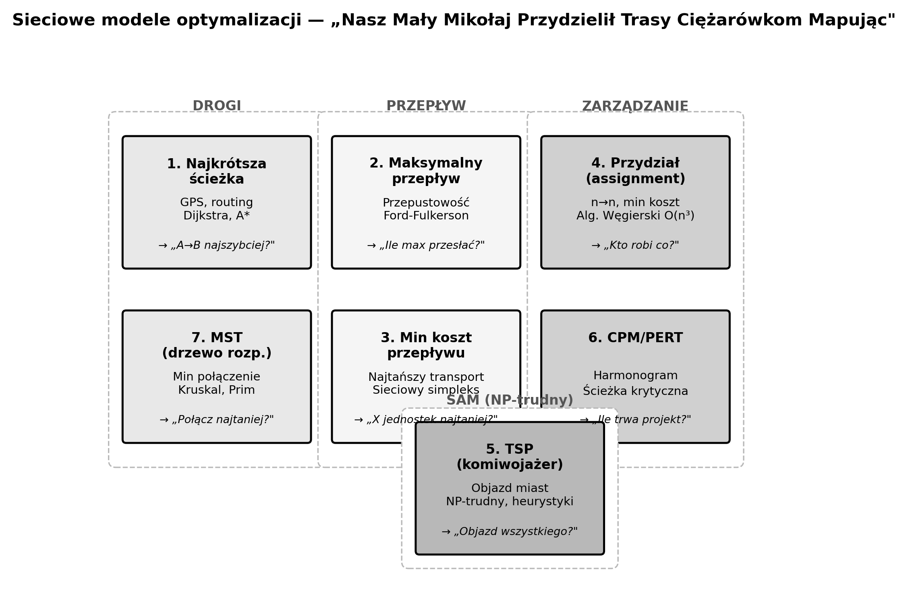

### MNEMONIK: „**Nasz Mały Mikołaj Przydzielił Trasy Ciężarówkom Mapując**" (NMMPTyCM)

Wyobraź sobie firmę kurierską „Nasz Mały Mikołaj" — Mikołaj musi:

| # | Litera | Model | Analogia Mikołaja | Pytanie, które rozwiązuje |
|---|--------|-------|--------------------|--------------------------|
| 1 | **N**asz | **N**ajkrótsza ścieżka | Mikołaj szuka najkrótszej drogi do domu Janka | „Jak dojechać NAJSZYBCIEJ z A do B?" |
| 2 | **M**ały | **M**aksymalny przepływ | W rurkach do fabryki może płynąć max X czekolady/h | „Ile max mogę przesłać od źródła do ujścia?" |
| 3 | **M**ikołaj | **M**inimalny koszt przepływu | Muszę wysłać 1000 paczek — NAJTANIEJ | „Jak przesłać X jednostek najtaniej?" |
| 4 | **P**rzydzielił | **P**rzydział (assignment) | Przydziel 5 elfów do 5 stanowisk (każdy 1 zadanie) | „Kto robi co? (n:n, min koszt)" |
| 5 | **T**rasy | **T**SP (komiwojażer) | Mikołaj musi odwiedzić WSZYSTKIE domy w jedną noc | „Objazd WSZYSTKICH punktów — najkrótsza trasa?" |
| 6 | **C**iężarówkom | **C**PM/PERT | Harmonogram budowy nowej fabryki zabawek | „Ile MIN trwa projekt? Co jest krytyczne?" |
| 7 | **M**apując | **M**ST (min spanning tree) | Połącz WSZYSTKIE wioski drogami za MIN koszt | „Jak połączyć WSZYSTKO najnajtaniej?" |

**Wizualna historia do zapamiętania (wyobraź sobie sceny jak komiks):**

    Scena 1  (N) — Mikołaj w GPS → najkrótsza ścieżka
    Scena 2  (M) — Rury z czekoladą → max flow
    Scena 3  (M) — Paczki z ceną → min cost flow
    Scena 4  (P) — Tablica z elfami → assignment
    Scena 5  (T) — Sanie oblatujące glob → TSP
    Scena 6  (C) — Kalendarz budowy → CPM/PERT
    Scena 7  (M) — Mapa z drogami → MST

**Alternatywna pamięciówka — pytania (do szybkiego mappowania):**

Dostałeś pytanie → które to pytanie → który model?
1. „Jak dojechać z A do B?" → **Najkrótsza ścieżka** (Dijkstra)
2. „Ile max przesłać?" → **Max flow** (Ford-Fulkerson)
3. „Jak najtaniej przesłać X?" → **Min cost flow**
4. „Kto robi co? (1:1)" → **Przydział** (węgierski)
5. „Objazd wszystkiego" → **TSP** (heurystyki)
6. „Ile trwa projekt?" → **CPM/PERT**
7. „Połącz wszystko najtaniej" → **MST** (Kruskal/Prim)

**Trik: 2 i 3 to warianty PRZEPŁYWU** (max flow vs min-cost flow). Pamiętaj: „PRZEPŁYW ma 2 wersje: max ilość vs min cena". Więc naprawdę musisz zapamiętać 6 UNIKALNYCH modeli + 1 wariant.

**Trik: paruj modele w 3 pary + 1:**
- DROGI: Najkrótsza ścieżka + MST (oba dotyczą krawędzi grafu)
- PRZEPŁYW: Max flow + Min cost flow (oba o przepustowości)
- ZARZĄDZANIE: Przydział + CPM/PERT (oba o organizacji pracy)
- SAM: TSP (jedyny NP-trudny, „komiwojażer")

---

| Model               | Złożoność       | Zastosowanie              |
|----------------------|-----------------|---------------------------|
| Najkrótsza ścieżka  | O(E log V)      | Logistyka, routing        |
| Max Flow             | O(VE²)          | Planowanie, dystrybucja   |
| Przydział            | O(n³)           | HR, grafiki               |
| TSP                  | NP-trudny       | Trasy kurierów            |
| CPM                  | O(V+E)          | Zarządzanie projektami    |
| MST                  | O(E log V)      | Sieci infrastrukturalne   |

### Etymologia

**Ford-Fulkerson** — Lester Ford Jr. + Delbert Fulkerson (1956). **Edmonds-Karp** — Jack Edmonds + Richard Karp (1972); BFS-owa wersja Ford-Fulkerson. **TSP (komiwojażer)** — z XIX-wiecznych niemieckich podręczników dla handlowców. **CPM** — Critical Path Method (DuPont, 1957). **PERT** — Program Evaluation and Review Technique (US Navy, Polaris, 1958). **Kruskal** — Joseph Kruskal (1956). **Prim** — Robert Prim (1957; niezależnie Jarník 1930). **Algorytm węgierski** — Harold Kuhn (1955); od prac Węgrów: Kőniga i Egerváry'ego.

### Jak zapamiętać

- **Mnemonik: „Nasz Mały Mikołaj Przydzielił Trasy Ciężarówkom Mapując"**
  - **N**ajkrótsza ścieżka, **M**ax flow, **M**in cost flow, **P**rzydział, **T**SP, **C**PM, **M**ST
- **3 pary + 1:** DROGI (ścieżka+MST), PRZEPŁYW (max+min cost), ZARZĄDZANIE (przydział+CPM) + TSP sam
- **6 modeli na grafach + 1 wariant:** Wszystko = „węzły + krawędzie + wagi → optymalizuj"
- **Pytanie-klucz:** „Jak dojechać?"=ścieżka, „ile max?"=flow, „kto co?"=przydział, „objazd?"=TSP, „ile trwa?"=CPM, „połącz?"=MST

\newpage

## PYTANIE 13/27: Modelowanie architektury systemów informatycznych (AIS)

**Cele i metody modelowania architektury.**

---

### Tło pojęciowe — słowniczek

**Architektura systemu informatycznego (software/system architecture)** — fundamentalne decyzje projektowe dotyczące struktury systemu: jakie komponenty, jak się komunikują, jakie technologie. Jak plan architektoniczny budynku — definiuje „kształt" systemu przed budową.

**Modelowanie architektury** — tworzenie uproszczonych reprezentacji (diagramów, opisów) systemu na różnych poziomach abstrakcji. Cele: komunikacja w zespole, dokumentacja, analiza jakości (czy system będzie wydajny? skalowalny?), planowanie rozwoju.

---

**Framework architektoniczny (architecture framework)** — ustrukturyzowane podejście do opisywania architektury. Definiuje: jakie widoki (views) tworzyć, jakie aspekty uwzględnić, w jakiej kolejności pracować.

**TOGAF (The Open Group Architecture Framework)** — najpopularniejszy framework enterprise architecture. Definiuje metodykę ADM (Architecture Development Method) — cykliczny proces tworzenia architektury. 4 domeny:
- **Business** — procesy organizacji
- **Data** — struktury danych
- **Application** — aplikacje i ich interakcje
- **Technology** — infrastruktura (serwery, sieci)

**ADM (Architecture Development Method)** — cykliczny proces TOGAF: Preliminary → Vision → Business Arch → IS Arch → Technology Arch → Opportunities → Migration → Governance. Iteracyjny — można wracać do wcześniejszych faz.

**4+1 View Model (Kruchten)** — model pięciu perspektyw architektury:
- **Logical View** — funkcjonalność (klasy, moduły)
- **Process View** — współbieżność, przepływ danych
- **Development View** — organizacja kodu (pakiety, warstwy)
- **Physical View** — wdrożenie na sprzęt (serwery, kontenery)
- **+1 Scenarios** — use cases łączące wszystkie widoki

    Dlaczego 4+1? Bo różni interesariusze patrzą na system inaczej:
    programista → Development View, admin → Physical View,
    użytkownik → Scenarios, architekt → Logical View

**Zachman Framework** — taksonomia 6×6: pytania CO/JAK/GDZIE/KTO/KIEDY/DLACZEGO × poziomy abstrakcji (kontekst → logiczny → fizyczny → ...). Nie mówi JAK modelować — mówi CO należy udokumentować. Kompletny, ale złożony.

---

**C4 Model (Simon Brown)** — pragmatyczny model: 4 poziomy zoomu diagramów:
1. **Context** — system w otoczeniu (kto go używa, z czym się integruje)
2. **Container** — kontenery techniczne (app server, DB, SPA, API)
3. **Component** — moduły wewnątrz kontenera
4. **Code** — klasy, interfejsy (opcjonalnie, np. UML)

Zaleta: prosty, zrozumiały dla nie-architektów. Zaczynasz od „big picture" i zanurzasz się głębiej.

**ArchiMate** — język modelowania The Open Group. 3 warstwy (Business, Application, Technology) × 3 aspekty (Active Structure — kto?, Behavior — co robi?, Passive Structure — na czym?). Komplementarny z TOGAF.

---

**UML (Unified Modeling Language)** — uniwersalny język modelowania. W kontekście architektury: **Component Diagram** (moduły i zależności), **Deployment Diagram** (mapowanie na sprzęt), **Sequence Diagram** (interakcje w czasie).

**ADR (Architecture Decision Records)** — lekka dokumentacja: każda kluczowa decyzja architektoniczna zapisana jako plik z: kontekstem, decyzją, konsekwencjami. Wersjonowane w repo. Format: „Zdecydowaliśmy X, bo Y. Konsekwencje: Z."

**ATAM (Architecture Tradeoff Analysis Method)** — metoda oceny architektury przez scenariusze jakościowe. Identyfikuje tradeoffs: „ta decyzja poprawia wydajność kosztem modyfikowalności". Opracowana przez SEI (Carnegie Mellon).

**Quality Attributes (atrybuty jakości, ISO 25010)** — mierzalne cechy systemu: Performance, Security, Scalability, Maintainability, Reliability, Usability, Portability, Compatibility. Architektura determinuje osiągalne atrybuty jakości.

---

### Diagramy — wizualizacja modeli architektonicznych

Poniższe diagramy ilustrują kluczowe frameworki i modele omówione w pytaniu. Wszystkie modelują architekturę systemu, ale z różnych perspektyw i na różnych poziomach abstrakcji.

**TOGAF ADM — cykl iteracyjny:**

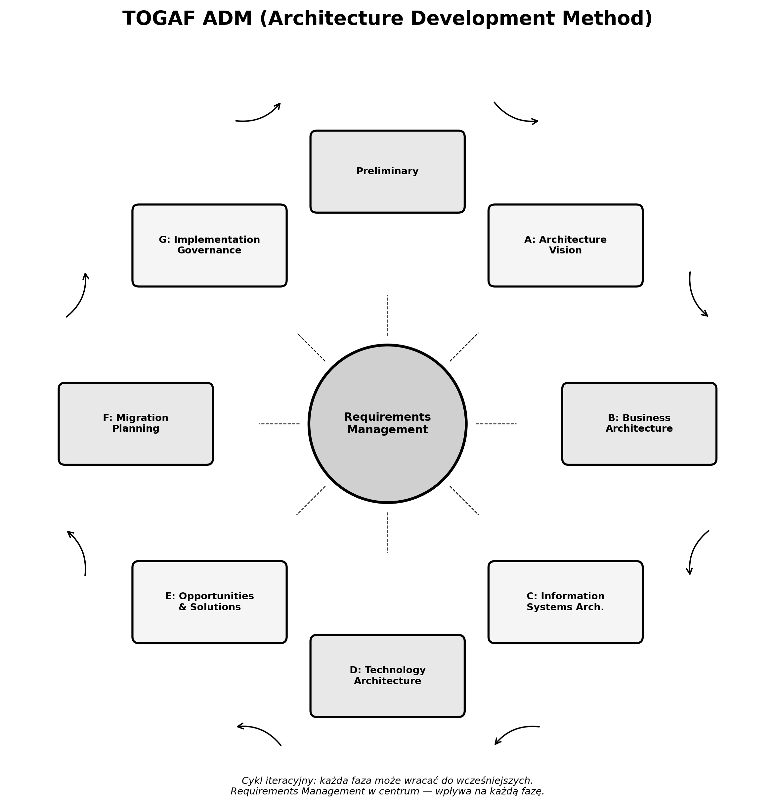

**4+1 View Model (Kruchten) — 5 perspektyw:**

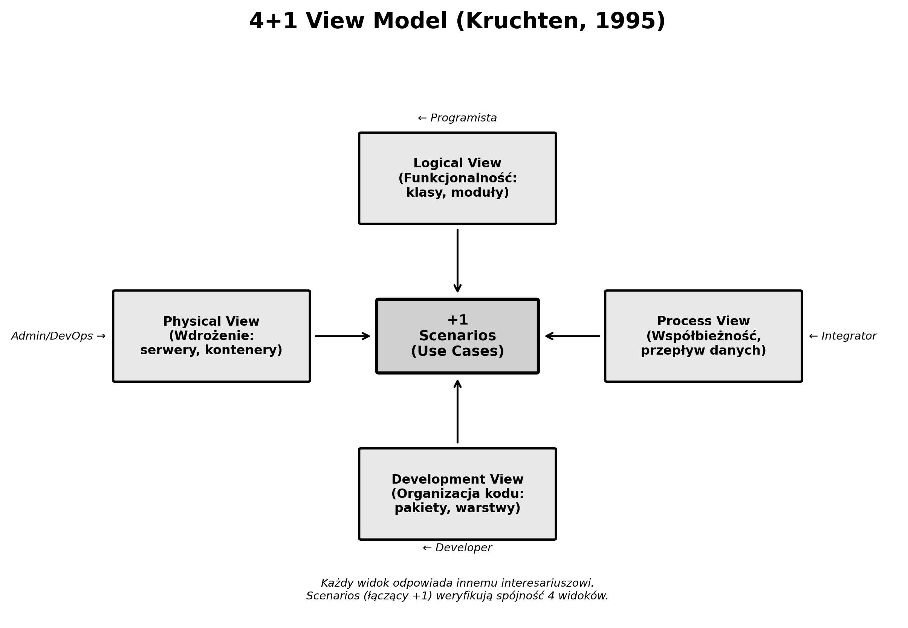

**C4 Model — 4 poziomy zoomu (Context → Container → Component → Code):**

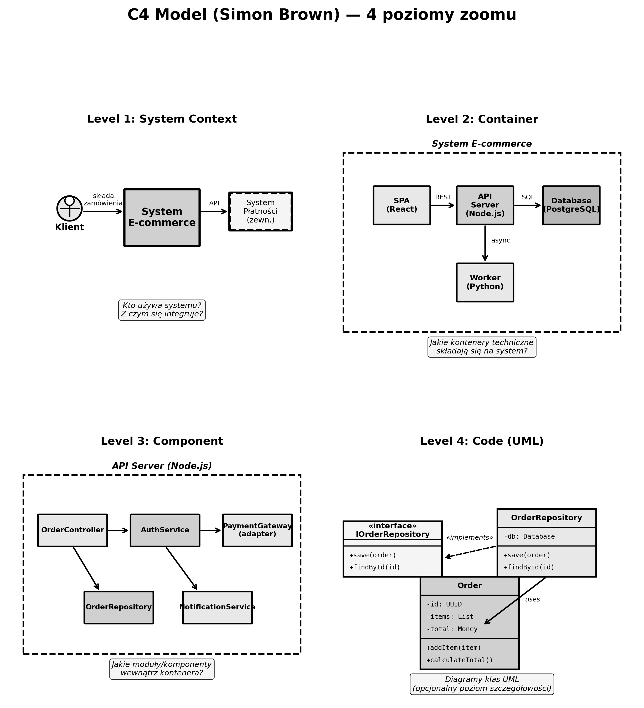

**Zachman Framework — taksonomia 6×6 (pytania × perspektywy):**

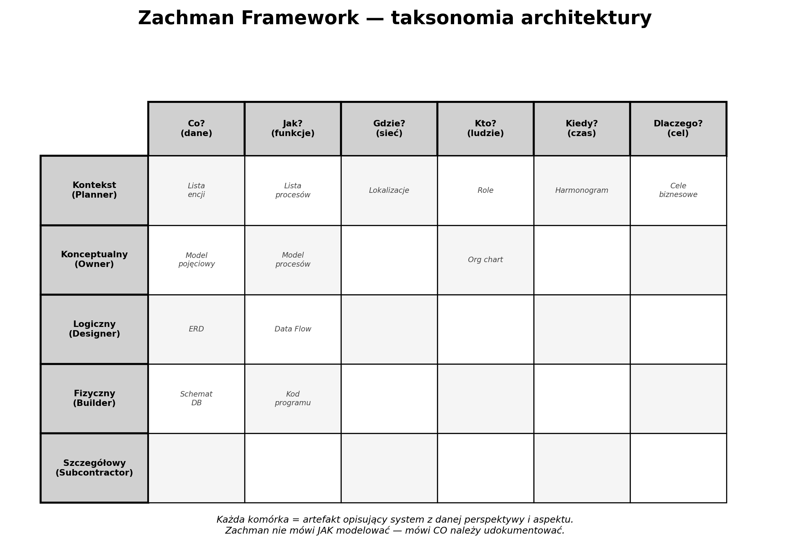

**ArchiMate — 3 warstwy × 3 aspekty:**

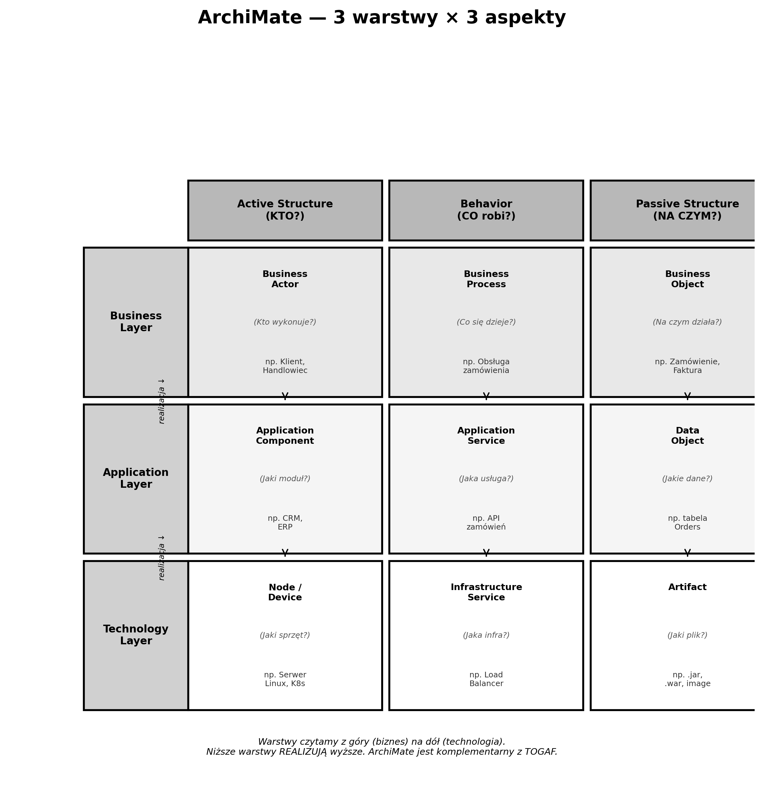

---

### Cele: komunikacja, dokumentacja, analiza jakości, planowanie, zarządzanie złożonością

### Frameworki

**TOGAF** — metodyka ADM (Architecture Development Method), 4 domeny: Business, Data, Application, Technology.

**4+1 View Model (Kruchten):**
- Logical (funkcjonalność), Process (współbieżność), Development (organizacja kodu), Physical (wdrożenie), + Scenarios (use cases)

**Zachman Framework** — taksonomia 6×6: What/How/Where/Who/When/Why × poziomy abstrakcji.

**C4 Model (Simon Brown):**
- Level 1: System Context → Level 2: Container → Level 3: Component → Level 4: Code

**ArchiMate** — 3 warstwy: Business, Application, Technology × 3 aspekty: Active, Behavior, Passive.

### Notacje: UML (Component, Deployment, Sequence), ArchiMate, C4, ADR (Architecture Decision Records)

### Analiza: ATAM (Architecture Tradeoff Analysis Method), Quality Attributes (ISO 25010: Performance, Security, Scalability, Maintainability, Reliability)

### Etymologia

**TOGAF** — The Open Group Architecture Framework. **Zachman** — John Zachman (IBM, 1987); framework nazwany od twórcy. **C4** — 4 × C: Context, Container, Component, Code (Simon Brown, 2006). **ArchiMate** — „Architecture" + „animate" (The Open Group). **ATAM** — Architecture Tradeoff Analysis Method (SEI, Carnegie Mellon). **Kruchten** — Philippe Kruchten (Rational/IBM, 1995); 4+1 View Model. **ISO 25010** — międzynarodowy standard atrybutów jakości oprogramowania.

### Jak zapamiętać

- **TOGAF = JAK** budować architekturę; **Zachman = CO** dokumentować
- **C4 = 4 poziomy zoomu** (Context → Container → Component → Code)
- **4+1 = LDPP+S** (Logical, Development, Process, Physical + Scenarios)

\newpage

## PYTANIE 14/28: Wzorce architektoniczne (AIS)

**Czemu służą? Jak powstają? Jak są katalogowane? Przykłady.**

---

### Tło pojęciowe — słowniczek

**Wzorzec (pattern)** — udokumentowane, powtarzalne rozwiązanie typowego problemu. Format: Nazwa + Problem (kiedy stosować) + Rozwiązanie (struktura) + Konsekwencje (tradeoffs). To nie gotowy kod — to szablon myślowy, który adaptujemy do kontekstu.

**Wzorzec architektoniczny (architectural pattern)** — wzorzec definiujący CAŁKOWITĄ strukturę systemu: jak podzielić na komponenty, jak komunikują się, jak skalować. Większa skala niż wzorzec projektowy (design pattern), który dotyczy pojedynczej klasy/obiektu.

    Skala wzorców:
    Architektoniczny: Microservices, Layered, Event-Driven  (cały system)
    Projektowy:       Singleton, Observer, Factory            (klasa/obiekt)
    Idiomatyczny:     RAII, for-each                          (linia kodu)

---

**Monolith (monolit)** — cały system jako jedna aplikacja, jeden deployment. Prosty, łatwy na start. Problemy: trudne skalowanie (skalujesz wszystko albo nic), długie buildy, duże ryzyko przy zmianach.

**Layered (warstwowy)** — system podzielony na warstwy, każda zależna od niższej: Presentation → Business Logic → Data Access → Database. Separacja odpowiedzialności. Wada: każde żądanie przechodzi przez WSZYSTKIE warstwy (overhead).

    [Presentation]  ← UI, API
          ↓
    [Business Logic] ← reguły domenowe
          ↓
    [Data Access]    ← SQL, ORM
          ↓
    [Database]       ← PostgreSQL

**Microservices (mikroserwisy)** — system rozbity na małe, niezależne serwisy, każdy z własną bazą danych i deploymentem. Każdy serwis odpowiada za jedną domenę (np. zamówienia, płatności, użytkownicy). Zalety: niezależne skalowanie, niezależne deployments, różne technologie. Wady: złożoność operacyjna (sieć, monitoring, transakcje rozproszone).

**Event-Driven Architecture (EDA)** — komunikacja przez zdarzenia (events). Producer generuje event → Broker (np. Kafka) → Consumers reagują. Loose coupling — producent nie wie kto konsumuje. Eventual consistency.

---

**CQRS (Command Query Responsibility Segregation)** — osobne modele do zapisu (Command) i odczytu (Query). Command model zoptymalizowany do walidacji i zapisu, Query model zoptymalizowany do szybkiego odczytu (np. zdenormalizowane widoki). Złożony, ale potężny przy asymetrii read/write.

    Command → [Write DB] → Event → [Read DB projekcja] → Query
    Zapis i odczyt mają osobne schematy!

**Hexagonal (Ports & Adapters, Alistair Cockburn)** — rdzeń domeny (business logic) jest niezależny od frameworków, baz danych, UI. Komunikuje się przez „porty" (interfejsy). „Adaptery" implementują porty (np. adapter PostgreSQL, adapter REST). Korzyść: testowalność — możesz podmienić adapter na mock.

---

**Katalogi wzorców:**
- **POSA (Pattern-Oriented Software Architecture)** — 5-tomowa seria o wzorcach architektonicznych: Layers, Pipes & Filters, Broker, MVC, Microkernel.
- **GoF (Gang of Four)** — Gamma, Helm, Johnson, Vlissides. 23 wzorce projektowe (nie architektoniczne): kreacyjne (Factory, Singleton), strukturalne (Adapter, Decorator), behawioralne (Observer, Strategy). Książka z 1994 r.
- **EIP (Enterprise Integration Patterns)** — Hohpe & Woolf. Wzorce komunikacji między systemami: Message Channel, Content-Based Router, Aggregator.
- **PoEAA (Patterns of Enterprise Application Architecture)** — Martin Fowler. Wzorce aplikacji enterprise: Repository, Unit of Work, Domain Model, Active Record.
- **Cloud Patterns** — Microsoft Azure Architecture Center, AWS Well-Architected. Wzorce chmurowe: Circuit Breaker, Sidecar, Saga, Strangler Fig.

---

**Skalowalność (scalability)** — zdolność systemu do obsługi rosnącego obciążenia. W kontekście wzorców: monolith → skalowalność niska (scale up), microservices → wysoka (scale out per serwis).

**Loose coupling (luźne wiązanie)** — komponenty mają minimalne zależności. Zmiana jednego nie wymaga zmiany drugiego. Event-Driven i Microservices promują loose coupling.

**Separacja odpowiedzialności (separation of concerns)** — każdy komponent odpowiada za jedną rzecz. Fundamentalna zasada stojąca za wzorcami warstwowymi, hexagonal, CQRS.

**Eventual consistency (spójność ostateczna)** — dane mogą być chwilowo niespójne, ale „w końcu" się zsynchronizują. Cena za skalowalność i loose coupling w systemach rozproszonych (EDA, Microservices).

---

**Christopher Alexander** — architekt budynków (nie programista!), ojciec idei wzorców w inżynierii. W książce „A Pattern Language" (1977) opisał 253 wzorców architektonicznych — budowlanych. GoF zaadaptowali jego format do oprogramowania. Kluczowa idea: wzorzec to nie luźna rada, ale skodyfikowane rozwiązanie z ustandaryzowanym opisem.

**Forma opisu wzorca (pattern template)** — standardowy szablon, w jakim kataloguje się każdy wzorzec. To serce odpowiedzi na „JAK są katalogowane?" — każdy wzorzec opisany jest według ustalonej struktury, dzięki czemu można je porównywać, przeszukiwać i komponować. Pola szablonu: Nazwa → Kontekst/Problem → Siły (forces) → Rozwiązanie → Konsekwencje → Powiązane wzorce → Znane zastosowania. Różne katalogi mają różne warianty szablonu (GoF ma 13 pól, forma Aleksandryjska jest bardziej narracyjna), ale rdzeń jest wspólny.

**Siły (forces)** — konkurencyjne wymagania, które wzorzec próbuje pogodzić. Np. wzorzec Layered godzi testowalność vs wydajność: warstwy ułatwiają testowanie, ale dodają overhead. Siły to serce wzorca — wyjaśniają DLACZEGO dane rozwiązanie jest kompromisem, a nie „idealnym rozwiązaniem na wszystko".

**Klasyfikacja wzorców (pattern classification)** — sposób organizacji wzorców wewnątrz katalogu. Główne osie klasyfikacji:
- **Skala/zasięg**: architektoniczny (cały system) → projektowy (klasa/obiekt) → idiomatyczny (linia kodu)
- **Domena problemu**: np. GoF dzieli 23 wzorce na kreacyjne (5), strukturalne (7), behawioralne (11)
- **Atrybut jakościowy**: wydajność, skalowalność, dostępność, testowalność
- **Domena zastosowania**: enterprise, chmura, integracja, embedded

**Język wzorców (pattern language)** — zbiór wzorców, które wzajemnie się referują, tworząc nawigacyjną sieć. Wzorzec „Microservices" referuje „API Gateway", „Service Discovery", „Circuit Breaker". Można „czytać" język wzorców jak przepis: „zacznij od X → jeśli problem Y → zastosuj Z". To trzeci filar katalogowania obok szablonu opisu i klasyfikacji.

---

### Cel: reużywalne rozwiązania typowych problemów, wspólne słownictwo, dokumentacja wiedzy

### Powstawanie: Problem powtarzalny → Podobne rozwiązania → Uogólnienie → Dokumentacja → Walidacja → Katalogowanie

### Katalogowanie — trzy filary metodologii

Pytanie „JAK są katalogowane?" = jaką METODĘ stosujemy, żeby z setek wzorców zrobić przeszukiwalny, porównywalny, kompozytowalny system wiedzy. Odpowiedź: trzy filary, razem tworzące kompletną metodologię.

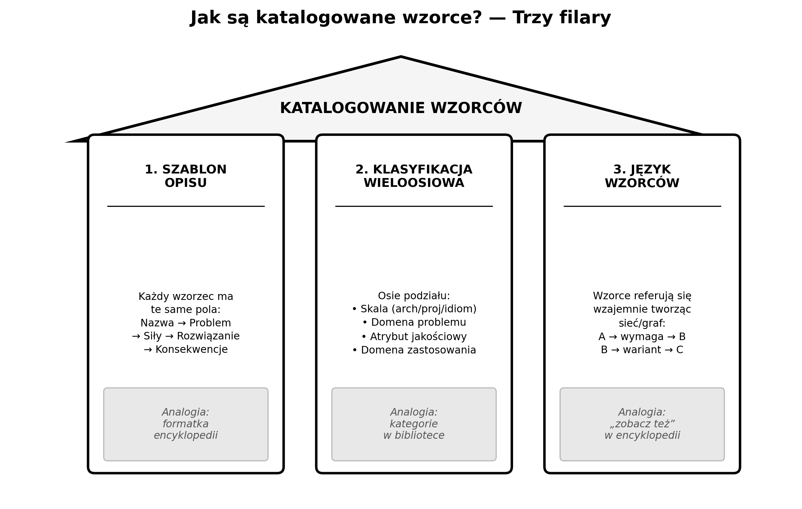

**1. Ustandaryzowany szablon opisu (pattern template)** — każdy wzorzec opisany wg tego samego formatu, dzięki czemu można je porównywać „pole po polu". Mnemonik: **NaPSiRoKo**.

| Pole | Skrót | Co zawiera | Przykład (Observer, GoF) |
|------|-------|------------|--------------------------|
| **Nazwa** | **Na** | jedno słowo/fraza | Observer |
| **Problem** | **P** | kiedy stosować? | Obiekt zmienia stan → wielu zależnych musi zareagować, ale nie chcemy ich hard-codować |
| **Siły** | **Si** | konkurencyjne wymagania | loose coupling vs koszt powiadomień (100 obserwatorów = 100 wywołań) |
| **Rozwiązanie** | **Ro** | struktura + zachowanie | Subject trzyma listę Observer; przy zmianie woła notify() na każdym |
| **Konsekwencje** | **Ko** | tradeoffs +/− | (+) luźne wiązanie, (−) kaskada powiadomień, memory leaks jeśli nie odrejestrujemy |
| Powiązane | — | wzorce pokrewne | Mediator (centralizuje), Pub/Sub (rozproszony wariant) |
| Znane zastosowania | — | real-world | Java Swing listeners, C# events, React useState → re-render |

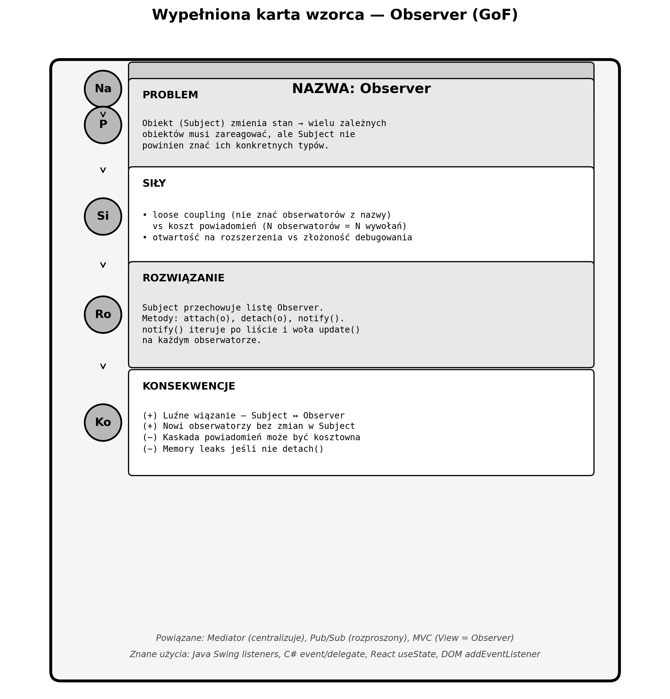

**2. Klasyfikacja wieloosiowa** — wzorce organizowane wzdłuż kilku osi jednocześnie, jak książki w bibliotece (dział + półka + autor).

Osie klasyfikacji:
- **Skala**: architektoniczny (cały system) → projektowy (klasa) → idiomatyczny (linia kodu)
- **Domena problemu**: kreacyjne / strukturalne / behawioralne (GoF) albo warstwy / komunikacja / dekompozycja (POSA)
- **Atrybut jakościowy**: wydajność, skalowalność, testowalność, dostępność

Konkretny przykład — jak GoF klasyfikuje 23 wzorce na dwóch osiach:

| | Kreacyjne (5) | Strukturalne (7) | Behawioralne (11) |
|---|---|---|---|
| **Klasa** | Factory Method | Adapter (class) | Interpreter, Template Method |
| **Obiekt** | Abstract Factory, Builder, Prototype, Singleton | Adapter (obj), Bridge, Composite, Decorator, Facade, Flyweight, Proxy | Chain of Resp., Command, Iterator, Mediator, Memento, **Observer**, State, Strategy, Visitor |

Observer jest w komórce: **behawioralny × obiekt**. Wiedzieć GDZIE wzorzec leży = szybsze przypomnienie i porównanie z sąsiadami (Mediator, State, Strategy — też behawioralne obiektowe).

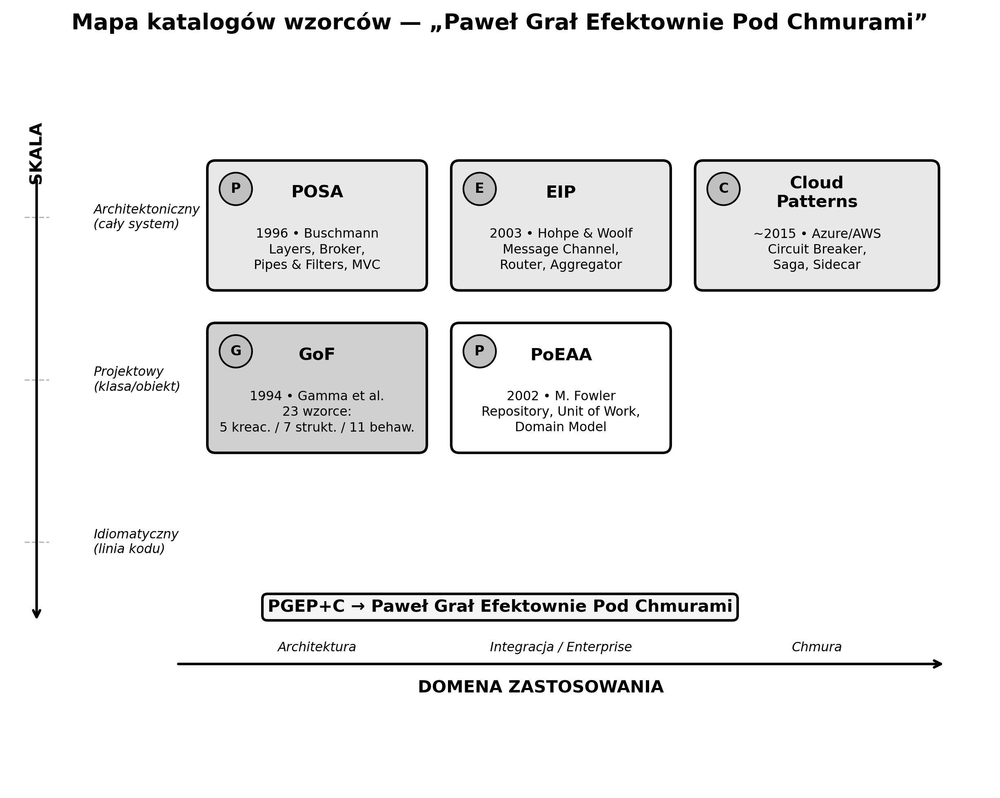

**3. Język wzorców (pattern language)** — wzorce referują się wzajemnie, tworząc nawigacyjny graf „zobacz też". Sens: masz problem → stosujesz wzorzec A → A rodzi nowy problem → wzorzec B go rozwiązuje.

Konkretna nawigacja w praktyce:

    Problem: „monolith nie skaluje się"
        ↓
    Wzorzec: Microservices
        ↓ wymaga
    Problem: „jak routować żądania do serwisów?"
        ↓
    Wzorzec: API Gateway
        ↓ rodzi problem
    Problem: „co gdy serwis nie odpowiada?"
        ↓
    Wzorzec: Circuit Breaker
        ↓ rodzi problem
    Problem: „jak zachować spójność transakcji?"
        ↓
    Wzorzec: Saga

Każdy wzorzec w katalogu ma pole „Powiązane wzorce" — to linki w tym grafie.

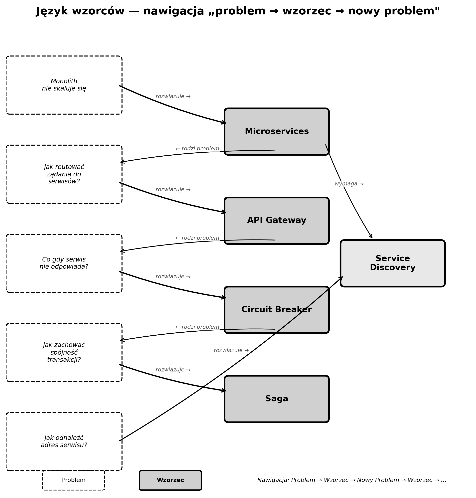

**Konkretne katalogi** (5 głównych — mnemonik **PGEP+C** = „Paweł Grał Efektownie Pod Chmurami"):

| Katalog | Rok | Autorzy | Skala | Domena | Przykładowe wzorce |
|---------|-----|---------|-------|--------|--------------------|
| **POSA** | 1996 | Buschmann et al. | architektoniczny | systemy | Layers, Pipes & Filters, Broker, MVC, Microkernel |
| **GoF** | 1994 | Gamma, Helm, Johnson, Vlissides | projektowy | obiekty | Factory, Singleton, Observer, Strategy (23 łącznie) |
| **EIP** | 2003 | Hohpe & Woolf | integracyjny | komunikacja między-systemowa | Message Channel, Router, Aggregator |
| **PoEAA** | 2002 | Martin Fowler | projektowy/arch. | enterprise | Repository, Unit of Work, Domain Model, Active Record |
| **Cloud** | ~2015 | Microsoft/AWS | architektoniczny | chmura | Circuit Breaker, Sidecar, Saga, Strangler Fig |

### Przykładowe wzorce

**Layered (Warstwy):** Presentation → Business Logic → Data Access → DB. Separacja odpowiedzialności. Sztywne, boilerplate.

**Microservices:** Niezależne serwisy, osobne wdrożenia, skalowalność. Złożoność operacyjna.

**Event-Driven (EDA):** Producer → Event Broker (Kafka) → Consumers. Loose coupling, eventual consistency.

**CQRS:** Osobne modele Read/Write. Optymalizacja per-strona. Złożoność.

**Hexagonal (Ports & Adapters):** Core niezależny od frameworków. Testowalność.

| Wzorzec        | Skalowalność | Złożoność | Use Case            |
|----------------|--------------|-----------|---------------------|
| Monolith       | Niska        | Niska     | MVP, małe zespoły   |
| Layered        | Średnia      | Niska     | Enterprise CRUD     |
| Microservices  | Wysoka       | Wysoka    | Duże systemy        |
| Event-Driven   | Wysoka       | Średnia   | Real-time, IoT      |

### Etymologia

**POSA** — Pattern-Oriented Software Architecture (Buschmann et al., 1996). **GoF** — Gang of Four: Gamma, Helm, Johnson, Vlissides (1994, „Design Patterns"). **EIP** — Enterprise Integration Patterns (Hohpe & Woolf, 2003). **PoEAA** — Patterns of Enterprise Application Architecture (Martin Fowler, 2002). **Hexagonal** — Alistair Cockburn (2005); kształt sześciokąta nie ma specjalnego znaczenia. **CQRS** — Command Query Responsibility Segregation (Greg Young, ~2010); oparty na CQS Bertranda Meyera. **Microservices** — termin spopularyzowany ~2012 (James Lewis, Martin Fowler).

### Jak zapamiętać

**Mnemonik 1 — szablon wzorca „NaPSiRoKo":**
- **Na**zwa → **P**roblem → **Si**ły → **Ro**związanie → **Ko**nsekwencje
- Historyjka: „**Na**pisałem **P**roblem na kartce, **Si**ły mnie ciągnęły w dwie strony, **Ro**związałem go, a **Ko**nsekwencje spisałem na odwrocie"
- Wyobraź sobie kartonowe pudełko: etykieta (Nazwa) → co nie działa (Problem) → wagi na szalce (Siły) → instrukcja montażu (Rozwiązanie) → lista „+" i „−" na boku (Konsekwencje)

**Mnemonik 2 — katalogi „PGEP+C" = „Paweł Grał Efektownie Pod Chmurami":**

    P = POSA     (1996, systemy)        „Paweł"
    G = GoF      (1994, obiekty)        „Grał"
    E = EIP      (2003, integracja)     „Efektownie"
    P = PoEAA    (2002, enterprise)     „Pod"
    C = Cloud    (~2015, chmura)        „Chmurami"

- Chronologicznie: GoF '94 → POSA '96 → PoEAA '02 → EIP '03 → Cloud ~'15
- Skala rośnie: GoF (obiekty) → PoEAA (aplikacja) → POSA/EIP (system) → Cloud (infrastruktura)

**Mnemonik 3 — trzy filary katalogowania „SzKlaJ" = „Szklany Jar":**
- **Sz**ablon opisu (NaPSiRoKo) — każde hasło w tym samym formacie
- **Kla**syfikacja wieloosiowa — hasła posortowane w kategorie (jak dział w bibliotece)
- **J**ęzyk wzorców — hasła mają „zobacz też" (graf nawigacyjny)
- Analogia: encyklopedia. Każde hasło ma ten sam format (**Sz**ablon), jest w kategorii z innymi hasłami tego typu (**Kla**syfikacja), i ma „zobacz też" (**J**ęzyk wzorców)

**Mnemonik 4 — GoF 3 kategorie „KSB" = „Kto Stworzył Budynek?":**
- **K**reacyjne (5) — JAK tworzyć obiekty? (Factory, Singleton, Builder, Prototype, Abstract Factory)
- **S**trukturalne (7) — JAK składać obiekty? (Adapter, Bridge, Composite, Decorator, Facade, Flyweight, Proxy)
- **B**ehawioralne (11) — JAK obiekty komunikują? (Observer, Strategy, Command, State, Iterator...)
- Zapamiętaj liczby: 5 + 7 + 11 = 23

**Szybka ściąga — wzorzec na obronie:**
- Wzorzec = Nazwa + Problem + Rozwiązanie + Konsekwencje (minimum do zapamiętania z dowolnego katalogu)
- „Monolith first" — rozdzielaj gdy znasz granice domen
- Katalogi wg skali: POSA = systemy, GoF = obiekty, EIP = komunikacja międzysystemowa

→ Diagramy do druku:
- `pytania/img/q14_pattern_template.png` — szablon NaPSiRoKo
- `pytania/img/q14_catalog_map.png` — mapa katalogów PGEP+C
- `pytania/img/q14_three_pillars.png` — trzy filary katalogowania
- `pytania/img/q14_observer_card_filled.png` — wypełniona karta wzorca Observer
- `pytania/img/q14_pattern_language_navigation.png` — nawigacja w języku wzorców

\newpage

## PYTANIE 15: Agent upostaciowiony w robotyce

**Jak wykorzystuje się agenta upostaciowionego do specyfikacji sterowników robotów?**

---

### Tło pojęciowe — słowniczek

**Agent (w AI)** — autonomiczny byt, który postrzega środowisko (sensory), podejmuje decyzje (deliberacja) i wykonuje akcje (efektory). Agent ma cel i działa racjonalnie — wybiera akcje maksymalizujące osiągnięcie celu.

**Agent upostaciowiony (embodied agent)** — agent posiadający ciało fizyczne w rzeczywistym świecie. Przeciwieństwo agenta czysto softwareowego (np. chatbot). Robot = klasyczny agent upostaciowiony: ma sensory (kamery, LIDAR), ciało (ramię, koła) i działa w środowisku fizycznym. Kluczowe: musi radzić sobie z szumem sensorów, opóźnieniami, nieprzewidywalnością świata.

    Agent software:    dane → algorytm → wynik (deterministyczne)
    Agent embodied:    szum sensorów → niepewność → akcja fizyczna → efekt nieprzewidywalny

**Sterownik robota (robot controller)** — oprogramowanie decydujące co robot robi w każdej chwili. Specyfikacja sterownika = formalny opis zachowania robota. Agent upostaciowiony to model konceptualny, na którym opiera się sterownik.

---

**Cykl percepcja-deliberacja-akcja (See-Think-Act)** — podstawowy cykl działania agenta upostaciowionego:
1. **See (Percepcja)** — odczytaj dane z sensorów (obraz, odległość, pozycja)
2. **Think (Deliberacja)** — podejmij decyzję (planuj trasę, wybierz akcję)
3. **Act (Akcja)** — wyślij komendy do efektorów (silniki, chwytaki)

    Czujnik LIDAR → [Mapa otoczenia] → [Planowanie ścieżki] → [Silniki kół]
         See              Think                Think               Act

---

**3T Architecture (trójwarstwowa architektura sterownika):**
1. **Planner (deliberacja)** — planowanie symboliczne na wysokim poziomie. Czas reakcji: sekundy–minuty. Np. „zaplanuj trasę z A do B przez pokoje 1,2,3".
2. **Sequencer (wykonawca)** — koordynuje zachowania, FSM/Behavior Trees. Czas: 100ms–sekundy. Np. „Jedź do punktu → Obróć → Chwyć obiekt".
3. **Controller (reaktywny)** — bezpośrednie sterowanie sprzętem. Czas: milisekundy. Np. PID utrzymujący prędkość, unikanie kolizji.

    PLANNER       (minuty)    "Jedź do kuchni po kubek"
        ↓
    SEQUENCER     (sekundy)   "1: Jedź do drzwi → 2: Otwórz → 3: Jedź do blatu"
        ↓
    CONTROLLER    (ms)        "PID: prędkość lewego koła = 0.5 m/s"

---

**BDI (Beliefs-Desires-Intentions)** — formalny model agenta racjonalnego:
- **Beliefs** — wiedza agenta o świecie (mapa, pozycja, stan baterii). Może być niepełna/nieprecyzyjna.
- **Desires** — cele, które agent chciałby osiągnąć (np. „dotrzyj do punktu B").
- **Intentions** — aktualnie realizowany plan (podzbiór desires, do którego agent się zobowiązał).

Przykład: Robot-dostawca. Belief: „drzwi zamknięte". Desire: „dostarczyć paczkę do pokoju 5". Intention: „spróbuję drzwi boczne".

**FSM (Finite State Machine / automat skończony)** — model zachowania: skończona liczba stanów + przejścia warunkowe. Prosty, ale przy złożonych zachowaniach eksploduje liczba stanów i przejść.

    IDLE ──[wykryto cel]──→ APPROACH ──[blisko]──→ GRASP
      ↑                                              │
      └──────────────[obiekt chwycony]────────────────┘

**Behavior Tree (drzewo zachowań)** — nowoczesna alternatywa FSM. Hierarchiczna struktura: węzły wewnętrzne = logika (Selector, Sequence), liście = akcje/warunki. Modularny, reużywalny, łatwy do debugowania. Wywodzi się z AI w grach (Halo 2, ~2004).
- **Selector (?)** — wykonuj dzieci po kolei aż pierwszy sukces (jak OR)
- **Sequence (→)** — wykonuj dzieci po kolei, wstrzymaj przy porażce (jak AND)

---

**LTL (Linear Temporal Logic)** — logika temporalna do formalnej specyfikacji zachowań w czasie:
- **□ (always/globally)** — musi być prawdziwe ZAWSZE. □(¬collision) = „nigdy nie koliduj".
- **◇ (eventually)** — kiedyś musi być prawdziwe. ◇(at_goal) = „w końcu dotrzyj do celu".
- **Bezpieczeństwo (safety):** □(obstacle → ¬move_forward) — „zawsze: jeśli przeszkoda, nie jedź do przodu".
- **Żywotność (liveness):** ◇(at_goal) — „w końcu osiągnij cel".

**PID (Proportional-Integral-Derivative)** — klasyczny regulator sterowania. Minimalizuje błąd (różnicę między wartością zadaną a rzeczywistą). Trzy składniki:
- **P** — proporcjonalny: reaguje na aktualny błąd
- **I** — całkowy: eliminuje błąd stały (drift)
- **D** — różniczkowy: tłumi oscylacje

    Przykład: PID utrzymuje prędkość 1 m/s:
    Błąd = 1.0 - 0.8 = 0.2 → P zwiększa moc
    Błąd utrzymuje się? → I dodaje korektę
    Błąd maleje za szybko? → D hamuje

**ROS (Robot Operating System)** — middleware (nie OS!) do robotyki. Model pub/sub: węzły (nodes) publikują i subskrybują tematy (topics). Pozwala łączyć moduły (LIDAR, planowanie, sterowanie) w jednolity system. Open source, standard w akademii.

---

### Odpowiedź wprost: jak agent upostaciowiony specyfikuje sterownik robota

**Definicja:** Agent upostaciowiony (embodied agent) to formalny model konceptualny robota — bytu posiadającego ciało fizyczne, sensory i efektory, działającego w rzeczywistym środowisku. Wykorzystanie tego modelu do specyfikacji sterowników polega na tym, że **architektura sterownika robota jest bezpośrednim odwzorowaniem struktury agenta**: cykl percepcja–deliberacja–akcja staje się pętlą sterowania, a formalne modele agenta (BDI, LTL) stają się specyfikacją wymagań dla oprogramowania robota.

**Krótko: model agenta → architektura sterownika → implementacja na robocie.**

#### Krok 1: Model agenta definiuje CO robot ma robić

Robot traktujemy jako agenta upostaciowionego. To oznacza, że specyfikujemy:
- **Sensory** — jakie dane wejściowe robot otrzymuje (LIDAR, kamera, IMU)
- **Efektory** — jakie akcje fizyczne może wykonać (jedź, chwyć, obróć)
- **Cel** — co agent ma osiągnąć (dostarczyć paczkę, unikać kolizji)
- **Środowisko** — w jakim świecie działa (magazyn, szpital, droga)

#### Krok 2: Cykl See-Think-Act definiuje JAK działa pętla sterowania

Każdy sterownik robota realizuje wariant cyklu agenta:
1. **See** — odczytaj sensory → zbuduj wewnętrzny model świata (np. mapę)
2. **Think** — na podstawie modelu i celu wybierz akcję (planowanie)
3. **Act** — wyślij komendy do silników/chwytaków

Ten cykl powtarza się w pętli z częstotliwością zależną od warstwy (ms → min).

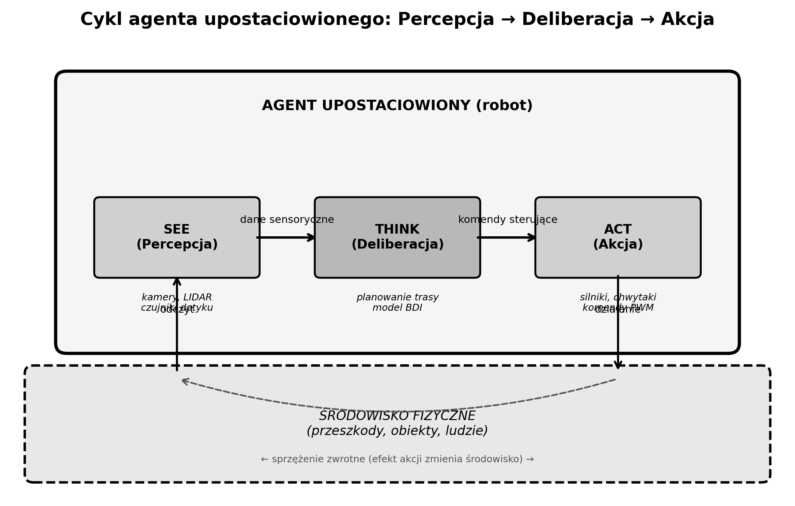

#### Krok 3: Architektura 3T dzieli sterownik na warstwy odpowiedzialności

Praktyczna realizacja agenta upostaciowionego to **architektura trójwarstwowa (3T)**:

| Warstwa | Rola | Czas reakcji | Przykład |
|---------|------|-------------|----------|
| **Planner** | planowanie symboliczne (CEL → PLAN) | sekundy–minuty | "Jedź trasą A→B→C" |
| **Sequencer** | koordynacja zachowań (PLAN → SEKWENCJA) | 100 ms–sekundy | FSM: IDLE→APPROACH→GRASP |
| **Controller** | sterowanie sprzętem (SEKWENCJA → SYGNAŁY) | milisekundy | PID: prędkość = 0.5 m/s |

Każda warstwa odpowiada innemu aspektowi agenta:
- Planner = deliberacja (myślenie długoterminowe)
- Sequencer = koordynacja intencji (BDI: Intentions)
- Controller = reaktywność (natychmiastowe bezpieczeństwo)

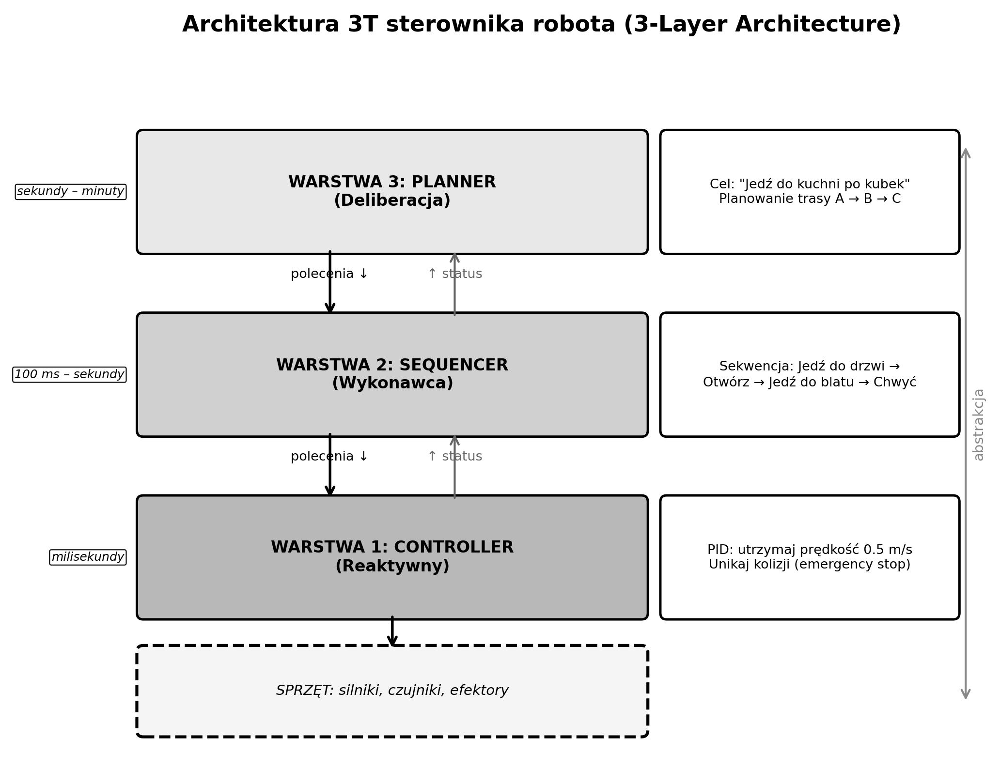

#### Krok 4: Formalne modele agenta specyfikują wymagania

**Model BDI** pozwala formalnie opisać stan wewnętrzny agenta i na tej podstawie generować/weryfikować sterownik:
- Beliefs = wiedza robota → baza danych sensorycznych
- Desires = cele → warunki sukcesu
- Intentions = aktualny plan → sekwencer

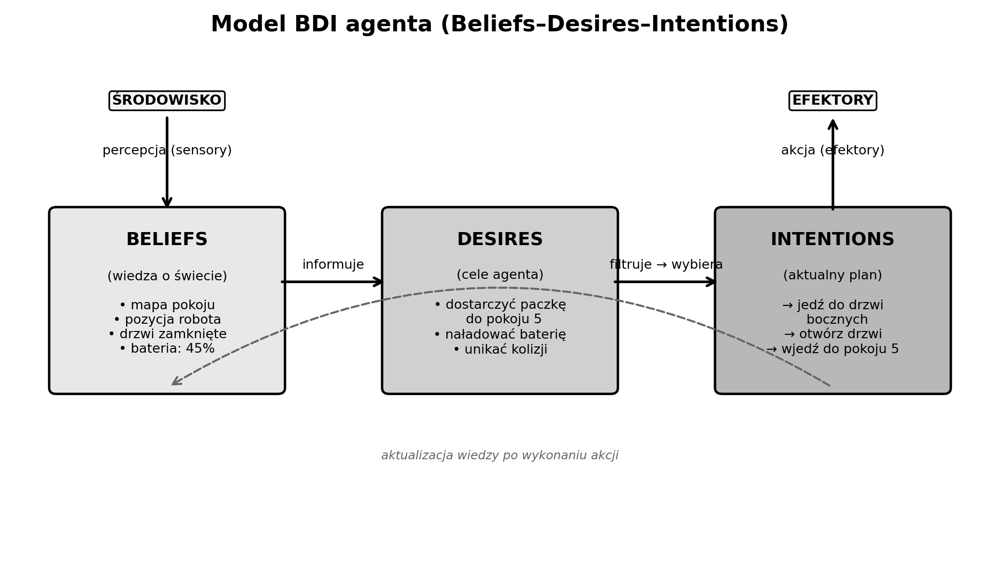

**Logika temporalna LTL** pozwala specyfikować wymagania bezpieczeństwa i żywotności:
- **Bezpieczeństwo:** □(obstacle → ¬move_forward) — "ZAWSZE: jeśli przeszkoda, NIE jedź naprzód"
- **Żywotność:** ◇(at_goal) — "KIEDYŚ dotrzyj do celu"

Formalna specyfikacja LTL → automatyczna synteza/weryfikacja sterownika (model checking).

#### Krok 5: Behavior Trees implementują specyfikację zachowań

Nowoczesna metoda implementacji warstwy Sequencer. Modularność, reużywalność, łatwe debugowanie:

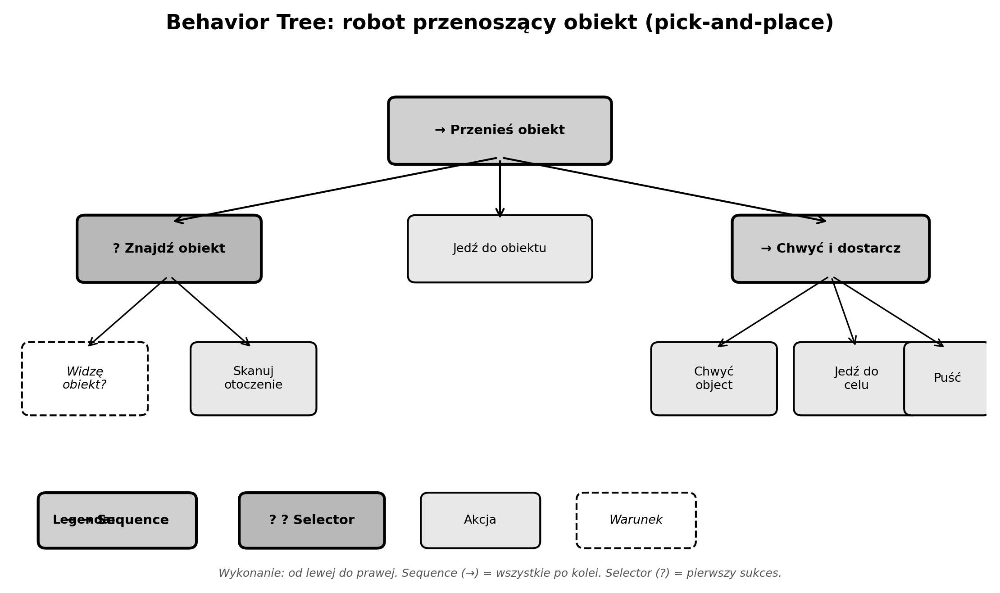

#### Konkretny przykład: robot-dostawca w szpitalu

1. **Model agenta:** sensory = LIDAR + kamera; efektory = koła + chwytak; cel = dostarcz lek do pokoju 5
2. **BDI:** Belief = "drzwi pokoju 5 zamknięte"; Desire = "dostarczyć lek"; Intention = "jedź do drzwi bocznych"
3. **LTL:** □(¬collision) ∧ ◇(at_room5) — "nigdy nie koliduj I w końcu dotrzyj do pokoju 5"
4. **3T:**
   - Planner: A* wyznacza trasę korytarz → winda → piętro 3 → pokój 5
   - Sequencer: BT: [Jedź do windy → Wjedź → Jedź do pokoju → Otwórz drzwi → Podaj lek]
   - Controller: PID utrzymuje prędkość 0.3 m/s, emergency stop przy przeszkodzie < 30 cm
5. **ROS:** node `/lidar_scan` → topic → node `/path_planner` → topic → node `/motor_driver`

---

### Agent upostaciowiony = ciało fizyczne + sensory + efektory + środowisko

Cykl: **Percepcja → Deliberacja → Akcja** (See-Think-Act)

### Architektura sterownika — 3 warstwy (3T Architecture)

1. **PLANNER** (deliberacja) — planowanie symboliczne, sekundy–minuty
2. **SEQUENCER** (wykonawca) — FSM/Behavior Trees, 100ms–sekundy
3. **CONTROLLER** (reaktywny) — PID, unikanie kolizji, milisekundy

### Model formalny BDI
- **Beliefs** — mapa, pozycja, stan
- **Desires** — cel nawigacji
- **Intentions** — aktualny plan

### Specyfikacja w logice temporalnej (LTL)
- Bezpieczeństwo: □(obstacle → ¬move_forward)
- Żywotność: ◇(at_goal)

### Behavior Trees — nowoczesna specyfikacja zachowań
- Selector (?): wykonaj pierwszy sukces
- Sequence (→): wykonaj wszystkie po kolei
- Action/Condition jako liście

### ROS (Robot Operating System) — middleware pub/sub dla robotów

### Etymologia

**Agent upostaciowiony (Embodied)** — łac. „corpus" = ciało; agent posiadający ciało fizyczne w środowisku. **BDI** — Beliefs-Desires-Intentions; Michael Bratman (filozof, 1987); Rao & Georgeff (1991) przenieśli do AI. **LTL** — Linear Temporal Logic; Amir Pnueli (1977, Turing Award 1996). **PID** — Proportional-Integral-Derivative; Nicolas Minorsky (1922, sterowanie okrętami). **ROS** — Robot Operating System (Willow Garage, 2007). **Behavior Tree** — z game AI (Halo 2, ~2004); zaadaptowane w robotyce.

### Jak zapamiętać

- **"STA"** = **S**ee → **T**hink → **A**ct (jak STA-bilność — stabilny cykl sterowania)
- **3T = "Plan-Seq-Con"** = od abstrakcji do sprzętu, jak w armii: generał (Plan) → oficer (Seq) → żołnierz (Con)
- **BDI = "Wiem–Chcę–Robię"**: Beliefs = co Wiem, Desires = co Chcę, Intentions = co Robię
- **LTL: □ = "zawsze" (kwadrat = solidny, niezmienny), ◇ = "kiedyś" (diament = cenny cel do zdobycia)**
- **Agent→Sterownik w 5 krokach:** CO (model agenta) → JAK (STA) → WARSTWY (3T) → WYMAGANIA (BDI+LTL) → IMPLEMENTACJA (BT+ROS)
- **Akronim SPECYFIKACJA:** **S**ensory → **P**ercepcja → **E**fekty → **C**ykl → **I**ntencje → **F**ormalność → **I**mplementacja → **K**ontroler → **A**kcja → **C**el → **J**akość → **A**rchitektura

→ Diagramy do druku: `pytania/img/agent_see_think_act.png`, `pytania/img/agent_3t_architecture.png`, `pytania/img/agent_bdi_model.png`, `pytania/img/agent_behavior_tree.png`

\newpage

## PYTANIE 16: Języki programowania robotów

**Omówić specjalizowane języki. Uwypuklić klasyfikację.**

---

### Tło pojęciowe — słowniczek

**Robot** — cz. „robota" = ciężka praca; termin ukuty przez Karla Čapka (R.U.R., 1920). W przemyśle: programowalna maszyna wykonująca zadania (spawanie, paletyzacja, montaż). W kontekście pytania: głównie roboty przemysłowe (manipulatory) — ramiona z 4–7 osiami obrotu, sterowane komputerowo.

**Język programowania robotów** — język do definiowania zachowania robota: ruchy, logika, I/O. Może być specjalizowany (dedykowany producenta) lub ogólny (C++, Python z bibliotekami). Klasyfikacja wg poziomu abstrakcji — od zadań po sygnały silników.

---

**Poziomy abstrakcji T-R-M-S:**

**Task-level (poziom zadania)** — najwyższy: opisujesz CO robot ma zrobić, nie JAK. „Podnieś A, połóż na B." Robot sam planuje ruchy. Przykłady: PDDL, Behavior Trees.

    // Task-level (pseudokod):
    pick(objectA);
    place(locationB);
    // Robot sam oblicza kinematykę, trajektorię, chwyt

**Robot-level (poziom robota)** — komendy ruchu w przestrzeni kartezjańskiej lub konfiguracyjnej: move_to(x,y,z), grasp(). Programista mówi GDZIE jechać, robot oblicza JAK (kinematyka odwrotna). Tu działają języki producentów: RAPID (ABB), KRL (KUKA), Karel (FANUC), PDL2 (Comau), URScript (Universal Robots).

**Motion-level (poziom ruchu)** — planowanie trajektorii: generowanie ciągu punktów od startu do celu z unikaniem kolizji. Kinematyka odwrotna, interpolacja. Przykłady: MoveIt (ROS), OMPL.

**Servo-level (poziom serwa)** — najniższy: bezpośrednie sterowanie silnikami/serwomechanizmami. Regulacja PID, sygnały PWM. Języki: C/C++, FPGA/VHDL. Czas reakcji: mikro-milisekundy.

    Przykład czasu reakcji na każdym poziomie:
    Task:    "Zamontuj śrubę"          (sekundy)
    Robot:   MoveL do_pozycji           (100 ms)
    Motion:  Trajektoria 50 pkt/s       (20 ms)
    Servo:   PID: PWM silnika = 75%     (1 ms)

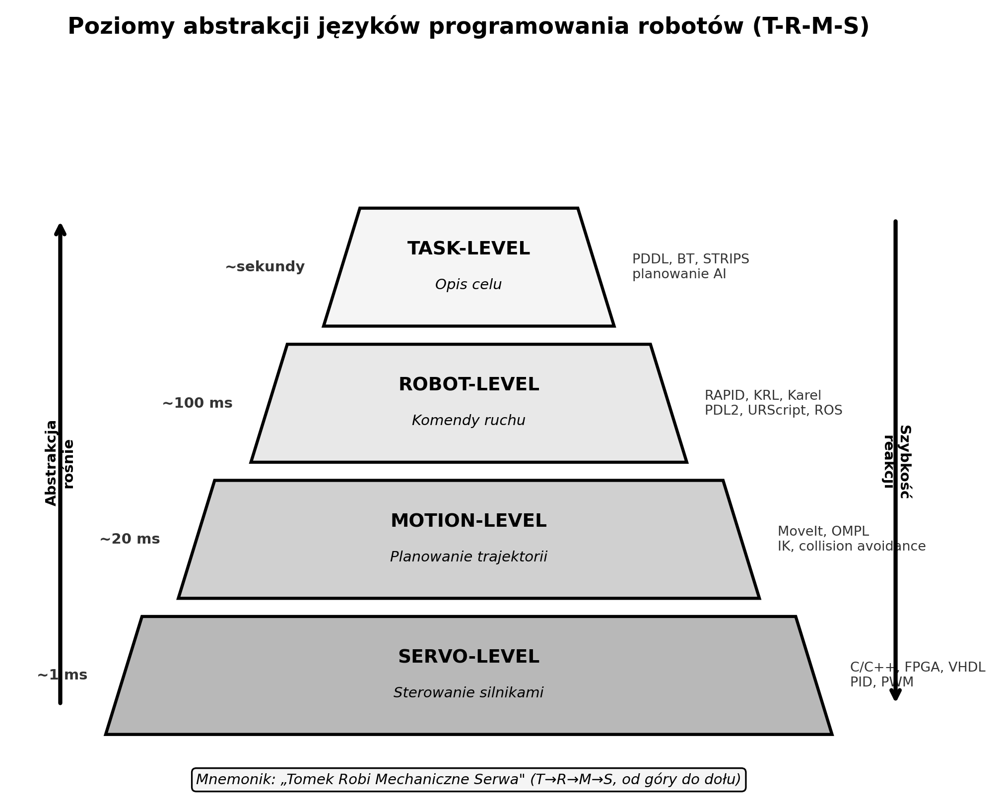

---

**Kinematyka odwrotna (inverse kinematics, IK)** — obliczenie kątów w stawach robota, aby efektor (np. chwytak) znalazł się w zadanej pozycji. Problem odwrotny: znasz cel (x,y,z + orientacja), szukasz konfiguracji (kąty q₁…qₙ). Może mieć 0, 1 lub wiele rozwiązań. Robot 6-osiowy: zazwyczaj do 8 rozwiązań dla jednej pozycji.

    Przykład (robot 2-osiowy, ramiona L₁=L₂=1m, cel: x=1.0, y=1.0):
    q₂ = arccos((x²+y²−L₁²−L₂²) / (2·L₁·L₂))
       = arccos((1+1−1−1)/2) = arccos(0) = 90°
    Dwa rozwiązania: „łokieć do góry" i „łokieć na dół"

**Trajektoria (trajectory)** — zaplanowana ścieżka ruchu w czasie: sekwencja pozycji + prędkości + przyspieszenia. Trzy typy interpolacji:
- **PTP (Point-to-Point)** — najszybsza, ale ścieżka w przestrzeni kartezjańskiej nieprzewidywalna (interpolacja w przestrzeni stawów)
- **LIN (Linear)** — prosta linia TCP (Tool Center Point); wymaga obliczenia IK w każdym punkcie
- **CIRC (Circular)** — łuk kołowy przez 3 punkty (start, pkt pomocniczy, cel)

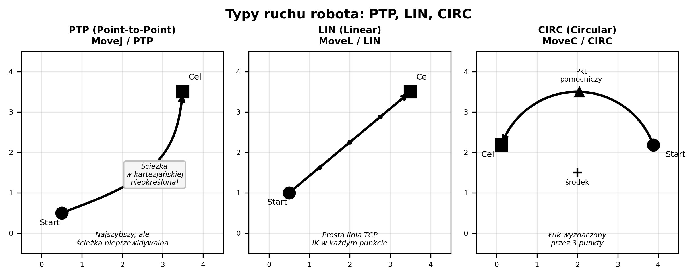

---

**Vendor lock-in** — każdy producent ma WŁASNY język. Program napisany w RAPID nie działa na robocie KUKA. To motywacja dla ROS i standardów. Porównanie języków:

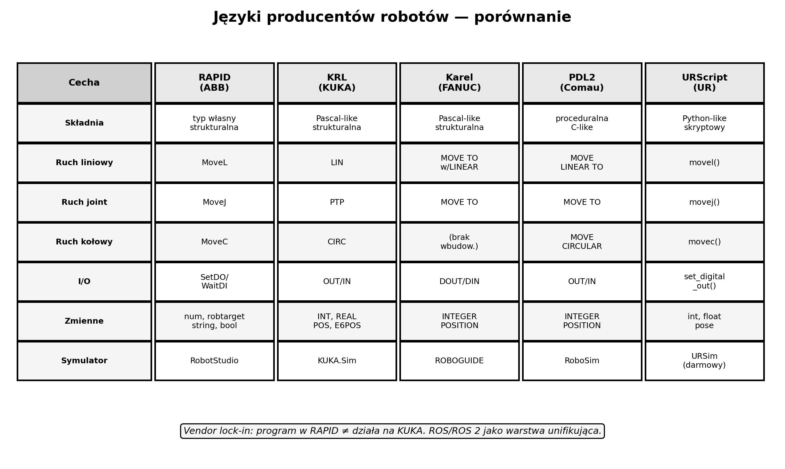

---

**TCP (Tool Center Point)** — punkt centralny narzędzia zamontowanego na końcu ramienia (np. czubek spawarki, środek chwytaka). Wszystkie komendy ruchu LIN i CIRC odnoszą się do TCP — robot steruje tak, żeby ten punkt poruszał się po żądanej ścieżce.

    Definiowanie TCP w RAPID:
    PERS tooldata tGripper := [TRUE, [[0,0,150],[1,0,0,0]],
                                [2,[0,0,75],[1,0,0,0],0,0,0]];
    // TCP jest 150mm nad kołnierzem, masa narzędzia 2kg

**Strefa zbliżenia (zone)** — parametr określający, jak blisko celu robot musi dojechać zanim zacznie ruch do kolejnego punktu. `fine` = dojazd dokładnie do punktu (zatrzymanie), `z10` = robot zaczyna skręcać w stronę następnego punktu gdy jest 10mm od celu (ruch „na okrągło", płynniejszy i szybszy).

    MoveL p1, v500, fine, tool1;   // zatrzymaj się dokładnie w p1
    MoveL p1, v500, z50, tool1;    // zacznij skręcać 50mm przed p1
    // z50 → szybszy cykl, ale mniejsza precyzja w punkcie

---

### Klasyfikacja wg poziomu abstrakcji: **T-R-M-S**

1. **Task-level** — „Podnieś A, połóż na B" (PDDL, Behavior Trees)
2. **Robot-level** — move_to(), grasp() (RAPID, KRL, Karel, URScript)
3. **Motion-level** — trajektorie, kinematyka odwrotna (MoveIt, OMPL)
4. **Servo-level** — PID, sterowanie silnikami (C/C++, FPGA)

### Klasyfikacja wg metody programowania

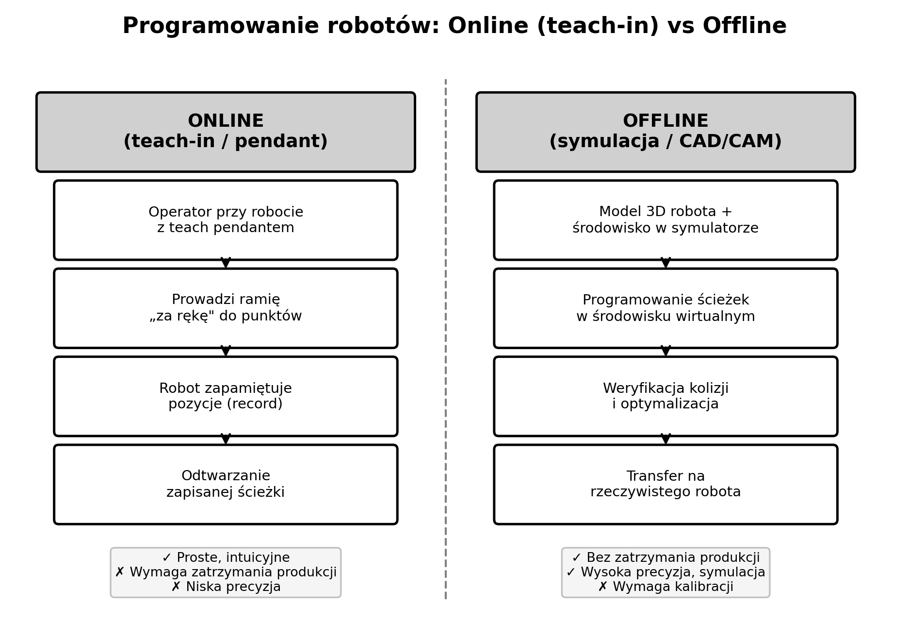

- **Online (teach-in)** — operator z teach pendantem prowadzi robota i zapisuje punkty. Proste, intuicyjne, ale wymaga wyłączenia produkcji.
- **Offline** — programowanie w symulatorze 3D (RobotStudio, KUKA.Sim, ROBOGUIDE), bez zatrzymywania robota. Wymaga kalibracji po transferze.
- **Hybrid** — w praktyce łączy się oba podejścia: offline do wstępnego programu, online do korekcji punktów.

### Języki producentów — szczegółowo

#### RAPID (ABB)

**Producent:** ABB. **Rozwinięcie:** Robotics Application Programming Interactive Dialogue. **Składnia:** własny typ, strukturalna, wielozadaniowa (RAPID obsługuje wielowątkowość). **Symulator:** RobotStudio (darmowa wersja edukacyjna).

**Kluczowe cechy:**
- Typy danych: `num` (liczba), `string`, `bool`, `robtarget` (pozycja kartezjańska + orientacja + konfiguracja), `jointtarget` (kąty stawów), `tooldata`, `wobjdata` (układ współrzędnych obiektu)
- Ruchy: `MoveJ` (joint — PTP), `MoveL` (linear), `MoveC` (circular), `MoveAbsJ` (absolutne kąty)
- I/O: `SetDO` (digital output), `WaitDI` (czekaj na digital input), `SetAO` (analog out)
- Kontrola przepływu: `IF/ELSEIF/ELSE/ENDIF`, `WHILE/ENDWHILE`, `FOR/ENDFOR`, `TEST/CASE/DEFAULT/ENDTEST`
- Obsługa błędów: `TRAP` (przerwania), `ERROR` handler
- Wielozadaniowość: wiele tasków wykonywanych równolegle — np. jeden task steruje ruchem, drugi monitoruje czujniki

**Przykładowy program pick & place:**

    MODULE MainModule
        ! --- Dane ---
        CONST robtarget pHome  := [[500,0,600],[1,0,0,0],[0,0,0,0],[9E9,9E9,9E9,9E9,9E9,9E9]];
        CONST robtarget pPick  := [[400,200,100],[1,0,0,0],[0,0,0,0],[9E9,9E9,9E9,9E9,9E9,9E9]];
        CONST robtarget pPlace := [[400,-200,100],[1,0,0,0],[0,0,0,0],[9E9,9E9,9E9,9E9,9E9,9E9]];
        VAR num nCycles := 0;

        ! --- Procedura główna ---
        PROC main()
            MoveJ pHome, v1000, z50, tGripper;     ! jedź do pozycji bazowej (joint)
            WHILE TRUE DO
                PickPart;
                PlacePart;
                Incr nCycles;
                TPWrite "Cykl nr: " + ValToStr(nCycles);
            ENDWHILE
        ENDPROC

        ! --- Podnoszenie ---
        PROC PickPart()
            MoveL Offs(pPick,0,0,50), v500, z10, tGripper;   ! 50mm nad celem
            MoveL pPick, v100, fine, tGripper;                 ! precyzyjnie na cel
            SetDO doGripper, 1;                                ! zamknij chwytak
            WaitTime 0.3;                                      ! czekaj na zamknięcie
            MoveL Offs(pPick,0,0,50), v500, z10, tGripper;   ! podnieś 50mm
        ENDPROC

        ! --- Odkładanie ---
        PROC PlacePart()
            MoveL Offs(pPlace,0,0,50), v500, z10, tGripper;  ! 50mm nad miejscem
            MoveL pPlace, v100, fine, tGripper;                ! precyzyjnie na cel
            SetDO doGripper, 0;                                ! otwórz chwytak
            WaitTime 0.3;
            MoveL Offs(pPlace,0,0,50), v500, z10, tGripper;  ! podnieś 50mm
        ENDPROC
    ENDMODULE

**Objaśnienie parametrów MoveL:**

    MoveL  pPick,  v500,   z10,    tGripper;
    │      │       │       │       └── narzędzie (tooldata) — definiuje TCP
    │      │       │       └── strefa zbliżenia: 10mm (nie zatrzymuj się, skręcaj)
    │      │       └── prędkość TCP: 500 mm/s
    │      └── cel: robtarget (pozycja + orientacja + konfiguracja)
    └── typ ruchu: ruch liniowy (TCP jedzie po prostej)

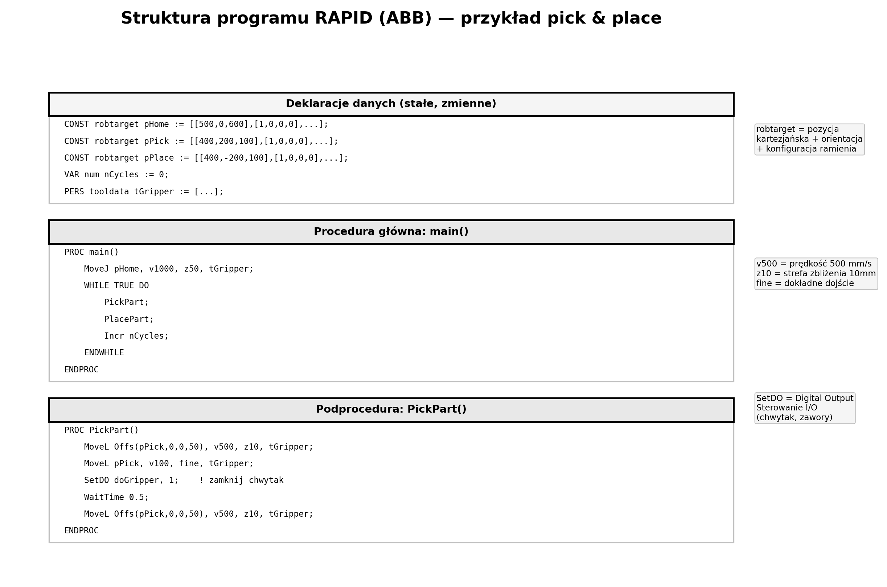

---

#### KRL (KUKA Robot Language)

**Producent:** KUKA. **Rozwinięcie:** KUKA Robot Language. **Składnia:** Pascal-like (BEGIN/END, deklaracje na początku). **Symulator:** KUKA.Sim Pro, WorkVisual.

**Kluczowe cechy:**
- Program = dwa pliki: `.src` (kod) + `.dat` (dane punktów)
- Typy: `INT`, `REAL`, `BOOL`, `CHAR`, `POS` (x,y,z,a,b,c), `E6POS` (+ osie dodatkowe), `AXIS` (kąty stawów)
- Ruchy: `PTP` (point-to-point = joint), `LIN` (linear), `CIRC` (circular)
- Approximation (odpowiednik zone w RAPID): `C_DIS` — robot nie zatrzymuje się w punkcie
- Kontrola przepływu: `IF/ENDIF`, `WHILE/ENDWHILE`, `FOR/ENDFOR`, `SWITCH/CASE/ENDSWITCH`

**Przykładowy program:**

    DEF PickAndPlace()
        ; --- Deklaracje ---
        DECL E6POS XHome, XPick, XPlace
        DECL INT nLoop

        ; --- Inicjalizacja ---
        BAS (#INITMOV, 0)         ; inicjalizacja ruchów
        $VEL.CP = 0.5             ; prędkość kartezjańska 0.5 m/s
        $APO.CDIS = 10            ; approximacja: 10mm

        ; --- Ruch do domu ---
        PTP XHome                 ; point-to-point (joint space)

        FOR nLoop = 1 TO 100
            ; Podjedź nad punkt pobrania
            LIN XPick              ; ruch liniowy do punktu
            ; Zamknij chwytak
            OUT 1 TRUE             ; digital output 1 = ON
            WAIT SEC 0.3
            ; Jedź do miejsca odkładania
            LIN XPlace
            OUT 1 FALSE            ; otwórz chwytak
            WAIT SEC 0.3
        ENDFOR
    END

**KRL vs RAPID — kluczowe różnice:**
- KRL rozdziela kod (`.src`) od danych (`.dat`); RAPID trzyma wszystko w MODULE
- KRL: `$VEL.CP = 0.5` (zmienna systemowa); RAPID: `v500` (nazwany speeddata)
- KRL: `C_DIS` approximation; RAPID: `z10` zone
- KRL: `OUT 1 TRUE`; RAPID: `SetDO doGripper, 1`

---

#### Karel (FANUC)

**Producent:** FANUC. **Nazwa:** od Karla Čapka. **Składnia:** Pascal-like (PROGRAM/BEGIN/END, VAR). **Symulator:** ROBOGUIDE.

**Kluczowe cechy:**
- Dwa tryby: Karel (tekstowy, pełny język) i TP (Teach Pendant — uproszczony, listowy)
- Karel: kompilowany, typowany, procedury/funkcje
- Typy: `INTEGER`, `REAL`, `BOOLEAN`, `STRING`, `POSITION`, `XYZWPR`
- TP program jest częściej używany w praktyce (prostszy, operatorzy go rozumieją)

**Przykład Karel:**

    PROGRAM pick_place
    VAR
        home_pos : POSITION
        pick_pos : POSITION
        place_pos : POSITION
        cycle_count : INTEGER
    BEGIN
        cycle_count = 0
        -- Jedź do domu
        MOVE TO home_pos
        WHILE cycle_count < 100 DO
            -- Podnoszenie
            MOVE TO pick_pos
            DOUT[1] = ON           -- zamknij chwytak
            DELAY 300              -- czekaj 300ms
            -- Odkładanie
            MOVE TO place_pos
            DOUT[1] = OFF          -- otwórz chwytak
            DELAY 300
            cycle_count = cycle_count + 1
        ENDWHILE
    END pick_place

**Przykład TP (Teach Pendant) — to widzi operator:**

       1: J P[1] 100% FINE          ; joint move do Home, 100% speed
       2: L P[2] 500mm/sec FINE     ; linear do Pick
       3: DO[1]=ON                  ; chwytak zamknij
       4: WAIT 0.30(sec)
       5: L P[3] 500mm/sec FINE     ; linear do Place
       6: DO[1]=OFF                 ; chwytak otwórz
       7: WAIT 0.30(sec)
       8: JMP LBL[1]               ; skocz do linii 1

**Uwaga:** W praktyce fabrycznej TP jest dominujący — operatorzy uczą się numerowanych linii, nie pełnego Karela.

---

#### URScript (Universal Robots)

**Producent:** Universal Robots (coboty — collaborative robots). **Składnia:** Python-like (brak nawiasów klamrowych, wcięcia nie mają znaczenia, ale styl jest skryptowy). **Symulator:** URSim (darmowy, oparty na VM).

**Kluczowe cechy:**
- Skryptowy i prosty — niski próg wejścia (coboty = roboty współpracujące z ludźmi)
- Wbudowane funkcje force control (sterowanie siłą) — unikalne dla cobotów
- Typy: brak deklaracji typów (dynamiczne), `pose` = [x,y,z,rx,ry,rz]
- Polyscope — graficzny interfejs do programowania (drag & drop + URScript)

**Przykład URScript:**

    def pick_and_place():
        # Pozycje jako pose: [x, y, z, rx, ry, rz] w metrach i radianach
        home  = p[0.5, 0.0, 0.4, 3.14, 0.0, 0.0]
        pick  = p[0.4, 0.2, 0.1, 3.14, 0.0, 0.0]
        place = p[0.4, -0.2, 0.1, 3.14, 0.0, 0.0]

        movej(home, a=1.2, v=0.5)          # joint move, acc=1.2 rad/s², vel=0.5 rad/s

        i = 0
        while i < 100:
            # Podnoszenie
            movel(pick, a=0.5, v=0.3)      # linear move
            set_digital_out(0, True)        # zamknij chwytak
            sleep(0.3)

            # Odkładanie
            movel(place, a=0.5, v=0.3)
            set_digital_out(0, False)       # otwórz chwytak
            sleep(0.3)

            i = i + 1
        end
    end

**URScript — unikalne cechy cobotów:**

    # Force mode — wkładanie kołka w otwór z kontrolą siły:
    force_mode(p[0,0,0,0,0,0], [0,0,1,0,0,0], [0,0,-10,0,0,0], 2, [0.1,0.1,0.05,1,1,1])
    # Robot naciska z siłą 10N w dół (oś Z), reszt osi blokuje

    # Freedrive — operator prowadzi robota ręcznie:
    freedrive_mode()
    sleep(10)   # 10 sekund swobodnego prowadzenia
    end_freedrive_mode()

---

#### PDL2 (Comau)

**Producent:** Comau (Fiat/Stellantis). **Składnia:** proceduralna, C-like. **Symulator:** RoboSim.

**Przykład:**

    PROGRAM pick_place
    VAR home_pos, pick_pos, place_pos : POSITION
    BEGIN
        MOVE TO home_pos
        CYCLE
            MOVE LINEAR TO pick_pos
            $DOUT[1] := TRUE          -- chwytak
            DELAY 300
            MOVE LINEAR TO place_pos
            $DOUT[1] := FALSE
            DELAY 300
        END CYCLE
    END pick_place

---

### Porównanie składni — ten sam ruch w 5 językach

    Zadanie: ruch liniowy do punktu pPick z prędkością ~500mm/s

    RAPID (ABB):    MoveL pPick, v500, fine, tGripper;
    KRL (KUKA):     LIN XPick
    Karel (FANUC):  MOVE TO pick_pos                      ; z opcją LINEAR
    TP (FANUC):     L P[2] 500mm/sec FINE
    URScript (UR):  movel(pick, a=0.5, v=0.5)
    PDL2 (Comau):   MOVE LINEAR TO pick_pos

### Języki uniwersalne i middleware

#### ROS / ROS 2 (Robot Operating System)

**ROS** to middleware (NIE system operacyjny!) — warstwa komunikacji między modułami (węzłami). Programuje się w Python lub C++. Architektura publish/subscribe: węzły publikują wiadomości na tematy (topics), inne węzły subskrybują.

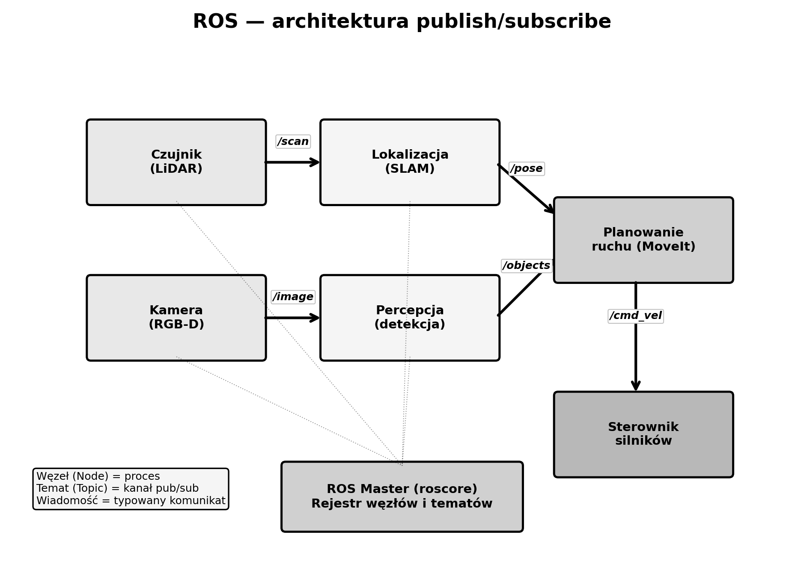

**ROS 1 vs ROS 2:**
- ROS 1: roscore (centralny master), brak real-time, Python 2/3 + C++
- ROS 2: DDS (bez centralnego mastera, peer-to-peer), real-time friendly, Python 3 + C++17
- ROS 2 dodaje: lifecycle nodes, QoS (Quality of Service), lepsze multi-robot

**Przykład ROS 2 (Python) — publisher prędkości:**

    import rclpy
    from geometry_msgs.msg import Twist

    def main():
        rclpy.init()
        node = rclpy.create_node('velocity_publisher')
        pub = node.create_publisher(Twist, '/cmd_vel', 10)

        msg = Twist()
        msg.linear.x = 0.5    # 0.5 m/s do przodu
        msg.angular.z = 0.1   # obrót 0.1 rad/s

        timer = node.create_timer(0.1, lambda: pub.publish(msg))  # co 100ms
        rclpy.spin(node)

**MoveIt** — biblioteka ROS do planowania ruchu manipulatorów. Obejmuje: IK, collision avoidance, trajectory planning. Wspiera roboty wielu producentów — klucz do przełamania vendor lock-in.

    # MoveIt — planowanie ruchu w Pythonie:
    move_group = MoveGroupCommander("arm")
    move_group.set_pose_target(target_pose)     # cel w kartezjańskiej
    plan = move_group.plan()                     # automatyczny plan trajektorii
    move_group.execute(plan)                     # wykonaj

#### Orocos (Open Robot Control Software)

Framework C++ do **hard real-time** sterowania robotów. Tam gdzie ROS nie wystarczy (pętle regulacji < 1ms), Orocos wypełnia lukę. Często łączony z ROS: ROS do komunikacji + Orocos do sterowania.

---

### Task-level: PDDL i Behavior Trees

#### PDDL (Planning Domain Definition Language)

Język opisu problemów planowania. Definiujesz: stany, akcje z warunkami i efektami, cel. Planner (np. Fast Downward) automatycznie znajduje sekwencję akcji.

    ; PDDL — domena: robot pick & place
    (define (domain robot-world)
        (:predicates
            (on-table ?obj)
            (holding ?obj)
            (arm-empty))
        (:action pick
            :parameters (?obj)
            :precondition (and (on-table ?obj) (arm-empty))
            :effect (and (holding ?obj) (not (on-table ?obj)) (not (arm-empty))))
        (:action place
            :parameters (?obj)
            :precondition (holding ?obj)
            :effect (and (on-table ?obj) (arm-empty) (not (holding ?obj)))))

    ; Problem: weź obiektA ze stołu
    (define (problem pick-a)
        (:domain robot-world)
        (:init (on-table objectA) (arm-empty))
        (:goal (holding objectA)))

    ; Planner automatycznie znajdzie: pick(objectA)

#### Behavior Trees (drzewa zachowań)

Alternatywa dla maszyn stanów w sterowaniu robotów i postaci w grach. Drzewo składa się z:
- **Sequence** (→) — wykonuj dzieci po kolei, przerwij jeśli któreś zawiedzie
- **Selector** (?) — próbuj dzieci po kolei, przerwij po pierwszym sukcesie
- **Action** — liść: wykonaj akcję
- **Condition** — liść: sprawdź warunek

    Behavior Tree: „Pick and Place"
    [→ Sequence]
        ├── [? Selector: FindObject]
        │     ├── [Condition: ObjectVisible?]
        │     └── [Action: SearchForObject]
        ├── [Action: MoveToObject]
        ├── [Action: Grasp]
        ├── [Action: MoveToTarget]
        └── [Action: Release]

---

### Środowiska graficzne

| Narzędzie    | Producent | Typ                    | Koszt            |
|-------------|-----------|------------------------|------------------|
| RobotStudio | ABB       | Offline + symulacja 3D | Licencja / edu   |
| KUKA.Sim    | KUKA      | Offline + symulacja 3D | Licencja         |
| ROBOGUIDE   | FANUC     | Offline + symulacja 3D | Licencja         |
| URSim       | UR        | Symulator kontrolera   | Darmowy          |
| Polyscope   | UR        | GUI na teach pendancie | Wbudowany        |
| Blockly     | Różni     | Graficzne (edukacja)   | Open source      |
| Gazebo      | ROS/OSRF  | Symulacja fizyczna 3D  | Open source      |

### Podsumowanie klasyfikacji

| Kryterium           | Kategorie                                                |
|--------------------|----------------------------------------------------------|
| **Poziom abstrakcji** | Task → Robot → Motion → Servo (T-R-M-S)              |
| **Metoda**           | Online (teach-in) vs Offline (symulacja) vs Hybrid    |
| **Zakres**           | Vendor-specific (RAPID, KRL, Karel) vs Universal (ROS)|
| **Interfejs**        | Tekstowy (RAPID, KRL) vs Graficzny (Polyscope, Blockly)|
| **Real-time**        | Hard RT (Orocos, C/FPGA) vs Soft RT (ROS 2)          |

### Etymologia

**RAPID** — Robotics Application Programming Interactive Dialogue (ABB, 1994). **KRL** — KUKA Robot Language (KUKA, Augsburg). **Karel** — od Karla Čapka, czeskiego pisarza, który ukuł słowo „robot" (cz. „robota" = ciężka/przymusowa praca) w sztuce R.U.R. (Rossum's Universal Robots, 1920). **PDL2** — Programming and Data Language 2 (Comau). **URScript** — Universal Robots Script. **PDDL** — Planning Domain Definition Language (Drew McDermott et al., 1998). **MoveIt** — open source, Willow Garage → PickNik Robotics. **ROS** — Robot Operating System (Willow Garage, 2007 → Open Robotics). **Orocos** — Open Robot Control Software (KU Leuven, Belgia). **TCP** — Tool Center Point (nie mylić z Transmission Control Protocol!). **OMPL** — Open Motion Planning Library. **Cobot** — collaborative robot (termin 1996, Northwestern University).

### Jak zapamiętać

- **„Tomek Robi Mechaniczne Serwa" → T-R-M-S** (Task → Robot → Motion → Servo, od abstrakcji do sprzętu)
- **„ABB RAPID jak rapier (szybki miecz)" → MoveL, MoveJ, MoveC** — trzy podstawowe ruchy
- **„KUKA KRL = Pascal na sterydach"** — PTP, LIN, CIRC; dwa pliki (.src + .dat)
- **„FANUC Karel = Čapek" → MOVE TO** — najprostszy składniowo
- **„UR = Python robota" → movel(), movej()** — małe litery, skryptowy, coboty
- **„ROS = WhatsApp robotów"** — węzły wysyłają wiadomości na tematy (topics), ale to NIE system operacyjny
- **Vendor lock-in → „Program w RAPID na KUKA = jak wtyczka EU w gniazdku UK"** — nie pasuje
- **Online = „trzymaj robota za rękę", Offline = „rysuj w symulatorze"**
- **MoveIt = „GPS dla ramienia robota"** — planuje trasę z unikaniem przeszkód
- **Zone/Approximation = „hamowanie przed zakrętem"** — fine = stop, z50 = przejeżdżaj płynnie

\newpage

## PYTANIE 17: Szeregowanie zadań

**Cechy klasyfikacji. Przykładowa metoda.**

---

### Tło pojęciowe — słowniczek

**Szeregowanie zadań (scheduling)** — przydzielanie zadań do maszyn (procesorów, linii produkcyjnych) w czasie, tak aby zoptymalizować wybrane kryterium (np. minimalizacja czasu ukończenia, minimalizacja opóźnień). Fundamentalny problem badań operacyjnych i systemów operacyjnych.

    Mam 5 zadań i 2 maszyny. Które zadanie na którą maszynę? W jakiej kolejności?
    Cel: ukończyć wszystko najszybciej.

---

**Notacja Grahama (α | β | γ)** — standardowy sposób opisu problemu szeregowania w trzech polach:

**α — środowisko maszynowe:** ile i jakie maszyny?
- **1** — jedna maszyna
- **Pm** — m identycznych maszyn równoległych
- **F** (flow shop) — zadania „płyną" przez maszyny w tej samej kolejności (jak taśma montażowa)
- **J** (job shop) — każde zadanie ma indywidualną trasę przez maszyny (elastyczniejsze, trudniejsze)

**β — charakterystyki zadań:** jakie ograniczenia?
- **rⱼ** (release dates) — zadanie j dostępne dopiero w czasie rⱼ
- **dⱼ** (due dates) — termin, do którego zadanie j powinno być ukończone
- **pmtn** (preemption) — można przerwać zadanie i wrócić później
- **prec** (precedencje) — zadanie A musi skończyć się przed B

**γ — kryterium optymalizacji:** co minimalizujemy?
- **Cmax (makespan)** — czas ukończenia OSTATNIEGO zadania. Minimalizacja → najszybsze „zrobienie wszystkiego".
- **ΣCⱼ** — suma czasów ukończenia. Minimalizacja → minimalizacja średniego czasu.
- **Lmax** — maksymalne opóźnienie (max(Cⱼ - dⱼ)). Minimalizacja → żadne zadanie nie jest „bardzo" spóźnione.
- **ΣTⱼ** — suma spóźnień (Tⱼ = max(0, Cⱼ - dⱼ)).
- **ΣUⱼ** — liczba spóźnionych zadań (Uⱼ = 1 jeśli Cⱼ > dⱼ, 0 w.p.p.).

    Przykład zapisu: 1 || ΣCⱼ
    Znaczenie: 1 maszyna, brak ograniczeń, minimalizuj sumę czasów ukończenia

---

**SPT (Shortest Processing Time)** — reguła: wykonuj najkrótsze zadanie najpierw. Optymalna dla problemu 1 || ΣCⱼ.

    Dlaczego SPT jest optymalne? Bo krótkie zadania „nie blokują" długich.
    Zadania: 5, 3, 8, 2, 6
    SPT → 2, 3, 5, 6, 8
    Czasy ukończenia: 2, 5, 10, 16, 24
    ΣCⱼ = 57

    Gdyby odwrotnie (LPT): 8, 6, 5, 3, 2
    Czasy ukończenia: 8, 14, 19, 22, 24
    ΣCⱼ = 87 (gorsze!)

**EDD (Earliest Due Date)** — reguła: wykonuj najpierw zadanie z najwcześniejszym terminem (deadline). Optymalna dla 1 || Lmax.

**Algorytm Johnsona** — optymalny dla flow shopu z 2 maszynami (F2 || Cmax). Algorytm:
1. Jeśli min czas jest na maszynie 1 → zadanie na początek
2. Jeśli min czas jest na maszynie 2 → zadanie na koniec

---

**Makespan (Cmax)** — czas od startu do zakończenia OSTATNIEGO zadania. „Jak długo trwa cały projekt?"

**Flow shop** — każde zadanie przechodzi przez te same maszyny w tej samej kolejności (M1 → M2 → M3). Jak linia montażowa w fabryce: każdy samochód przechodzi spawanie → malowanie → montaż.

**Job shop** — każde zadanie ma indywidualną trasę (J1: M2→M1→M3; J2: M1→M3→M2). Bardziej elastyczny, ale problem szeregowania jest znacznie trudniejszy (NP-trudny już dla 3 maszyn!).

**Preemption (wywłaszczanie)** — możliwość przerwania zadania w trakcie i dokończenia go później. Bez preemption (non-preemptive): raz rozpoczęte zadanie musi się skończyć.

**Precedencje (precedence constraints)** — ograniczenia kolejności: zadanie A musi skończyć się zanim B może się zacząć. Modelowane jako DAG (Directed Acyclic Graph).

**NP-trudny** — klasa problemów bez znanego algorytmu wielomianowego. Job shop scheduling jest NP-trudny nawet dla 3 maszyn. Pm||Cmax jest NP-trudny dla m≥2. W praktyce: heurystyki, metaheurystyki (genetic algorithms, simulated annealing), programming math.

---

### Część 1 — Cechy klasyfikacji problemów szeregowania

Problemy szeregowania klasyfikuje się za pomocą **notacji Grahama α | β | γ** (trzy pola opisujące problem) oraz ortogonalnych cech dodatkowych.

#### Notacja Grahama: **α | β | γ**

**α — środowisko maszynowe** (ile i jakie maszyny):

| Symbol | Nazwa | Opis |
|--------|-------|------|
| **1** | jedna maszyna | najprostsze problemy |
| **Pm** | identyczne równoległe | m maszyn, ten sam czas pⱼ na każdej |
| **Qm** | jednorodne (uniform) | maszyna i ma prędkość sᵢ; czas = pⱼ/sᵢ |
| **Rm** | niespokrewnione (unrelated) | czas pᵢⱼ zależy od pary (zadanie, maszyna) |
| **Fm** | flow shop | wszystkie zadania w tej samej kolejności maszyn |
| **Jm** | job shop | każde zadanie ma indywidualną trasę |
| **Om** | open shop | kolejność maszyn dowolna per zadanie |

    Flow shop: każde zadanie → M1 → M2 → M3  (ta sama kolejność)
    Job shop:  J1 → M2→M1→M3;  J2 → M1→M3→M2  (indywidualne trasy)
    Open shop: dowolna permutacja maszyn per zadanie

**β — charakterystyki zadań** (ograniczenia i cechy):

| Symbol | Nazwa | Znaczenie |
|--------|-------|-----------|
| **rⱼ** | release dates | zadanie j dostępne od czasu rⱼ |
| **dⱼ** | due dates | termin ukończenia (soft — opóźnienie jest kosztem) |
| **d̄ⱼ** | deadlines | termin bezwzględny (hard — musi być dotrzymany) |
| **pmtn** | preemption | można przerwać i wznowić zadanie |
| **prec** | precedencje | DAG zależności: A musi się skończyć przed B |
| **pⱼ=1** | unit processing | wszystkie zadania mają czas = 1 |
| **sⱼₖ** | setup times | czas przezbrojenia między zadaniami j i k |

**γ — kryterium optymalizacji** (co minimalizujemy):

| Kryterium | Wzór | Interpretacja |
|-----------|------|---------------|
| **Cmax** | max(Cⱼ) | makespan — czas ukończenia WSZYSTKIEGO |
| **ΣCⱼ** | Σ Cⱼ | suma czasów ukończenia (~ średni czas) |
| **ΣwⱼCⱼ** | Σ wⱼCⱼ | ważona suma (priorytety zadań) |
| **Lmax** | max(Cⱼ - dⱼ) | maksymalne opóźnienie |
| **ΣTⱼ** | Σ max(0, Cⱼ-dⱼ) | suma spóźnień |
| **ΣUⱼ** | Σ 𝟙(Cⱼ>dⱼ) | liczba spóźnionych zadań |

    Przykład zapisu: F2 || Cmax
    Znaczenie: flow shop, 2 maszyny, brak ograniczeń na zadania, minimalizuj makespan

#### Cechy dodatkowe (ortogonalne do α|β|γ)

| Cecha | Warianty | Wpływ |
|-------|----------|-------|
| **Determinizm** | deterministyczne vs stochastyczne | czy czasy pⱼ są znane z góry czy losowe? |
| **Dynamika** | statyczne vs dynamiczne | czy wszystkie zadania znane na starcie? |
| **Wywłaszczanie** | preemptive vs non-preemptive | czy można przerwać zadanie? |
| **Online/offline** | online vs offline | czy decyzje podejmowane bez wiedzy o przyszłości? |

#### Złożoność obliczeniowa

| Problem | Złożoność | Metoda rozwiązania |
|---------|-----------|-------------------|
| 1 \|\| ΣCⱼ | **O(n log n)** | SPT — sortowanie |
| 1 \|\| Lmax | **O(n log n)** | EDD — sortowanie |
| F2 \|\| Cmax | **O(n log n)** | Algorytm Johnsona |
| Pm \|\| Cmax (m≥2) | **NP-trudny** | heurystyki (LPT), metaheurystyki |
| Jm \|\| Cmax (m≥3) | **silnie NP-trudny** | branch & bound, GA, symulowane wyżarzanie |

---

### Część 2 — Przykładowa metoda: Algorytm Johnsona (F2 || Cmax)

#### Problem

Flow shop z **2 maszynami** (M1, M2), **n zadań**. Każde zadanie musi najpierw przejść przez M1 (czas aⱼ), potem M2 (czas bⱼ). Kolejność zadań na obu maszynach **taka sama** (permutacyjny flow shop). Cel: minimalizacja **Cmax** (makespanu).

#### Algorytm (Selmer Johnson, 1954)

1. Dla każdego zadania j wyznacz min(aⱼ, bⱼ).
2. Jeśli minimum jest na M1 (aⱼ ≤ bⱼ) → zadanie na **POCZĄTEK** kolejki (od lewej).
3. Jeśli minimum jest na M2 (bⱼ < aⱼ) → zadanie na **KONIEC** kolejki (od prawej).
4. W obrębie grupy „na początek" — rosnąco wg aⱼ; „na koniec" — malejąco wg bⱼ.

#### Przykład liczbowy

5 zadań z czasami:

    Zadanie:  J1   J2   J3   J4   J5
    M1 (aⱼ):  4    2    6    1    3
    M2 (bⱼ):  5    3    2    7    4

**Krok 1 — Znajdź minima i przydziel:**

    J1: min(4,5) = 4 na M1 → POCZĄTEK
    J2: min(2,3) = 2 na M1 → POCZĄTEK
    J3: min(6,2) = 2 na M2 → KONIEC
    J4: min(1,7) = 1 na M1 → POCZĄTEK
    J5: min(3,4) = 3 na M1 → POCZĄTEK

**Krok 2 — Posortuj w grupach:**

    POCZĄTEK (rosnąco wg aⱼ): J4(1), J2(2), J5(3), J1(4)
    KONIEC (malejąco wg bⱼ):  J3(2)

**Optymalna kolejność: J4 → J2 → J5 → J1 → J3**

**Krok 3 — Oblicz czasy (diagram Gantta):**

    M1: |J4:1|J2:2 |J5:3  |J1:4   |J3:6       |
    t:  0   1    3     6      10       16

    M2:      |J4:7      |J2:3|J5:4   |J1:5      |J3:2|
    t:  0   1          8   11     15       20   22

    Szczegółowe obliczenie:
    J4: M1=[0,1],   M2=[1,8]     (start M2 = max(1, 0) = 1)
    J2: M1=[1,3],   M2=[8,11]    (start M2 = max(3, 8) = 8)
    J5: M1=[3,6],   M2=[11,15]   (start M2 = max(6, 11) = 11)
    J1: M1=[6,10],  M2=[15,20]   (start M2 = max(10, 15) = 15)
    J3: M1=[10,16], M2=[20,22]   (start M2 = max(16, 20) = 20)

    Cmax = 22

**Dlaczego optymalny?** Johnson udowodnił (1954), że zamiana dowolnych dwóch sąsiednich zadań w tej kolejności nie zmniejszy Cmax. Algorytm minimalizuje „idle time" na M2 — krótkie zadania na M1 na początku szybko „karmią" M2, a krótkie na M2 na końcu kończą się szybko po M1.

#### Klasyczne reguły optymalne (inne metody)

| Reguła | Problem | Opis | Złożoność |
|--------|---------|------|-----------|
| **SPT** | 1 \|\| ΣCⱼ | najkrótsze najpierw | O(n log n) |
| **WSPT** | 1 \|\| ΣwⱼCⱼ | sortuj wg pⱼ/wⱼ rosnąco | O(n log n) |
| **EDD** | 1 \|\| Lmax | najwcześniejszy termin | O(n log n) |
| **Johnson** | F2 \|\| Cmax | algorytm powyżej | O(n log n) |

#### Przykład SPT: 1 || ΣCⱼ

    Zadania: J1(5), J2(3), J3(8), J4(2), J5(6)
    SPT → J4(2), J2(3), J1(5), J5(6), J3(8)
    Czasy ukończenia:  2,  5,  10,  16,  24
    ΣCⱼ = 2+5+10+16+24 = 57  ← OPTYMALNE

    Gdyby LPT (odwrotnie): J3(8), J5(6), J1(5), J2(3), J4(2)
    Czasy ukończenia:         8,  14,  19,  22,  24
    ΣCⱼ = 8+14+19+22+24 = 87  ← 53% gorsze!

    Dowód optymalności SPT: zamiana sąsiednich i,j gdzie pᵢ > pⱼ
    zwiększa ΣCⱼ o (n-k)(pᵢ - pⱼ) > 0. Więc SPT = minimum.

### Etymologia

**Notacja Grahama** — Ronald Graham (Bell Labs, 1966–1979); znany też z liczby Grahama. **SPT** — Shortest Processing Time. **EDD** — Earliest Due Date. **Johnson** — Selmer Johnson (RAND, 1954). **Makespan** — „make" (ukończyć) + „span" (rozpiętość); czas od startu do końca wszystkich zadań. **Flow shop** — zadania „płyną" przez maszyny w tej samej kolejności (jak taśma). **Job shop** — każde zadanie ma indywidualną trasę. **NP-trudny** — Non-deterministic Polynomial-time hard.

### Jak zapamiętać

- **α|β|γ = Maszyny|Zadania|Cel**
- **SPT = „Short first"** — krótsze pierwsze dla sumy Cⱼ
- **EDD = „Early Due Date"** — najwcześniejszy termin dla Lmax

\newpage

## PYTANIE 18: Zarządzanie zapasami w łańcuchu dostaw

**Problemy i przykładowy model.**

---

### Tło pojęciowe — słowniczek

**Łańcuch dostaw (supply chain)** — sieć organizacji od surowca do klienta końcowego: dostawcy → producenci → dystrybutorzy → detaliści → klienci. Zarządzanie zapasami na każdym ogniwie ma ogromny wpływ na koszty i poziom obsługi.

    Dostawca → [Magazyn] → Producent → [Magazyn] → Dystrybutor → [Magazyn] → Sklep → Klient
                                    zapasy na każdym etapie!

**Zapasy (inventory)** — produkty/materiały przechowywane „na wszelki wypadek" lub w oczekiwaniu na sprzedaż/produkcję. Za dużo = zamrożony kapitał, koszty magazynowania, ryzyko przeterminowania. Za mało = brak towaru (stockout), utrata klientów.

---

**Bullwhip Effect (efekt byczego bicza)** — zjawisko amplifikacji wahań popytu w górę łańcucha dostaw. Mała zmiana popytu u detalisty (np. +5%) powoduje coraz większe wahania zamówień u dystrybutorów (+10%), producentów (+20%), dostawców (+40%).

    Klient: popyt +5% → Detalista zamawia +10% → Dystrybutor +20% → Producent +40%
    Jak bicz: mały ruch ręki → ogromny ruch na końcu

Przyczyny: prognozowanie (forecasting), zamawianie partiami (batching), promocje cenowe, racjonowanie przy niedoborach.

**Stockout (brak towaru)** — sytuacja gdy produkt jest niedostępny. Koszt: utrata sprzedaży, utrata klienta, kary umowne.

**Overstock (nadmiar zapasów)** — za dużo towaru. Koszt: magazynowanie, zamrożony kapitał, obsolescence (przeterminowanie/utrata aktualności).

---

**Koszty zapasów — trzy kategorie:**

**Koszt utrzymania (holding cost, h)** — koszt przechowywania towaru per jednostka per rok. Obejmuje: magazyn, ubezpieczenie, koszt kapitału, utrata wartości. Typowo: 15-30% wartości towaru rocznie.

**Koszt zamawiania (ordering cost, K)** — stały koszt złożenia jednego zamówienia. Obejmuje: transport, administracja, kontrola jakości. Niezależny od ilości zamówionej.

**Koszt braku (shortage cost, p)** — koszt gdy nie mamy towaru: utrata sprzedaży, ekspresowe dostawy, kary.

---

**EOQ (Economic Order Quantity)** — model Harrisa-Wilsona (1913). Najstarszy model zarządzenia zapasami. Znajduje optymalną wielkość zamówienia Q* minimalizującą łączny koszt (zamawianie + utrzymanie).

**Założenia EOQ:** popyt stały i znany (D szt/rok), lead time = 0, brak braków, koszt zamówienia K, koszt utrzymania h.

**Wzór EOQ:**

    Q* = √(2KD/h)

    TC(Q) = K·D/Q    +    h·Q/2
            koszt         koszt
         zamawiania    utrzymania

**Dlaczego √?** Bo koszty zamawiania maleją z Q (mniej zamówień), a koszty utrzymania rosną z Q (więcej w magazynie). Optimum = punkt przecięcia.

**Przykład liczbowy:**

    D = 10 000 szt/rok, K = 100 PLN/zamówienie, h = 2 PLN/szt/rok
    Q* = √(2 × 100 × 10000 / 2) = √1 000 000 = 1000 szt
    Liczba zamówień = 10000/1000 = 10/rok
    TC* = √(2 × 100 × 10000 × 2) = 2000 PLN/rok

---

**Lead time (czas realizacji, L)** — czas od złożenia zamówienia do otrzymania dostawy. Np. 5 dni. Kluczowy dla punktu zamawiania.

**ROP (Reorder Point / punkt zamawiania)** — poziom zapasu, przy którym składamy nowe zamówienie:

    ROP = d × L + SS
    d = popyt dzienny, L = lead time, SS = safety stock

**Safety stock (zapas bezpieczeństwa, SS)** — dodatkowy bufor na wypadek wahań popytu lub opóźnień dostawy:

    SS = z × σ_L
    z = kwantyl rozkładu normalnego (np. 1.65 dla 95% poziomu obsługi)
    σ_L = odchylenie standardowe popytu w lead time

    Przykład: d=30 szt/dzień, L=5 dni, SS=50 szt
    ROP = 30×5 + 50 = 200 szt
    Gdy stan spada do 200 → zamawiaj!

---

**Modele zaawansowane:**
- **(s, Q)** — gdy stan spadnie do s, zamów dokładnie Q sztuk. (s = ROP, Q = EOQ)
- **(s, S)** — gdy stan spadnie do s, zamów „do poziomu S" (order-up-to). Wielkość zamówienia zmienna.
- **(R, S)** — co R dni (stały cykl) zamów „do poziomu S". Prostsze administracyjnie.
- **VMI (Vendor Managed Inventory)** — dostawca zarządza zapasami klienta (np. Walmart + P&G). Dostawca widzi dane sprzedażowe i sam decyduje kiedy dostarczyć.

---

### Problemy

- **Bullwhip Effect** — amplifikacja wahań popytu w górę łańcucha (detaliści → dystrybutorzy → producenci → dostawcy). Przyczyny: forecasting, batching, promocje.
- Stockouts vs Overstock, obsolescence, lead time variability, demand uncertainty

### Koszty: Utrzymania (h) + Zamawiania (K) + Braku (p)

### Model EOQ (Economic Order Quantity) — Harris-Wilson

**Założenia:** popyt stały D, lead time = 0, koszt zamówienia K, koszt utrzymania h.

    TC(Q) = K·D/Q + h·Q/2

    Optymalna wielkość: Q* = √(2KD/h)
    Opt. koszt: TC* = √(2KDh)

**Przykład:** D=10000, K=100, h=2 → Q*=1000, TC*=2000 PLN/rok

### Punkt zamawiania (ROP)

    ROP = d × L + SS     (popyt dzienny × lead time + safety stock)
    SS = z × σ_L          (z z tablic normalnych, np. 1.65 dla 95%)

### Modele zaawansowane: (s,Q), (s,S), (R,S), VMI (Vendor Managed Inventory)

### Etymologia

**EOQ** — Economic Order Quantity; Ford W. Harris (1913, „How Many Parts To Make At Once") — jedno z najstarszych zastosowań badań operacyjnych. **Bullwhip Effect** — Procter & Gamble (1990s) nadali nazwę; Jay Forrester (MIT, 1961) pierwszy opisał jako „demand amplification"; „bullwhip" = bicz pasterski. **ROP** — Reorder Point. **VMI** — Vendor Managed Inventory (Walmart + P&G, lata 80.). **Safety stock** — zapas bezpieczeństwa na wypadek wahań popytu/dostaw.

### Jak zapamiętać

- **EOQ = √(2KD/h)** — zapamiętaj formułę!
- **ROP = d×L + SS** — kiedy zamawiać
- **Bullwhip = bicz** — małe wahania na końcu → duże na początku łańcucha

\newpage

## PYTANIE 19/29: Model Publish-Subscribe

**Scharakteryzować model i przykładowe rozwiązania techniczne.**

---

### Tło pojęciowe — słowniczek

**Pub/Sub (Publish-Subscribe)** — wzorzec komunikacji: nadawcy (publishers) wysyłają wiadomości, NIE wiedząc kto je odbierze. Odbiorcy (subscribers) deklarują zainteresowanie i otrzymują dopasowane wiadomości. Między nimi stoi **broker** (pośrednik). Metafora: radio — nadawca nadaje, kto chce słucha.

    Publisher A ──→ ┌─────────┐ ──→ Subscriber X
    Publisher B ──→ │  BROKER │ ──→ Subscriber Y
    Publisher C ──→ └─────────┘ ──→ Subscriber Z

**Dlaczego nie bezpośrednio?** Bo publisher musiałby znać wszystkich subscriberów, zarządzać połączeniami, retransmitować. Broker rozwiązuje to centralnie.

---

**Publisher (nadawca)** — komponent wysyłający wiadomości (eventy/zdarzenia) do brokera. Nie wie, kto subskrybuje. Przykład: czujnik temperatury publikuje odczyt co 5 sekund.

**Subscriber (odbiorca)** — komponent rejestrujący się u brokera na określone tematy/typy wiadomości. Otrzymuje wiadomości pasujące do subskrypcji. Przykład: alarm subskrybuje temat „temperatura" i reaguje gdy >50°C.

**Broker (pośrednik)** — centralny komponent routujący wiadomości od publishers do subscribers. Odpowiada za: filtrowanie, dostarczanie, buforowanie, gwarancje dostarczenia.

**Luźne powiązanie (loose coupling)** — publisher i subscriber nie znają się nawzajem. Można dodać nowego subscribera bez zmiany publishera. Fundamentalna zaleta pub/sub.

---

**Typy subskrypcji:**
- **Topic-based** — subscriber subskrybuje temat (np. „orders.created"). Najprostszy i najpopularniejszy.
- **Content-based** — filtrowanie po treści wiadomości (np. „price > 100"). Bardziej elastyczny, ale wolniejszy.
- **Type-based** — filtrowanie po typie wiadomości (np. klasa OrderEvent).
- **Hierarchical (wildcards)** — wzorce tematów: `orders.*` dopasowuje `orders.created`, `orders.cancelled`.

    Topic: "sensors/temperature/room1"
    Wildcard: "sensors/temperature/#"  → dopasowuje room1, room2, ...

---

**QoS (Quality of Service)** — gwarancje dostarczenia wiadomości:
- **At-most-once** — wiadomość dostarczana 0 lub 1 raz. „Fire and forget." Najszybszy, ryzyko utraty. Użycie: logi, metryki.
- **At-least-once** — wiadomość dostarczana ≥1 raz. Mogą być duplikaty. Użycie: płatności (z idempotencją).
- **Exactly-once** — wiadomość dostarczana dokładnie 1 raz. Najtrudniejszy do zaimplementowania. Użycie: transakcje finansowe.

    At-most-once:   send → ✓ lub ✗ (nie retransmituj)
    At-least-once:  send → ack? retry → może duplikat
    Exactly-once:   send → ack + deduplikacja (najkosztowniejszy)

---

**Kafka (Apache Kafka)** — rozproszony log. Model pull: konsument sam ciągnie wiadomości ze logu. Wiadomości **przechowywane** na dysku (retention 7 dni default). Partycje + Consumer Groups = równoległy odczyt. Bardzo wysoka przepustowość (miliony msg/s). LinkedIn (2011). Exactly-once z transakcjami.

    Kafka = rozproszony, trwały LOG
    Topic: [msg1][msg2][msg3][msg4][msg5]  ← append-only
    Consumer czyta od dowolnego offsetu (może cofnąć!)

**RabbitMQ** — klasyczna kolejka wiadomości (message queue). Model push: broker dostarcza do konsumenta. Protokół AMQP. Exchange types: Direct (klucz), Topic (*, #), Fanout (broadcast), Headers. Elastyczny routing. Wiadomości konsumowane → usunięte z kolejki.

    RabbitMQ: Publisher → Exchange → Queue → Consumer
    Wiadomość skonsumowana = znika z kolejki

**MQTT (Message Queuing Telemetry Transport)** — ultralekkiprotokół pub/sub. 2-bajtowy nagłówek! Zaprojektowany dla IoT i urządzeń z ograniczonymi zasobami (sensory, mikrokontrolery). IBM (1999) do monitoringu rurociągów naftowych przez satelitę. Brokers: Mosquitto, HiveMQ.

**Redis Pub/Sub** — pub/sub wbudowany w Redis (in-memory database). Szybki, ale BEZ persistencji — jeśli subscriber był offline, wiadomość przepada. Dla real-time (chat, live updates).

    Cecha           Kafka         RabbitMQ      MQTT          Redis
    ────────────────────────────────────────────────────────────────
    Model           Pull (log)    Push (queue)  Push          Push
    Persistencja    Tak           Opcjonalna    Retained msg  Nie
    Throughput      Bardzo wysoki Wysoki        Niski-średni  Wysoki
    Use case        Streaming     Task queues   IoT           Real-time

---

**SPOF (Single Point of Failure)** — broker jako centralny punkt: jeśli padnie, cała komunikacja się zatrzymuje. Rozwiązanie: klasteryzacja brokera (Kafka cluster, RabbitMQ cluster).

**AMQP (Advanced Message Queuing Protocol)** — otwarty protokół messaging. Standard implementowany przez RabbitMQ. Definiuje: exchange, queue, binding, ack.

---

### Model Pub/Sub

Publishers → **Broker** (router/message bus) → Subscribers
- Luźne powiązanie (publisher nie zna subscriberów)
- Asynchroniczne, skalowalne (1:N, N:M)

### Typy subskrypcji: topic-based, content-based, type-based, hierarchical (wildcards)

### Gwarancje dostarczenia (QoS): At-most-once, At-least-once, Exactly-once

### Rozwiązania techniczne

| Technologia  | Model          | Persistence | Throughput    | Use Case      |
|--------------|----------------|-------------|---------------|---------------|
| **Kafka**    | Pull (log)     | Tak         | Bardzo wysoki | Event streaming|
| **RabbitMQ** | Push (queue)   | Opcjonalne  | Wysoki        | Task queues   |
| **MQTT**     | Push           | Retained    | Niski-średni  | IoT           |
| **Redis**    | Push           | Nie         | Wysoki        | Real-time     |

**Kafka:** Partycje + Consumer Groups, distributed log, exactly-once z transakcjami.
**RabbitMQ:** AMQP, Exchange types (Direct, Topic, Fanout, Headers), flexible routing.
**MQTT:** Lekki (2-byte header), idealny dla IoT/constrained devices, brokers: Mosquitto, HiveMQ.

### Zalety / Wady

Zalety: decoupling, skalowalność, asynchroniczność, broadcast.
Wady: debugging trudniejsze, ordering challenges, broker = SPOF.

### Etymologia

**Kafka** — od Franza Kafki (pisarz); Jay Kreps (LinkedIn, 2011): „system zoptymalizowany do pisania — a Kafka był pisarzem". **RabbitMQ** — „rabbit" = szybkość; AMQP = Advanced Message Queuing Protocol. **MQTT** — Message Queuing Telemetry Transport; Andy Stanford-Clark (IBM) + Arlen Nipper (1999); do monitoringu rurociągów naftowych przez satelitę. **Redis** — REmote DIctionary Server (Salvatore Sanfilippo, 2009). **Pub/Sub** — publish-subscribe; wzorzec z systemów event-driven (lata 80/90). **QoS** — Quality of Service.

### Jak zapamiętać

- **„Pub/Sub = Radio"** — nadawca nadaje, kto chce słucha
- **Kafka = Log** (przechowuje historię), **RabbitMQ = Queue** (konsumuje i kasuje)
- **MQTT = IoT** — lekki, mały overhead

\newpage

## PYTANIE 20/30: Analityka danych strumieniowych

**Rozwiązania analityczne na danych strumieniowych.**

---

### Tło pojęciowe — słowniczek

**Dane strumieniowe (streaming data)** — ciągły, potencjalnie nieskończony przepływ zdarzeń (events) przychodzących w czasie rzeczywistym. Przykłady: kliknięcia użytkowników, odczyty sensorów IoT, transakcje bankowe, logi serwerów. W odróżnieniu od danych wsadowych (batch): nie możesz „poczekać na wszystkie" — musisz analizować na bieżąco.

    Batch:      [cały zbiór] → analiza → wynik     (minuty/godziny)
    Streaming:  event → event → event → ...→ analiza ciągła    (ms/sekundy)

**Strumień (stream)** — abstrakcja: nieograniczona (unbounded) sekwencja zdarzeń, każde ze stemplem czasowym. Musisz przetwarzać „w locie" — nie mieścisz wszystkiego w pamięci.

---

**Event Time vs Processing Time:**
- **Event Time** — moment GDY zdarzenie nastąpiło (np. kliknięcie o 14:00:05)
- **Processing Time** — moment GDY system przetwarza zdarzenie (np. o 14:00:07)
- Różnica wynika z opóźnień sieciowych. Zdarzenia mogą przychodzić **out-of-order** (pozamiejscowe).

    Zdarzenie A (event time 14:00:01) → dociera o 14:00:05
    Zdarzenie B (event time 14:00:03) → dociera o 14:00:04
    B dociera PRZED A, mimo że A było wcześniej!

**Watermark** — znacznik postępu: „z dużym prawdopodobieństwem nie przyjdą już zdarzenia z event time < W". Pozwala systemowi zdecydować, kiedy zamknąć okno i wyemitować wynik. Zdarzenia po watermarku = „late data" (spóźnione).

---

**Okno czasowe (window)** — mechanizm grupowania zdarzeń w strumienia w skończone porcje do analizy:

**Tumbling window (okno przerzutne)** — stały rozmiar, rozłączne. Np. „liczba kliknięć co 5 minut".

    |---5min---|---5min---|---5min---|
    [events A] [events B] [events C]   ← 0 nakładania

**Sliding window (okno przesuwne)** — stały rozmiar + krok przesunięcia. Nakładają się. Np. „średnia z 10 min, co 1 min".

    |----10min----|
       |----10min----|
          |----10min----|              ← nakładanie

**Session window (okno sesji)** — dynamiczny rozmiar, oparte na aktywności. Nowa sesja po przerwie (gap). Np. „sesja użytkownika: od pierwszego kliknięcia do 30 min nieaktywności".

**Global window** — jedno okno na cały strumień. Trigger decyduje kiedy wyemitować wynik.

---

**True streaming vs Micro-batch:**
- **True streaming** — przetwarzanie event-by-event. Niższa latencja. Kafka Streams, Flink.
- **Micro-batch** — grupowanie zdarzeń w małe paczki (np. co 100ms) i przetwarzanie batch. Spark Streaming. Prostsza semantyka, ale wyższa latencja.

**Kafka Streams** — biblioteka (nie klaster!) do przetwarzania strumieni Kafka. Działa w procesie aplikacji Java. Niska latencja, exactly-once. Stateful processing (windows, joins).

**Apache Flink** — rozproszony silnik do true streaming. Bardzo niska latencja (<10ms). Natywne wsparcie event time, windows, stateful processing. Exactly-once. Deployment jako klaster.

**Spark Streaming** — rozszerzenie Apache Spark. Model micro-batch (~100ms+). Średnia latencja, ale korzysta z ekosystemu Spark (SQL, ML). Exactly-once.

---

**Algorytmy strumieniowe (probabilistyczne):**

**HyperLogLog** — estymacja liczby unikalnych elementów (cardinality). Zużywa O(1) pamięci (~1.5 KB) niezależnie od liczby elementów. Błąd ~2%.

    100 mln unikalnych URL-i → HyperLogLog odpowiada "~100 mln ± 2%"
    Pamięć: 1.5 KB zamiast ~800 MB (hash set)

**Count-Min Sketch** — estymacja częstości elementów. Macierz d×w z hashami. Gwarantuje overestimates (nigdy nie zaniży). O(1) per query/update.

    "Ile razy pojawił się IP 192.168.1.1?" → CMS: ~4523 (± ε·N)

**Reservoir Sampling** — równomierne próbkowanie k elementów ze strumienia o nieznanym rozmiarze n. Każdy element ma szansę k/n. O(k) pamięci.

**Late data strategies:**
- **Drop** — odrzuć spóźnione zdarzenia
- **Recompute** — przelicz okno ponownie
- **Side output** — przekieruj do osobnego strumienia do ręcznej analizy
- **Allowed lateness** — czekaj dodatkowy czas przed zamknięciem okna

---

### Rozwiązania analityczne — przegląd

Rozwiązanie analityczne na strumieniu = odpowiedź na pytanie biznesowe w czasie rzeczywistym, gdy dane przychodzą ciągle i nie można ich wszystkich zapamiętać. Trzy filary: **windowing** (jak grupować), **platformy** (gdzie przetwarzać), **algorytmy probabilistyczne** (jak liczyć w O(1) pamięci).

---

### Rozwiązanie 1 — Analityka okienna (Windowing)

Problem: strumień jest nieskończony, a analiza wymaga skończonej porcji danych. Okno wyodrębnia fragment strumienia do obliczenia agregatu (count, sum, avg, max).

**4 typy okien:**

| Okno | Rozmiar | Nakładanie | Kiedy użyć |
|------|---------|------------|------------|
| **Tumbling** | stały | rozłączne | raporty okresowe: „kliknięcia co 5 min" |
| **Sliding** | stały + krok | nakładające | średnie kroczące: „avg(10 min) co 1 min" |
| **Session** | dynamiczny (gap) | rozłączne per klucz | sesje użytkowników: „aktywność do 30 min przerwy" |
| **Global** | cały strumień | — | trigger-based: „emituj po N zdarzeniach" |

**Przykład — Tumbling window (fraud detection):**

    Strumień transakcji bankowych, okno = 1 minuta:
    [14:00–14:01] → 3 transakcje z karty X → OK
    [14:01–14:02] → 47 transakcji z karty X → ALERT! (>10 = podejrzane)

**Przykład — Sliding window (monitoring SLA):**

    Okno = 5 min, krok = 1 min (nakładanie):
    t=14:05 → avg latency [14:00–14:05] = 120ms ✓
    t=14:06 → avg latency [14:01–14:06] = 340ms ✗ → alert

**Event Time vs Processing Time:**
- Okna na **event time** = poprawne biznesowo (kiedy zdarzenie faktycznie nastąpiło)
- Okna na **processing time** = prostsze, ale podatne na out-of-order delivery
- **Watermark** rozwiązuje problem: „z prawdopodobieństwem ~100% nie przyjdą zdarzenia z event time < W"

---

### Rozwiązanie 2 — Platformy przetwarzania strumieniowego

| Cecha | Kafka Streams | Apache Flink | Spark Streaming |
|-------|---------------|--------------|-----------------|
| **Model** | event-by-event | event-by-event | micro-batch (~100ms) |
| **Deployment** | library (w JVM) | klaster | klaster |
| **Latencja** | ~1–10 ms | < 10 ms | 100 ms – sekundy |
| **Exactly-once** | tak (Kafka TXN) | tak (checkpointing) | tak (WAL) |
| **State management** | RocksDB local | RocksDB + checkpoints | in-memory/external |
| **Okna** | tumbling, sliding, session | wszystkie + custom | tumbling, sliding |
| **Use case** | transformacja Kafka → Kafka | złożona analityka real-time | ETL z ekosystemem Spark |

**True streaming vs Micro-batch — co wybrać?**

    True streaming (Flink, Kafka Streams):
      Latencja:  < 10 ms    ← trade fraud, click tracking
      Semantyka: event-by-event
      Złożoność: wyższa (watermarks, state, exactly-once)

    Micro-batch (Spark Streaming):
      Latencja:  ~100 ms – sekundy
      Semantyka: mini-batch (prostsza, batch-like API)
      Ekosystem: Spark SQL, MLlib → łatwa integracja z ML

**Architektura Lambda vs Kappa:**

    Lambda: [batch layer (Spark)] + [speed layer (Flink)] → merge
            Dwa systemy, dwa kody — skomplikowane ale pewne

    Kappa:  [streaming only (Flink/Kafka)] → replay z Kafka
            Jeden system — prostsze, ale replay = I/O koszt

---

### Rozwiązanie 3 — Algorytmy probabilistyczne (Sketches)

Problem: na strumieniu nie zmieścisz WSZYSTKICH danych w pamięci. Algorytmy probabilistyczne dają przybliżone odpowiedzi w **O(1) pamięci** z gwarantowanym błędem.

| Algorytm | Pytanie | Pamięć | Błąd | Przykład |
|----------|---------|--------|------|----------|
| **HyperLogLog** | „Ile unikalnych?" | ~1.5 KB | ~2% | unique visitors na stronie |
| **Count-Min Sketch** | „Ile razy element X?" | d×w counters | ε·N (overestimate) | częstość IP w logach |
| **Bloom Filter** | „Czy element X był?" | m bitów | false positives, 0 false neg | cache: „czy URL widziany?" |
| **Reservoir Sampling** | „Losowa próbka k z n?" | O(k) | dokładna (nie przybliżona) | próbka logów do debugowania |
| **T-Digest** | „Jaki percentyl?" | O(δ) | <1% na ogonach | p99 latency monitorowanie |

**Dlaczego HyperLogLog zużywa O(1)?**

    Idea: hashuj każdy element, licz pozycję pierwszego bitu 1.
    Jeśli widzisz dużo zer na początku → prawdopodobnie dużo unikalnych.

    100 mln unikalnych URL-i:
    - HashSet: ~800 MB pamięci (8 bajtów × 10⁸)
    - HyperLogLog: 1.5 KB pamięci, odpowiedź ~100 mln ± 2%
    - Oszczędność: 500 000× mniej pamięci!

**Count-Min Sketch — jak działa:**

    Macierz d wierszy × w kolumn (np. 5 × 2048), d funkcji hashowych.
    Insert("X"): dla każdego hash h_i, zwiększ cell[i][h_i("X")]++
    Query("X"):  min over i of cell[i][h_i("X")]
    Gwarancja: nigdy nie ZANIŻY (overestimate, no underestimate)

---

### Rozwiązanie 4 — Obsługa opóźnień i spójność

**Problem late data:** zdarzenie z event time 14:00:01 przychodzi o 14:00:30, gdy okno [14:00–14:05] już zamknięte.

| Strategia | Opis | Trade-off |
|-----------|------|-----------|
| **Drop** | odrzuć spóźnione | proste, ale utrata danych |
| **Allowed lateness** | czekaj dodatkowy czas (np. +5 min) | wyższe zużycie pamięci |
| **Recompute** | przelicz okno z nowym zdarzeniem | poprawne ale kosztowne |
| **Side output** | przekieruj late events do osobnego strumienia | elastyczne, ręczna analiza |

**Exactly-once semantics** — gwarancja, że każde zdarzenie wpływa na wynik dokładnie raz, mimo awarii:
- **At-most-once** — mogą zginąć (szybkie, proste)
- **At-least-once** — mogą się zduplikować (retry)
- **Exactly-once** — żadnych duplikatów ani strat (checkpoint + transakcje, kosztowne)

    Flink: distributed snapshots (algorytm Chandy-Lamport) → checkpoint co N ms
    Kafka Streams: transakcje Kafka (idempotent producer + TX coordinator)
    Spark: WAL (Write-Ahead Log) + idempotent sinks

---

### Rozwiązanie 5 — CEP (Complex Event Processing)

Wykrywanie złożonych wzorców w strumieniach zdarzeń. Reguły definiowane deklaratywnie.

    Pattern: "Jeśli 3 nieudane logowania z tego samego IP w ciągu 5 minut,
             a potem udane logowanie z INNEGO IP → alert: konto przejęte"

    Flink CEP:
    Pattern.<LoginEvent>begin("fails")
        .where(event -> !event.isSuccess())
        .times(3).within(Time.minutes(5))
        .next("success")
        .where(event -> event.isSuccess())

Zastosowania: fraud detection, cybersecurity, monitoring IoT, trading algorytmiczny.

### Etymologia

**Flink** — niem. „flink" = zwinny/szybki (TU Berlin, 2014). **Spark** — „iskra"; Matei Zaharia (UC Berkeley, 2012). **HyperLogLog** — Philippe Flajolet et al. (2007); „Hyper" = ulepszenie LogLog; „LogLog" = zużywa log(log(n)) pamięci. **Count-Min Sketch** — Cormode & Muthukrishnan (2005); „sketch" = probabilistyczny skrót danych. **Reservoir Sampling** — Jeffrey Vitter (1985); „reservoir" = stały zbiornik prób. **Watermark** — znacznik postępu czasu zdarzeń w strumieniu.

### Jak zapamiętać

- **4 okna: „TSSG"** — Tumbling, Sliding, Session, Global
- **Flink = szybki (true streaming)**, Spark = safe (micro-batch)
- **HyperLogLog = „ile unikalnych?" z kilobajtem pamięci**

\newpage

## PYTANIE 21: Zegary logiczne i wektory stempli czasowych

**Koncepcja i przeznaczenie.**

---

### Tło pojęciowe — słowniczek

**Zegar (clock)** — urządzenie (lub mechanizm) mierzące upływ czasu. W informatyce rozróżniamy:
- **Zegar fizyczny (physical clock)** — kwarc, zegar atomowy, `System.currentTimeMillis()`. Mierzy czas rzeczywisty (sekundy), ale w systemie rozproszonym każdy węzeł ma WŁASNY zegar fizyczny i driftują (rozbieżność ~10–100 μs/s). Nie można na nich polegać do ustalenia kolejności zdarzeń.
- **Zegar logiczny (logical clock)** — abstrakcyjny licznik, który NIE mierzy czasu fizycznego, lecz **porządek zdarzeń** (co było wcześniej, co później). Nie odpowiada na „która godzina?", lecz na „czy A było przed B?".

    Zegar fizyczny:  "14:00:01.003"  → mówi KIEDY (ale niedokładnie!)
    Zegar logiczny:  "7"             → mówi CO KTÓRY RAZ (porządek)

**Zegar logiczny (logical clock)** — mechanizm przypisujący zdarzeniom wartości (stemple) tak, aby zachować porządek przyczynowy. Dwa warianty:
- **Zegar Lamporta** — każdy proces trzyma jeden licznik (skalar). Gwarantuje: a→b ⟹ C(a)<C(b). Ale NIE odwrotnie — nie wykrywa współbieżności.
- **Zegar wektorowy** — każdy z N procesów trzyma wektor N liczników. Gwarantuje: a→b **⟺** V(a)<V(b). Pełna informacja o porządku.

---

**Stempel czasowy (timestamp)** — wartość przypisana zdarzeniu przez zegar. W kontekście zegarów logicznych to NIE czas w sekundach, lecz wartość logiczna (liczba lub wektor liczb):

    Stempel fizyczny:  "2026-02-14T14:00:01.003Z"    (data/godzina)
    Stempel Lamporta:  7                               (jeden int)
    Stempel wektorowy: [3, 1, 5]                       (wektor intów)

**Wektor (vector)** — uporządkowana lista N liczb, po jednej per proces w systemie. W kontekście zegarów: V[i] oznacza „ile zdarzeń procesu i jest mi znanych".

    System z 3 procesami (P1, P2, P3):
    Wektor P1 = [3, 1, 0]
    Znaczenie: P1 wie o 3 swoich zdarzeniach, 1 zdarzeniu P2, 0 zdarzeniach P3

**Wektor stempli czasowych (vector timestamp / vector clock)** — stempel czasowy będący wektorem N wartości. Każde zdarzenie dostaje taki wektor. Porównując dwa wektory, możemy ustalić:
- **V(a) < V(b)** — każdy element V(a) ≤ odpowiedni V(b), i przynajmniej jeden <. Oznacza: **a → b** (a przyczynowo przed b).
- **V(a) || V(b)** — ani V(a)≤V(b), ani V(b)≤V(a). Oznacza: **współbieżne** (brak związku przyczynowego).

    Zdarzenie A: V(A) = [2, 0]
    Zdarzenie B: V(B) = [0, 1]
    Porównanie: 2>0 ale 0<1 → nieporównywalne → A || B (współbieżne!)

    Zdarzenie C: V(C) = [2, 1]
    Zdarzenie D: V(D) = [3, 2]
    Porównanie: 2≤3 i 1≤2, przynajmniej jeden < → V(C) < V(D) → C → D

---

**System rozproszony (distributed system)** — system, w którym wiele komputerów (węzłów) współpracuje przez sieć, ale nie współdzielą pamięci ani zegara. Przykłady: Cassandra, Dynamo, blockchain. Fundamentalny problem: jak ustalić kolejność zdarzeń, skoro nie ma wspólnego zegara?

**Brak globalnego zegara** — w systemie rozproszonym każdy węzeł ma własny zegar fizyczny. Zegary driftują (różnią się o milisekundy–sekundy). Nie można polegać na zegarze fizycznym do określenia „co było wcześniej". Dlatego potrzebne są zegary logiczne.

    Węzeł A: zegar 14:00:01.000
    Węzeł B: zegar 14:00:01.003  ← 3ms driftu!
    Czy zdarzenie A(14:00:01.002) było przed B(14:00:01.001)?
    Nie wiadomo — zegary fizyczne nie są zsynchronizowane!

---

**Zdarzenie (event)** — atomowa akcja w systemie: wykonanie instrukcji, wysłanie wiadomości, odebranie wiadomości. Zegary logiczne przypisują każdemu zdarzeniu „stempel czasowy" bez polegania na zegarze fizycznym.

**Relacja happened-before (→)** — porządek częściowy zdarzeń (Lamport, 1978):
1. Jeśli a i b są w tym samym procesie i a jest przed b → a → b
2. Jeśli a = wysłanie msg i b = odbiór tej msg → a → b
3. Przechodniość: a → b i b → c ⟹ a → c

**Zdarzenia współbieżne (a || b)** — dwa zdarzenia są współbieżne gdy ani a→b, ani b→a. Nie ma związku przyczynowego między nimi. Mogły zdarzyć się w dowolnej kolejności.

---

**Zegar Lamporta (Lamport clock)** — najprostszy zegar logiczny. Każdy proces ma jeden licznik (skalar). Algorytm:
1. Przed własnym zdarzeniem: C_i++
2. Przy wysyłaniu: dołącz timestamp C_i
3. Przy odbieraniu (timestamp t): C_i = max(C_i, t) + 1

**Co oznacza C_i?** C to nazwa „zegar" (Clock), a _i to indeks procesu. C_i to po prostu **lokalny licznik (integer) procesu i-tego**. Każdy proces P_i ma swój własny licznik C_i, startujący od 0. C(a) oznacza „wartość zegara Lamporta przypisana zdarzeniu a". Nie jest to czas w sekundach — to rosnąca liczba porządkowa.

    Proces P₁ ma zegar C₁ (startuje od 0)
    Proces P₂ ma zegar C₂ (startuje od 0)
    Zdarzenie a w procesie P₁ → C₁++ → C(a) = wartość C₁ w momencie zdarzenia a
    Zdarzenie b w procesie P₂ → C₂++ → C(b) = wartość C₂ w momencie zdarzenia b

**Krok po kroku — pełny przykład z 2 procesami:**

    Czas → → → → → → → → → → → → → → → → → →
    P₁:  C₁=0  [A: C₁=1] ─── wysyła msg(ts=1) ──→  [C: C₁=max(1,?)=1, C₁++=2]
                                                 ↗
    P₂:  C₂=0       [B: C₂=1] ──── [D: odbiera msg(ts=1), C₂=max(1,1)+1=2]

    Krok 1: P₁ robi zdarzenie A → C₁++ → C₁=1, więc C(A)=1
    Krok 2: P₂ robi zdarzenie B → C₂++ → C₂=1, więc C(B)=1
    Krok 3: P₁ wysyła msg do P₂, dołącza ts=C₁=1
    Krok 4: P₂ odbiera msg → C₂ = max(C₂=1, ts=1) + 1 = 2 → C(D)=2

    Wyniki: C(A)=1, C(B)=1, C(C)=2, C(D)=2

**Właściwość:**

a → b ⟹ C(a) < C(b) — **TAK**. Ale: C(a) < C(b) **NIE** implikuje a → b! Nie wykrywa współbieżności.

**DLACZEGO a → b ⟹ C(a) < C(b) (implikacja w przód DZIAŁA)?**

Dowód jest prosty — wynika wprost z algorytmu:
- Jeśli a i b są w TYM SAMYM procesie i a jest przed b → między a i b był co najmniej jeden C_i++ → C(a) < C(b). ✓
- Jeśli a = wysłanie msg i b = odbiór → C(b) = max(C_j, C(a)) + 1 ≥ C(a) + 1 > C(a). ✓
- Przechodniość: a→b→c ⟹ C(a) < C(b) < C(c). ✓

Innymi słowy: algorytm jest ZAPROJEKTOWANY tak, żeby każda kolejność przyczynowa była odzwierciedlona w wartościach zegarów.

**DLACZEGO C(a) < C(b) NIE implikuje a → b (implikacja w TYŁ NIE DZIAŁA)?**

Ponieważ Lamport to JEDEN licznik per proces — nie wie, co robią inne procesy. Dwa niezależne procesy mogą mieć te same wartości zegarów:

    P₁:  [A: C₁=1]     (P₁ zrobił swoje pierwsze zdarzenie)
    P₂:  [B: C₂=1]     (P₂ zrobił swoje pierwsze zdarzenie, niezależnie!)

    C(A)=1, C(B)=1 → C(A) = C(B)
    Ale nawet gdyby C(A)=1, C(B)=2, to nadal NIE WIEMY czy A→B!
    Bo B MOGŁO dostać C₂=2 z własnych wewnętrznych zdarzeń, niezwiązanych z A.

    Lamport widzi: C(A)=1, C(B)=1 → nie wie czy A||B, A→B, czy B→A
    → BRAK INFORMACJI o współbieżności — stracona!

---

**Zegar wektorowy (vector clock)** — każdy z N procesów utrzymuje wektor V[1..N]. Co to znaczy? Wyobraź sobie, że każdy proces ma **tablicę z N komórkami** — jedną per proces w systemie. V_i[j] = „ile zdarzeń procesu j jest mi (procesowi i) znanych".

**V_i** = wektor procesu i. **V_i[j]** = komórka j-ta w tym wektorze = „ile wiem o procesie j".

Algorytm (3 proste reguły):
1. **Własne zdarzenie:** V_i[i]++ — „zrobiłem coś, więc mój własny licznik rośnie"
2. **Wysyłanie msg:** dołącz CAŁY wektor V_i do wiadomości — „wysyłam swoją wiedzę o świecie"
3. **Odbieranie msg (wektor T):** V_i[j] = max(V_i[j], T[j]) dla KAŻDEGO j, potem V_i[i]++ — „aktualizuję swoją wiedzę na podstawie tego, co wie nadawca, a potem notuję, że sam coś zrobiłem (odbiór)"

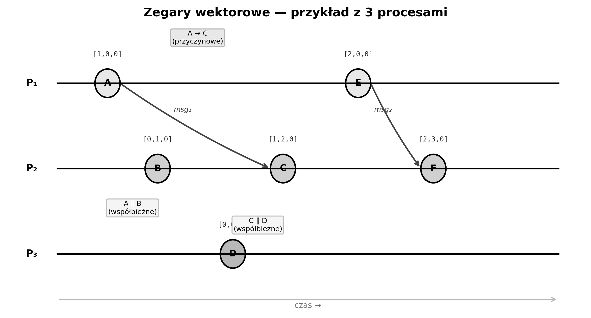

**Krok po kroku — pełna symulacja z 3 procesami (P₁, P₂, P₃):**

    Początek: V₁=[0,0,0], V₂=[0,0,0], V₃=[0,0,0]

    Krok 1: P₁ robi zdarzenie A
            V₁[1]++ → V₁=[1,0,0] → V(A) = [1,0,0]
            „P₁ wie o 1 swoim zdarzeniu, o P₂ i P₃ nic nie wie"

    Krok 2: P₂ robi zdarzenie B
            V₂[2]++ → V₂=[0,1,0] → V(B) = [0,1,0]
            „P₂ wie o 1 swoim zdarzeniu, o P₁ i P₃ nic nie wie"

    Krok 3: P₁ wysyła msg do P₂ (dołącza V₁=[1,0,0])
            P₂ odbiera: V₂ = max([0,1,0], [1,0,0]) = [1,1,0], potem V₂[2]++ = [1,2,0]
            Zdarzenie C (odbiór) → V(C) = [1,2,0]
            „P₂ teraz wie o 1 zdarzeniu P₁ (z msg), 2 swoich zdarzeniach, 0 o P₃"

    Krok 4: P₃ robi zdarzenie D
            V₃[3]++ → V₃=[0,0,1] → V(D) = [0,0,1]

**Teraz porównajmy — kto jest przed kim?**

    V(A)=[1,0,0] vs V(B)=[0,1,0]:
      Pozycja 1: 1 > 0 (A wygrywa)
      Pozycja 2: 0 < 1 (B wygrywa)
      → NIEPORÓWNYWALNE → A || B  (współbieżne!) ✓ (bo A i B były niezależne)

    V(A)=[1,0,0] vs V(C)=[1,2,0]:
      Pozycja 1: 1 ≤ 1 ✓
      Pozycja 2: 0 ≤ 2 ✓
      Przynajmniej jeden <: pozycja 2 → V(A) < V(C) → A → C ✓
      (bo C to odbiór msg od P₁, więc A przyczynowo wpłynęło na C)

    V(D)=[0,0,1] vs V(C)=[1,2,0]:
      Pozycja 1: 0 < 1 (C wygrywa), ale pozycja 3: 1 > 0 (D wygrywa)
      → NIEPORÓWNYWALNE → C || D ✓ (P₃ nie komunikował się z P₁/P₂)

**Formalne zasady porównywania wektorów:**

    V(a) < V(b) ⟺ ∀i: V(a)[i] ≤ V(b)[i]  AND  ∃j: V(a)[j] < V(b)[j]
    → Oznacza: a → b (a przyczynowo przed b)

    V(a) || V(b) ⟺ ¬(V(a) ≤ V(b)) ∧ ¬(V(b) ≤ V(a))
    → Oznacza: współbieżne (żaden nie „wie" wystarczająco o drugim)

**DLACZEGO V(a) < V(b) ⟺ a → b (równoważność DZIAŁA w obie strony)?**

Wektor niesie PEŁNĄ WIEDZĘ procesu o stanie systemu. Jeśli V(b) „wie" o wszystkim, co wie V(a), plus coś więcej — to znaczy, że informacja z a DOTARŁA do b (bezpośrednio lub pośrednio przez łańcuch wiadomości). Odwrotny kierunek: jeśli informacja z a NIE dotarła do b, to V(b) NIE będzie „wiedzieć" o a, więc będzie element, w którym V(b) < V(a) → wektory nieporównywalne → współbieżne.

Innymi słowy: wektor to „historia przyczynowa" — koduje WSZYSTKO, co dany proces widział. Dlatego porównanie wektorów daje PEŁNĄ informację o relacji między zdarzeniami.

Lamport tego nie potrafi, bo JEDNA liczba nie może zakodować N niezależnych historii.

---

**Porównanie Lamport vs Vector:**

    Cecha                  Lamport        Vector
    ───────────────────────────────────────────────
    Rozmiar per zdarzenie  O(1) (skalar)  O(N) (wektor)
    a→b ⟹ C(a)<C(b)       TAK            TAK
    C(a)<C(b) ⟹ a→b       NIE            TAK
    Wykrywa współbieżność  NIE            TAK

**Dlaczego Lamport NIE wykrywa współbieżności?**

Lamport kompresuje CAŁĄ historię do jednej liczby. To jak „kolejka w sklepie" — masz numerek 7, ktoś inny ma 8, ale nie wiesz, czy on przyszedł PO tobie, czy z innego wejścia (niezależnie). Jedna liczba nie koduje ŹRÓDŁA zdarzenia, tylko pewien porządek, który może być przypadkowy.

    P₁: A(C=1), B(C=2)     ← wewnętrzne zdarzenia P₁
    P₂: C(C=1), D(C=2)     ← wewnętrzne zdarzenia P₂ (niezależne od P₁!)

    Lamport widzi: C(A)=1 < C(D)=2 → „A przed D?"
    Ale NIE! A i D są WSPÓŁBIEŻNE — procesy działały niezależnie.
    Lamport zgubił tę informację, bo 1 < 2 nie implikuje związku przyczynowego.

**Dlaczego Vector Clock WSZYSTKO wykrywa?**

Vector przechowuje N liczb — osobną dla KAŻDEGO procesu. To jak „notatnik, w którym zapisujesz historię KAŻDEGO kolegi":

    V(A)=[1,0] → „wiem o 1 zdarzeniu P₁, 0 zdarzeniach P₂"
    V(D)=[0,2] → „wiem o 0 zdarzeniach P₁, 2 zdarzeniach P₂"

    Porównanie: pozycja 1 → 1>0 (A „wie więcej" o P₁)
                pozycja 2 → 0<2 (D „wie więcej" o P₂)
    → NIEPORÓWNYWALNE → A || D → WSPÓŁBIEŻNE! ✓

    Gdyby A wpłynęło na D (przez msg), to D wiedziałoby o zdarzeniach P₁
    → V(D)[1] ≥ 1 → ale V(D)[1]=0 → A NIE wpłynęło na D → współbieżne.

**Analogia: Lamport = jednokanałowe radio (słyszysz dźwięk, ale nie wiesz skąd). Vector = system GPS z N satelitami (dokładna pozycja przyczynowa w N-wymiarowej przestrzeni).**

---

**Porządek częściowy (partial order)** — relacja, w której nie wszystkie pary elementów są porównywalne. Happened-before to porządek częściowy: niektóre zdarzenia są współbieżne (nieporównywalne). Zegar wektorowy w pełni go reprezentuje.

**Porządek przyczynowy (causal order)** — wiadomości dostarczane w kolejności przyczynowej: jeśli wysłanie msg A → wysłanie msg B, to odbiorca widzi A przed B. Wymaga vector clocks.

**Version vectors / wektory wersji** — mechanizm replikacji danych w systemach rozproszonych (np. Amazon Dynamo). Każda replika utrzymuje wektor wersji obiektu. Przy konflikcie (wektory nieporównywalne = współbieżne zapisy) → system zwraca obie wersje do rozwiązania (siblings).

**Causal broadcast** — protokół rozsyłania wiadomości zachowujący porządek przyczynowy. Wiadomość B (zależna przyczynowo od A) jest dostarczana dopiero po A. Implementacja przez vector clocks.

---

### Problem: brak globalnego zegara w systemach rozproszonych (drift, opóźnienia)

### Relacja happened-before (→) — Lamport 1978
- a, b w jednym procesie, a przed b → a → b
- a = wysłanie msg, b = odbiór → a → b
- Przechodniość
- a || b (współbieżne) gdy ¬(a→b) ∧ ¬(b→a)

### Zegar Lamporta (skalarny)

Algorytm: przed zdarzeniem Cᵢ++; wysyłając dołącz Cᵢ; odbierając Cᵢ = max(Cᵢ, t) + 1.

| Właściwość                | Lamport |
|---------------------------|---------|
| a → b ⟹ C(a) < C(b)     | TAK     |
| C(a) < C(b) ⟹ a → b     | **NIE** |

### Zegary wektorowe

Każdy z N procesów ma wektor V[1..N]. Przed zdarzeniem: V[i]++; wysyłając dołącz V; odbierając: V[j] = max(V[j], T[j]) ∀j, potem V[i]++.

| Właściwość                    | Vector Clock |
|-------------------------------|-------------|
| a → b ⟺ V(a) < V(b)         | **TAK**     |
| Wykrycie współbieżności       | **TAK**     |

Porównanie: V ≤ W ⟺ ∀i: V[i] ≤ W[i]; V || W gdy ¬(V≤W) ∧ ¬(W≤V)

### Lamport: O(1) rozmiar, ale nie wykrywa współbieżności.
### Vector: O(N) rozmiar, ale pełna charakteryzacja happened-before.

### Zastosowania: replikacja (Dynamo — version vectors), causal broadcast, distributed debugging

### Etymologia

**Lamport** — Leslie Lamport (1978, „Time, Clocks, and the Ordering of Events..."); Turing Award 2013; twórca LaTeX-a! **Vector clocks** — Friedemann Mattern + Colin Fidge (niezależnie, 1988). **Happened-before** — Lamportowski termin; relacja częściowego porządku. **Dynamo** — Amazon (2007); wektory wersji do wykrywania konfliktów. **Causal broadcast** — „causal" od łac. „causa" = przyczyna; wiadomości dostarczane w porządku przyczynowym.

### Jak zapamiętać

- **Lamport = 1 liczba** — „wie że było wcześniej, ale nie wie czy współbieżnie"
- **Vector = wektor N liczb** — „każdy wie o każdym" → pełna informacja
- **V(a) < V(b) ⟺ a → b** — kluczowa równoważność vector clocks

\newpage

## PYTANIE 22: Modele spójności danych w systemach rozproszonych

**Silne i słabe modele spójności.**

---

### Tło pojęciowe — słowniczek

**Model (w informatyce)** — uproszczony, formalny opis zachowania systemu. Model definiuje REGUŁY: co system gwarantuje, a czego nie. Jak umowa/kontrakt — mówi programiście „na to możesz liczyć". W kontekście spójności: model opisuje jakie wyniki odczytów są dopuszczalne po zapisie.

    Model = kontrakt:
    "Jeśli zapiszesz x=5, to odczyt zwróci..."
    ...5 natychmiast?  (silny model)
    ...5 kiedyś?       (słaby model)
    ...3 albo 5?       (bardzo słaby model)

**Model spójności (consistency model)** — kontrakt między systemem rozproszonym a programistą, definiujący jakie GWARANCJE daje system dotyczące kolejności i widoczności operacji na danych. Każdy model odpowiada na pytanie: „Gdy węzeł A zapisze x=5, co i kiedy zobaczy węzeł B?"

Modele tworzą **spektrum** od silnych do słabych:

    Silne ←───────────────────────────────→ Słabe
    Linearizability → Sequential → Causal → Eventual

**Silny model spójności (strong consistency)** — system zachowuje się tak, jakby istniała JEDNA kopia danych. Każdy odczyt po zapisie zwraca najnowszą wartość. Gwarancja: programista nie musi myśleć o replikacji. Cena: wysoka latencja (węzły muszą się komunikować/uzgadniać przed odpowiedzią), niska dostępność przy partycjach sieciowych.

    Silny model:
    Klient A pisze x=5  →  [consensus: 3 węzły potwierdzają]  → OK
    Klient B czyta x    →  GWARANTOWANE: x=5 (natychmiast!)
    Koszt: ~10-100ms latencji na zapis (czeka na consensus)

**Słaby model spójności (weak consistency)** — system NIE gwarantuje, że odczyt po zapisie zwróci najnowszą wartość. Repliki mogą być chwilowo rozbieżne (stale data). Zaleta: niska latencja (odpowiedź natychmiast z lokalnej repliki), wysoka dostępność. Programista musi obsłużyć niespójności.

    Słaby model:
    Klient A pisze x=5  →  [zapis lokalny]  → OK (natychmiast!)
    Klient B czyta x    →  x=3 (stara wartość! replika nie zdążyła)
    ...po kilku sekundach...
    Klient B czyta x    →  x=5 (w końcu zsynchronizowane)
    Koszt: programista musi tolerować stale data

**Trade-off silny vs słaby:**

    Cecha              Silny (Linearizable)     Słaby (Eventual)
    ─────────────────────────────────────────────────────────────
    Latencja zapisu    wysoka (~10-100ms)        niska (~1ms)
    Latencja odczytu   wysoka (quorum read)      niska (lokalna replika)
    Dostępność         niska (wymaga quorum)     wysoka (lokalna odpowiedź)
    Poprawność         gwarantowana              programista musi obsłużyć
    Skalowanie         trudne (consensus)        łatwe (dodaj repliki)
    Przykłady          Spanner, Zookeeper        Cassandra, DNS, DynamoDB

---

**Spójność danych (consistency)** — gwarancja, że wszystkie węzły systemu rozproszonego widzą te same dane w przewidywalny sposób. Pytanie: gdy zapisuję na węzeł A, co odczyta węzeł B? Odpowiedź zależy od modelu spójności.

**Replikacja (replication)** — przechowywanie kopii danych na wielu węzłach. Cel: dostępność (awaria jednego → dane na innym), wydajność (odczyt z najbliższego). Problem: aktualizujesz jedną kopię — kiedy reszta się zsynchronizuje?

    Zapis na replice A: x = 5
    Replika B: x = ? (jeszcze 3? już 5?)
    Odpowiedź zależy od modelu spójności!

---

**Linearizability (linearyzowalność)** — najsilniejszy model. Każda operacja wygląda jakby nastąpiła atomowo w jednym momencie między jej wywołaniem a odpowiedzią. System zachowuje się jak JEDNA kopia danych. Wymaga consensus (np. Paxos, Raft) — kosztowna.

    Klient A pisze x=5 o 14:00:01, dostaje OK o 14:00:02
    Klient B czyta x o 14:00:01.5 → MUSI dostać 5 (bo zapis "nastąpił" gdzieś w 14:00:01-02)

Przykład: Google Spanner (zegary atomowe TrueTime).

**Sequential consistency (spójność sekwencyjna)** — globalny porządek operacji zgodny z porządkiem programu KAŻDEGO procesu. Ale NIE musi odpowiadać czasowi rzeczywistemu. Słabsza niż linearyzowalność.

    Proces A: write(x,1), write(x,2)
    Proces B: read(x)→2, read(x)→1  ← NIE OK (B widzi operacje A w złej kolejności)
    Proces B: read(x)→1, read(x)→2  ← OK (zgodne z kolejnością A)

---

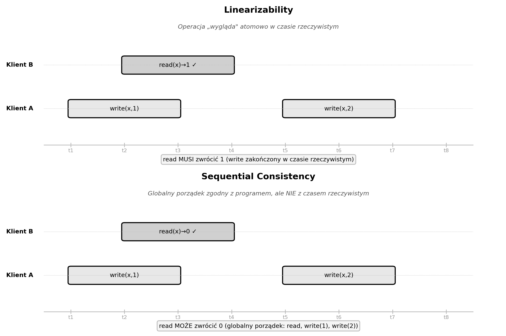

**KLUCZOWA RÓŻNICA: Linearizability vs Sequential Consistency — przykład:**

Wyobraź sobie rejestr x, dwa klienty A i B, i oś REALNEGO CZASU:

    Czas:     t₁────t₂────t₃────t₄────t₅────t₆
    Klient A: [──write(x,1)──]                     (start t₁, OK t₃)
    Klient B:            [──read(x)──]              (start t₂, odpowiedź t₄)
    Klient A:                          [──write(x,2)──]  (start t₅, OK t₆)

**Linearizability mówi:** Operacja read(x) klienta B ZACZĘŁA SIĘ (t₂) PO ROZPOCZĘCIU write(x,1) klienta A (t₁), i SKOŃCZYŁA SIĘ (t₄) PO ZAKOŃCZENIU write(x,1) (t₃). Więc operacje NIE nakładają się — read musi OBOWIĄZKOWO zwrócić x=1. Gdyby zwróciła coś innego (np. starą wartość x=0), naruszałoby to linearizability, bo w czasie rzeczywistym zapis już się zakończył.

**Sequential consistency mówi:** Musi istnieć JAKIŚ globalny porządek operacji, który jest zgodny z kolejnością programu klienta A (write(x,1) przed write(x,2)) i klienta B (read(x) w jego kolejności). ALE ten porządek NIE MUSI odpowiadać temu, co dzieje się w czasie rzeczywistym.

    Linearizability: read(x) o t₂-t₄ MUSI zobaczyć wynik write z t₁-t₃ → x=1 ✓
    Sequential:      system MOŻE ułożyć operacje jako: read(x)→0, write(x,1), write(x,2)
                     → read(x) zwraca 0 (starą wartość) → DOPUSZCZALNE!
                     Bo ten porządek jest „sekwencyjnie spójny" — po prostu read
                     jest w globalnej kolejności PRZED write, mimo że w zegarku ściennym
                     nakładały się czasowo.

**Jeszcze prościej — analogia kina:**
- **Linearizability** = film NA ŻYWO: jeśli gol padł o 14:00, to widzowie w tym momencie MUSZĄ go zobaczyć.
- **Sequential consistency** = film NAGRANY i emitowany z opóźnieniem: kolejność scen jest zachowana, ale nie odpowiada czasowi rzeczywistemu. Widzisz gol, potem korner — w poprawnej kolejności, ale nie wiesz KIEDY naprawdę się wydarzyły.

---

**Causal consistency (spójność przyczynowa)** — operacje przyczynowo zależne widziane w tej samej kolejności przez wszystkich. Operacje współbieżne (niezależne) mogą być widziane w różnej kolejności. Wymaga vector clocks.

    A pisze x=1 → B czyta x(=1) → B pisze y=2
    Przyczynowość: write(x,1) → write(y,2)
    Każdy musi widzieć write(x,1) PRZED write(y,2)

**Session guarantees (gwarancje sesji):**
- **Read Your Writes** — jeśli zapisałem x=5, mój następny odczyt zobaczy 5 (nie starą wartość)
- **Monotonic Reads** — odczyty nie „cofają się w czasie" (jeśli widziałem x=5, nie zobaczę x=3)
- **Monotonic Writes** — moje zapisy są stosowane w kolejności
- **Writes Follow Reads** — jeśli przeczytałem x i na tej podstawie zapisałem y, inni widzą x przed y

**Eventual consistency (spójność ostateczna)** — najsłabszy model. Jeśli przestaniesz pisać, KIEDYŚ wszystkie odczyty zwrócą tę samą wartość. Ale „kiedyś" może trwać sekundy lub minuty! Najszybszy i najskalowalniejszy. Przykłady: DNS, Cassandra.

    Zapis x=5 na replice A
    Replika B: jeszcze x=3... x=3... [replikacja]... x=5 ← w końcu!

**Dlaczego DNS to przykład eventual consistency?**

DNS (Domain Name System) tłumaczy nazwy domen (np. google.com) na adresy IP. Jest MASYWNIE rozproszony — tysiące serwerów DNS na świecie, każdy z własną kopią (cache). Gdy zmienisz rekord DNS (np. google.com → nowy IP), co się dzieje:

    Krok 1: Admin zmienia rekord na AUTHORITATIVE server: google.com → 142.250.80.46
    Krok 2: Authoritative server ma nową wartość NATYCHMIAST
    Krok 3: Ale tysiące serwerów DNS na świecie mają STARY cache!
            → ISP DNS w Warszawie: google.com → 142.250.80.14 (stary, z cache)
            → ISP DNS w Tokio: google.com → 142.250.80.14 (stary)
            → Google Public DNS: google.com → 142.250.80.14 (stary)
    Krok 4: Cache ma TTL (Time To Live), np. 300 sekund = 5 minut
            Po upływie TTL, serwer DNS pyta authoritative → dostaje nowy IP
    Krok 5: STOPNIOWO, jeden po drugim, serwery DNS aktualizują cache
            Po ~24-48h → WSZYSTKIE serwery mają nową wartość

    To jest EVENTUAL CONSISTENCY:
    - Brak silnej gwarancji: w t=0 różni klienci widzą RÓŻNE IP
    - „Kiedyś" się zsynchronizuje: po TTL + propagacja
    - Kompromis: SZYBKOŚĆ (cache, brak czekania na consensus) vs NIESPÓJNOŚĆ (stale data)
    - Gdyby DNS był linearizable, każde zapytanie DNS musiałoby pytać
      authoritative server → 100-300ms latencji zamiast <1ms z cache → internet byłby WOLNY

---

**CAP Theorem (twierdzenie Brewera)** — w systemie rozproszonym przy partycji sieciowej (P) musisz wybrać między Consistency (C) a Availability (A):
- **CP** — spójny, ale niedostępny przy partycji (np. HBase, Spanner)
- **AP** — dostępny, ale niespójny przy partycji (np. Cassandra, DynamoDB)
- Bez partycji możesz mieć oba. Ale partycje SĄ nieuniknione w sieci.

    Partycja = węzły A i B nie mogą się komunikować
    CP: odmów operacji (niedostępny) → zachowaj spójność
    AP: wykonaj operację (dostępny) → ryzykuj niespójność

---

**Consensus (uzgadnianie)** — protokół, w którym rozproszone węzły zgadzają się na jedną wartość pomimo awarii. Kluczowy dla linearyzowalności. Algorytmy: Paxos (Lamport), Raft (prostszy), Zab (Zookeeper).

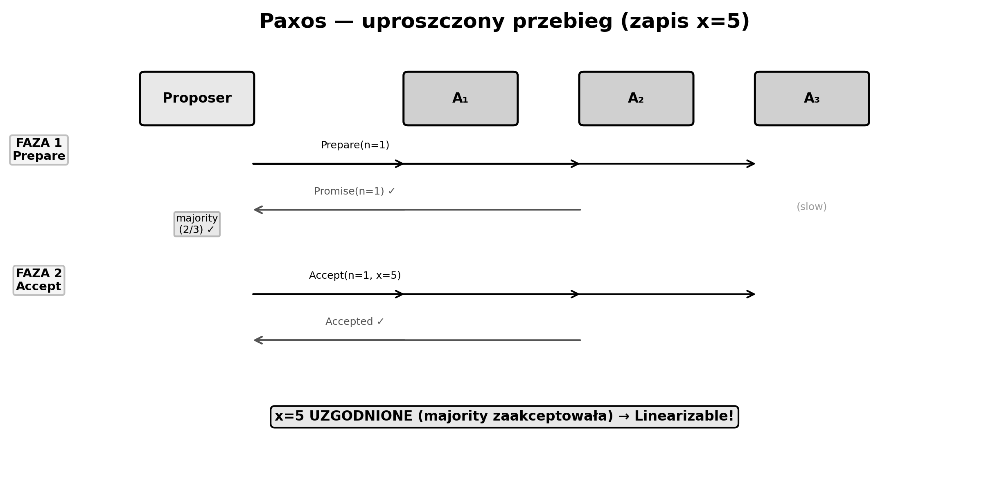

**Jak działa Paxos — uproszczony walkthrough (dlaczego daje linearyzowalność):**

Paxos ma 3 role: **Proposer** (proponuje wartość), **Acceptor** (głosuje), **Learner** (dowiaduje się wyniku). Typowo 3-5 acceptorów (nieparzyste). Protokół ma 2 fazy:

    FAZA 1: PREPARE — „Czy mogę zaproponować?"
    Proposer → wysyła Prepare(n) do WSZYSTKICH acceptorów (n = numer propozycji, rosnący)
    Acceptor → jeśli n > każdy wcześniejszy n, odpowiada Promise(n) + ewentualnie wcześniej
               zaakceptowaną wartość. Jeśli n mniejszy — ignoruje.

    FAZA 2: ACCEPT — „Zaakceptujcie tę wartość!"
    Proposer → jeśli dostał Promise od MAJORITY (np. 2 z 3), wysyła Accept(n, wartość)
    Acceptor → jeśli nie obiecał wyższego n, akceptuje → wartość UZGODNIONA

    Przykład: 3 acceptory (A₁, A₂, A₃), proposer chce zapisać x=5

    Proposer  ──Prepare(1)──→  A₁: Promise(1) ✓
                               A₂: Promise(1) ✓  ← majority (2/3)!
                               A₃: (wolny, nie odpowiedział)

    Proposer  ──Accept(1, x=5)──→  A₁: Accepted ✓
                                    A₂: Accepted ✓  ← majority!
    → x=5 jest UZGODNIONE. Każdy przyszły odczyt MUSI zwrócić 5.

**Dlaczego to daje linearyzowalność?** Bo zapis x=5 jest „zacommitowany" dopiero gdy MAJORITY potwierdzi. Odczyt też musi odpytać majority → co najmniej 1 acceptor wie o x=5 (bo majority zapisu i majority odczytu OVERLAPują się — kworum). Dlatego odczyt ZAWSZE widzi najnowszą wartość.

    W + R > N → overlap gwarantowany
    W=2, R=2, N=3: zapis potwierdza 2, odczyt pyta 2 → min. 1 wspólny acceptor

**Quorum** — minimalna liczba węzłów, które muszą potwierdzić operację.

    N = liczba replik, W = quorum zapisu, R = quorum odczytu
    W + R > N → gwarantuje odczyt najnowszej wartości
    Np. N=3, W=2, R=2: zawsze przynajmniej 1 wspólna replika

**CRDTs (Conflict-free Replicated Data Types)** — struktury danych, które automatycznie zbiegają do spójnego stanu bez koordynacji. Matematycznie gwarantują brak konfliktów. Przykłady: G-Counter (grow-only counter), OR-Set (observed-remove set). Idealne dla eventual consistency.

**LWW (Last-Writer-Wins)** — prosty mechanizm rozwiązywania konfliktów: wygrywa zapis z najnowszym timestampem. Problem: wymaga zsynchronizowanych zegarów i może tracić dane.

---

### Spektrum (od silnego do słabego)

    Linearizability → Sequential → Causal → Session → Eventual

### Silne modele

**Linearizability:** Każda operacja wygląda atomowo w momencie między wywołaniem a odpowiedzią. Najsilniejsza. „Globalny czas rzeczywisty." Kosztowna (consensus). Przykład: Spanner.

**Sequential Consistency:** Globalny porządek operacji zgodny z porządkiem programu każdego procesu, ale NIE z czasem rzeczywistym. Przykład: Zookeeper.

### Słabe modele

**Causal Consistency:** Operacje przyczynowo zależne widziane w tej samej kolejności. Niezależne mogą być w różnej. Wymaga vector clocks. Przykład: MongoDB.

**Session Guarantees:** Read Your Writes, Monotonic Reads, Monotonic Writes, Writes Follow Reads.

**Eventual Consistency:** Jeśli brak nowych zapisów, ostatecznie wszystkie odczyty zwrócą tę samą wartość. Najsłabszy, najszybszy. Przykład: DNS, Cassandra.

### CAP Theorem: Consistency + Availability + Partition tolerance — wybierz 2 (w obecności partycji: C lub A).

### Rozwiązywanie konfliktów: LWW (Last-Writer-Wins), Siblings (multi-value), **CRDTs** (automatycznie zbieżne struktury).

### Etymologia

**Linearizability** — Maurice Herlihy + Jeannette Wing (1990); łac. „linearis" = w linii. **Sequential consistency** — Leslie Lamport (1979). **Causal consistency** — Ahamad et al. (1995); łac. „causa" = przyczyna. **CAP** — Eric Brewer (UC Berkeley, 2000, „Brewer's conjecture"); udowniony przez Gilbert & Lynch (2002). **CRDTs** — Conflict-free Replicated Data Types (Marc Shapiro et al., 2011). **Quorum** — łac. „of whom" = minimalna liczba głosów (z prawa rzymskiego).

### Jak zapamiętać

- **Linearizable = „natychmiast, atomowo, jak 1 kopia"**
- **Eventual = „kiedyś się zsynchronizuje" (ale kiedy?)**
- **CAP = „Partition → wybierz C albo A"**
- **Quorum: W+R > N** gwarantuje odczyt najnowszej wartości

\newpage

## PYTANIE 23: Segmentacja obrazu

**Problem, strategie klasyczne i sieci neuronowe.**

---

### Tło pojęciowe — słowniczek

**Obraz cyfrowy (digital image)** — macierz pikseli. Obraz 1920×1080 = ~2 mln pikseli. Każdy piksel ma wartość (grayscale: 0-255) lub kanały RGB (3 × 0-255). Segmentacja operuje na tej macierzy.

**Piksel (pixel)** — najmniejsza jednostka obrazu. „Picture element." Segmentacja = przypisanie etykiety KAŻDEMU pikselowi.

**Segmentacja obrazu (image segmentation)** — podział obrazu na regiony, gdzie każdy piksel dostaje etykietę klasy (np. „samochód", „droga", „niebo"). Różni się od klasyfikacji (cały obraz → 1 etykieta) i detekcji (bounding box + etykieta).

**Czy naprawdę KAŻDY piksel?** Tak, w semantic segmentation wynik to mapa o IDENTYCZNYM rozmiarze jak obraz wejściowy. Obraz 640×480 → mapa 640×480, w której KAŻDY z 307 200 pikseli ma etykietę klasy. Żaden piksel nie jest pominięty. Nawet piksele „tła" dostają etykietę (np. klasa „background" lub „void"). W instance segmentation dodatkowo piksele tego samego obiektu dostają ten sam ID instancji.

    Obraz wejściowy:        640 × 480 pikseli (RGB, 3 kanały)
    Mapa segmentacji:       640 × 480 pikseli (1 kanał — numer klasy)
    Piksel (100, 200):      RGB=(134, 178, 210) → klasa 3 ("niebo")
    Piksel (320, 400):      RGB=(82, 79, 73)    → klasa 7 ("droga")
    KAŻDY piksel ma etykietę — nawet ten "nudny" fragment tła.

---

**Over-segmentation (nad-segmentacja)** — sytuacja, gdy algorytm segmentacji generuje ZBYT WIELE regionów — więcej niż jest obiektów/klas na obrazie. Jeden obiekt zostaje podzielony na kilka-kilkadziesiąt fragmentów. Problem typowy dla metod klasycznych (watershed, region growing).

    Obraz: jeden kubek na stole
    Idealna segmentacja: 2 regiony (kubek, tło)
    Over-segmentation:  47 regionów! (kubek podzielony na 12 kawałków,
                        stół na 20, tło na 15)

    Dlaczego to się dzieje?
    - Watershed: każde lokalne minimum jasności → osobny region → setki regionów
    - Region Growing: drobne różnice w intensywności → osobne regiony
    - Szum (noise) w obrazie → fałszywe granice

    Jak sobie z tym radzić?
    - **Markers/seeds:** zamiast automatycznych minimów → podaj ręczne punkty startowe
    - **Superpixels:** celowa nad-segmentacja na ~100-500 jednorodnych "superpikseli"
      (np. SLIC), potem GRUPOWANIE superpikseli w klasy → szybsze i stabilniejsze
    - **Hierarchiczne:** wielopoziomowa segmentacja → scalanie regionów bottom-up
    - **Deep learning:** sieci neuronowe uczą się "co jest obiektem" z danych → nie mają
      problemu z over-segmentation (bo wiedzą, że kubek to jeden obiekt)

**Under-segmentation (pod-segmentacja)** — przeciwieństwo: zbyt mało regionów, różne obiekty zlane w jeden region. Mniej typowy problem.

---

**Typy segmentacji:**

**Semantic segmentation** — każdy piksel → klasa, ale NIE rozróżnia instancji. Wszystkie samochody = jedna klasa „samochód".

    [samochód][samochód][droga][droga][pieszo][niebo]
    Dwa samochody = ta sama etykieta "samochód"

**Instance segmentation** — rozróżnia instancje tego samego obiektu. Samochód#1 i Samochód#2 mają różne etykiety.

**Panoptic segmentation** — łączy semantic + instance. Obiekty „things" (samochody, ludzie) mają instancje; „stuff" (niebo, droga) — tylko klasy.

---

#### Pojęcia kluczowe dla progowania i Otsu

**Wariancja (variance, σ²)** — miara tego, jak bardzo wartości RÓŻNIĄ SIĘ od swojej średniej. Im większa wariancja, tym bardziej „rozrzucone" są dane. Wzór: σ² = Σ(xᵢ - μ)² / n, gdzie μ to średnia.

    Przykład 1 — MAŁA wariancja (dane skupione):
    wartości: [48, 50, 52, 49, 51]     średnia μ = 50
    σ² = ((48-50)² + (50-50)² + (52-50)² + (49-50)² + (51-50)²) / 5
       = (4 + 0 + 4 + 1 + 1) / 5 = 2.0

    Przykład 2 — DUŻA wariancja (dane rozrzucone):
    wartości: [10, 90, 30, 80, 50]     średnia μ = 52
    σ² = ((10-52)² + (90-52)² + (30-52)² + (80-52)² + (50-52)²) / 5
       = (1764 + 1444 + 484 + 784 + 4) / 5 = 896.0

    Mała σ² = punkty blisko średniej = dane JEDNORODNE
    Duża σ² = punkty daleko od średniej = dane RÓŻNORODNE

**Wewnątrzklasowa (within-class)** — „wewnątrz klasy" oznacza, że mierzymy wariancję OSOBNO dla każdej grupy (klasy), a potem ważymy wynik proporcją pikseli w grupie. Jeśli klasa 0 ma piksele [30, 50, 45] a klasa 1 ma piksele [180, 200, 190], to σ²_wewnątrz = (udział_kl0 × σ²_kl0) + (udział_kl1 × σ²_kl1).

**Wariancja wewnątrzklasowa (within-class variance)** — obliczasz wariancję KAŻDEJ klasy osobno, ważysz przez udział pikseli w tej klasie, sumujesz. Jeśli σ²_wewnątrz jest MAŁA → klasy są „jednorodne" (piksele w klasie 0 mają podobne jasności, piksele w klasie 1 też).

**Co to znaczy „klasy jednorodne"?** — jednorodna klasa to taka, w której WSZYSTKIE piksele mają podobne wartości. Np. klasa „tło" ma jasności [195, 200, 198, 205] → jednorodna (σ² mała). Klasa mieszająca tło i obiekt [30, 200, 50, 190] → niejednorodna (σ² duża). Otsu szuka progu T, który daje NAJBARDZIEJ jednorodne klasy.

**Histogram bimodalny (bimodal histogram)** — histogram z DWOMA wyraźnymi „garbami" (pikami). „Bi" = dwa, „modal" = moda (najczęstsza wartość). Typowy dla obrazów z jednym obiektem na tle — garb 1 odpowiada ciemnym pikselom (obiekt), garb 2 jasnym (tło). Otsu działa TYLKO gdy histogram jest bimodalny — bo szuka progu MIĘDZY garbami.

    Garb 1 (ciemne~60): piksele obiektu
    Garb 2 (jasne~190): piksele tła
    Dolina między garbami → tu Otsu stawia próg T!

    Gdyby histogram miał JEDEN garb (unimodalny) → brak naturalnego
    podziału → Otsu wybierze losowy próg → słaby wynik.

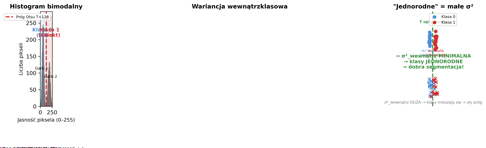

---

**Thresholding (progowanie)** — najprostsza metoda segmentacji. Pomysł: każdy piksel ma wartość jasności (0=czarny, 255=biały). Wybierz PRÓG T: piksel > T → klasa 1 (obiekt), piksel ≤ T → klasa 0 (tło). Działa lepiej niż się wydaje na prostych obrazach (tekst na kartce, RTG, dokumenty).

    Obraz (jasność pikseli): [50][200][180][30][220][190]
    Próg T=128:
    50 ≤ 128 → 0 (tło)
    200 > 128 → 1 (obiekt)
    180 > 128 → 1
    30 ≤ 128 → 0
    Wynik:                   [ 0 ][ 1 ][ 1 ][ 0][ 1 ][ 1 ]

    Problem: JAK wybrać T? Ręcznie → subiektywne. Rozwiązanie → Otsu.

    Mnemonik: „PRÓG na bramce" — jak bramkarz, przepuszcza piksele jaśniejsze od T,
    blokuje ciemniejsze.

**Otsu** — automatyczny dobór progu. Algorytm: przetestuj WSZYSTKIE progi T=0..255, dla każdego oblicz wariancję wewnątrzklasową (jak „różnorodne" są piksele w klasie 0 i klasie 1). Wybierz T minimalizujące tę wariancję = klasy jak najbardziej jednorodne. Złożoność: O(n·L) gdzie n=piksele, L=poziomy jasności (256). Ograniczenie: działa TYLKO dla 2 klas i zakłada bimodalny histogram jasności (dwa „garby"). Patrz diagram powyżej.

    Pseudokod Otsu:
    best_T = 0
    min_var = ∞
    for T in 0..255:
        c0 = piksele z jasność ≤ T
        c1 = piksele z jasność > T
        w0 = len(c0) / len(all_pixels)
        w1 = len(c1) / len(all_pixels)
        var = w0 * variance(c0) + w1 * variance(c1)
        if var < min_var:
            min_var = var
            best_T = T
    return best_T

    Mnemonik: „AUTO-bramkarz Otsu" — sam sprawdza 256 progów i wybiera najlepszy.

---

#### Pojęcia kluczowe dla Region Growing

**Region Growing (rozrastanie regionu)** — zaczynasz od jednego piksela „ziarna" (seed) wybranego ręcznie lub automatycznie. Sprawdzasz sąsiadów: jeśli sąsiad jest PODOBNY (np. |jasność_sąsiada - jasność_regionu| < próg), dodaj go do regionu. Powtarzaj aż nie ma więcej podobnych sąsiadów. Następnie nowy seed → nowy region.

**Dlaczego seed „ręcznie LUB automatycznie"?** — to dwa różne scenariusze użycia:

    RĘCZNY seed:
    - Użytkownik klika myszką na obraz: „tu jest obiekt"
    - Użycie: segmentacja interaktywna (Photoshop „magic wand",
      narzędzia medyczne do zaznaczania guzów na RTG)
    - Zaleta: precyzyjny, użytkownik wie co chce segmentować
    - Wada: wymaga człowieka → nie skaluje się do 10 000 obrazów

    AUTOMATYCZNY seed — metody:
    1. Siatka (grid): seed co N pikseli (np. co 50 px na obrazie 500×500 → 100 seedów)
    2. Lokalne ekstrema histogramu: znajdź najczęstszą jasność → seed tam
    3. Losowanie: wylosuj K punktów jako seedy
    4. Analiza gradientu: piksele w „płaskich" regionach (brak krawędzi) → dobre seedy

    Dlaczego OR a nie AND?
    Bo to ALTERNATYWNE podejścia — albo człowiek wybiera (mało i precyzyjnie),
    albo algorytm wybiera (dużo i szybko, ale mniej precyzyjnie).

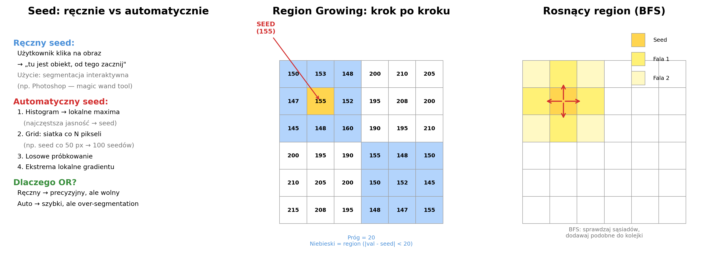

    Pseudokod Region Growing:
    region = {seed}
    queue = [seed]
    while queue not empty:
        pixel = queue.pop()
        for neighbor in pixel.neighbors():  # 4 lub 8 sąsiadów
            if neighbor not visited AND similar(neighbor, region):
                region.add(neighbor)
                queue.append(neighbor)

    Mnemonik: „PLAMA atramentu" — seed to kropla atramentu na papierze,
    rozlewa się na podobne (jasne) miejsca, zatrzymuje się na granicach.

---

#### Pojęcia kluczowe dla Watershed

**Watershed (metoda zlewiska)** — traktuje obraz jak mapę topograficzną: wartość jasności piksela = wysokość terenu. Ciemne piksele = doliny, jasne = szczyty. Algorytm „zalewa" mapę wodą od najniższych punktów (minimów). Gdy woda z dwóch dolin się spotyka — tam jest GRANICA segmentu (grań).

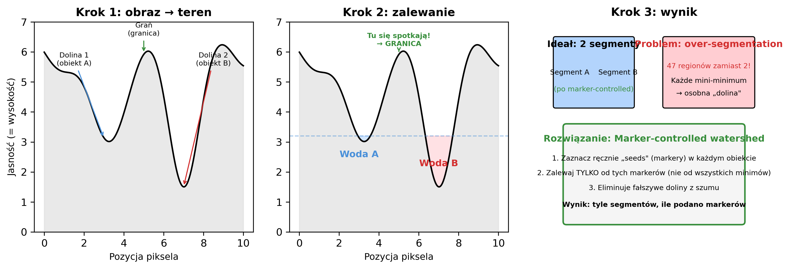

    Algorytm:
    1. Zamień obraz na „mapę wysokości" (jasność = wysokość)
    2. Znajdź wszystkie lokalne minima (najciemniejsze punkty)
    3. „Zalewaj" od minimów — woda rośnie równomiernie
    4. Gdy woda z dwóch dolin się spotyka → postaw TAMĘ (granicę segmentu)
    5. Kontynuuj aż cały obraz zalany

    Problem: MASYWNA over-segmentation — każde lokalne minimum (nawet szum!) → osobna dolina
    Rozwiązanie: marker-controlled watershed — użytkownik podaje markery (seedy),
    zalewamy TYLKO od tych markerów

    Mnemonik: „ZALEWANIE terenu" — wyobraź sobie model terenu z plasteliny w wannie.
    Powoli nalewasz wodę → doliny się wypełniają → granie gór = granice segmentów.

---

#### Pojęcia kluczowe dla Mean Shift

**Okno (window) / jądro (kernel)** — w kontekście Mean Shift to koło (lub kula w wielowymiarowej przestrzeni) o ustalonej szerokości (bandwidth = promień h) wokół aktualnego punktu. Wewnątrz okna algorytm oblicza „średnią ważoną" pozycji pikseli. Okno = jądro — to synonim. Nazwa „jądro" pochodzi od estymacji jądrowej gęstości (kernel density estimation, KDE).

    Okno o promieniu h = 30 wokół punktu (100, 150):
    Bierze WSZYSTKIE piksele, których cechy (jasność, x, y)
    są w odległości ≤ 30 od (100, 150).
    Oblicza ich średnią → przesuwa okno NA TĘ ŚREDNIĄ.
    Powtarza aż okno się „zatrzyma" (przesunięcie < ε).

**Najwyższa gęstość (density peak)** — punkt w przestrzeni cech, gdzie jest NAJWIĘKSZE skupisko pikseli. Jak najwyższy szczyt góry w 3D. Mean Shift = „przesuń w kierunku średniej" → iteracyjnie zbliża się do szczytu gęstości.

**Przestrzeń cech (feature space)** — każdy piksel jest opisany nie tylko pozycją (x, y) ale też cechami koloru (jasność, R, G, B). Przestrzeń cech to przestrzeń wielowymiarowa, np. (R, G, B, x, y) = 5 wymiarów. Piksele o podobnych kolorach i blisko siebie będą blisko w przestrzeni cech → tworzą klastry (skupiska).

    Piksel A: (x=100, y=200, R=30, G=25, B=35)  → punkt w 5D
    Piksel B: (x=102, y=201, R=32, G=27, B=33)  → BLISKO A w 5D
    Piksel C: (x=105, y=198, R=200, G=210, B=220)  → DALEKO od A w 5D (inny kolor!)
    → A i B w jednym segmencie, C w innym

**Dlaczego Mean Shift NIE wymaga podania liczby segmentów?** — W K-means musisz podać K=3 (trzy klastry) ZANIM uruchomisz algorytm. Mean Shift działa inaczej: każdy piksel startuje i „toczy się" do najbliższego szczytu gęstości. Ile jest szczytów = tyle segmentów. Algorytm sam ODKRYWA liczbę klastrów. Parametrem jest tylko bandwidth (szerokość okna h): duże h → mało szczytów → mało segmentów; małe h → dużo szczytów → dużo segmentów.

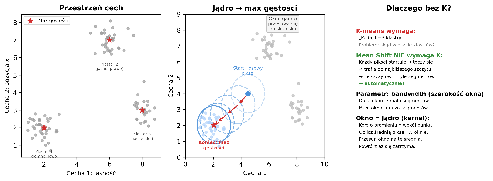

    Pseudokod Mean Shift:
    for each pixel p:
        x = p.features  # np. (R, G, B, pos_x, pos_y)
        repeat:
            window = all pixels within distance h from x
            x_new = weighted_mean(window)
            if |x_new - x| < epsilon:
                break
            x = x_new
        p.cluster = x  # zbieżny punkt = ID klastra

    Mnemonik: „KULKI toczą się do dołków" — rozsyp kulki na nierównym stole,
    każda toczy się do najbliższego zagłębienia. Ile dołków = tyle segmentów.

---

#### Pojęcia kluczowe dla Normalized Cuts

**Cięcie grafu (graph cut)** — graf to zbiór węzłów (pikseli) połączonych krawędziami (z wagami = podobieństwo). „Ciąć graf" to znaleźć LINIĘ dzielącą węzły na grupy, tak aby krawędzie „przecięte" tą linią miały niską wagę (= łączyły niepodobne piksele), a krawędzie wewnątrz grup miały wysoką wagę (= łączyły podobne piksele).

**Jak szukamy cięcia?** — Naiwnie: sprawdź WSZYSTKIE możliwe podziały → wykładnicza złożoność. Normalized Cuts zamienia problem na rozwiązanie „problemu wartości własnych" (eigenvalue problem) macierzy Laplacianu grafu. Drugi najmniejszy wektor własny wskazuje, które piksele należą do grupy A (wartości dodatnie) a które do B (wartości ujemne).

**Dlaczego „znormalizowane" (normalized)?** — Zwykłe cięcie (min-cut) ma wadę: preferuje odcinanie MALUTKICH grup (1 piksel odcięty = małe cięcie). Normalizowanie dzieli koszt cięcia przez rozmiar grup → duże, zrównoważone segmenty.

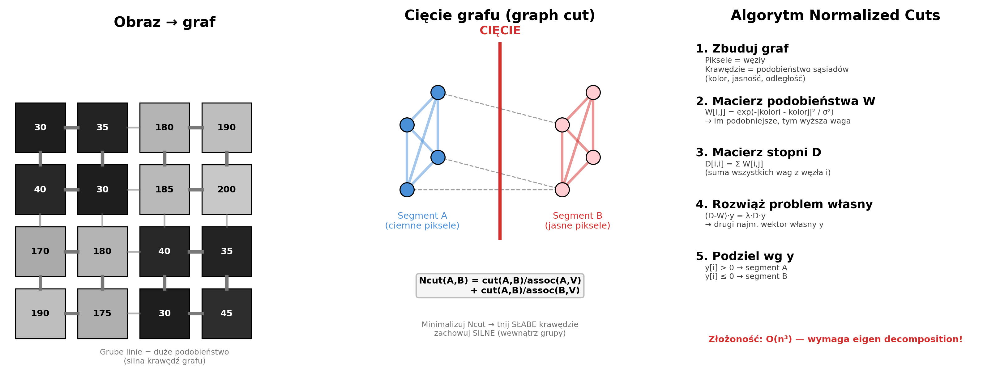

    Pseudokod Normalized Cuts (uproszczony):
    # 1. Zbuduj macierz podobieństwa W
    for each pair of pixels (i, j):
        W[i,j] = exp(-|color_i - color_j|^2 / sigma^2)  # jeśli sąsiedzi
        W[i,j] = 0                                        # jeśli odlegli

    # 2. Macierz stopni D
    D = diag(sum(W, axis=1))  # D[i,i] = suma wiersza i

    # 3. Rozwiąż problem wartości własnych
    (D - W) * y = lambda * D * y
    # Weź DRUGI najm. wektor własny y (pierwszy = trywialny)

    # 4. Podziel piksele
    segment_A = {i : y[i] > 0}
    segment_B = {i : y[i] <= 0}

    Mnemonik: „CIĘCIE sznurków" — piksele połączone sznurkami (mocne = podobne).
    Tnij SŁABE sznurki → dwie grupy. Normalizacja = nie odcinaj samotnych pikseli.

---

#### Pojęcia kluczowe dla sieci neuronowych

**ReLU (Rectified Linear Unit)** — najpopularniejsza funkcja aktywacji w sieciach neuronowych. Wzór: ReLU(x) = max(0, x). Jeśli wejście jest ujemne → wynik = 0 (neuron „milczy"). Jeśli wejście jest dodatnie → wynik = x (neuron „przepuszcza" sygnał bez zmiany). Prosta, ale bardzo skuteczna — szybsza od starszych funkcji (sigmoid, tanh), bo nie wymaga obliczania exp().

    ReLU(-3) = max(0, -3) = 0    ← neuron „wyłączony"
    ReLU(0)  = max(0, 0)  = 0    ← na granicy
    ReLU(2.5) = max(0, 2.5) = 2.5 ← neuron „włączony", przekazuje 2.5

    Dlaczego nie po prostu f(x) = x (bez progu)?
    Bo liniowość → cała sieć = jedna warstwa liniowa (tracisz głębokość).
    ReLU jest NIELINIOWA (ma „zakręt" w 0) → pozwala sieci uczyć się
    skomplikowanych wzorców.

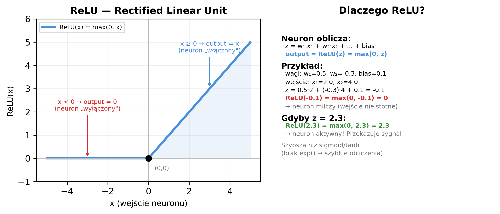

**Iloczyn skalarny (dot product)** — operacja na dwóch wektorach (listach liczb) dająca JEDNĄ liczbę. Mnożysz odpowiednie elementy parami i sumujesz wyniki. W CNN konwolucja = iloczyn skalarny filtra × fragment obrazu. Duży wynik = wektory „podobne" (filtr pasuje do fragmentu).

    a = [1, 3, -2]     b = [4, -1, 5]
    a · b = 1·4 + 3·(-1) + (-2)·5 = 4 - 3 - 10 = -9

    W konwolucji:
    filtr = [-1, 0, 1, -1, 0, 1, -1, 0, 1]  (spłaszczony 3×3)
    fragment = [50, 50, 200, 50, 50, 200, 50, 50, 200]
    dot = (-1)·50 + 0·50 + 1·200 + ... = 450 → duży = krawędź!

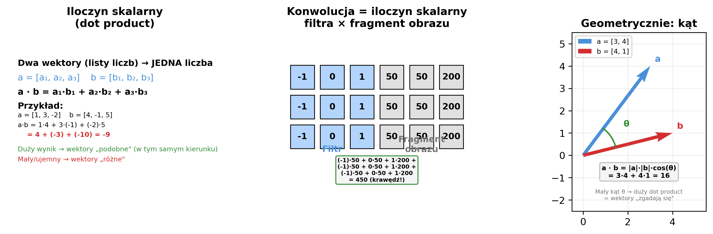

---

**Warstwa Fully Connected (FC, gęsta, dense)** — warstwa, w której KAŻDY neuron jest połączony z KAŻDYM wejściem. Obraz 7×7×512 (po konwolucjach) = 25 088 wartości. FC z 4096 neuronami = 25 088 × 4 096 = **~103 miliony wag**. Wady: (1) wymaga STAŁEGO rozmiaru wejścia (zawsze 7×7×512), (2) traci informację GDZIE coś jest (spłaszcza przestrzeń na wektor 1D).

**Konwolucja (convolution)** — operacja przesuwania małego filtra (np. 3×3) po obrazie. W każdej pozycji oblicza iloczyn skalarny filtra × fragment obrazu → jedną liczbę. TE SAME wagi filtra użyte w KAŻDEJ pozycji → dzielenie parametrów. Zachowuje informację przestrzenną (GDZIE coś jest).

**Conv 1×1 (konwolucja punktowa)** — filtr o rozmiarze 1×1 pikseli. „Patrzy" na JEDEN piksel, ale WSZYSTKIE kanały (np. 512). Działa jak FC, ale OSOBNO dla KAŻDEGO piksela → zachowuje mapę H×W. FCN zamienia FC na Conv 1×1: zamiast spłaszczyć 7×7×512 → 25 088 → FC, robi Conv1×1 na KAŻDYM z 7×7 pikseli × 512 kanałów → mapa 7×7×C (C = liczba klas).

**Jak FCN zamienia FC na Conv 1×1?** — Klasyczny CNN: ostatnia mapa cech 7×7×512 → FLATTEN → wektor 25 088 → FC → 1000 klas → „to jest kot". FCN: ostatnia mapa cech H×W×512 → Conv1×1(512→C) → mapa H×W×C → upsample do pełnej rozdzielczości. Kluczowa różnica: NIE spłaszczamy → możemy przetwarzać obraz o DOWOLNYM rozmiarze.

**Skip connections z encodera** — w encoder-decoder encoder zmniejsza obraz (pooling): 224→112→56→28→14. W tym procesie traci DETALE przestrzenne (dokładne krawędzie). Skip connections = „drogi na skróty" — cechy z wczesnych warstw encodera (pełne detali) są przekazywane WPROST do odpowiednich warstw decodera. Decoder wie CO i GDZIE.

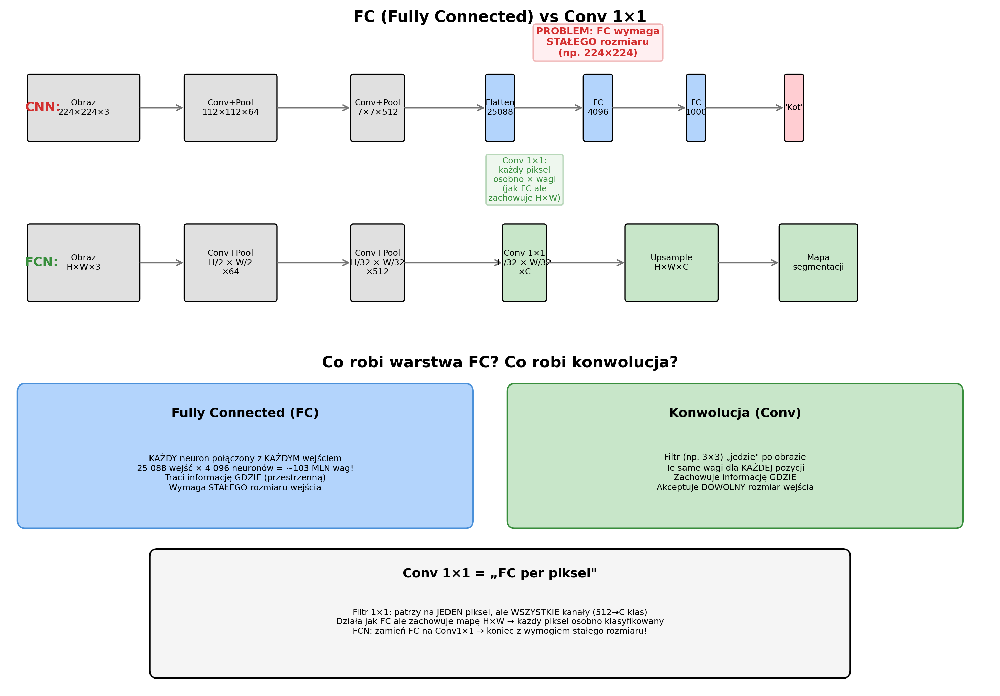

---

**U-Net — dlaczego kształt „U"?** — Narysuj architekturę: encoder zmniejsza rozdzielczość (bloki idą w DÓŁ po lewej stronie), bottleneck jest na dole, decoder zwiększa rozdzielczość (bloki idą W GÓRĘ po prawej stronie). Wizualnie tworzy literę „U". „Encoder schodzi w dół" = każda warstwa encodera ma MNIEJSZĄ rozdzielczość (224→112→56→28), wizualizowane jako bloki o malejącym rozmiarze ułożone jeden pod drugim.

**Concatenation (konkatenacja, złączenie)** — operacja „sklejania" dwóch tensorów wzdłuż osi kanałów. Jeśli encoder na poziomie 2 daje mapę 128×128×64 kanałów, a decoder na poziomie 2 daje mapę 128×128×64 kanałów, to concatenation = 128×128×**128** kanałów (64+64). Różni się od DODAWANIA (addition), które daje 128×128×64 (element-wise sum). Concatenation zachowuje WIĘCEJ informacji — sieć sama wybiera, które kanały wykorzystać.

    Dodawanie (ResNet-style):
    encoder [a, b, c] + decoder [x, y, z] = [a+x, b+y, c+z]  → 3 kanały

    Concatenation (U-Net-style):
    encoder [a, b, c] ++ decoder [x, y, z] = [a, b, c, x, y, z]  → 6 kanałów!
    → więcej informacji, sieć sama zdecyduje co ważne

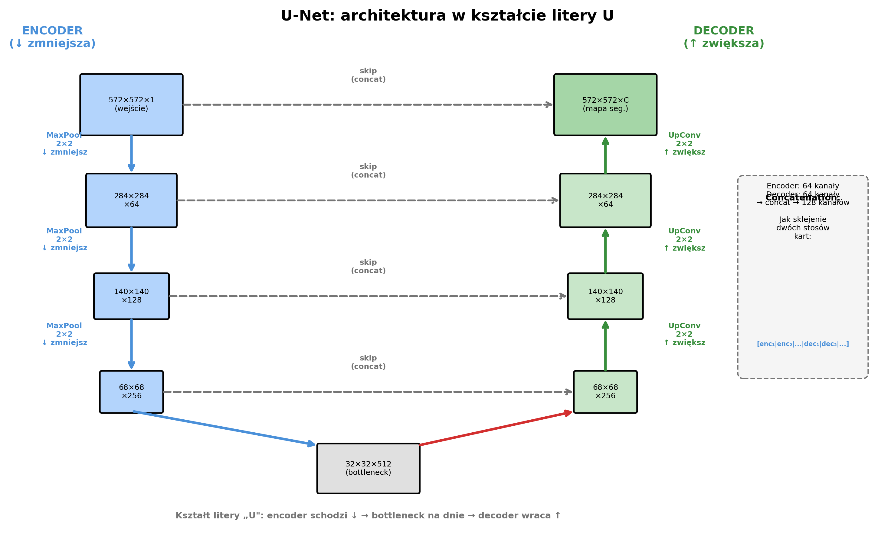

    Mnemonik U-Net: „Litera U — w dół i w górę" — encoder schodzi ↓ (zmniejsza),
    decoder wraca ↑ (zwiększa), między nimi mosty (skip = concat).

---

**Receptive field (pole widzenia, pole recepcyjne)** — ile pikseli WEJŚCIOWYCH wpływa na JEDEN piksel wyjściowy. Konwolucja 3×3 → RF = 3×3. Dwie konwolucje 3×3 pod rząd → RF = 5×5 (druga widzi 3×3 fragmenty, z których każdy widział 3×3 → efektywnie 5×5). Większe RF = neuron widzi większy kontekst = lepiej rozumie co to za piksel.

**Dlaczego większe RF jest lepsze?** — Pojedynczy piksel o jasności 150 może być fragmentem nieba LUB samochodu. Patrząc na otoczenie 3×3 → nadal nie wiesz. Patrząc na otoczenie 50×50 → widzisz budynki obok → „to droga!". Segmentacja wymaga KONTEKSTU globalnego.

**Rate (współczynnik dylatacji)** — parametr atrous (dilated) convolution. Rate=1 = zwykła konwolucja (filtr dotyka sąsiadów). Rate=2 = filtr próbkuje co DRUGI piksel → RF rośnie z 3×3 do 5×5 przy TYCH SAMYCH 9 wagach. Rate=3 → RF = 7×7. Większy kontekst za darmo (bez dodatkowych parametrów).

**Global Average Pooling (GAP)** — operacja redukcji: mapa cech H×W×C → 1×1×C. Dla KAŻDEGO kanału oblicza ŚREDNIĄ ze wszystkich H×W pikseli. Wynik: jeden wektor o wymiarze C, reprezentujący „średnią informację" z całego obrazu. RF = nieskończone (cały obraz). Używane w ASPP DeepLab jako jedna z równoległych gałęzi.

    Mapa cech 7×7×512:
    Kanał 0: macierz 7×7 wartości → średnia → jedna liczba
    Kanał 1: macierz 7×7 wartości → średnia → jedna liczba
    ...
    Kanał 511: macierz 7×7 wartości → średnia → jedna liczba
    Wynik: wektor [avg₀, avg₁, ..., avg₅₁₁] → 1×1×512

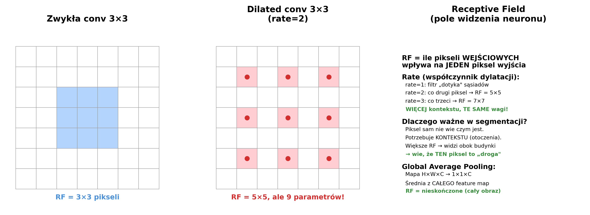

---

**Transformer** — architektura sieci neuronowej zaproponowana w 2017 (Vaswani et al., „Attention Is All You Need"). Oryginalnie dla NLP (tłumaczenie), od 2020 (ViT — Vision Transformer) stosowana w wizji komputerowej. Kluczowy mechanizm: **self-attention** — każdy element (piksel/token) „pyta" WSZYSTKIE inne elementy: „jak bardzo jesteś ze mną powiązany?". Każdy element tworzy trzy wektory: Q (Query — czego szukam?), K (Key — co oferuję), V (Value — moja wartość). Attention = softmax(Q·Kᵀ / √d) · V. Koszt: O(n²) pamięci (n = liczba elementów).

**SOTA (State Of The Art)** — najlepszy znany wynik na danym benchmarku (zbiorze testowym) w danym momencie. Np. „Mask2Former osiąga mIoU 57.8% na ADE20K — to aktualny SOTA". SOTA ciągle się zmienia — każdy nowy paper może pobić poprzedni rekord.

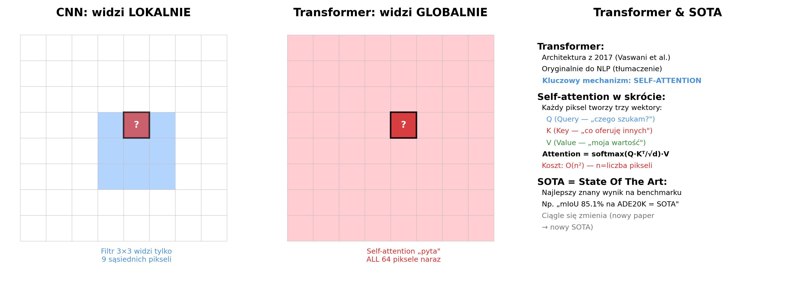

---

**mIoU (mean Intersection over Union)** — standardowa metryka segmentacji. Dla każdej klasy: IoU = (piksele poprawne ∩ ground truth) / (piksele poprawne ∪ ground truth). Potem średnia z klas.

    Klasa "samochód": predykcja=100 pikseli, GT=120, wspólne=80
    IoU = 80 / (100+120-80) = 80/140 = 0.571 = 57.1%

**Dice Loss** — funkcja kosztu powiązana z IoU: 2·|A∩B| / (|A|+|B|). Popularna w segmentacji medycznej (dobrze radzi sobie z class imbalance).

**Focal Loss** — modyfikacja cross-entropy redukująca wpływ łatwych przykładów, skupiająca uczenie na trudnych. Kluczowa przy class imbalance (np. 99% tła, 1% obiekt).

---

### Problem: czym jest segmentacja obrazu?

Segmentacja obrazu to **przypisanie etykiety klasy KAŻDEMU pikselowi** obrazu. Wynik: mapa segmentacji o tym samym rozmiarze co obraz wejściowy, gdzie każdy piksel ma etykietę (np. „samochód", „droga", „niebo").

    Wejście:   obraz 640×480 (RGB)                    = 307 200 pikseli
    Wynik:     mapa 640×480, każdy piksel → etykieta   = 307 200 etykiet

    Obraz:           [niebo niebo niebo niebo]
                     [niebo drzewo drzewo niebo]
                     [droga droga samochód droga]
                     [droga droga droga   droga]

**Czym segmentacja NIE jest:**

    Zadanie              Wynik                          Granulacja
    ──────────────────────────────────────────────────────────────
    Klasyfikacja         1 etykieta na cały obraz       obraz
    Detekcja             bounding box + klasa            prostokąt
    Segmentacja          etykieta per piksel             piksel

**3 warianty segmentacji:**

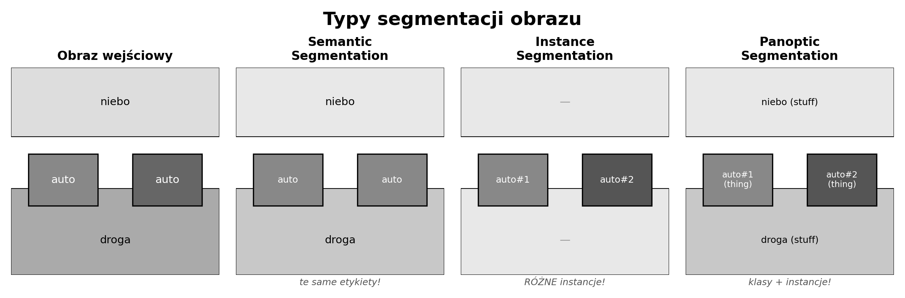

| Wariant | Co robi | Przykład |
|---------|---------|----------|
| **Semantic** | klasa per piksel, bez rozróżniania instancji | wszystkie samochody = „samochód" |
| **Instance** | rozróżnia instancje tego samego obiektu | samochód#1, samochód#2 |
| **Panoptic** | semantic + instance razem | „stuff" (niebo) + „things" (samochód#1, #2) |

---

### Strategie klasyczne

Metody niewymagające uczenia maszynowego — oparte na ręcznie zdefiniowanych regułach (próg, podobieństwo, struktura grafu).

| Metoda | Idea | Wada | Złożoność | Mnemonik |
|--------|------|------|-----------|----------|
| **Thresholding** | piksel > T → klasa 1, else → klasa 0 | tylko 2 klasy, proste sceny | O(n) | „PRÓG na bramce" |
| **Otsu** | automatyczny próg (min wariancja wewnątrzklasowa) | j.w. ale dobiera T sam | O(n·L) | „AUTO-bramkarz" |
| **Region Growing** | dodawaj sąsiednie piksele o podobnej wartości | over-segmentation, zależy od seeda | O(n) | „PLAMA atramentu" |
| **Watershed** | obraz = mapa wysokości, granice = granie gór | over-segmentation | O(n log n) | „ZALEWANIE terenu" |
| **Mean Shift** | iteracyjnie przesuwaj jądro do max gęstości | wolny | O(n²) | „KULKI toczą się" |
| **Normalized Cuts** | piksele = węzły grafu, minimalizuj znormalizowane cięcie | bardzo wolny | O(n³) | „CIĘCIE sznurków" |

#### DIY Przykład — Thresholding (Otsu) krok po kroku

Poniższy diagram pokazuje CAŁY pipeline progowania Otsu od obrazu wejściowego do wyniku. Obraz syntetyczny 64×64 z ciemnym kołem na jasnym tle — typowy przypadek bimodalny.

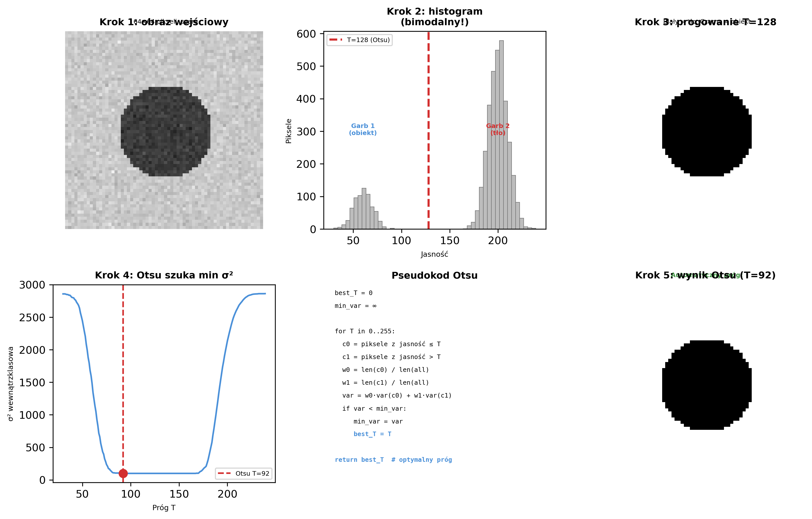

    Pseudokod Otsu (Python-style):
    best_T, min_var = 0, float('inf')
    for T in range(256):
        c0 = pixels[pixels <= T]      # piksele ciemne
        c1 = pixels[pixels > T]       # piksele jasne
        if len(c0) == 0 or len(c1) == 0:
            continue
        w0 = len(c0) / len(pixels)    # udział klasy 0
        w1 = len(c1) / len(pixels)    # udział klasy 1
        var = w0 * variance(c0) + w1 * variance(c1)  # σ² wewnątrzklasowa
        if var < min_var:
            min_var = var
            best_T = T
    # best_T = optymalny próg (np. 128)
    result = (pixels > best_T).astype(int)  # binaryzacja

**Wspólna wada klasycznych metod:** wymagają ręcznego doboru parametrów (próg, seed, kernel), nie uczą się cech z danych, słabe na złożonych obrazach naturalnych.

---

### Sieci neuronowe (deep learning)

Metody uczące się automatycznie rozpoznawać cechy z danych treningowych. Wszystkie oparte na architekturze **encoder-decoder** z wariacjami.

**Wspólna idea encoder-decoder:**

    Encoder: obraz [224×224] → [112] → [56] → [28] → [14]   (wyciąga CECHY)
    Decoder: cechy [14] → [28] → [56] → [112] → [224×224]   (odtwarza MAPĘ)
                                   bottleneck

| Sieć | Rok | Kluczowa innowacja | Use case | Mnemonik |
|------|-----|-------------------|----------|----------|
| **FCN** | 2015 | w pełni konwolucyjna + skip connections | pierwsza end-to-end | „FC → Conv 1×1" |
| **U-Net** | 2015 | U-shape + skip concat + data augmentation | segmentacja medyczna | „Litera U + mosty" |
| **DeepLab v3+** | 2018 | atrous (dilated) conv + ASPP | general-purpose | „DZIURY w filtrze" |
| **SegFormer** | 2021 | transformer encoder (self-attention) | SOTA lightweight | „WSZYSCY ze WSZYSTKIMI" |
| **Mask2Former** | 2022 | masked attention + unified architecture | SOTA universal | „WSZYSCY ze WSZYSTKIMI" |

**FCN (Fully Convolutional Network):**

    Mnemonik: „FC → Conv 1×1 = otwieramy bramkę dla DOWOLNEGO rozmiaru"
    Zwykły CNN:  Conv → Conv → Pool → ... → FC → FC → "kot"
    FCN:         Conv → Conv → Pool → ... → Conv1×1 → Upsample → mapa pikseli
    Innowacja: zamiana FC na Conv1×1 → wejście dowolnego rozmiaru
    Skip connections: łączą cechy z encodera → zachowują detale przestrzenne

**U-Net:**

    Mnemonik: „Litera U + mosty" — schodzisz w dół, wracasz w górę,
    po drodze mosty (skip connections z concat) przenoszą detale.
    Encoder (↓)         Decoder (↑)
    [64]────skip────→[64]        ← skip connections = concatenation
    [128]───skip───→[128]           (przenosi detale z encodera do decodera)
    [256]──skip──→[256]
    [512]─skip─→[512]
         [1024]                  ← bottleneck
    Dlaczego medycyna? Działa dobrze z MAŁYMI zbiorami danych (data augmentation)

**DeepLab v3+:**

    Mnemonik: „DZIURY w filtrze" — filtr dosłownie ma dziury (à trous),
    przez co widzi dalej bez dodatkowych parametrów.
    Zwykła konwolucja 3×3:   [x][x][x]         receptive field = 3
    Dilated (rate=2):        [x][ ][x][ ][x]   receptive field = 5, te same parametry!
    ASPP: równolegle rate=6,12,18 → multi-scale features → łączenie
    Efekt: widzi kontekst globalny BEZ zwiększania parametrów

**Transformery (SegFormer, Mask2Former):**

    Mnemonik: „WSZYSCY ze WSZYSTKIMI" — każdy piksel rozmawia z KAŻDYM innym.
    CNN: filtr 3×3 widzi LOKALNY kontekst (sąsiadów)
    Transformer: self-attention widzi CAŁY obraz naraz
    Cena: O(n²) pamięci (n = piksele), ale lepsze wyniki

#### DIY Przykład — U-Net krok po kroku

Poniższy diagram pokazuje CAŁY pipeline U-Net od obrazu wejściowego do mapy segmentacji. Obraz syntetyczny 64×64 z dwoma obiektami (koła) na jasnym tle.

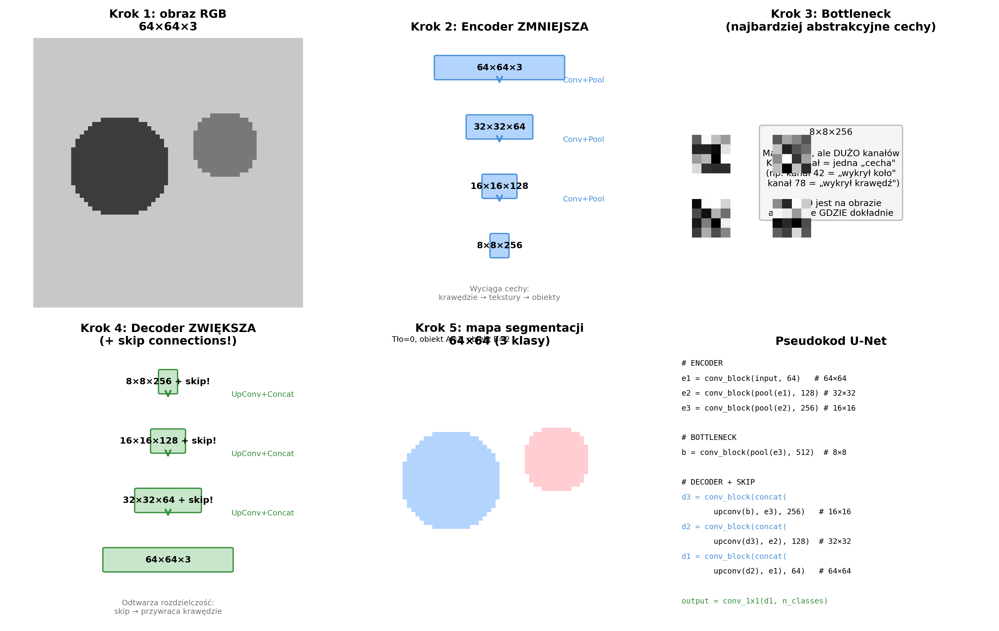

    Pseudokod U-Net (PyTorch-style):
    # ENCODER — zmniejsza rozdzielczość, wyciąga cechy
    e1 = conv_block(input, filters=64)      # [64×64×64]
    e2 = conv_block(maxpool(e1), filters=128)  # [32×32×128]
    e3 = conv_block(maxpool(e2), filters=256)  # [16×16×256]

    # BOTTLENECK — najgłębsza warstwa
    b = conv_block(maxpool(e3), filters=512)   # [8×8×512]

    # DECODER — zwiększa rozdzielczość + skip connections (concat!)
    d3 = conv_block(concat(upconv(b), e3), filters=256)    # [16×16×256]
    d2 = conv_block(concat(upconv(d3), e2), filters=128)   # [32×32×128]
    d1 = conv_block(concat(upconv(d2), e1), filters=64)    # [64×64×64]

    # WYNIK — Conv 1×1 → mapa klas
    output = conv_1x1(d1, n_classes=3)  # [64×64×3] → argmax → [64×64] etykiety

---

### Metryki i funkcje kosztu

| Metryka/Loss | Wzór | Kiedy użyć |
|-------------|------|------------|
| **mIoU** | mean(IoU per klasa) | standardowy benchmark |
| **Pixel Accuracy** | poprawne / wszystkie | prosta, ale zła przy class imbalance |
| **Dice Loss** | 1 - 2·\|A∩B\| / (\|A\|+\|B\|) | segmentacja medyczna |
| **Focal Loss** | -α(1-p)^γ · log(p) | class imbalance (99% tła) |

### Etymologia

**Segmentacja** — łac. „segmentum" = odcięty kawałek; podział obrazu na regiony. **Otsu** — Nobuyuki Otsu (1979); automatyczny dobór progu. **Watershed** — metafora: woda spływająca z grani do dolin (z geografii). **U-Net** — Ronneberger et al. (Freiburg, 2015); „U" od kształtu architektury. **FCN** — Fully Convolutional Network (Long, Shelhamer, Darrell, 2015). **DeepLab** — Google (2015–2018); „Atrous" z fr. „à trous" = „z dziurami" (dilated convolutions). **mIoU** — mean Intersection over Union.

### Jak zapamiętać

**Super-mnemonik na kolejność algorytmów:**

    „Turyści Oglądają Rzekę, Wodospad, Morze, Nurt — Fotografują Uroczy Dwór Tajemnic"

    Klasyczne: Thresholding → Otsu → Region growing → Watershed → Mean shift → Normalized cuts
    Neuronowe: FCN → U-Net → DeepLab → Transformer

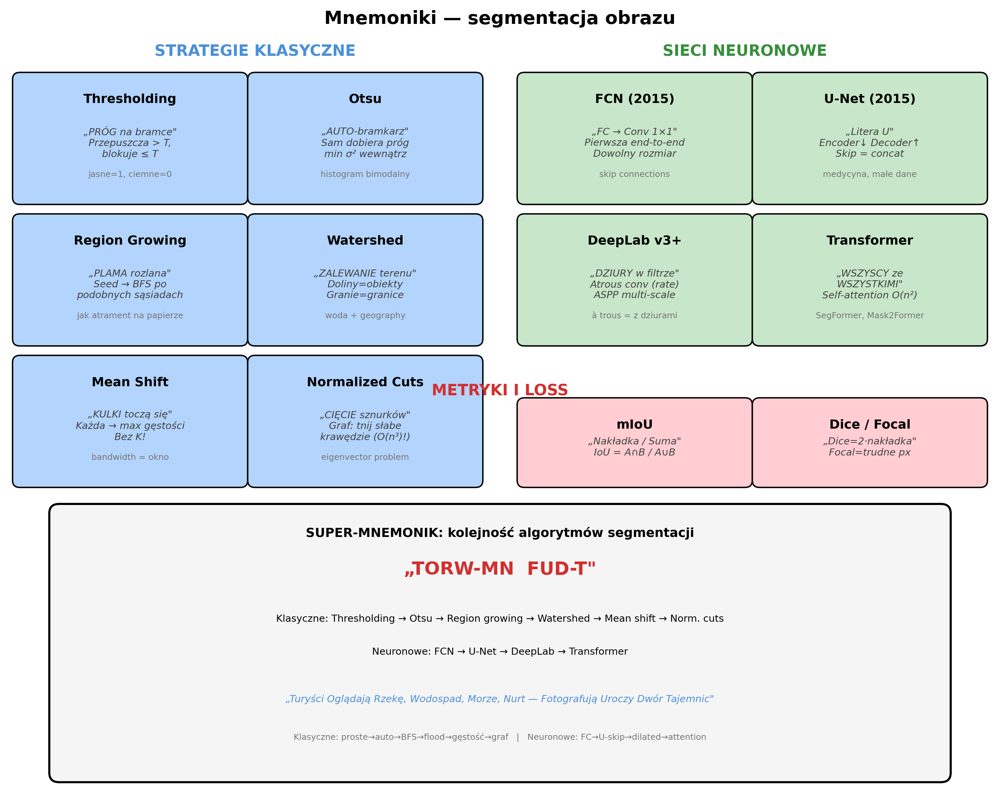

**Mnemoniki per algorytm — STRATEGIE KLASYCZNE:**

| Algorytm | Mnemonik | Skojarzenie |
|----------|----------|-------------|
| **Thresholding** | „PRÓG na bramce" | Bramkarz przepuszcza piksele > T, blokuje ≤ T |
| **Otsu** | „AUTO-bramkarz" | Sam sprawdza 256 progów, wybiera najlepszy (min σ²) |
| **Region Growing** | „PLAMA atramentu" | Kropla atramentu rozlewa się na podobne piksele (BFS) |
| **Watershed** | „ZALEWANIE terenu" | Woda zalewa doliny, granie gór = granice segmentów |
| **Mean Shift** | „KULKI toczą się do dołków" | Każda kulka → max gęstości, ile dołków = tyle segmentów |
| **Normalized Cuts** | „CIĘCIE sznurków" | Tnij słabe sznurki (krawędzie grafu), zachowaj silne |

**Mnemoniki per algorytm — SIECI NEURONOWE:**

| Sieć | Mnemonik | Skojarzenie |
|------|----------|-------------|
| **FCN** | „FC → Conv 1×1" | Otwiera bramkę dla dowolnego rozmiaru wejścia |
| **U-Net** | „Litera U + mosty" | Schodzisz ↓, wracasz ↑, mosty (skip concat) przenoszą detale |
| **DeepLab** | „DZIURY w filtrze" | Filtr ma dziury (à trous) → widzi dalej bez dodatkowych wag |
| **Transformer** | „WSZYSCY ze WSZYSTKIMI" | Każdy piksel pyta każdy inny (self-attention, O(n²)) |

**Mnemoniki per metrykę:**

- **mIoU** = „Nakładka / Suma" → intersection / union, uśrednione per klasa
- **Dice** = „Dwie nakładki / Razem" → 2·|A∩B| / (|A|+|B|)
- **Focal** = „Fokus na TRUDNYCH" → trudne piksele ważą więcej

\newpage

## PYTANIE 24: Detekcja obiektów

**Problem, metody klasyczne, deep learning. Jak zbudować detektor z klasyfikatora?**

---

### Tło pojęciowe — słowniczek

**Detekcja obiektów (object detection)** — zadanie widzenia komputerowego: zlokalizuj obiekty na obrazie (bounding box) i przypisz im klasy (samochód, pieszo, kot...). Wynik: lista (klasa, prostokąt, pewność). Trudniejsze niż klasyfikacja (→ cały obraz, 1 label), ale łatwiejsze niż segmentacja (→ per piksel).

    Klasyfikacja:  "To zdjęcie zawiera kota"
    Detekcja:      "Kot w prostokącie (50,30)-(200,180), pewność 95%"
    Segmentacja:   Maska pikseli kota

**Bounding box (prostokąt ograniczający, bbox)** — prostokąt opisujący położenie obiektu. Zwykle: (x_min, y_min, x_max, y_max) lub (x_center, y_center, width, height). Przybliżenie — obiekty rzadko są prostokątne.

**Confidence (pewność)** — wynik 0-1 mówiący jak pewny jest detektor, że wykrył obiekt danej klasy. Zwykle próg np. 0.5: detekcje poniżej odrzucane.

---

**CNN (Convolutional Neural Network, konwolucyjna sieć neuronowa)** — typ sieci neuronowej zaprojektowany specjalnie do przetwarzania OBRAZÓW. Używany w KAŻDYM nowoczesnym detektorze (R-CNN, YOLO, SSD, DETR). Kluczowa idea: zamiast łączyć KAŻDY piksel z KAŻDYM neuronem (→ miliardy parametrów), CNN używa MAŁYCH filtrów (np. 3×3 piksele) przesuwanych po obrazie. Dzięki temu:
1. Mało parametrów (filtr 3×3 = 9 wag, niezależnie od rozmiaru obrazu)
2. Wykrywa lokalne wzorce (krawędzie, rogi, tekstury)
3. Inwariantność na przesunięcie (kot w lewym rogu = kot w prawym rogu)

    Dlaczego CNN a nie zwykła sieć neuronowa?
    Obraz 224×224×3 = 150 528 pikseli.
    Zwykła sieć (FC): 150 528 × 4096 neuronów = 616 MILIONÓW wag w 1 warstwie!
    CNN: filtr 3×3×3 = 27 wag, przesuwany po CAŁYM obrazie → 27 wag zamiast 616M!

    Mnemonik: CNN = „Czytaj Nie Naraz" — nie bierzesz całego obrazu naraz,
    tylko małe fragmenty (filtry 3×3), krok po kroku.

**Konwolucja (convolution)** — podstawowa operacja CNN: mały filtr (macierz np. 3×3) przesuwa się po obrazie, w każdej pozycji mnoży element-po-elemencie z fragmentem obrazu i sumuje → jedna liczba na wyjściu. Wynik = „feature mapa" — mapa pokazująca GDZIE na obrazie dany wzorzec jest obecny.

    Przykład liczbowy:
    Fragment obrazu 3×3:     Filtr 3×3:             Wynik (1 piksel feature mapy):
    [1  2  3]                [-1  0  1]
    [4  5  6]       ×        [-1  0  1]    = 1(-1)+2(0)+3(1)+4(-1)+5(0)+6(1)+7(-1)+8(0)+9(1)
    [7  8  9]                [-1  0  1]    = (-1+0+3) + (-4+0+6) + (-7+0+9) = 6

    Ten filtr wykrywa PIONOWE KRAWĘDZIE (liczy różnicę prawa-lewa strona).
    Duży wynik (6) = silna krawędź. Wynik ≈ 0 = brak krawędzi.
    Filtr przesuwa się po CAŁYM obrazie → cała mapa cech.

    Pseudokod konwolucji:
    def convolve(image, filter_3x3):
        output = zeros(image.height - 2, image.width - 2)
        for y in range(1, image.height - 1):
            for x in range(1, image.width - 1):
                patch = image[y-1:y+2, x-1:x+2]        # wycinek 3×3
                output[y-1][x-1] = sum(patch * filter)   # iloczyn + suma
        return output

**Filtr / Kernel** — mała macierz wag (np. 3×3, 5×5) uczona AUTOMATYCZNIE podczas treningu. CNN ma WIELE filtrów — każdy uczy się wykrywać INNY wzorzec. 64 filtry w jednej warstwie → 64 map cech.

    KLUCZOWA RÓŻNICA: w HOG cechy projektuje CZŁOWIEK.
    W CNN filtry uczy się SIEĆ SAMA — to główna przewaga deep learning!

    Warstwa conv z 64 filtrami 3×3:
    Filtr 1: nauczył się wykrywać pionowe krawędzie
    Filtr 2: nauczył się wykrywać poziome krawędzie
    Filtr 3: nauczył się wykrywać rogi
    ...
    Filtr 64: jakiś inny wzorzec pomocny w rozpoznawaniu

**Feature map (mapa cech)** — wynik zastosowania JEDNEGO filtra do obrazu. Jasne piksele = „tu jest ten wzorzec". 64 filtry → 64 map cech → tensor [H × W × 64]. Feature mapy to WEWNĘTRZNA REPREZENTACJA tego, co sieć „widzi" na obrazie.

    Hierarchia cech w CNN (każda warstwa coraz bardziej abstrakcyjna):
    Warstwa 1:  krawędzie, gradienty         (jak HOG!)
    Warstwa 2:  rogi, proste tekstury
    Warstwa 3:  fragmenty obiektów (oko, koło, ucho)
    Warstwa 4+: całe obiekty (twarz = oczy+nos+usta, samochód = koła+okna+dach)

    Mnemonik: „K-R-F-O" = „Każdy Rycerz Znajduje Obiekt"
    (Krawędzie → Rogi → Fragmenty → Obiekty)

**Pooling (łączenie / podpróbkowanie)** — warstwa ZMNIEJSZAJĄCA rozmiar feature mapy. Najczęstsza: **max pooling 2×2** — z każdego bloku 2×2 pikseli zachowaj MAKSIMUM. Wynik: mapa 2× mniejsza w każdym wymiarze (= 4× mniej pikseli), ale zachowuje najsilniejsze cechy.

    Feature map 4×4:           Po Max Pool 2×2:
    [1  3 | 2  1]              [3  2]    ← max(1,3,0,3)=3   max(2,1,1,2)=2
    [0  3 | 1  2]              [4  3]    ← max(0,4,1,2)=4   max(1,0,3,1)=3
    ─────────────
    [0  4 | 1  0]              Rozmiar: 4×4 → 2×2 (4× mniej danych!)
    [1  2 | 3  1]              Zachowane: najsilniejsze cechy z każdego bloku

    Dlaczego max pooling?
    1. Mniej pikseli = mniej obliczeń w następnych warstwach
    2. Większe „pole widzenia" (receptive field) — warstwa „widzi" większy fragment
    3. Odporność na małe przesunięcia: obiekt ±1px → ten sam max

**Stride (krok)** — o ile pikseli filtr przesuwa się za jednym krokiem. Stride=1: co 1 piksel (wyjście duże). Stride=2: co 2 piksele (wyjście 2× mniejsze). Max pool 2×2 ze stride 2 = typowy pooling.

**FC (Fully Connected layer, warstwa w pełni połączona)** — warstwa, w której KAŻDY neuron jest połączony z KAŻDYM wyjściem poprzedniej warstwy. W CNN zwykle na KOŃCU sieci: feature mapy (3D) → spłaszczone do wektora 1D → FC klasyfikuje.

    CNN: Conv → Pool → Conv → Pool → [Flatten] → FC(4096) → FC(1000) → "kot"
                                         ↑                       ↑
                                  spłaszcz 3D→1D         1000 klas (ImageNet)

    FC = „warstwa decyzyjna" — łączy cechy z CAŁEGO obrazu w jedną decyzję.
    Mnemonik: FC = „Full Connection" — każdy z każdym, jak klasa każdy-z-każdym.
    Problem FC: DUŻO parametrów (np. 25088 × 4096 = 102M wag w VGG-16!)

**Forward pass (przejście w przód)** — JEDNO przetworzenie danych przez sieć od wejścia do wyjścia. Obraz wchodzi → przechodzi przez Conv, Pool, FC → wychodzi predykcja. Nie aktualizuje wag (to backward pass / backpropagation = uczenie).

    Forward pass CNN (czasy na GPU):
    Jeden obraz przez ResNet-50: ~5ms
    R-CNN:      2000 regionów × 5ms = 10 SEKUND (dlatego był wolny!)
    Fast R-CNN: 1 forward pass cały obraz + ROI Pool = ~200ms (50× szybciej!)

**ReLU (Rectified Linear Unit)** — funkcja aktywacji: f(x) = max(0, x). Przepuszcza wartości dodatnie, zeruje ujemne. Standard w CNN — stosowana PO KAŻDEJ warstwie konwolucyjnej.

    Wejście:  [-3, 5, -1, 2, 0, -7, 4]
    ReLU:     [ 0, 5,  0, 2, 0,  0, 4]

    Dlaczego potrzebna? Bez ReLU sieć = seria mnożeń macierzy = JEDNA liniowa
    transformacja → nie potrafi uchwycić złożonych wzorców.
    ReLU dodaje NIELINIOWOŚĆ → sieć aproksymuje DOWOLNĄ funkcję.

**Softmax** — funkcja na WYJŚCIU klasyfikatora: zamienia surowe wyniki (logits) na prawdopodobieństwa sumujące się do 1.

    Logits:     [2.0,  1.0,  0.1]
    Softmax:    [0.66, 0.24, 0.10]   ← e^2.0 / (e^2.0 + e^1.0 + e^0.1) ≈ 0.66
    Klasy:      ["kot", "pies", "ryba"]
    → „66% szans, że to kot"

**Tensor** — wielowymiarowa tablica liczb. Uogólnienie wektora i macierzy.

    Skalar = 0D tensor:     5
    Wektor = 1D:            [1, 2, 3]
    Macierz = 2D:           [[1,2],[3,4]]
    Obraz RGB = 3D:         [224 × 224 × 3]        ← wysokość × szerokość × kanały
    Batch obrazów = 4D:     [32 × 224 × 224 × 3]   ← 32 obrazy naraz
    Wyjście YOLO = 3D:      [7 × 7 × 30]           ← siatka × predykcje

**Architektura CNN — pełny przykład (AlexNet, wygrał ImageNet 2012):**

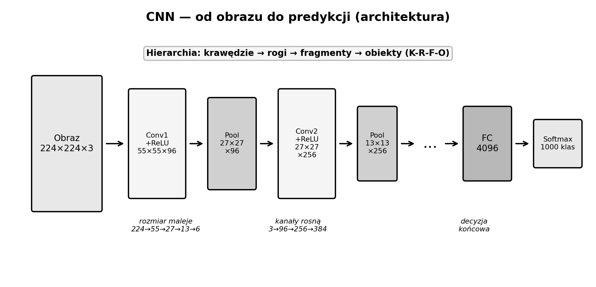

    ROZMIARY MALEJĄ:  224 → 55 → 27 → 13 → 6  (kompresja przestrzenna)
    KANAŁY ROSNĄ:     3 → 96 → 256 → 384 → 256 (coraz więcej wyuczonych cech)

---

**Backbone (kręgosłup / sieć bazowa)** — duża, pretrenowana sieć CNN (np. ResNet-50, VGG-16) używana jako „ekstraktor cech". Backbone przetwarza obraz → feature mapa. Na wierzch dodaje się GŁOWICĘ (head) specyficzną dla zadania.

    Analogia: backbone = SILNIK samochodu, head = KAROSERIA.
    Ten sam silnik (ResNet) w różnych karoseriach:
        Sedan  → klasyfikacja: FC head → "kot"
        SUV    → detekcja: RPN + ROI Pool head → bbox + klasa
        Pickup → segmentacja: dekoder head → maska pikseli

    Backbone PRETRENOWANY na ImageNet (miliony obrazów).
    Head TRENOWANY od zera na konkretnym zadaniu (detekcja, segmentacja).

**Detection head (głowa detekcyjna)** — warstwy dodane NA WIERZCH backbone'u. Predykują klasy obiektów + pozycje bbox. W Faster R-CNN: RPN + ROI Pool + FC. W YOLO: warstwy conv + wyjście S×S×(B×5+C).

**ResNet, VGG, AlexNet — popularne backbone'y:**

    Sieć       Rok   Warstw   Parametrów   Top-5 ImageNet   Innowacja
    ─────────────────────────────────────────────────────────────────────
    AlexNet    2012   8        60M          84.7%             Pierwsza głęboka CNN
    VGG-16     2014   16       138M         92.7%             Małe filtry 3×3
    ResNet-50  2015   50       25M          96.4%             Skip connections

    Mnemonik: A → V → R = „Architektura Bardzo Rezylientna" (2012 → 2014 → 2015)

    Skip connection (ResNet): y = F(x) + x
    Wejście bloku DODAWANE do wyjścia → gradient nie zanika
    → można trenować 50-152 warstw (bez skip: >20 warstw = DEGRADACJA!)

**ImageNet** — ogromny zbiór danych: 14M obrazów, 1000 klas (pies, samolot, gitara...). Standard pretrenowania w computer vision. ILSVRC (coroczne zawody) — AlexNet wygrał 2012 → rewolucja deep learning.

**Transfer learning (uczenie transferowe)** — weź sieć pretrenowaną na dużym zbiorze (ImageNet), użyj do INNEGO zadania (detekcja, segmentacja). Backbone „wie" jak wyglądają krawędzie i kształty — trzeba tylko nauczyć nowej głowicy.

    Krok po kroku:
    1. ResNet-50 pretrenowany na ImageNet (1000 klas, miliony obrazów)
    2. Odtnij warstwę FC (klasyfikujse 1000 klas ImageNet) ← WYRZUĆ
    3. Dodaj nową głowicę detekcji (bbox + 80 klas COCO)  ← NOWA
    4. Trenuj głowicę na danych detekcyjnych (COCO/VOC)
    5. Opcjonalnie: fine-tune = odmroź backbone, ucz z MAŁYM learning rate

    Dlaczego działa? Cechy niskiego poziomu (krawędzie, tekstury) SĄ UNIWERSALNE.
    Kot, samochód, twarz — wszystko ma krawędzie i tekstury!

**Fine-tuning (dostrajanie)** — forma transfer learning: odmrażasz backbone i uczysz CAŁĄ sieć z MAŁYM learning rate, żeby subtelnie dopasować cechy do nowego zadania.

**COCO (Common Objects in Context)** — benchmark detekcji: 330K obrazów, 80 klas (samochód, osoba, pies...), 1.5M bboxów. Standard oceny detektorów.

**Pascal VOC (Visual Object Classes)** — starszy benchmark: 20 klas. Używany w oryginalnym YOLO i R-CNN.

**mAP (mean Average Precision)** — główna metryka jakości detekcji. Łączy trafność klasy z trafnością lokalizacji.

    mAP@0.5:      detekcja „trafna" jeśli IoU ≥ 0.5 (≥50% pokrycia z prawdą)
    mAP@0.5:0.95: średnia po progach 0.5, 0.55, ..., 0.95 (dużo surowsza)

    Faster R-CNN (COCO): mAP ≈ 42%
    YOLOv8-X (COCO):     mAP ≈ 53%

**End-to-end (od końca do końca)** — cała sieć trenowana jako JEDNOŚĆ, jeden loss, jeden trening. Przeciwieństwo: R-CNN miał ODDZIELNIE Selective Search + CNN + SVM = 3 osobne kroki. Faster R-CNN = end-to-end → komponenty uczą się WSPÓŁPRACOWAĆ → lepsze wyniki.

**FPN (Feature Pyramid Network)** — technika łączenia feature map z RÓŻNYCH warstw backbone'u. Wczesne warstwy (wysoka rozdzielczość) → małe obiekty. Późne warstwy (niska rozdzielczość) → duże obiekty. FPN łączy obie → wykrywa obiekty WSZYSTKICH rozmiarów.

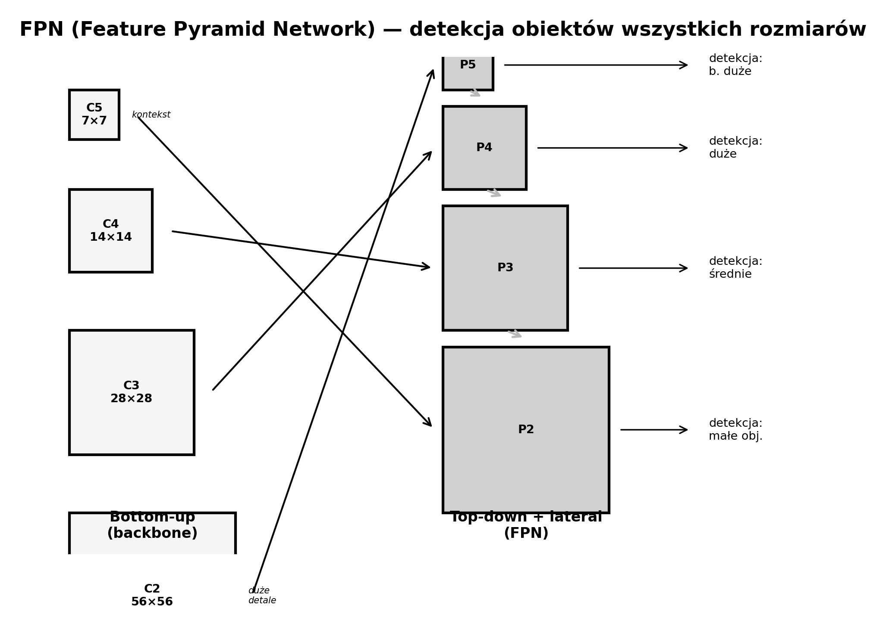

---

**Klasyfikator (classifier)** — model przypisujący etykietę do wejścia. Np. CNN trenowany na ImageNet: obraz → „kot" (+ prawdopodobieństwo). Klasyfikator nie mówi GDZIE jest obiekt — mówi tylko CO jest na obrazie. Pytanie brzmi: jak z takiego modelu zbudować detektor?

**Sliding window (okno przesuwane)** — najprostsza metoda budowy detektora z klasyfikatora: wytnij prostokątny fragment obrazu (wiele rozmiarów, wiele pozycji), każdy fragment sklasyfikuj. Jeśli „pozytywny" → detekcja. Ekstremalnie wolne: tysiące fragmentów × klasyfikacja per fragment.

    [okno 64×64] przesuwa się po obrazie 640×480:
    (640-64)×(480-64) ≈ ~240 000 pozycji × wiele skal = MILIONY klasyfikacji!

---

**HOG (Histogram of Oriented Gradients)** — klasyczny deskryptor cech wizualnych. Rozbijmy nazwę:

- **Gradient** — w kontekście obrazu to „kierunek i siła zmiany jasności" w danym pikselu. Oblicza się go jako różnicę jasności sąsiednich pikseli. Gradient wskazuje KRAWĘDZIE — tam, gdzie jasność zmienia się szybko.

      Piksel:           [50] [50] [200]       ← nagły skok jasności
      Gradient w x:      0    150              ← duży gradient = KRAWĘDŹ!
      Gradient w y:      obliczany analogicznie (góra/dół)
      Kierunek krawędzi: arctan(gy/gx) ← np. 0° = pionowa, 90° = pozioma

- **Orientacja (Oriented)** — kierunek gradientu. Gradient ma KĄTP (0°–180°): krawędź pionowa = ~0°, pozioma = ~90°, ukośna = ~45°.

- **Histogram** — zliczenie „ile pikseli ma gradient w danym kierunku". Dla komórki 8×8 pikseli liczymy histogram 9 binów (co 20°: 0°, 20°, 40°, ..., 160°).

- **HOG pipeline krok po kroku:**

      Krok 1: Oblicz gradient KAŻDEGO piksela (Gx, Gy → magnitude + direction)
                Gx = pixel[x+1] - pixel[x-1]
                Gy = pixel[y+1] - pixel[y-1]
                magnitude = √(Gx² + Gy²)
                direction = arctan(Gy / Gx)

      Krok 2: Podziel obraz na komórki (cells) 8×8 pikseli
                Okno 64×128 → 8×16 komórek

      Krok 3: Dla każdej komórki stwórz histogram 9 binów (0°-180°, co 20°)
                Każdy piksel w komórce „głosuje" na bin odpowiadający jego kierunkowi
                z wagą = magnitude (silniejsze krawędzie głosują mocniej)

      Krok 4: Normalizuj histogramy w blokach 2×2 komórek (16×16 px)
                → odporność na zmiany oświetlenia

      Krok 5: Połącz wszystkie histogramy w jeden wektor cech
                Okno 64×128: (8-1)×(16-1) = 7×15 = 105 bloków × 4 komórki × 9 binów = 3780 cech

      Wynik: wektor 3780 liczb = „odcisk palca" kształtu w oknie
      Sylwetka człowieka → charakterystyczny wzorzec kierunków krawędzi

**Pseudokod HOG:**

      def compute_hog(window_64x128):
          gradients = compute_gradients(window)     # Gx, Gy per pixel
          magnitudes = sqrt(Gx**2 + Gy**2)
          directions = arctan2(Gy, Gx) * 180 / pi   # kąt w stopniach

          hog_vector = []
          for block in sliding_blocks_2x2(cells_8x8):
              block_hist = []
              for cell in block.four_cells():
                  hist = zeros(9)                    # 9 binów
                  for pixel in cell.pixels():
                      bin_idx = int(directions[pixel] / 20)
                      hist[bin_idx] += magnitudes[pixel]
                  block_hist.append(hist)
              block_hist = normalize(concatenate(block_hist))  # L2-norm
              hog_vector.extend(block_hist)

          return hog_vector   # 3780-dim vector

**SVM (Support Vector Machine)** — klasyczny klasyfikator binarny (2 klasy: „tak/nie", „pieszy/nie-pieszy"). Pomysł:

- Dane treningowe to punkty w przestrzeni wielowymiarowej (np. wektory HOG 3780-dim)
- Każdy punkt ma etykietę: +1 (pozytywna klasa) lub -1 (negatywna)
- SVM szuka **hiperpłaszczyzny** (w 2D to linia, w 3D to płaszczyzna) najlepiej SEPARUJĄCEJ dwie klasy

**Czym jest hiperpłaszczyzna?** W 2D: linia dzieląca punkty na dwie grupy. W 3D: płaszczyzna. W N wymiarach: (N-1)-wymiarowa „ściana".

**Margines (margin)** — odległość od hiperpłaszczyzny do najbliższego punktu danych. SVM MAKSYMALIZUJE margines → najlepsza generalizacja.

**Support Vectors** — punkty danych NAJBLIŻSZE hiperpłaszczyźnie. To one „podpierają" (support) margines i definiują pozycję hiperpłaszczyzny. Reszta punktów jest nieistotna! Nazwa: „wektory nośne" — bo to wektory cech, które „niosą" decyzję.

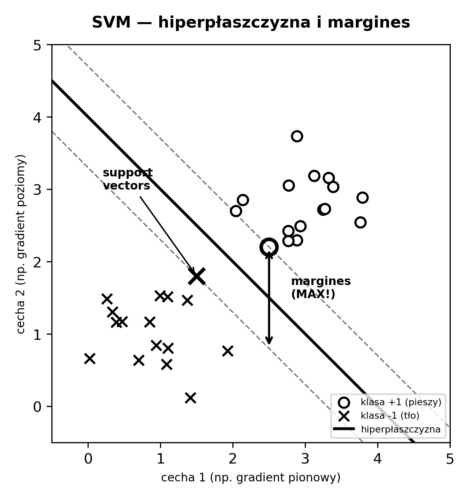

**HOG+SVM — klasyczny pipeline detekcji pieszych:**

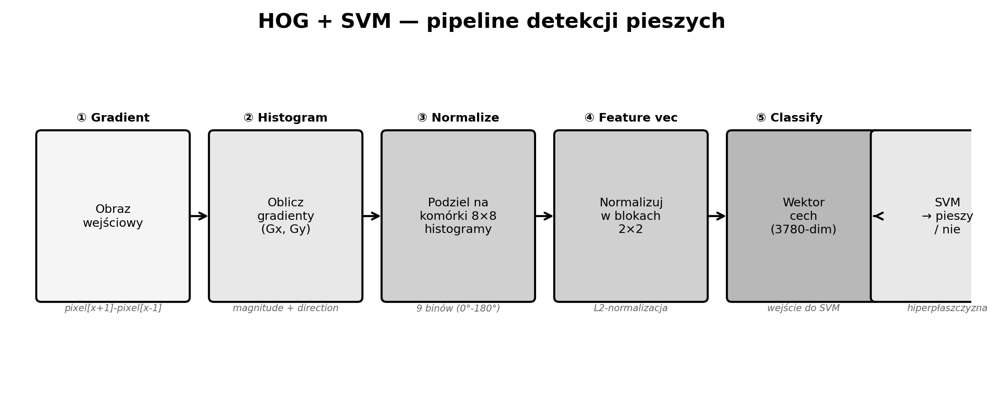

      1. Sliding window (okno 64×128) przesuwa się po obrazie
      2. Dla każdej pozycji okna:
         a) Oblicz HOG → wektor 3780 cech
         b) SVM klasyfikuje: „pieszy" (+1) lub „nie-pieszy" (-1)
      3. NMS (Non-Maximum Suppression) → usuń duplikaty
      4. Wynik: lista bounding boxów z detekcjami pieszych

**Viola-Jones (2001)** — przełomowy detektor twarzy w CZASIE RZECZYWISTYM. Trzy kluczowe innowacje wyjasnione szczegółowo:

**Haar features (cechy Haarowe)** — najprostsze cechy obrazowe: prostokąty podzielone na jasną i ciemną część. Wartość cechy = (suma pikseli jasnych) − (suma pikseli ciemnych). Proste, ale skuteczne — wykrywają kontrasty typowe dla twarzy.

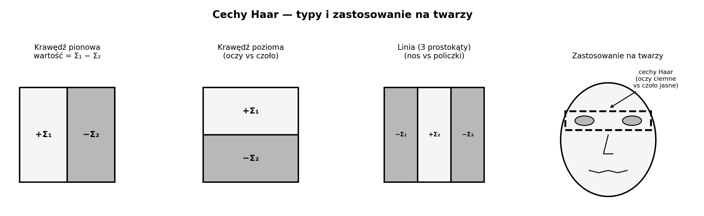

    Dlaczego działa na TWARZACH?
    - Oczy CIEMNIEJSZE niż czoło → cecha "krawędź pozioma" daje dużą wartość
    - Nos JAŚNIEJSZY niż policzki → cecha "linia pionowa" daje dużą wartość
    - Twarz = charakterystyczna KOMBINACJA takich kontrastów!

    Ile cech? W oknie 24×24 pikseli: ponad 160 000 możliwych cech Haar
    (różne rozmiary × różne pozycje). AdaBoost wybiera ~200 NAJLEPSZYCH.

**Integral Image (obraz całkowy)** — precomputed tabela pozwalająca obliczyć sumę pikseli w DOWOLNYM prostokącie w O(1) — stały czas, niezależnie od rozmiaru! To dlatego Haar features liczą się tak szybko.

    Jak? Integral Image[x,y] = suma WSZYSTKICH pikseli od (0,0) do (x,y).

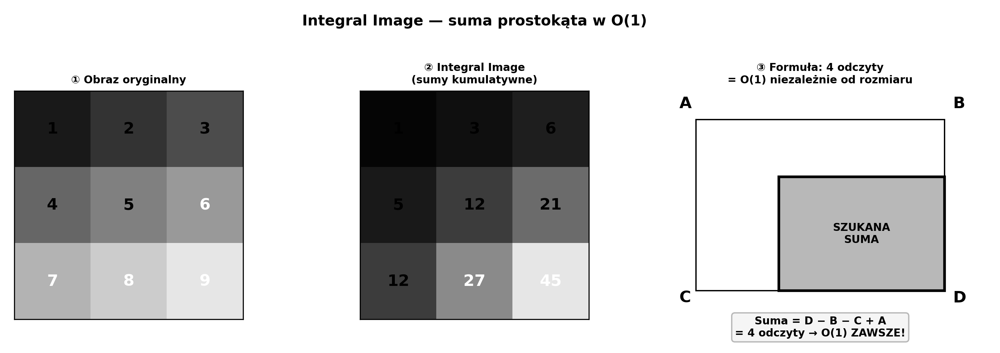

    Zawsze 4 odczyty z tabeli → O(1)!
    Czy prostokąt ma 4 piksele czy 4 MILIONY — czas TEN SAM!
    Bez Integral Image: O(w×h) — suma 1000×1000 = milion operacji.
    Z Integral Image: O(1) — 4 operacje. ZAWSZE.

    Pseudokod:
    def integral_image(img):
        II = zeros_like(img)
        for y in range(H):
            for x in range(W):
                II[y][x] = img[y][x] + II[y-1][x] + II[y][x-1] - II[y-1][x-1]
        return II

    def rect_sum(II, x1, y1, x2, y2):   # O(1) zawsze!
        return II[y2][x2] - II[y1-1][x2] - II[y2][x1-1] + II[y1-1][x1-1]

**AdaBoost (Adaptive Boosting)** — algorytm uczenia maszynowego łączący wiele SŁABYCH klasyfikatorów w jeden SILNY. Słaby = niewiele lepszy od losowego (>50% trafień). AdaBoost iteracyjnie:
1. Trenuj słaby klasyfikator (np. 1 cecha Haar + próg: "czy wartość > 1200?")
2. Sprawdź, które przykłady ŹLE sklasyfikował
3. Nadaj źle sklasyfikowanym WIĘKSZĄ wagę → następny klasyfikator SKUPI się na nich
4. Powtórz 200× → suma ważona 200 słabych klasyfikatorów ≈ silny klasyfikator

    Intuicja: jak PANEL EKSPERTÓW, z których każdy zna się na JEDNEJ rzeczy.
    Ekspert 1: "czy okolice oczu ciemne?"        (trafność 55%)
    Ekspert 2: "czy nos jaśniejszy niż policzki?" (trafność 60%)
    Ekspert 3: "czy brwi ciemne?"                 (trafność 53%)
    ...
    200 ekspertów razem → trafność >95%!
    Mnemonik: AdaBoost = "ADAptacyjnie BOOSTuj" słabe modele do silnego.

**Cascade (kaskada klasyfikatorów)** — genialna optymalizacja szybkości: zamiast sprawdzać WSZYSTKIE 200 cech na każdym oknie, użyj KASKADY etapów. Każdy etap = prosty klasyfikator, który szybko ODRZUCA "na pewno nie-twarz".

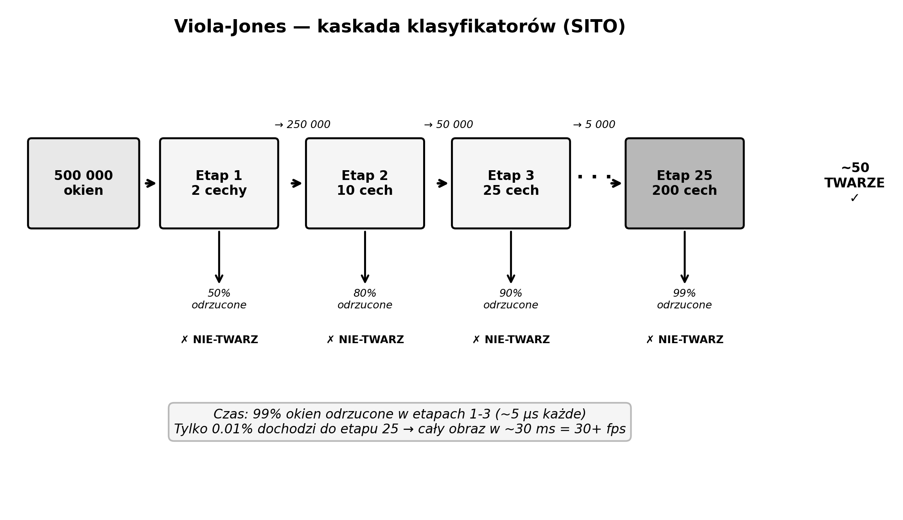

    Mnemonik: kaskada = "SITO" — coraz drobniejsze oczka,
    na początku odpada piach, na końcu zostaje ZŁOTO (twarz).

    Pseudokod kaskady:
    def cascade_classify(window):
        for stage in cascade_stages:           # etap 1, 2, ..., 25
            score = stage.evaluate(window)     # oblicz kilka cech Haar
            if score < stage.threshold:        # za niski wynik
                return "NIE-TWARZ"             # SZYBKIE odrzucenie!
        return "TWARZ"                         # przeszło WSZYSTKIE etapy

---

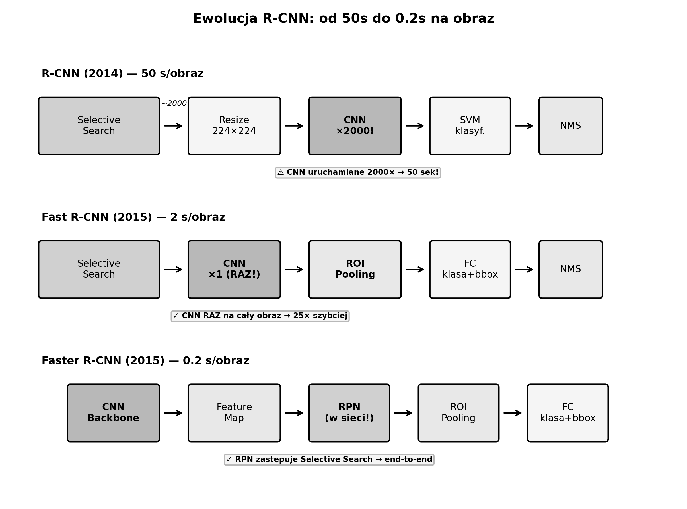

**R-CNN family (two-stage detectors)** — dwuetapowe: najpierw generuj propozycje regionów, potem klasyfikuj każdy region. Nazwa: Region-based CNN.

**Selective Search (wyszukiwanie selektywne)** — klasyczny algorytm (NIE sieć neuronowa!) generowania propozycji regionów. Zamiast MILIONÓW pozycji okna (sliding window), inteligentnie łączy podobne fragmenty obrazu i proponuje ~2000 prostokątów, w których MOGĄ być obiekty.

    Algorytm krok po kroku:
    1. Over-segmentation: podziel obraz na ~1000 małych regionów (superpixele)
       (na podstawie koloru i tekstury — algorytm Felzenszwalb)
    2. Powtarzaj aż zostanie 1 region:
       a) Znajdź 2 najbardziej PODOBNE sąsiednie regiony:
          - podobny kolor? (histogram kolorów)
          - podobna tekstura? (histogram gradientów)
          - pasujący rozmiar? (preferuj łączenie MAŁYCH regionów)
       b) Połącz je w jeden → zapamiętaj bounding box nowego regionu
    3. Zebrane bbox-y ze WSZYSTKICH kroków → ~2000 propozycji

    Sliding window:    ~500 000 okien → 99.9% to "tło" → marnujesz czas
    Selective Search:  ~2 000 regionów → ~50% zawiera coś → 250× wydajniej
    RPN (Faster R-CNN): ~300 propozycji → sieć neuronowa (najszybciej!)

**Czym jest "region proposal" (propozycja regionu)?** — prostokąt, w którym MOŻE być obiekt. Dużo mniej niż sliding window (2000 zamiast milionów), ale każda propozycja ma WYSOKIE prawdopodobieństwo trafienia obiektu.

**R-CNN (2014, Ross Girshick)** — pierwszy detektor oparty na CNN. Pipeline:

    Krok 1: Selective Search → ~2000 regionów-kandydatów (prostokątów)
    Krok 2: Dla KAŻDEGO z 2000 regionów:
            a) Wytnij prostokąt z obrazu, przeskaluj do 224×224
            b) Przepuść przez CNN (np. AlexNet) → wektor cech 4096-dim
            c) SVM klasyfikuje: „samochód? kot? tło?"
    Krok 3: Bbox regression — doprecyzuj pozycję prostokąta
    Krok 4: NMS — usuń duplikaty

    Problem: 2000 × CNN forward pass = 50 SEKUND na obraz! (2000 razy odpalasz CNN)
    Dlaczego tak wolno? Bo CNN liczy cechy na KAŻDYM wyciętym regionie OSOBNO,
    choć regiony się częściowo nakładają → redundantne obliczenia

**Fast R-CNN (2015)** — kluczowa optymalizacja: przepuść cały obraz przez CNN RAZ, uzyskaj "mapę cech" (feature map). Potem wytnij cechy regionów z tej mapy (ROI Pooling), zamiast odpalać CNN 2000 razy.

**ROI (Region of Interest, region zainteresowania)** — prostokątny fragment feature mapy odpowiadający propozycji regionu na oryginalnym obrazie. Np. Selective Search zaproponował bbox (100,50)-(200,150) na obrazie 800×600 → odpowiadający ROI na feature mapie (po redukcji 16× przez pooling) to mniej więcej (6,3)-(12,9).

**ROI Pooling (pooling regionu zainteresowania)** — operacja zamieniająca ROI o DOWOLNYM rozmiarze na tensor o STAŁYM rozmiarze (np. 7×7). Konieczne, bo warstwa FC wymaga stałego rozmiaru wejścia!

    Problem: region 1 = 14×10 na feature mapie,  region 2 = 8×6  → RÓŻNE!
             Warstwa FC wymaga np. 7×7 → STAŁY rozmiar.

    Rozwiązanie — ROI Pooling:
    1. Weź ROI (np. 14×10) z feature mapy
    2. Podziel go na siatkę 7×7 (= 7 wierszy × 7 kolumn)
       Każda komórka obejmuje ok. 2×1.4 pikseli feature mapy
    3. W każdej komórce weź MAX (jak max pooling)
    4. Wynik: tensor 7×7 — STAŁY rozmiar niezależnie od oryginalnego ROI!

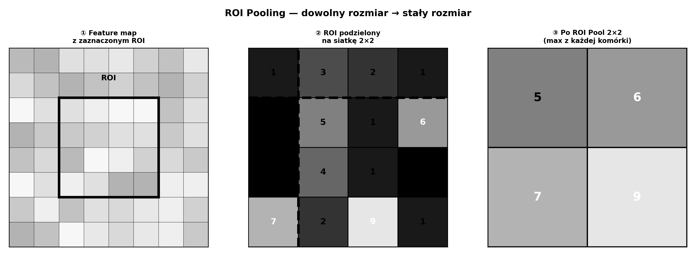

    Kluczowa sztuczka Fast R-CNN:
    CNN raz na CAŁY obraz → JEDNA feature mapa → ROI Pool 2000 regionów z TEJ SAMEJ mapy
    (zamiast 2000× odpalać CNN jak w R-CNN!)
    Przyspieszenie: ~2 sec/obraz (vs 50 sec) → 25× szybciej!

    Pseudokod ROI Pooling:
    def roi_pool(feature_map, roi_bbox, output_size=7):
        roi = feature_map[roi_bbox]              # wycinek z feature mapy
        h, w = roi.shape
        cell_h, cell_w = h // output_size, w // output_size
        output = zeros(output_size, output_size)
        for i in range(output_size):
            for j in range(output_size):
                cell = roi[i*cell_h:(i+1)*cell_h, j*cell_w:(j+1)*cell_w]
                output[i][j] = max(cell)         # max pooling w komórce
        return output   # stały rozmiar 7×7!

    CNN raz → feature map → ROI Pool 2000 regionów → FC → klasy + bbox

**Bbox regression (regresja prostokąta ograniczającego)** — sieć predykuje nie bezpośrednie współrzędne bbox, ale PRZESUNIĘCIA (offsets) od propozycji: Δx, Δy (przesunięcie środka), Δw, Δh (zmiana szerokości/wysokości).

    Propozycja (z RPN/Selective Search): (x=100, y=80,  w=60,  h=90)  ← przybliżone
    Predykcja regresji:                  (Δx=+5, Δy=-3, Δw=+10, Δh=+5)
    Ostateczny bbox:                     (x=105, y=77,  w=70,  h=95)  ← dokładniejsze!

    Dlaczego offsets a nie współrzędne bezpośrednio?
    Łatwiejsze zadanie! Sieć poprawia przybliżony prostokąt O TROCHĘ,
    zamiast zgadywać lokalizację od zera.
    Mnemonik: bbox regression = "GPS korekta" — masz przybliżoną pozycję,
    poprawiasz o parę metrów w prawo i w górę.

**Faster R-CNN (2015)** — ostatni krok ewolucji: zastąp Selective Search (osobny algorytm) siecią neuronową! **RPN (Region Proposal Network)** — mała sieć przesuwana po feature mapie, która w KAŻDEJ pozycji predykuje: "czy tu jest obiekt?" + proponuje bbox. Wszystko w jednej sieci, end-to-end.

    Pipeline Faster R-CNN:
    Obraz → CNN backbone (np. ResNet) → Feature Map → RPN (proposals) → ROI Pool → FC → klasy + bbox

    RPN krok po kroku:
    Feature mapa [40×60×256] ← z backbone
      ↓ Filtr 3×3 przesuwa się po feature mapie
      ↓ W KAŻDEJ pozycji (x,y) rozważ k=9 "anchor boxes":

        9 anchorów = 3 rozmiary × 3 proporcje:
        ┌───┐  ┌─────┐  ┌───────┐   ← 128×128, 256×256, 512×512
        │   │  │     │  │       │      × proporcje 1:1, 1:2, 2:1
        └───┘  └─────┘  └───────┘

      ↓ Dla KAŻDEGO z 9 anchorów sieć predykuje:
        - P(obiekt) = prawdopodobieństwo, że tu jest obiekt
        - (Δx, Δy, Δw, Δh) = przesunięcie bbox względem anchora

    40×60 = 2400 pozycji × 9 anchorów = 21 600 potencjalnych propozycji!
    → Weź ~300 z najwyższym P(obiekt) → ROI Pool → FC → klasy + bbox

    Faster R-CNN: ~5 fps (~0.2 sec/obraz) — 250× szybciej niż R-CNN!

    Mnemonik ewolucji R-CNN: "CORAZ MNIEJ MARNOWANIA"
    R-CNN:       Selective Search + 2000×CNN          = 50s  → WOLNE
    Fast R-CNN:  Selective Search + 1×CNN + ROI Pool   = 2s   → lepiej
    Faster R-CNN: RPN (w sieci!) + 1×CNN + ROI Pool   = 0.2s → 250× szybciej!

---

**One-stage detectors** — klasyfikacja i lokalizacja w jednym przejściu (bez osobnego etapu propozycji). Szybsze, ale historycznie mniej precyzyjne.

**YOLO (You Only Look Once, 2016)** — rewolucyjny pomysł: „po co robić 2 etapy, skoro można w JEDNYM?" Obraz dzielony jest na siatkę S×S (np. 13×13 = 169 komórek). Każda komórka odpowiada za wykrycie obiektu, którego ŚRODEK wpada w tę komórkę. Każda komórka predykuje:
- B bounding boxów × (x, y, w, h, confidence) = lokalizacja + „pewność, że tu jest obiekt"
- C prawdopodobieństw klas = „jaki to obiekt?"
Jedno przejście przez sieć → WSZYSTKIE detekcje naraz. 45-155 fps!

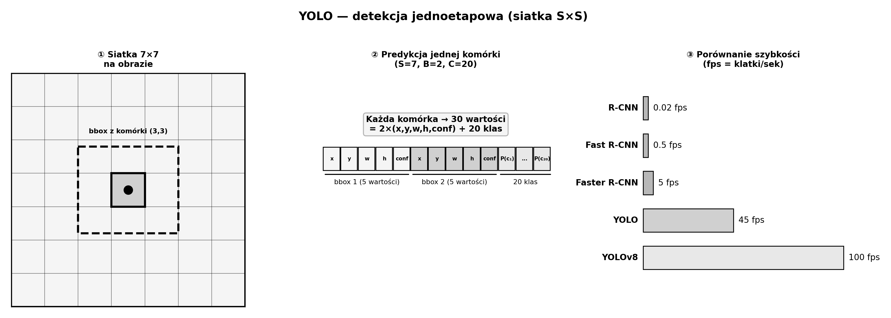

**SSD (Single Shot MultiBox Detector, 2016)** — ulepsza YOLO przez multi-scale feature maps: predykcje z WIELU warstw CNN, każda o innej rozdzielczości. Wczesne warstwy (wysoka rozdzielczość) wykrywają MAŁE obiekty; późne warstwy (niska rozdzielczość) wykrywają DUŻE. Anchor boxes predefiniowane na każdej skali.

**Anchor box (kotwica)** — predefiniowany prostokąt o określonym kształcie/proporcji (np. 1:1, 1:2, 2:1). Sieć NIE predykuje bbox od zera — predykuje PRZESUNIĘCIE (offset) od najbliższego anchora. Łatwiejsze zadanie! Wiele anchorów → pokrycie różnych kształtów obiektów (osoby = wysoki prostokąt, samochód = szeroki).

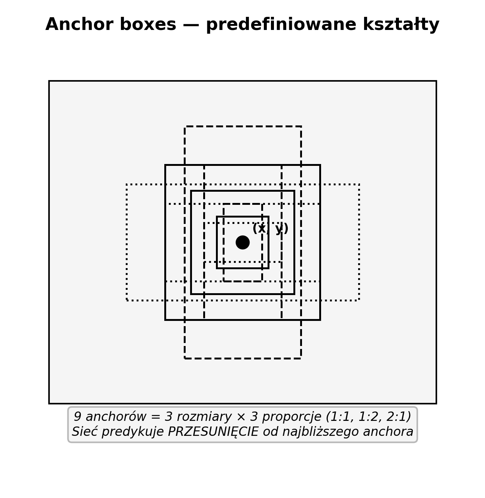

**Anchor-free** — nowoczesne podejście (FCOS, YOLOv8): bezpośrednia predykcja środka i wymiarów, bez predefiniowanych anchorów. Prostsza architektura, mniej hyperparametrów.

**Transformer** — architektura sieci neuronowej pierwotnie z NLP (2017, "Attention is All You Need"), ale skutecznie zaadaptowana do wizji komputerowej (ViT, DETR). Kluczowy mechanizm: **self-attention** — każdy element wejścia "patrzy" na WSZYSTKIE inne elementy i decyduje, które są dla niego ważne.

    W tekście: słowo "bank" patrzy na "rzeka" i "pieniądze" →
    attention decyduje: "w tym zdaniu chodzi o brzeg RZEKI, nie bank pieniędzy"

    W obrazie (DETR): fragment obrazu "patrzy" na inne fragmenty →
    attention: "ta łapa jest częścią TEGO kota, a nie tamtego psa"

**Self-attention (samo-uwaga)** — mechanizm: dla każdego elementu oblicz "uwagę" do KAŻDEGO innego elementu. Matematycznie: Query × Key → wagi attention → ważona suma Values.

    Uproszczony pseudokod:
    def self_attention(features):         # features = N elementów
        Q = features × W_query            # Query: "czego szukam?"
        K = features × W_key              # Key: "co oferuję?"
        V = features × W_value            # Value: "jaką informację niosę?"

        attention = softmax(Q × K^T / sqrt(d))  # macierz N×N: "kto ważny dla kogo"
        output = attention × V                   # ważona kombinacja wartości
        return output

    Złożoność: O(n^2) — każdy element z każdym → wolne dla dużych obrazów.
    Dlatego DETR wolniej się TRENUJE niż YOLO (ale architektura jest PROSTSZA).

**DETR (DEtection TRansformer, 2020)** — model Facebooka stosujący Transformer do detekcji. Radykalnie prostszy pipeline: BRAK anchorów, BRAK NMS! Sieć predykuje bezpośrednio ZESTAW N obiektów (np. N=100).

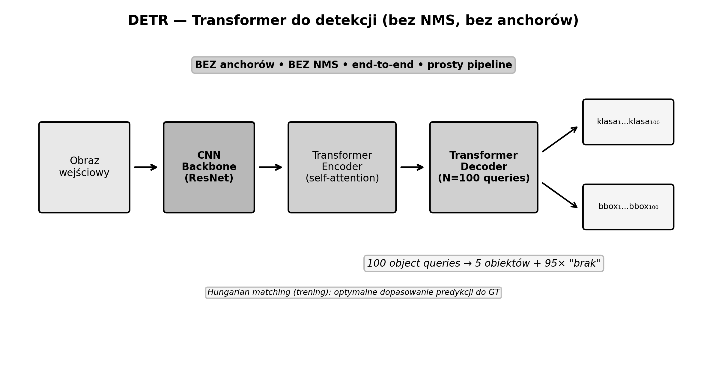

    "Object queries" = 100 wyuczonych wektorów, każdy "szuka" jednego obiektu.
    Obraz z 5 obiektami → 5 queries dopasuje się do obiektów,
    95 queries zwróci klasę "brak obiektu" (empty set).

    Pseudokod DETR:
    def detr_forward(image):
        features = backbone(image)                # ResNet → feature mapa
        encoded = transformer_encoder(features)   # self-attention na feat. mapie
        queries = learnable_queries(100)           # 100 wyuczonych zapytań
        decoded = transformer_decoder(queries, encoded)  # cross-attention
        predictions = []
        for q in decoded:
            cls = classify(q)      # "samochód" / "pies" / "brak"
            box = regress(q)       # (x, y, w, h)
            predictions.append((cls, box))
        return predictions         # 100 predykcji (większość = brak)

    Mnemonik DETR: "Detekcja Eliminująca Trikowe Redundancje"
    → bez NMS, bez anchorów, prosty pipeline.

**Hungarian matching (dopasowanie węgierskie)** — algorytm używany podczas TRENINGU DETR. Problem: sieć daje 100 predykcji, na obrazie jest 5 obiektów — która predykcja odpowiada któremu obiektowi? Algorytm węgierski znajduje OPTYMALNE dopasowanie 1:1 minimalizując łączny koszt (błąd klasy + błąd bbox).

    Predykcje DETR:           Ground truth:
    pred_1: "samochód"        gt_1: "samochód" (bbox A)
    pred_2: "pies"            gt_2: "pies" (bbox B)
    pred_3: "brak"
    ...                       Hungarian matching:
    pred_100: "brak"          pred_1 ↔ gt_1 (najlepsze dopasowanie!)
                              pred_2 ↔ gt_2
                              reszta ↔ "brak obiektu"

    Efekt: BRAK DUPLIKATÓW → BRAK NMS!
    (Każdy obiekt dopasowany do DOKŁADNIE jednej predykcji)

---

**NMS (Non-Maximum Suppression, tłumienie nie-maksymalnych)** — algorytm post-processingu usuwający ZDUPLIKOWANE detekcje. Problem: detektor generuje WIELE nakładających się bbox dla tego samego obiektu. NMS zachowuje NAJLEPSZĄ i usuwa resztę. Jedyny detektor BEZ NMS = DETR.

    Algorytm NMS krok po kroku:
    Wejście: detekcje posortowane malejąco po confidence
    [bbox_1 conf=0.95], [bbox_2 conf=0.90], [bbox_3 conf=0.85], [bbox_4 conf=0.40]

    Pseudokod NMS:
    def nms(detections, iou_threshold=0.5):
        detections.sort(by=confidence, descending=True)
        keep = []
        while detections:
            best = detections.pop(0)        # weź najlepszą
            keep.append(best)               # ZACHOWAJ ją
            detections = [d for d in detections
                          if iou(best, d) < iou_threshold]  # usuń nakładające
        return keep

    Krok 1: Weź bbox_1 (0.95) → ZACHOWAJ
    Krok 2: IoU(bbox_1, bbox_2) = 0.82 > 0.5 → USUŃ (duplikat tego samego kota!)
            IoU(bbox_1, bbox_3) = 0.75 > 0.5 → USUŃ (duplikat!)
            IoU(bbox_1, bbox_4) = 0.10 < 0.5 → ZACHOWAJ (INNY obiekt!)
    Krok 3: Wynik: [bbox_1, bbox_4] — 2 unikalne obiekty

    Mnemonik: NMS = "Najlepszy Ma Się dobrze" — zachowaj najlepszą, usuń resztę.

**IoU (Intersection over Union)** — miara nakładania dwóch prostokątów. IoU = pole przecięcia / pole sumy. Wartości: 0.0 (nie nakładają się) do 1.0 (identyczne).

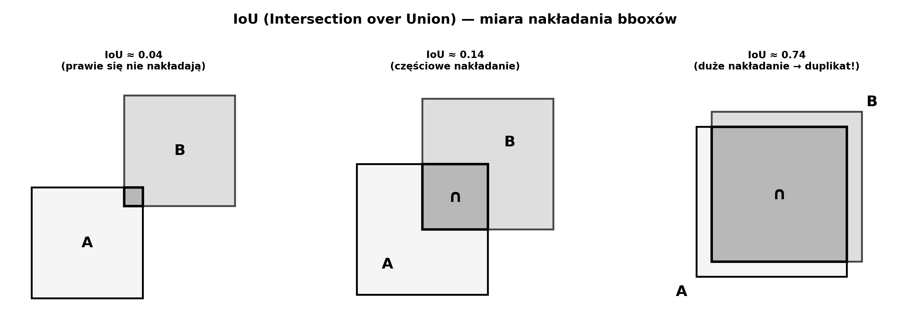

    IoU = pole(∩) / pole(A ∪ B)
        = pole(∩) / (pole(A) + pole(B) − pole(∩))

    Przykład liczbowy:
    A = [0, 0, 100, 100]    → pole = 10 000
    B = [50, 50, 150, 150]  → pole = 10 000
    ∩ = [50, 50, 100, 100]  → pole = 2 500
    IoU = 2500 / (10000 + 10000 − 2500) = 2500 / 17500 ≈ 0.14

    IoU > 0.5 w NMS → "to TEN SAM obiekt" → usuń słabszą detekcję
    IoU > 0.5 w mAP → "detekcja TRAFNA" → poprawna lokalizacja

---

**Jak zbudować detektor z klasyfikatora? Trzy podejścia (+ bonus):**
1. **Sliding window** — wytnij, sklasyfikuj, NMS. Bardzo wolne (miliony klasyfikacji).
2. **Region proposals + klasyfikator** — Selective Search → ~2000 regionów → klasyfikuj + NMS. Wolne ale działa (= R-CNN).
3. **Fine-tune backbone** — weź pretrained classifier (ResNet z ImageNet), dodaj detection head (bbox regression + cls), dotrenuj na danych detekcyjnych. **Najlepsza jakość** (= Faster R-CNN, YOLO, SSD).
4. **Transformer (DETR)** — bez anchorów, bez NMS, predykcja zestawu obiektów end-to-end.

---

### Problem: czym jest detekcja obiektów?

Detekcja obiektów to **lokalizacja** (gdzie?) i **klasyfikacja** (co?) obiektów na obrazie. Wynik: lista krotek **(klasa, bounding box, confidence)**.

    Wejście:   zdjęcie ulicy
    Wynik:     [("samochód", [50,30,200,180], 0.95),
                ("pieszy",   [300,100,350,250], 0.88),
                ("rower",    [400,150,480,300], 0.72)]

**Porównanie z innymi zadaniami:**

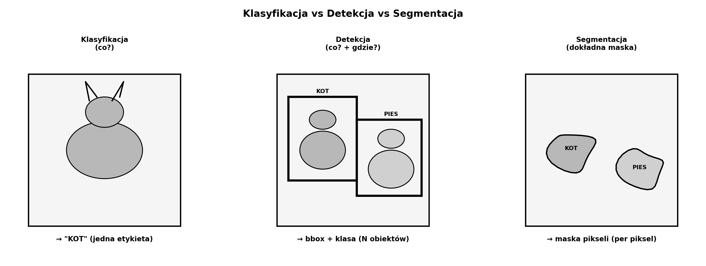

---

### Metody klasyczne

Metody sprzed deep learningu — ręcznie projektowane cechy (features) + klasyczny klasyfikator.

| Metoda | Rok | Cechy | Klasyfikator | Szybkość | Use case |
|--------|-----|-------|-------------|----------|----------|
| **HOG + SVM** | 2005 | Histogram of Oriented Gradients | SVM | wolna (~1 fps) | detekcja pieszych |
| **Viola-Jones** | 2001 | Haar features + Integral Image | AdaBoost cascade | real-time (30+ fps) | detekcja twarzy |

#### HOG + SVM (Dalal & Triggs, 2005) — krok po kroku

**Mnemonik kroków HOG: „GÓRA KOCHA BOGATYCH NARCIARZY" → Gradienty → Orientacja → Komórki → Bloki → Normalizacja**

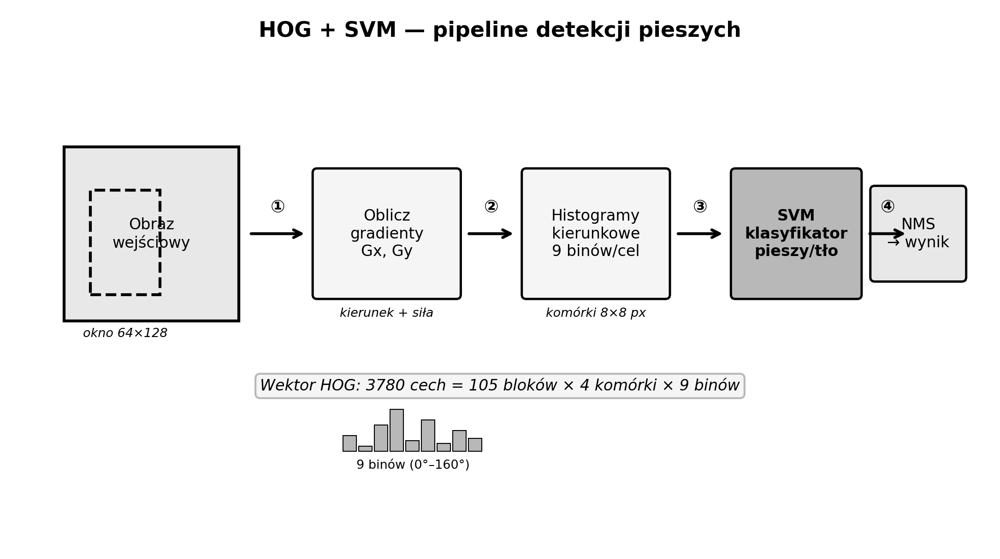

**Krok 1 — Gradienty (G jak GÓRA):** Oblicz gradient KAŻDEGO piksela. Gradient = „siła i kierunek zmiany jasności". Tam, gdzie jasność skacze (np. 50→200), jest krawędź.

    Przykład liczbowy:
    Piksele w wierszu: [50, 50, 200]
    Gx = pixel[x+1] − pixel[x−1] = 200 − 50 = 150  ← silna krawędź pionowa!
    Gy = analogicznie w pionie
    Siła: magnitude = √(Gx² + Gy²) = √(150² + 0²) = 150
    Kierunek: direction = arctan(Gy/Gx) = arctan(0/150) = 0° (krawędź pionowa)

**Krok 2 — Orientacja (O jak KOCHA):** Każdy piksel głosuje na kierunek swojej krawędzi. 9 „koszyków" (binów) co 20°: 0°, 20°, 40°, …, 160°. Głos ważony SIŁĄ gradientu (silniejsza krawędź = mocniejszy głos).

    Piksel z magnitude=150, direction=10°:
    Głosuje na bin 0° (z wagą proporcjonalną do bliskości) i bin 20°
    Piksel z magnitude=30, direction=85°:
    Głosuje na bin 80° i bin 100° (słabsza krawędź = słabszy głos)

**Krok 3 — Komórki (K jak BOGATYCH):** Podziel okno (64×128 px) na komórki 8×8 pikseli = 8×16 = 128 komórek. Dla KAŻDEJ komórki stwórz histogram 9 binów — to jej „odcisk palca kierunkowości krawędzi".

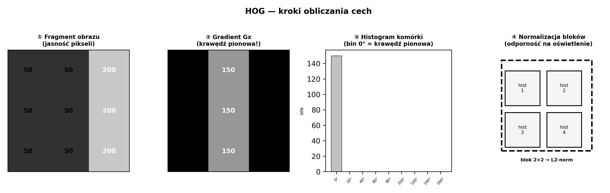

**Krok 4 — Bloki (B jak NARCIARZY):** Grupuj komórki w bloki 2×2 (= 16×16 px). Przesuwaj blok z krokiem 1 komórki. Okno 64×128 → (8−1)×(16−1) = 7×15 = 105 bloków.

**Krok 5 — Normalizacja (N):** Dla KAŻDEGO bloku (4 komórki × 9 binów = 36 wartości) wykonaj normalizację L2 → odporność na zmiany oświetlenia. 105 bloków × 36 = **3780 cech** → wektor HOG.

    Pseudokod:
    def compute_hog(window_64x128):
        Gx = pixel[x+1] - pixel[x-1]          # gradient poziomy
        Gy = pixel[y+1] - pixel[y-1]          # gradient pionowy
        mag = sqrt(Gx**2 + Gy**2)             # siła
        dir = arctan2(Gy, Gx) * 180 / pi     # kierunek 0°-180°

        hog = []
        for block_2x2 in sliding_blocks(cells_8x8):
            block_hist = []
            for cell in block_2x2:                 # 4 komórki
                hist = [0]*9                       # 9 binów
                for px in cell.pixels:             # 64 piksele
                    bin = int(dir[px] / 20)        # który bin?
                    hist[bin] += mag[px]           # ważone głosowanie
                block_hist += hist
            block_hist = L2_normalize(block_hist)  # normalizacja!
            hog += block_hist
        return hog  # wektor 3780 cech → do SVM

**Krok 6 — SVM klasyfikuje:** Wektor 3780 cech → SVM odpowiada: „pieszy" (+1) lub „tło" (−1).

    Mnemonik SVM: „LINIA MAKSYMALNEGO ODDECHU"
    SVM = linia (hiperpłaszczyzna) z MAKSYMALNYM marginesem.
    Jak MOST nad rzeką — im szerszy, tym bezpieczniejszy (lepiej generalizuje).

**Krok 7 — NMS:** Usuń duplikaty (wiele okien wykryło tego samego pieszego → zachowaj najlepsze).

    Mnemonik PEŁNEGO pipeline'u HOG+SVM: „GOKBN-SN"
    → Gradienty → Orientacja → Komórki → Bloki → Normalizacja → SVM → NMS
    = „Grasz Ostro, Kumplu? Bądź Naturalny, Szybko Nabierz (wprawy)!"

---

#### Viola-Jones (2001) — krok po kroku

**Mnemonik 3 innowacji: „HIC" → Haar + Integral Image + Cascade**

**Innowacja 1 — Haar features (H):** Prostokąty dzielone na jasną i ciemną część. Wartość = Σ(jasna) − Σ(ciemna). Proste, ale wykrywają kontrasty typowe dla twarzy.

    Pseudokod cechy Haar:
    def haar_edge_vertical(img, x, y, w, h):
        left_sum  = sum_pixels(img, x, y, x+w//2, y+h)    # jasna połówka
        right_sum = sum_pixels(img, x+w//2, y, x+w, y+h)  # ciemna połówka
        return left_sum - right_sum   # duża wartość = silna krawędź

    Mnemonik: Haar = „Hej, A tu jest Różnica?"
    Cechy Haar pytają: „Czy lewa strona JAŚNIEJSZA niż prawa?"

**Innowacja 2 — Integral Image (I):** Precomputed tabela: suma DOWOLNEGO prostokąta w O(1) — 4 odczyty z tabeli, niezależnie od rozmiaru!

    Pseudokod:
    def build_integral_image(img):
        II = zeros(H, W)
        for y in range(H):
            for x in range(W):
                II[y][x] = img[y][x] + II[y-1][x] + II[y][x-1] - II[y-1][x-1]
        return II

    def rect_sum(II, x1, y1, x2, y2):    # ZAWSZE O(1)!
        return II[y2][x2] - II[y1-1][x2] - II[y2][x1-1] + II[y1-1][x1-1]

    Mnemonik: Integral Image = „4 Odczyty I Gotowe!" = 4OIG
    Jak czytanie z gotowej tabeli: nie liczymy, tylko odczytujemy!

**Innowacja 3 — Cascade (C):** Kaskada etapów — szybkie odrzucanie „na pewno nie-twarz".

    Pseudokod:
    def cascade_classify(window):
        for stage in [stage_1, stage_2, ..., stage_25]:
            score = sum(stage.weights[i] * haar_feature[i](window)
                        for i in stage.features)
            if score < stage.threshold:
                return "NIE-TWARZ"      # szybkie odrzucenie!
        return "TWARZ"                  # przeszło WSZYSTKIE etapy

    Mnemonik: Cascade = „SITO z coraz drobniejszymi oczkami"
    Etap 1: sito o dużych oczkach → odpada piach (oczywiste nie-twarze)
    Etap 25: sito najdrobniejsze → zostaje ZŁOTO (twarz)
    99% okien odpada w pierwszych 3 etapach → REAL-TIME!

**Pełny pipeline Viola-Jones:**

    1. Sliding window (24×24) po obrazie w wielu skalach
    2. Integral Image (preprocessing, O(n) — raz)
    3. Dla każdego okna: kaskada (Haar + AdaBoost, najczęściej odrzuci w 1-3 etapie)
    4. NMS na detekcjach → wynik

    Mnemonik pipeline'u: „SIKN" = Sliding → Integral → Kaskada → NMS
    = „Szybko Identyfikuj Kształty Niezwykłe!"

---

### Deep learning

**Two-stage detectors (dwuetapowe)** — najpierw generuj propozycje regionów, potem klasyfikuj.

| Model | Rok | Propozycje | Szybkość | Innowacja |
|-------|-----|-----------|----------|----------|
| **R-CNN** | 2014 | Selective Search (~2000) | 50 sec/img (!) | CNN per region |
| **Fast R-CNN** | 2015 | Selective Search | ~2 sec/img | CNN raz + ROI Pooling |
| **Faster R-CNN** | 2015 | RPN (w sieci!) | ~5 fps | Region Proposal Network |

    Ewolucja R-CNN:
    R-CNN:       [Selective Search] → 2000 × [CNN] → 2000 × [SVM]    = 50s WOLNE!
    Fast R-CNN:  [CNN raz] → [ROI Pool 2000 regionów] → [FC]          = 2s lepiej
    Faster R-CNN:[CNN] → [RPN generuje propozycje] → [ROI Pool] → [FC] = 0.2s!

**One-stage detectors (jednoetapowe)** — klasyfikacja i lokalizacja w JEDNYM przejściu.

| Model | Rok | Szybkość | Innowacja |
|-------|-----|----------|----------|
| **YOLO** | 2016 | 45-155 fps | siatka S×S, jedno przejście |
| **SSD** | 2016 | 46-59 fps | multi-scale feature maps |
| **YOLOv8** | 2023 | 100+ fps | anchor-free, SOTA |
| **DETR** | 2020 | ~40 fps | transformer, bez NMS |

    YOLO:
    Obraz [416×416] → siatka 13×13 → każda komórka predykuje:
      - B bounding boxów (pozycja + rozmiar + confidence)
      - C klas (prawdopodobieństwa)
    Jedno forward pass → WSZYSTKIE detekcje naraz → NMS → wynik

**Two-stage vs One-stage:**

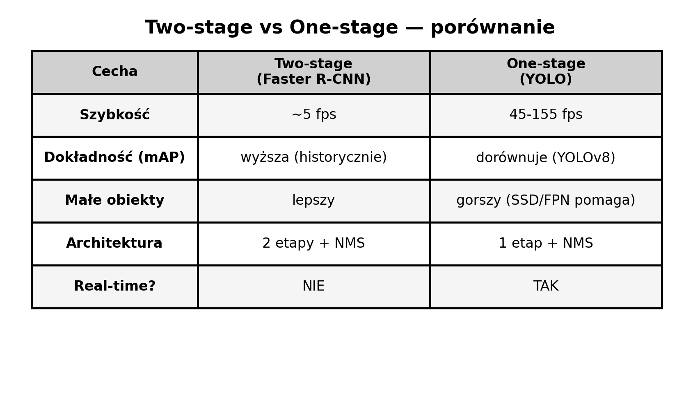

---

### Jak zbudować detektor z klasyfikatora?

Masz wytrenowany klasyfikator (np. ResNet na ImageNet: obraz → „kot"). Jak go użyć do **lokalizacji** obiektów?

**Mnemonik 3 podejść: „SRF" = „Sliding → Region → Fine-tune" = „Szukaj Ręcznie, Finalnie optymalizuj!"**

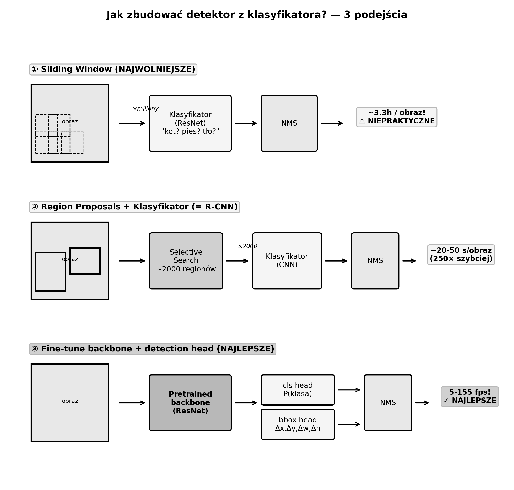

---

#### Podejście 1 — Sliding Window (najprostsze, NAJWOLNIEJSZE)

**Idea:** Wycinaj prostokątne fragmenty obrazu, KAŻDY pokaż klasyfikatorowi, zbierz pozytywne.

**Mnemonik: „WYCINAJ i PYTAJ" — jak wycinanie ciasteczek: koło po kole, aż cały obraz pokryty.**

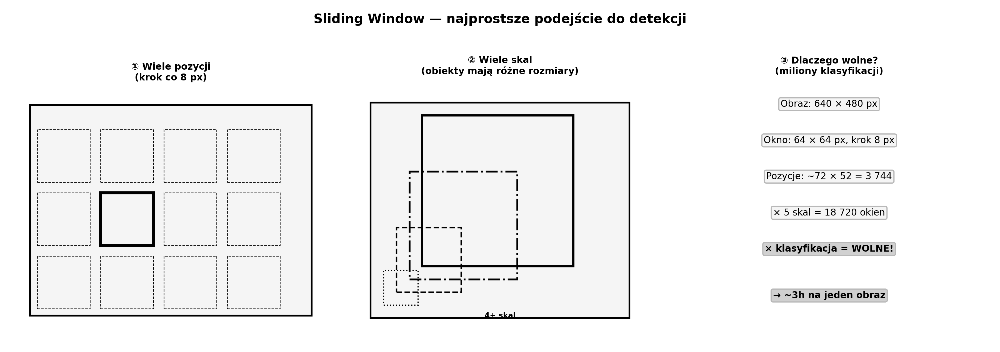

    Pseudokod:
    def sliding_window_detect(image, classifier, window_size=64, step=8):
        detections = []
        for scale in [0.5, 0.75, 1.0, 1.5, 2.0]:        # 5 skal
            resized = resize(image, scale)
            for y in range(0, resized.height - window_size, step):
                for x in range(0, resized.width - window_size, step):
                    window = resized[y:y+window_size, x:x+window_size]
                    label, confidence = classifier.predict(window)
                    if label != "tło" and confidence > 0.5:
                        # przelicz współrzędne na oryginał
                        bbox = (x/scale, y/scale,
                                (x+window_size)/scale, (y+window_size)/scale)
                        detections.append((label, bbox, confidence))
        return nms(detections)   # usuń duplikaty

**Dlaczego wiele skal?** Obiekty mają różne rozmiary — kot blisko = duży, kot daleko = mały. Okno 64×64 nie złapie kota 200×200.

    Obliczenia dla obrazu 640×480:
    Pozycje na skali 1.0: (640-64)/8 × (480-64)/8 = 72 × 52 = 3 744
    × 5 skal = 18 720 okien
    × klasyfikacja ResNet (~10ms/obraz na GPU) = ~3 minuty
    × na CPU (~100ms/obraz) = ~30 minut na 1 obraz!
    ⚠ NIEPRAKTYCZNE dla zastosowań real-time

**Wady:** (1) Ekstremalnie wolne. (2) Stały kształt okna — obiekty nie są kwadratowe. (3) ~99.9% okien to „tło" → marnowanie czasu.

---

#### Podejście 2 — Region Proposals + Klasyfikator (= R-CNN)

**Idea:** Zamiast milionów okien, inteligentnie zaproponuj ~2000 regionów, w których MOGĄ być obiekty, i tylko te sklasyfikuj.

**Mnemonik: „INTELIGENTNE CIĘCIE" — zamiast kroić cały tort na milion kawałków, wytnij tylko tam, gdzie widzisz wiśnie (obiekty).**

    Pseudokod (= R-CNN):
    def region_proposal_detect(image, classifier):
        # Krok 1: Selective Search — inteligentnie generuj regiony
        proposals = selective_search(image)    # ~2000 prostokątów
        detections = []

        # Krok 2: Dla KAŻDEGO regionu — clasificuj
        for bbox in proposals:                 # ~2000 iteracji (nie milion!)
            crop = image[bbox]                 # wytnij region
            crop = resize(crop, 224, 224)      # rozmiar wymagany przez CNN
            features = cnn_backbone(crop)      # ResNet → wektor 2048 cech
            label, conf = svm_classify(features)  # SVM: "samochód? kot? tło?"
            if label != "tło" and conf > 0.5:
                detections.append((label, bbox, conf))

        # Krok 3: bbox regression — doprecyzuj pozycje
        for det in detections:
            det.bbox += bbox_regressor(det.features)  # Δx, Δy, Δw, Δh

        return nms(detections)   # Krok 4: usuń duplikaty

**Dlaczego 2000 a nie milion?** Selective Search łączy podobne fragmenty obrazu (kolor, tekstura) bottom-up. Wynik: ~2000 „mądrych" propozycji, z których ~50% zawiera coś (vs 0.1% w sliding window).

    Porównanie z sliding window:
    Sliding Window: ~18 000 okien × 10ms = ~3 min
    Proposals:      ~2 000 regionów × 10ms = ~20 sec ← 9× szybciej
    ALE wciąż 2000 × forward pass CNN → dlatego powstał Fast R-CNN!

**Wady:** (1) Selective Search jest osobnym algorytmem (nie end-to-end). (2) 2000 × forward pass CNN = wciąż wolno. (3) SVM trenowany OSOBNO od CNN.

---

#### Podejście 3 — Fine-tune backbone + detection head (NAJLEPSZE)

**Idea:** Weź pretrenowany klasyfikator, ODETNIJ głowicę klasyfikacyjną (FC 1000 klas), zastąp ją DWOMA nowymi głowicami: (1) głowica klasyfikacji → klasa obiektu, (2) głowica regresji → pozycja bbox.

**Mnemonik: „PRZESZCZEP GŁOWY" — ten sam silnik (backbone), nowa głowa (detection head).**

    Pseudokod (= Faster R-CNN / YOLO w uproszczeniu):
    # KROK 1: Weź pretrenowany klasyfikator
    resnet = load_pretrained("resnet50_imagenet")  # 1000 klas ImageNet

    # KROK 2: Odetnij starą głowicę klasyfikacji
    backbone = resnet.layers[:-2]    # ZACHOWAJ: Conv1...Conv5 (ekstraktor cech)
    # WYRZUĆ: FC(1000) + Softmax

    # KROK 3: Dodaj nowe głowice detekcji
    class DetectionHead:
        def __init__(self):
            self.cls_head = Linear(2048, num_classes)    # "samochód? kot? tło?"
            self.bbox_head = Linear(2048, 4)             # Δx, Δy, Δw, Δh

        def forward(self, features):
            cls = softmax(self.cls_head(features))       # P(klasa)
            bbox = self.bbox_head(features)              # przesunięcie bbox
            return cls, bbox

    # KROK 4: Zamroź backbone, trenuj głowice na danych detekcyjnych
    for image, gt_boxes, gt_labels in coco_dataset:
        features = backbone(image)          # pretrenowane cechy (zamrożone)
        cls, bbox = detection_head(features)
        loss = cls_loss(cls, gt_labels) + bbox_loss(bbox, gt_boxes)
        loss.backward()                     # aktualizuj TYLKO detection_head

    # KROK 5 (opcja): Fine-tune — odmroź backbone z MAŁYM learning rate
    backbone.unfreeze()
    optimizer = SGD(lr=0.0001)    # 10× mniejszy niż dla głowicy!
    # trenuj jak w kroku 4, ale teraz backbone też się uczy

**Dlaczego to działa?** Pretrenowany backbone na ImageNet „wie", jak wyglądają krawędzie, tekstury, kształty. Te cechy są UNIWERSALNE — przydają się zarówno do klasyfikacji „złota rybka vs samolot" jak i do detekcji „samochód na zdjęciu z drona".

    Transfer learning w liczbach:
    Trenowanie od zera na COCO (330K obrazów):     ~12h na 8×V100 GPU
    Fine-tune pretrained ResNet-50:                ~4h na 8×V100 GPU ← 3× szybciej!
    Fine-tune osiąga mAP ~42%, od zera ~38%        ← lepsze wyniki!

**Pełny przykład w PyTorch (Faster R-CNN z pretrained backbone):**

    import torchvision
    from torchvision.models.detection import fasterrcnn_resnet50_fpn

    # Gotowy detektor z pretrained backbone!
    model = fasterrcnn_resnet50_fpn(pretrained=True)

    # Custom: zmiana na 5 klas (zamiast 91 COCO)
    num_classes = 5  # 4 obiekty + tło
    in_features = model.roi_heads.box_predictor.cls_score.in_features
    model.roi_heads.box_predictor = FastRCNNPredictor(in_features, num_classes)

    # Trening:
    model.train()
    for images, targets in dataloader:
        loss_dict = model(images, targets)  # cls_loss + bbox_loss
        total_loss = sum(loss_dict.values())
        total_loss.backward()
        optimizer.step()

    # Inferencja:
    model.eval()
    predictions = model([test_image])
    # predictions = [{'boxes': tensor, 'labels': tensor, 'scores': tensor}]
    # boxes = [[x1,y1,x2,y2], ...], labels = [1, 3, ...], scores = [0.95, 0.88, ...]

---

#### Podsumowanie — porządek od NAJGORSZEGO do NAJLEPSZEGO:

    Podejście          Okien      Czas/obraz    Jakość     Rok     Przykład
    ──────────────────────────────────────────────────────────────────────────
    Sliding Window     ~milion    ~30 min       niska      -       (teoria)
    Region Proposals   ~2000     ~20-50 sec     średnia    2014    R-CNN
    Fine-tune + RPN    ~300      ~0.2 sec       wysoka     2015    Faster R-CNN
    One-stage          1×siatka  ~7-22 ms       wysoka     2016+   YOLO, SSD
    Transformer        N queries  ~25 ms        wysoka     2020    DETR

    Mnemonik porządku: „SRFTD" = „Sliding → Region → Fine-tune → Transformer → (Done!)"
    = „Szukaj Ręcznie, Finalnie Transformer (Detekuje!)"

---

### NMS (Non-Maximum Suppression) — post-processing

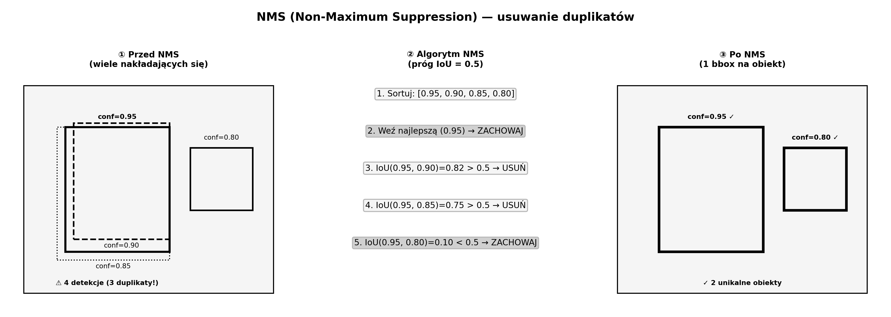

    Detektor generuje WIELE nakładających się bbox dla jednego obiektu:
    [bbox1, 0.95], [bbox2, 0.90], [bbox3, 0.85] — wszystkie na tym samym kocie

    Pseudokod NMS:
    def nms(detections, iou_threshold=0.5):
        detections.sort(by=confidence, descending=True)
        keep = []
        while detections:
            best = detections.pop(0)        # weź najlepszą
            keep.append(best)               # ZACHOWAJ
            detections = [d for d in detections
                          if iou(best, d) < iou_threshold]  # usuń nakładające
        return keep

    Krok po kroku (przykład):
    1. Sortuj: [0.95, 0.90, 0.85, 0.40]
    2. Weź bbox₁ (0.95) → ZACHOWAJ
    3. IoU(bbox₁, bbox₂) = 0.82 > 0.5 → USUŃ (duplikat!)
       IoU(bbox₁, bbox₃) = 0.75 > 0.5 → USUŃ (duplikat!)
       IoU(bbox₁, bbox₄) = 0.10 < 0.5 → ZACHOWAJ (INNY obiekt!)
    4. Wynik: [bbox₁, bbox₄] — 2 unikalne obiekty

    Mnemonik NMS: „Najlepszy Ma Się dobrze" — zachowaj najlepszą, resztę wyrzuć
    Mnemonik IoU: „Ile pokrycia Ustalono?" — pole(∩) / pole(A∪B)

### Etymologia

**CNN** — Convolutional Neural Network (sieć z konwolucjami). **YOLO** — You Only Look Once (Joseph Redmon et al., 2016). **R-CNN** — Region-based CNN (Ross Girshick, 2014). **HOG** — Histogram of Oriented Gradients (Dalal & Triggs, 2005). **SVM** — Support Vector Machine (Vapnik, 1995). **Viola-Jones** — Paul Viola + Michael Jones (2001). **DETR** — DEtection TRansformer (Facebook AI, 2020). **SSD** — Single Shot MultiBox Detector (Liu et al., 2016). **NMS** — Non-Maximum Suppression; tłumienie nie-maksymalnych detekcji. **ROI** — Region of Interest (region zainteresowania). **RPN** — Region Proposal Network (sieć propozycji regionów). **FPN** — Feature Pyramid Network (piramida cech). **IoU** — Intersection over Union (przecięcie przez sumę). **FC** — Fully Connected (w pełni połączona). **ReLU** — Rectified Linear Unit (wyprostowana jednostka liniowa). **mAP** — mean Average Precision (średnia precyzja).

### Jak zapamiętać

- **CNN = „Czytaj Nie Naraz"** — małe filtry 3×3 przesuwane po obrazie, nie cały obraz naraz
- **Hierarchia CNN: „K-R-F-O" = „Każdy Rycerz Znajduje Obiekt"** — Krawędzie → Rogi → Fragmenty → Obiekty
- **FC = „Full Connection"** — każdy z każdym, warstwa decyzyjna na końcu CNN
- **Backbone = SILNIK samochodu** — ten sam silnik (ResNet), różne karoserie (klasyfikacja/detekcja/segmentacja)
- **Backbone'y: A→V→R = „Architektura Bardzo Rezylientna"** — AlexNet (2012) → VGG (2014) → ResNet (2015)
- **Transfer learning = „PRZESZCZEP GŁOWY"** — nie ucz się od zera, przenieś wiedzę z ImageNet, zmień głowicę
- **HOG kroki: „GOKBN" = „Grasz Ostro, Kumplu? Bądź Naturalny"** — Gradienty → Orientacja → Komórki → Bloki → Normalizacja
- **SVM = „LINIA MAKSYMALNEGO ODDECHU"** — margines jak most: im szerszy, tym bezpieczniej
- **Viola-Jones: „HIC" = Haar + Integral Image + Cascade**
- **Haar = „Hej, A tu jest Różnica?"** — porównuje jasne i ciemne prostokąty
- **Integral Image = „4 Odczyty I Gotowe" (4OIG)** — suma dowolnego prostokąta O(1)
- **Kaskada = „SITO"** — piach odpada wcześnie, złoto (twarz) zostaje na końcu
- **Viola-Jones pipeline: „SIKN" = „Szybko Identyfikuj Kształty Niezwykłe"** — Sliding → Integral → Kaskada → NMS
- **AdaBoost = „ADAptacyjnie BOOSTuj"** — słabe modele razem = silny
- **Selective Search** — inteligentne łączenie regionów zamiast milionów okien
- **ROI Pooling** — dowolny rozmiar → stały rozmiar (siatkowanie + max)
- **Bbox regression = „GPS korekta"** — popraw przybliżoną pozycję o Δx, Δy, Δw, Δh
- **Ewolucja R-CNN: „CORAZ MNIEJ MARNOWANIA"** — R-CNN (50s) → Fast (2s) → Faster (0.2s)
- **YOLO = „You Only Look Once"** — jednoetapowy, szybki, siatka S×S
- **Faster R-CNN = CNN + RPN + ROI Pool** — dwuetapowy, dokładny
- **NMS = „Najlepszy Ma Się dobrze"** — zachowaj najlepszą detekcję, usuń duplikaty
- **IoU = „Ile pokrycia Ustalono?"** — pole(∩) / pole(A∪B)
- **DETR = „Detekcja Eliminująca Trikowe Redundancje"** — bez NMS, bez anchorów, transformer
- **Detektor z klasyfikatora: „SRF" = „Szukaj Ręcznie, Finalnie optymalizuj!"** — Sliding Window (wolno) → Region Proposals (lepiej) → Fine-tune backbone (najlepiej)

\newpage

## PYTANIE 25: Prawo Amdahla — przyspieszenie równoległe

**Oszacować przyspieszenie. Co osłabia ograniczenie?**

---

### Tło pojęciowe — słowniczek

**Obliczenia równoległe (parallel computing)** — wykonanie wielu operacji jednocześnie na wielu procesorach/rdzeniach. Cel: przyspieszenie obliczeń. Nie każdy program da się w pełni zrównoleglić — zawsze jest część sekwencyjna (inicjalizacja, agregacja wyników, I/O).

    Sekwencyjnie (1 rdzeń): ████████████  12 sec
    Równolegle (4 rdzenie):  ███         3 sec (część równoległa)
                             ██           2 sec (część sekwencyjna)
                             Razem:       5 sec (nie 3!)

**Przyspieszenie (speedup)** — stosunek czasu sekwencyjnego do równoległego: S(n) = T_seq / T_par(n). Idealne przyspieszenie na n procesorach = n (liniowe). W praktyce zawsze mniej z powodu części sekwencyjnej i overheadów.

---

**Prawo Amdahla (Amdahl's Law)** — określa MAKSYMALNE przyspieszenie programu przy zrównolegleniu na n procesorach. Kluczowe parametry:
- **p** — część programu, którą DA SIĘ zrównoleglić (0 ≤ p ≤ 1)
- **(1-p)** — część sekwencyjna (nie do zrównoleglenia)
- **n** — liczba procesorów

**Wzór:**

    S(n) = 1 / ((1-p) + p/n)

**Dlaczego tak?** Czas sekwencyjny = 1. Część sekwencyjna zajmuje (1-p), nie przyspiesza. Część równoległa trwa p/n. Suma = nowy czas.

**Maksymalne przyspieszenie (n→∞):**

    S_max = 1/(1-p)

    p=90% (10% sekwencyjne) → S_max = 1/0.10 = 10x
    p=95% (5% sekwencyjne)  → S_max = 1/0.05 = 20x
    p=99% (1% sekwencyjne)  → S_max = 1/0.01 = 100x

**Kluczowy wniosek:** nawet z nieskończoną liczbą procesorów, 10% sekwencyjnego kodu ogranicza przyspieszenie do 10x! Sekwencyjna część dominuje.

**Przykład liczbowy: p=90%, n=4:**

    S(4) = 1 / (0.10 + 0.90/4) = 1 / (0.10 + 0.225) = 1/0.325 ≈ 3.08x
    Z 4 procesorów uzyskamy ~3.08x, NIE 4x!

---

**Prawo Gustafsona (Gustafson's Law)** — alternatywna perspektywa osłabiająca ograniczenie Amdahla. Zamiast „przyspiesz stały problem" → „rozwiąż WIĘKSZY problem w tym samym czasie".

    S = 1 − p + p·n    (scaled speedup)

Dla p=90%, n=100: Gustafson → S = 1 - 0.9 + 0.9×100 = 90.1x (vs Amdahl: ~10x!)

**Strong scaling (Amdahl)** — stały rozmiar problemu, więcej procesorów.
**Weak scaling (Gustafson)** — rozmiar problemu rośnie proporcjonalnie do procesorów. W praktyce: więcej rdzeni → większa symulacja, więcej danych, wyższa rozdzielczość.

---

**Efektywność (efficiency):** E(n) = S(n)/n — ile z dodanych procesorów jest naprawdę wykorzystane. E(4)=3.08/4=0.77 → 77% efektywności. Spada z n.

**Overhead synchronizacji** — dodatkowy koszt koordynacji między wątkami/procesami: mutex contention, bariery, komunikacja. Im więcej procesów, tym większy overhead.

**False sharing** — dwa rdzenie modyfikują różne zmienne, ale leżące w tej samej linii cache. Powoduje ciągłe invalidation cache — dramatyczny spadek wydajności.

    Core 0 pisze: x (cache line 42)
    Core 1 pisze: y (cache line 42!)  ← ta sama linia!
    → Pingpong cache line między rdzeniami

**NUMA (Non-Uniform Memory Access)** — architektura: pamięć „bliżej" jednego procesora jest szybsza dla niego. Odwołanie do pamięci zdalnej = wolniejsze. Programy muszą uwzględniać lokalność.

**Load imbalance (nierównomierne obciążenie)** — procesory kończą w różnych czasach. Najwolniejszy limituje cały czas. Rozwiązanie: dynamic scheduling, work stealing.

**Lock-free (bez blokad)** — struktury danych operujące na CAS (Compare-And-Swap) zamiast mutexów. Eliminują blokowanie, ale trudniejsze w implementacji.

**Pipelining** — podział pracy na etapy: każdy etap na osobnym rdzeniu. Jak taśma montażowa: etap 1 przetwarza dane N, etap 2 — dane N-1, etap 3 — dane N-2, jednocześnie.

---

### Prawo Amdahla

    S(n) = 1 / ((1-p) + p/n)

- p = część równoległa, n = procesory
- Maks. przyspieszenie (n→∞): **S_max = 1/(1-p)**
- 10% sekwencyjnego kodu → max **10x** nawet z ∞ procesorami!

### Tabela przykładów

| p     | n=4  | n=16 | n=∞   |
|-------|------|------|-------|
| 90%   | 3.08 | 5.93 | 10    |
| 95%   | 3.48 | 9.52 | 20    |
| 99%   | 3.88 |13.91 | 100   |

### Co osłabia ograniczenie?

**Prawo Gustafsona:** S = 1 − p + p·n. Skaluj problem (więcej danych), nie procesory. Dla p=90%, n=100 → S=90.1x (vs Amdahl: ~10x).

**Techniki:** algorytmy równoległe, lock-free structures, pipelining, speculative execution, ukrywanie latencji (async I/O, prefetching).

### Czynniki zmniejszające RZECZYWISTE przyspieszenie

- Overhead synchronizacji (mutex contention)
- Komunikacja (latencja, bandwidth)
- Load imbalance
- Cache effects (false sharing, NUMA)
- Thread management

### Efektywność: E(n) = S(n)/n — spada z n

### Etymologia

**Gene Amdahl** (IBM, 1967, „Validity of the single processor approach..."); współtwórca IBM System/360. **John Gustafson** (Sandia Labs, 1988, „Reevaluating Amdahl's Law"); weak scaling vs strong scaling. **Speedup (przyspieszenie)** — stosunek czasu sekwencyjnego do równoległego. **Efektywność** — ile z dodanych procesorów jest naprawdę wykorzystane. **Lock-free** — struktury danych bez blokad (CAS — Compare-And-Swap).

### Jak zapamiętać

- **S = 1/((1-p) + p/n)** — zapamiętaj wzór!
- **„10% seq = max 10x"** — sekwencyjna część limituje WSZYSTKO
- **Gustafson = „zwiększ problem, nie procesory"** — weak scaling
- **„FLOP" = False sharing, Load imbalance, Overhead, Poor locality**

\newpage

## PYTANIE 26: Komunikacja sync/async, blokująca/nieblokująca

**Definicje. Jak uniknąć zakleszczenia w symetrycznych procesach (Jacobi)?**

---

### Tło pojęciowe — słowniczek

**Komunikacja międzyprocesowa w obliczeniach równoległych** — procesy na różnych procesorach/maszynach muszą wymieniać dane. Kluczowe pytania: czy nadawca czeka na odbiorcę? Czy funkcja blokuje wątek? Te dwa aspekty (synchroniczność i blokowanie) to osobne, ortogonalne koncepcje.

---

**Komunikacja synchroniczna (synchronous)** — nadawca czeka, aż odbiorca faktycznie odbierze wiadomość. Obie strony muszą być „zsynchronizowane" w czasie — jak rozmowa telefoniczna (mówisz, słuchacz MUSI słuchać w tym momencie).

    Nadawca: Send(data) ──────────→ Odbiorca: Recv()
                  ↑                        ↑
             czeka tu                 czeka tu
             aż odbiorca              aż nadawca
             odbierze                 wyśle

**Komunikacja asynchroniczna (asynchronous)** — nadawca wysyła wiadomość do bufora i kontynuuje pracę, nie czekając na odbiorcę. Jak SMS — wysyłasz i robisz swoje, odbiorca przeczyta kiedy chce.

    Nadawca: Send(data) → [BUFOR] → kontynuuje pracę
                                    Odbiorca: Recv() kiedy gotowy

---

**Funkcja blokująca (blocking)** — wywołanie funkcji nie wraca, dopóki operacja nie jest zakończona (lub wystarczająco zaawansowana). Wątek jest „zamrożony" w oczekiwaniu.

    MPI_Send(data, dest) ← program "stoi" tutaj aż bufor gotowy
    printf("gotowe");     ← wykona się DOPIERO po zakończeniu Send

**Funkcja nieblokująca (non-blocking)** — wywołanie wraca natychmiast, operacja odbywa się w tle. Programista sprawdza status później (wait/test). Wątek może robić inne rzeczy w międzyczasie.

    MPI_Isend(data, dest, &request) ← wraca natychmiast
    // ... rób inne obliczenia ...
    MPI_Wait(&request)              ← czekaj na zakończenie

**Kluczowe: synchroniczność ≠ blokowanie!**

    Cecha              Synchroniczna          Asynchroniczna
    ──────────────────────────────────────────────────────────
    Nadawca czeka na   odbiorcę               bufor
    Wymaga matchingu   Tak (rendezvous)       Nie
    Bufor              Nie potrzebny          Potrzebny

    Cecha              Blokująca              Nieblokująca
    ──────────────────────────────────────────────────────────
    Funkcja wraca      po zakończeniu         natychmiast
    Wątek              zamrożony              może pracować
    Sprawdzenie        automatyczne           wait()/test()

---

**MPI (Message Passing Interface)** — standard komunikacji w obliczeniach równoległych (HPC). Najbardziej popularny model programowania na klastrach. Procesy komunikują się przez przesyłanie wiadomości (send/recv). Forum MPI zdefiniowało kilka wariantów Send:

- **MPI_Send** — blokujące, synchroniczność zależna od implementacji (może buforować lub czekać na recv)
- **MPI_Ssend** — blokujące, synchroniczne (czeka aż odbiorca dopasuje recv)
- **MPI_Bsend** — blokujące, asynchroniczne (kopiuje do bufora użytkownika i wraca)
- **MPI_Isend** — nieblokujące (I = Immediate), wraca natychmiast
- **MPI_Recv** — blokujące odbieranie
- **MPI_Irecv** — nieblokujące odbieranie

---

**Zakleszczenie (deadlock) w komunikacji** — gdy oba procesy wywołują blokujące Send przed Recv, żaden nie może odebrać (bo czeka na odbiorcę):

    Proc 0: Send(to=1); Recv(from=1);   ← czeka na recv z proc 1
    Proc 1: Send(to=0); Recv(from=0);   ← czeka na recv z proc 0
    → Oba czekają, nikt nie odbiera → DEADLOCK!

**Metoda Jacobiego (Jacobi iteration)** — iteracyjna metoda rozwiązywania układów równań liniowych $Ax = b$. W każdej iteracji nowa wartość $x_i$ jest obliczana WYŁĄCZNIE na podstawie wartości z poprzedniej iteracji (w przeciwieństwie do metody Gaussa-Seidla, która używa już obliczonych nowych wartości).

Konkretny przykład — układ 3 równań:

    10x₁ + 2x₂ + x₃  = 27        Przekształcenie:
     x₁ + 5x₂ + x₃   = 14.5      x₁ = (27  - 2x₂ - x₃) / 10
     2x₁ + 3x₂ + 10x₃ = 29       x₂ = (14.5 - x₁ - x₃) / 5
                                    x₃ = (29  - 2x₁ - 3x₂) / 10

    Start: x = [0, 0, 0]
    Iter 1: x₁ = (27 - 0 - 0)/10 = 2.70
            x₂ = (14.5 - 0 - 0)/5 = 2.90
            x₃ = (29 - 0 - 0)/10 = 2.90
    Iter 2: x₁ = (27 - 2·2.90 - 2.90)/10 = 1.83
            x₂ = (14.5 - 2.70 - 2.90)/5 = 1.78
            x₃ = (29 - 2·2.70 - 3·2.90)/10 = 1.49
    ... → zbieżność do x = [2, 1.5, 2]

**Wersja równoległa metody Jacobiego** — w obliczeniach naukowych (np. symulacja ciepła, dynamika płynów) macierz $A$ jest ogromna (miliony zmiennych). Dzielimy wektor $x$ na bloki — każdy proces MPI oblicza swój fragment. Ale na granicy bloków proces potrzebuje wartości od sąsiada → wymiana komunikatami Send/Recv.

    Domena 1D podzielona na 4 procesy:
    Proc 0         Proc 1         Proc 2         Proc 3
    [x₀ x₁ x₂]   [x₃ x₄ x₅]   [x₆ x₇ x₈]   [x₉ x₁₀ x₁₁]
              ↑↓             ↑↓             ↑↓
         wymiana x₂↔x₃  wymiana x₅↔x₆  wymiana x₈↔x₉

    Każdy proces potrzebuje "ghost cells" (komórek-duchów) od sąsiada,
    by obliczyć nowe wartości na swojej granicy.

**Kod SPMD (Single Program, Multiple Data)** — model programowania, gdzie WSZYSTKIE procesy uruchamiają TEN SAM program. Każdy rozróżnia się tylko numerem (rankiem). To jest właśnie „symetryczny kod" — i tu leży problem z deadlockiem.

**Dlaczego Jacobi jest podatny na deadlock?** — Symetryczny kod oznacza, że każdy proces wykonuje identyczną sekwencję: najpierw Send do sąsiada, potem Recv od sąsiada. Przy blokującym, synchronicznym Send (np. MPI_Ssend) KAŻDY proces czeka, aż sąsiad wywoła Recv. Ale sąsiad też jest w Send i też czeka!

    // Deadlock w symetrycznym Jacobi — KAŻDY proces uruchamia ten sam kod:
    for (iter = 0; iter < max_iter; iter++) {
        oblicz_nowe_wartości(x_local);
        MPI_Ssend(x_boundary, neighbor);  ← BLOKUJE, czeka na Recv sąsiada
        MPI_Recv(ghost_cells, neighbor);  ← nigdy nie dotrze tutaj!
    }

    Proc 0: Ssend(to=1) → czeka na Recv(from=0) w Proc 1
    Proc 1: Ssend(to=0) → czeka na Recv(from=0) w Proc 0
    → OBA CZEKAJĄ → DEADLOCK!

---

**Rozwiązania deadlocka w symetrycznym kodzie** — istnieją 4 główne strategie. Każda ma inne kompromisy między prostotą kodu, wydajnością i bezpieczeństwem.

**1. Asymetria kolejności (odd-even trick)** — łamiemy symetrię ręcznie: procesy o parzystym ranku robią Send→Recv, a o nieparzystym Recv→Send. Wymaga ręcznego podziału logiki (kod staje się mniej czytelny), ale gwarantuje brak deadlocka, bo zawsze jest para Send↔Recv gotowa do dopasowania.

    // Proc 0 (parzysty):       // Proc 1 (nieparzysty):
    Send(to=1);                  Recv(from=0);
    Recv(from=1);                Send(to=0);

    Proc 0: Send(to=1) ──→ Proc 1: Recv(from=0)  ✓ dopasowanie!
    Proc 0: Recv(from=1) ←── Proc 1: Send(to=0)  ✓ dopasowanie!

    Wada: asymetryczny kod — trzeba pisać if (rank % 2 == 0) {...} else {...}
    Zaleta: zero buforowania, pełna kontrola, brak dodatkowej pamięci.

**2. Komunikacja nieblokująca (Irecv + Isend + Waitall)** — każdy proces NAJPIERW inicjuje odbiór (Irecv — non-blocking), POTEM inicjuje wysłanie (Isend — non-blocking), a na końcu czeka na zakończenie obu (Waitall). Ponieważ Irecv/Isend wracają natychmiast, nie ma momentu, w którym oba procesy blokowałyby się nawzajem.

    // Identyczny kod na KAŻDYM procesie (symetryczny!):
    MPI_Request reqs[2];
    MPI_Irecv(ghost_cells, neighbor, &reqs[0]);  // inicjuj odbiór — wraca natychmiast
    MPI_Isend(x_boundary, neighbor, &reqs[1]);   // inicjuj wysyłanie — wraca natychmiast
    // tutaj można robić obliczenia wewnętrzne (overlap computation & communication)
    MPI_Waitall(2, reqs, MPI_STATUSES_IGNORE);   // czekaj na zakończenie obu

    Zalety: symetryczny kod, możliwość overlappingu obliczeń z komunikacją.
    Wady: trzeba zarządzać obiektami MPI_Request, nieco bardziej złożony kod.

**3. MPI_Sendrecv — jedna funkcja, zero deadlocków** — MPI dostarcza funkcję, która JEDNOCZEŚNIE wysyła do jednego procesu i odbiera od innego. Implementacja MPI wewnętrznie dba o brak deadlocka (np. przez buforowanie lub asynchroniczny transport). To najbezpieczniejsze i najczystsze rozwiązanie.

    // Identyczny kod na KAŻDYM procesie:
    MPI_Sendrecv(
        x_boundary, count, MPI_DOUBLE, neighbor, tag_send,  // co wysyłam i komu
        ghost_cells, count, MPI_DOUBLE, neighbor, tag_recv,  // co odbieram i od kogo
        MPI_COMM_WORLD, &status
    );

    Zalety: najprostszy kod, symetryczny, gwarantuje brak deadlocka.
    Wady: brak overlappingu (blokujące — wraca dopiero po zakończeniu obu operacji).
    → REKOMENDOWANE rozwiązanie w większości zastosowań Jacobi.

**4. Buforowane wysyłanie (MPI_Bsend)** — nadawca kopiuje dane do bufora użytkownika i wraca natychmiast (nie czeka na Recv odbiorcy). Bufor musi być wcześniej zaalokowany przez MPI_Buffer_attach. Recv nie musi być gotowy — dane czekają w buforze.

    // Przygotowanie bufora:
    char buffer[BUF_SIZE];
    MPI_Buffer_attach(buffer, BUF_SIZE);

    // Identyczny kod na KAŻDYM procesie:
    MPI_Bsend(x_boundary, count, MPI_DOUBLE, neighbor, tag);  // kopiuje do bufora → wraca
    MPI_Recv(ghost_cells, count, MPI_DOUBLE, neighbor, tag, ...);  // normalny Recv

    Zalety: symetryczny kod, Send nie blokuje.
    Wady: wymaga zarządzania buforem (alokacja, rozmiar), dodatkowa pamięć.
    Ryzyko: jeśli bufor się przepełni → MPI_ERR_BUFFER → crash.

**Porównanie rozwiązań:**

    Rozwiązanie       Symetryczny?  Overlap?   Dodatkowa pamięć?  Prostota
    ─────────────────────────────────────────────────────────────────────────
    Odd-even           Nie          Nie        Nie                Średnia
    Irecv+Isend+Wait   Tak          Tak        MPI_Request        Średnia
    MPI_Sendrecv       Tak          Nie        Nie                Najlepsza
    Bsend              Tak          Nie        Bufor użytkownika  Średnia

---

### Definicje

**Synchroniczna:** Nadawca czeka aż odbiorca odbierze (oba zsynchronizowane).
**Asynchroniczna:** Nadawca wysyła do bufora i kontynuuje (nie czeka na odbiorcę).

**Blokująca:** Funkcja nie wraca dopóki operacja nie skończona.
**Nieblokująca:** Funkcja wraca natychmiast; operacja w tle; sprawdzaj wait()/test().

### MPI

| Funkcja    | Blok? | Sync?     |
|------------|-------|-----------|
| MPI_Send   | Blok  | Zależy    |
| MPI_Ssend  | Blok  | Sync      |
| MPI_Bsend  | Blok  | Async     |
| MPI_Isend  | Nie   | Async     |
| MPI_Recv   | Blok  | -         |
| MPI_Irecv  | Nie   | -         |

### Problem: Zakleszczenie w symetrycznym kodzie (Jacobi)

**Kontekst — równoległy Jacobi:** Rozpatrzmy symulację ciepła w 1D (równanie Poissona). Domena podzielona na $P$ procesów. W każdej iteracji:
1. Oblicz nowe wartości wewnętrznych punktów na podstawie starego $x$
2. Wyślij wartość graniczną sąsiadowi (Send)
3. Odbierz wartość graniczną od sąsiada (Recv)
4. Powtórz

Ponieważ używamy modelu SPMD (Single Program, Multiple Data), KAŻDY proces uruchamia IDENTYCZNY kod:

    // Symetryczny kod Jacobi — DEADLOCK!
    for (iter = 0; iter < 1000; iter++) {
        // Oblicz nowe wartości wewnętrzne
        for (i = 1; i < local_n-1; i++)
            x_new[i] = 0.5 * (x[i-1] + x[i+1]);

        // Wymiana granic z sąsiadami — TU JEST PROBLEM:
        MPI_Ssend(&x_new[local_n-1], 1, MPI_DOUBLE, right, tag, comm);  // ← BLOKUJE
        MPI_Ssend(&x_new[0],         1, MPI_DOUBLE, left,  tag, comm);  // ← BLOKUJE
        MPI_Recv(&ghost_right, 1, MPI_DOUBLE, right, tag, comm, &st);   // nigdy tu nie dotrze
        MPI_Recv(&ghost_left,  1, MPI_DOUBLE, left,  tag, comm, &st);   // nigdy tu nie dotrze
    }

**Dlaczego deadlock?** Każdy z $P$ procesów wisi na pierwszym Ssend, czekając aż sąsiad wywoła Recv. Ale sąsiad TEŻ wisi na swoim Ssend. Nikt nigdy nie dochodzi do Recv → klasyczny cykliczny deadlock.

    Proc 0: Ssend(to=1) ──CZEKA──→ potrzebuje Recv(from=0) w Proc 1
    Proc 1: Ssend(to=0) ──CZEKA──→ potrzebuje Recv(from=0) w Proc 0
    Proc 1: Ssend(to=2) ──CZEKA──→ potrzebuje Recv(from=1) w Proc 2
    Proc 2: Ssend(to=1) ──CZEKA──→ potrzebuje Recv(from=2) w Proc 1
    → CYKL ZALEŻNOŚCI → DEADLOCK dla WSZYSTKICH procesów!

### Rozwiązania zakleszczenia — szczegółowo

#### 1. Asymetria kolejności (odd-even trick)

Łamiemy symetrię ręcznie: procesy o **parzystym** ranku wykonują Send→Recv, a o **nieparzystym** Recv→Send. Gwarantuje to, że w każdym momencie istnieje dopasowana para Send↔Recv.

    // Pełny kod Jacobi z odd-even:
    for (iter = 0; iter < 1000; iter++) {
        oblicz_wnetrze(x, x_new, local_n);

        if (rank % 2 == 0) {
            // PARZYSTY: najpierw wyślij w prawo, potem odbierz z prawa
            MPI_Send(&x_new[local_n-1], 1, MPI_DOUBLE, right, 0, comm);
            MPI_Recv(&ghost_right,      1, MPI_DOUBLE, right, 0, comm, &st);
            // potem wyślij w lewo, odbierz z lewa
            MPI_Send(&x_new[0],         1, MPI_DOUBLE, left,  0, comm);
            MPI_Recv(&ghost_left,       1, MPI_DOUBLE, left,  0, comm, &st);
        } else {
            // NIEPARZYSTY: najpierw odbierz z lewa, potem wyślij w lewo
            MPI_Recv(&ghost_left,       1, MPI_DOUBLE, left,  0, comm, &st);
            MPI_Send(&x_new[0],         1, MPI_DOUBLE, left,  0, comm);
            // potem odbierz z prawa, wyślij w prawo
            MPI_Recv(&ghost_right,      1, MPI_DOUBLE, right, 0, comm, &st);
            MPI_Send(&x_new[local_n-1], 1, MPI_DOUBLE, right, 0, comm);
        }
    }

    Proc 0 (parzysty): Send(→1) ──→ Proc 1 (nieparzysty): Recv(←0)  ✓
    Proc 1 (nieparzysty): Send(→0) ──→ Proc 0 (parzysty): Recv(←1)  ✓

**Zalety:** brak dodatkowej pamięci, pełna kontrola nad kolejnością, brak narzutu buforowania.
**Wady:** kod asymetryczny (if/else), łatwo o błąd, trudniejszy w utrzymaniu.

#### 2. Komunikacja nieblokująca (Irecv + Isend + Waitall)

Każdy proces NAJPIERW inicjuje odbiór (Irecv), POTEM inicjuje wysłanie (Isend), a na końcu czeka na zakończenie obu (Waitall). Kluczowa zasada: **zawsze inicjuj Irecv PRZED Isend** — wtedy gdy dane dotrą, odbiór jest już gotowy na nie.

    // Pełny kod Jacobi z non-blocking — symetryczny!
    MPI_Request reqs[4];
    for (iter = 0; iter < 1000; iter++) {
        // 1. Inicjuj odbiory (wraca natychmiast)
        MPI_Irecv(&ghost_right, 1, MPI_DOUBLE, right, 0, comm, &reqs[0]);
        MPI_Irecv(&ghost_left,  1, MPI_DOUBLE, left,  0, comm, &reqs[1]);

        // 2. Inicjuj wysyłanie (wraca natychmiast)
        MPI_Isend(&x_new[local_n-1], 1, MPI_DOUBLE, right, 0, comm, &reqs[2]);
        MPI_Isend(&x_new[0],         1, MPI_DOUBLE, left,  0, comm, &reqs[3]);

        // 3. W MIĘDZYCZASIE: oblicz wartości wewnętrzne (overlap!)
        oblicz_wnetrze(x, x_new, local_n);

        // 4. Czekaj na zakończenie WSZYSTKICH komunikacji
        MPI_Waitall(4, reqs, MPI_STATUSES_IGNORE);

        // 5. Teraz ghost_left i ghost_right są gotowe — oblicz granice
        oblicz_granice(x, x_new, ghost_left, ghost_right);
    }

**Zalety:** kod symetryczny (identyczny na każdym procesie), możliwość **overlappingu** — obliczenia wewnętrznych punktów odbywają się RÓWNOCZEŚNIE z komunikacją, co może znacznie przyspieszyć program.
**Wady:** trzeba zarządzać tablicą MPI_Request, nieco bardziej złożony kod, obliczenia muszą być podzielone na „wewnętrzne" (bez ghost cells) i „graniczne" (z ghost cells).

#### 3. MPI_Sendrecv — atomowa wymiana (REKOMENDOWANE)

MPI dostarcza funkcję, która JEDNOCZEŚNIE wysyła i odbiera. Implementacja MPI wewnętrznie gwarantuje brak deadlocka (np. przez wewnętrzne buforowanie lub scheduling). Najbezpieczniejsze i najczystsze rozwiązanie.

    // Pełny kod Jacobi z Sendrecv — symetryczny, prosty, bezpieczny!
    for (iter = 0; iter < 1000; iter++) {
        oblicz_wnetrze(x, x_new, local_n);

        // Wymiana z prawym sąsiadem (wysyłam swoją prawą granicę, odbieram jego lewą):
        MPI_Sendrecv(
            &x_new[local_n-1], 1, MPI_DOUBLE, right, 0,   // wysyłam
            &ghost_right,      1, MPI_DOUBLE, right, 0,   // odbieram
            comm, &status
        );

        // Wymiana z lewym sąsiadem:
        MPI_Sendrecv(
            &x_new[0],    1, MPI_DOUBLE, left,  0,        // wysyłam
            &ghost_left,  1, MPI_DOUBLE, left,  0,        // odbieram
            comm, &status
        );

        oblicz_granice(x, x_new, ghost_left, ghost_right);
    }

**Zalety:** najprostszy kod, symetryczny, zero ryzyka deadlocka, brak zarządzania Request/Buffer.
**Wady:** blokujące — wraca dopiero po zakończeniu obu operacji, więc NIE pozwala na overlapping obliczeń z komunikacją. Dla większości zastosowań Jacobi to **nie problem**, bo komunikacja jest krótka.

#### 4. Buforowane wysyłanie (MPI_Bsend)

Nadawca kopiuje dane do wcześniej zaalokowanego bufora i wraca natychmiast. Recv nie musi być jeszcze wywołany — dane czekają w buforze. Wymaga ręcznego zarządzania buforem.

    // Pełny kod Jacobi z Bsend:
    // SETUP (jednorazowo):
    int buf_size = 2 * (sizeof(double) + MPI_BSEND_OVERHEAD);
    char* buffer = malloc(buf_size);
    MPI_Buffer_attach(buffer, buf_size);

    for (iter = 0; iter < 1000; iter++) {
        oblicz_wnetrze(x, x_new, local_n);

        // Bsend kopiuje do bufora i WRACA NATYCHMIAST:
        MPI_Bsend(&x_new[local_n-1], 1, MPI_DOUBLE, right, 0, comm);
        MPI_Bsend(&x_new[0],         1, MPI_DOUBLE, left,  0, comm);

        // Recv normalnie blokuje, ale dane już czekają w buforze sąsiada:
        MPI_Recv(&ghost_right, 1, MPI_DOUBLE, right, 0, comm, &st);
        MPI_Recv(&ghost_left,  1, MPI_DOUBLE, left,  0, comm, &st);

        oblicz_granice(x, x_new, ghost_left, ghost_right);
    }

    // CLEANUP:
    MPI_Buffer_detach(&buffer, &buf_size);
    free(buffer);

**Zalety:** kod symetryczny, Send nie blokuje, proste użycie.
**Wady:** wymaga zarządzania buforem (alokacja, rozmiar MPI_BSEND_OVERHEAD), dodatkowa pamięć. Jeśli bufor się przepełni (np. wiele Bsend bez matchujących Recv) → **MPI_ERR_BUFFER** → crash programu.

#### Porównanie wszystkich rozwiązań

    Rozwiązanie       Symetryczny?  Overlap?   Ekstra pamięć?     Prostota
    ─────────────────────────────────────────────────────────────────────────
    Odd-even           Nie          Nie        Nie                Średnia
    Irecv+Isend+Wait   Tak          TAK        MPI_Request        Średnia
    MPI_Sendrecv       Tak          Nie        Nie                ★ Najlepsza
    Bsend              Tak          Nie        Bufor użytkownika  Średnia

### Etymologia

**MPI** — Message Passing Interface (MPI Forum, 1994); standard komunikacji w obliczeniach równoległych. **Jacobi** — Carl Gustav Jacob Jacobi (1804–1851, mat. niemiecki); metoda iteracyjna rozwiązywania układów równań. **Synchroniczna** — grec. „syn" (razem) + „chronos" (czas) = w tym samym czasie. **Asynchroniczna** — grec. „a-" (nie) + synchronous = nie w tym samym czasie. **Blokująca** — funkcja „blokuje" wątek aż operacja się skończy.

### Jak zapamiętać

- **Deadlock = Send-Send** — oba czekają, nikt nie odbiera
- **Sendrecv = „safe exchange"** — jedna funkcja, zero deadlocków
- **I = Immediate = Non-blocking** (MPI_Isend, MPI_Irecv)
- **S = Synchronous** (MPI_Ssend — czeka na recv)

\newpage

## PYTANIE 31: Interaktywne wspomaganie decyzji w warunkach ryzyka

**Przedstawić metody interaktywne.**

---

### Tło pojęciowe — słowniczek

**Decyzja (decision)** — wybór jednej opcji spośród co najmniej dwóch dostępnych alternatyw. W teorii decyzji to pojęcie formalne: mamy zbiór alternatyw $A = \{a_1, a_2, \dots, a_n\}$ i musimy wybrać „najlepszą" według pewnego kryterium.

    Przykład: „Kupić mieszkanie A za 400k, mieszkanie B za 350k, czy wynajmować?"
    3 alternatywy → 1 decyzja.

**Wspomaganie decyzji (decision support)** — dziedzina nauki o dostarczaniu decydentowi narzędzi, metod i modeli matematycznych, które pomagają mu podjąć lepszą (bardziej uzasadnioną) decyzję. NIE podejmujemy decyzji za niego — pomagamy mu zrozumieć problem, porównać alternatywy i ocenić ryzyko. Efekt: decydent podejmuje decyzję ŚWIADOMIE, znając konsekwencje.

    Bez wspomagania: „Czuję, że auto A jest lepsze" (intuicja)
    Ze wspomaganiem: „Auto A wygrywa 4 z 5 kryteriów, ale przegrywa ceną o 30%" (analiza)

**Warunki (conditions)** — w teorii decyzji „warunki" oznaczają POZIOM WIEDZY decydenta o konsekwencjach swoich wyborów. Nie chodzi o warunki atmosferyczne — chodzi o to, ile wiemy o przyszłości w momencie podejmowania decyzji.

**Ryzyko (risk)** — w potocznym języku „ryzyko" = zagrożenie. W teorii decyzji ma PRECYZYJNE znaczenie: sytuacja, w której znamy WSZYSTKIE możliwe wyniki każdej alternatywy ORAZ znamy ich PRAWDOPODOBIEŃSTWA. To kluczowe — ryzyko ≠ niepewność!

    Ryzyko: „Rzut kostką — wiem, że P(6) = 1/6, P(nie 6) = 5/6"
    Niepewność: „Nowy produkt na rynku — nie wiem nawet jakie są możliwe wyniki"

**Warunki ryzyka (conditions of risk)** — kontekst decyzyjny, w którym decydent zna możliwe scenariusze (stany natury) i ich prawdopodobieństwa, ale NIE wie, który scenariusz się zrealizuje. To środek spektrum między pewnością a niepewnością.

    Stan natury S₁ (p=0.6)    Stan natury S₂ (p=0.4)
    ──────────────────────────────────────────────────
    Alternatywa A:  +100 zł        −50 zł
    Alternatywa B:   +30 zł        +20 zł

    E[A] = 0.6×100 + 0.4×(−50) = 40 zł   ← wyższa średnia, ale ryzyko straty
    E[B] = 0.6×30  + 0.4×20    = 26 zł   ← niższa średnia, ale bezpieczna
    → Który wybrać? Zależy od PREFERENCJI decydenta wobec ryzyka!

**Metoda (method)** — w kontekście wspomagania decyzji: sformalizowany, powtarzalny algorytm (procedura krok po kroku), który prowadzi od danych wejściowych (alternatywy, kryteria, preferencje) do wyniku (ranking, wybór, klasyfikacja). Metoda musi być obiektywna i odtwarzalna — dwóch analityków z tymi samymi danymi dostaje ten sam wynik.

**Interaktywność (interactivity)** — cecha metody polegająca na DIALOGU z decydentem w trakcie procesu. Zamiast wymagać od decydenta podania WSZYSTKICH preferencji z góry (co jest trudne — ludzie nie znają swoich preferencji precyzyjnie), metoda interaktywna zadaje pytania krok po kroku i uczy się preferencji stopniowo.

    Metoda NIEinteraktywna (a priori):
    1. Decydent podaje wszystkie wagi/preferencje → [CZARNA SKRZYNKA] → wynik
    Problem: „Skąd mam wiedzieć, że cena jest 3× ważniejsza od komfortu?"

    Metoda interaktywna:
    1. System: „Wolisz A czy B?" → Decydent: „A"
    2. System: „A jest tańsze, ale mniej komfortowe. Ile komfortu poświęcisz za cenę?"
    3. Decydent: „Hmm, dużo" → System aktualizuje model preferencji
    4. System: „To może C? Tanie i w miarę komfortowe" → ...
    → Iteracyjne dochodzenie do najlepszej decyzji

**Interaktywne wspomaganie decyzji (interactive decision support)** — połączenie obu pojęć: pomagamy decydentowi wybrać najlepszą alternatywę przez DIALOG — zadajemy mu pytania o preferencje (np. „Wolisz X na pewno czy loterię Y?"), aktualizujemy model matematyczny, i proponujemy rozwiązanie. Proces powtarza się aż decydent jest usatysfakcjonowany.

    Cykl interaktywnego wspomagania:
    ┌──────────────────────────────────────────┐
    │  1. System proponuje pytanie/loterię     │
    │  2. Decydent odpowiada (preferencja)     │
    │  3. System aktualizuje model U(x)        │
    │  4. System proponuje rozwiązanie         │
    │  5. Decydent akceptuje? → TAK → KONIEC   │
    │                         → NIE → wróć do 1│
    └──────────────────────────────────────────┘

**Metody interaktywne (interactive methods)** — konkretne algorytmy realizujące interaktywne wspomaganie decyzji. W kontekście tego pytania są to KRYTERIA DECYZYJNE stosowane gdy decydent nie zna prawdopodobieństw stanów natury (lub je zakłada). Interaktywność polega na tym, że decydent WYBIERA kryterium (a w przypadku Hurwicza — także parametr α), co wymaga dialogu o jego postawie wobec ryzyka.

    Kryterium         Pytanie do decydenta / założenie
    ──────────────────────────────────────────────────────────────────
    Wart. oczekiwana  „Znasz prawdopodobieństwa stanów?" (potrzebne p)
    Laplace'a         „Każdy stan natury równie prawdopodobny" (założenie)
    Optymistyczne     „Zawsze liczysz na najlepszy scenariusz?" (postawa)
    Pesymistyczne     „Chcesz zabezpieczyć się przed najgorszym?" (postawa)
    Hurwicza          „Podaj swój współczynnik optymizmu α ∈ [0,1]" (parametr)
    Savage'a          „Chcesz minimalizować żal z podjętej decyzji?" (postawa)

---

**Warunki decyzyjne** — trzy poziomy wiedzy o przyszłości, w których podejmujemy decyzje:

    Pewność (certainty)     → znamy dokładny wynik każdej decyzji
    Ryzyko (risk)           → znamy możliwe wyniki I ich prawdopodobieństwa
    Niepewność (uncertainty) → nie znamy prawdopodobieństw

Przykład ryzyka: „Z 60% szansą zysk 100 zł, z 40% strata 50 zł." Przykład niepewności: „Możemy zyskać lub stracić, ale nie wiemy ile i z jakim prawdopodobieństwem."

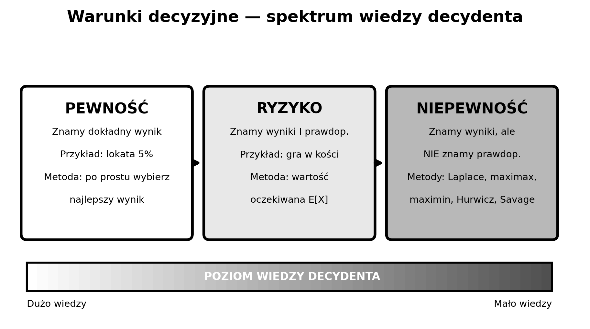

---

**Decydent (decision maker)** — osoba lub podmiot, który musi wybrać jedną z dostępnych alternatyw. Metody interaktywne wymagają dialogu z decydentem — pytamy go o postawę wobec ryzyka (optymista? pesymista?) i ew. parametry (α Hurwicza).

**Stan natury (state of nature)** — scenariusz/sytuacja zewnętrzna, na którą decydent NIE ma wpływu. Np. pogoda, koniunktura gospodarcza, zachowanie konkurencji. Oznaczamy S₁, S₂, …, Sₙ.

    Stany natury: S₁ = „dobra koniunktura", S₂ = „zła koniunktura"
    Decydent NIE wybiera stanu — stan „się zdarza".

**Macierz wypłat (payoff matrix)** — tabela, w której wiersze = alternatywy (decyzje), kolumny = stany natury, a komórki = wyniki (wypłaty). To podstawowa struktura danych dla WSZYSTKICH kryteriów decyzyjnych.

    Przykład — macierz wypłat (zyski w tys. zł):
                  S₁ (dobra)    S₂ (średnia)   S₃ (zła)
    ─────────────────────────────────────────────────────
    A₁ (fabryka)     200           50            −100
    A₂ (sklep)        80           70              40
    A₃ (obligacje)    30           30              30

    A₁ może dać 200k, ale też stratę 100k.
    A₃ daje 30k niezależnie od stanu → decyzja bezpieczna.

**Wartość oczekiwana E[X] (expected value)** — średni wynik ważony prawdopodobieństwami stanów natury. Używana w kryterium wartości oczekiwanej (gdy znamy prawdopodobieństwa) i w kryterium Laplace'a (z równymi prawdopodobieństwami).

    E[X] = Σ pᵢ × xᵢ

    Przykład z PRAWDZIWYMI prawdopodobieństwami (p₁=0.5, p₂=0.3, p₃=0.2):
    E[A₁] = 0.5×200 + 0.3×50 + 0.2×(−100) = 100 + 15 − 20 = 95  ← MAX
    E[A₂] = 0.5×80  + 0.3×70 + 0.2×40     = 40 + 21 + 8   = 69
    E[A₃] = 0.5×30  + 0.3×30 + 0.2×30     = 15 + 9 + 6    = 30

    Dla Laplace'a (równe prawdopodobieństwa, p₁ = p₂ = p₃ = 1/3):
    E[A₁] = (200 + 50 + (−100)) / 3 = 150/3 = 50
    E[A₂] = (80 + 70 + 40) / 3 = 190/3 ≈ 63.3  ← najlepsza wg Laplace'a
    E[A₃] = (30 + 30 + 30) / 3 = 30

**Kryterium wartości oczekiwanej (expected value criterion)** — NAJPROSTSZA metoda decyzyjna W WARUNKACH RYZYKA (gdy znamy prawdopodobieństwa). Oblicz E[Aᵢ] = Σⱼ pⱼ × aᵢⱼ dla każdej alternatywy i wybierz tę z NAJWYŻSZĄ wartością oczekiwaną.

    Formuła: V(Aᵢ) = Σⱼ pⱼ × aᵢⱼ    →    wybierz Aᵢ z max V(Aᵢ)

    Przykład (p₁=0.5, p₂=0.3, p₃=0.2):
    V(A₁) = 0.5×200 + 0.3×50 + 0.2×(−100) = 95  ← MAX → wybieramy A₁
    V(A₂) = 0.5×80  + 0.3×70 + 0.2×40     = 69
    V(A₃) = 0.5×30  + 0.3×30 + 0.2×30     = 30

    Kluczowa różnica od Laplace'a:
    - Laplace: ZAKŁADA p = 1/n (bo nie znamy prawdopodobieństw)
    - Wart. oczekiwana: UŻYWA PRAWDZIWYCH p (bo je znamy!)

    Przykład życiowy: firma rozważa inwestycję
    - Analityk oszacował: P(boom) = 50%, P(stabilna) = 30%, P(kryzys) = 20%
    - Fabryka wygrywa (E=95k), bo wysoki zysk w boomie (200k) × duże p (50%)
      przeważa nad stratą w kryzysie (−100k) × małe p (20%)

    Ograniczenie: E[X] ignoruje ROZRZUT wyników! A₁ ma E=95k, ale może
    dać −100k. Decydent z awersją do ryzyka może wolę A₂ (E=69k, ale
    minimum 40k). Dlatego sam E[X] nie wystarczy — potrzeba też analizy
    ryzyka (np. wariancji, worst-case).

    Mnemonik: „Średnia ważona — jak średnia ocen"
    Wynik × prawdopodobieństwo = waga.
    Sumuj wagi → E[X]. Jak w dzienniku: 5×0.3 + 4×0.5 + 2×0.2 = 3.9

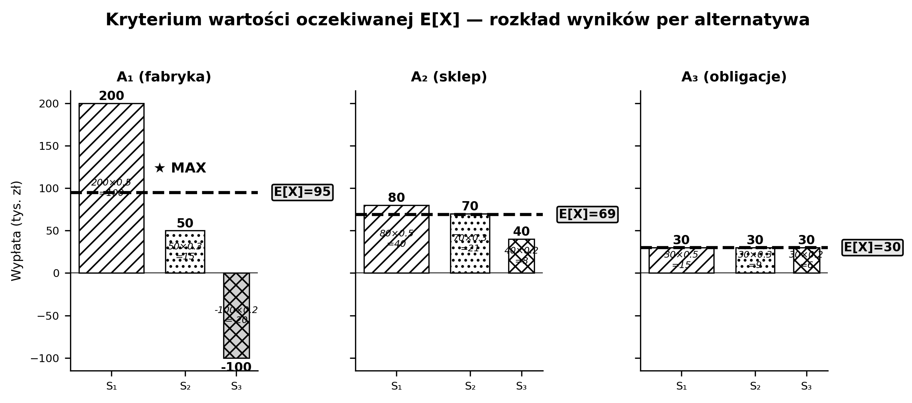

---

**Kryterium decyzyjne (decision criterion)** — reguła/algorytm, który z macierzy wypłat wyznacza „najlepszą" alternatywę. Każde kryterium odzwierciedla INNĄ postawę decydenta wobec ryzyka. Dlatego to samo zadanie może dać INNE odpowiedzi zależnie od wybranego kryterium — i to jest OK.

    Te same dane, różne kryteria → różne „najlepsze" decyzje:
    Kryterium          Wygrywa     Dlaczego?
    ─────────────────────────────────────────────────────
    Wart. oczekiwana   A₁ (95)     najwyższa E[X] z prawdziwymi p
    Laplace            A₂ (≈63)    najwyższa średnia (równe p)
    Optymistyczne      A₁ (200)    najwyższy max
    Pesymistyczne      A₂ (40)     najwyższy min (bezpieczne)
    Hurwicz (α=0.6)    A₁ (80)     kompromis
    Savage             A₂ (120)    najniższy max żalu

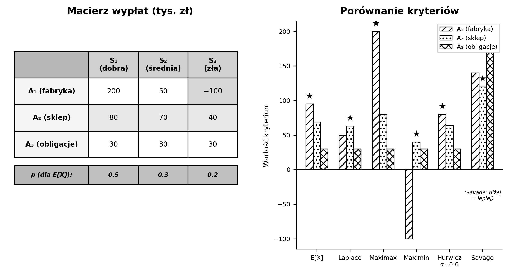

**Kryterium Laplace'a (Laplace criterion / principle of insufficient reason)** — zakładamy, że WSZYSTKIE stany natury są RÓWNIE PRAWDOPODOBNE (bo nie mamy powodu faworyzować żadnego). Obliczamy średnią arytmetyczną wypłat dla każdej alternatywy i wybieramy najwyższą.

    Formuła: V(Aᵢ) = (1/n) × Σⱼ aᵢⱼ    (n = liczba stanów natury)

    Przykład z macierzy powyżej (n=3):
    V(A₁) = (200 + 50 + (−100)) / 3 = 50.0
    V(A₂) = (80 + 70 + 40) / 3       = 63.3  ← MAX → wybieramy A₂
    V(A₃) = (30 + 30 + 30) / 3       = 30.0

    Interaktywność: decydent musi zaakceptować założenie równych
    prawdopodobieństw — „Czy zgadzasz się, że każdy scenariusz
    jest tak samo możliwy?"

    Przykład życiowy: wybieram restaurację w nieznanym mieście.
    Nie wiem, która dobra — traktuję je „po równo" i porównuję
    średnią ocen z 3 portali (każdy portal = stan natury z p=1/3).

    Mnemonik: „Laplace = Loteria — Losowe, ALE Po równo"

**Kryterium optymistyczne (maximax / optimistic criterion)** — decydent-OPTYMISTA: dla każdej alternatywy bierzemy NAJLEPSZY możliwy wynik (max w wierszu), potem wybieramy alternatywę z najwyższym z tych maksimów.

    Formuła: V(Aᵢ) = maxⱼ aᵢⱼ    →    wybierz Aᵢ z max V(Aᵢ)

    max(A₁) = max(200, 50, −100) = 200  ← MAX → wybieramy A₁
    max(A₂) = max(80, 70, 40)    = 80
    max(A₃) = max(30, 30, 30)    = 30

    A₁ wygrywa — optymista liczy na najlepszy scenariusz (200k).
    Ryzyko: jeśli S₃, to strata −100k!

    Przykład życiowy: gracz w pokera, który zawsze idzie all-in,
    bo „może trafię straight flush". Patrzy TYLKO na najlepsze
    możliwe rozdanie. Ignoruje szansę przegranej.

    Mnemonik: „Maximax = Marzyciel — Max z Max, bo MARZĘ o najlepszym"

**Kryterium pesymistyczne (maximin / Wald criterion)** — decydent-PESYMISTA: dla każdej alternatywy bierzemy NAJGORSZY możliwy wynik (min w wierszu), potem wybieramy alternatywę z najwyższym z tych minimów. Zabezpieczamy się przed najgorszym scenariuszem.

    Formuła: V(Aᵢ) = minⱼ aᵢⱼ    →    wybierz Aᵢ z max V(Aᵢ)

    min(A₁) = min(200, 50, −100) = −100
    min(A₂) = min(80, 70, 40)    = 40
    min(A₃) = min(30, 30, 30)    = 30

    max{−100, 40, 30} = 40 → wybieramy A₂
    Pesymista: „Nawet w najgorszym razie dostanę 40k" (A₂ jest bezpieczna).

    Przykład życiowy: jadąc na wakacje, pesymista wybiera hotel z gwarancją
    zwrotu, bo „a jeśli będzie brzydka pogoda?". Woli gwarantowany minimum
    komfort niż ryzykować. Ubezpieczenia działają na tej zasadzie.

    Mnemonik: „Maximin = Mur obronny — buduję MUR pod MINimum, bo zawsze
    zakładam NAJGORSZE (Wald = Wall = Mur)"

**Kryterium Hurwicza (Hurwicz criterion)** — kompromis między optymizmem a pesymizmem. Decydent podaje współczynnik optymizmu α ∈ [0, 1], gdzie α = 1 to pełny optymista, α = 0 to pełny pesymista.

    Formuła: V(Aᵢ) = α × maxⱼ aᵢⱼ + (1−α) × minⱼ aᵢⱼ

    Dla α = 0.6:
    V(A₁) = 0.6×200 + 0.4×(−100) = 120 − 40 = 80
    V(A₂) = 0.6×80  + 0.4×40     = 48 + 16  = 64
    V(A₃) = 0.6×30  + 0.4×30     = 18 + 12  = 30

    max{80, 64, 30} = 80 → A₁ wygrywa dla α=0.6.

    Dla α = 0.3 (bardziej pesymistyczny):
    V(A₁) = 0.3×200 + 0.7×(−100) = 60 − 70 = −10
    V(A₂) = 0.3×80  + 0.7×40     = 24 + 28 = 52  ← teraz A₂!
    V(A₃) = 0.3×30  + 0.7×30     = 9 + 21  = 30

    → Zmiana α zmienia wynik! Dlatego TO kryterium jest najbardziej
      interaktywne — decydent MUSI podać swoje α w dialogu.

    Przypadki specjalne:
    α = 1 → kryterium optymistyczne (maximax)
    α = 0 → kryterium pesymistyczne (maximin)

    Przykład życiowy: kupujesz akcje. Z α=0.8 (optymista) patrzysz głównie
    na potencjalny zysk. Z α=0.2 (pesymista) prawie tylko na potencjalną
    stratę. α to „pokrętło optymizmu" — kręcisz i widzisz jak zmienia
    się rekomendacja.

    Mnemonik: „Hurwicz = Huśtawka — huśtasz się między max a min,
    α mówi jak daleko w stronę max się wychylasz"

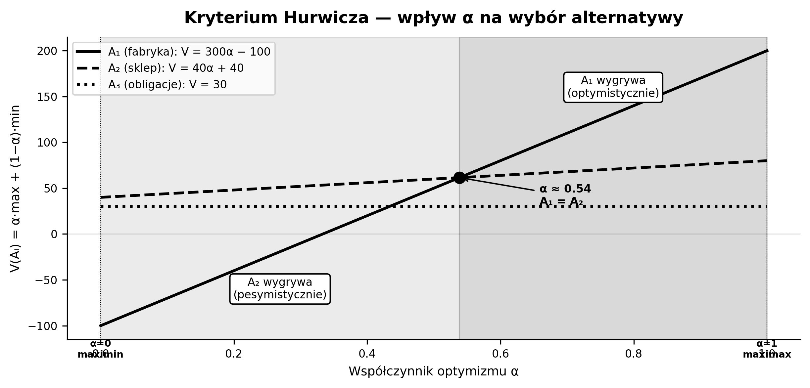

**Współczynnik optymizmu α (optimism coefficient)** — parametr Hurwicza z przedziału [0, 1]. Wyraża postawę decydenta: α bliskie 1 = optymista (wierzy w dobre scenariusze), α bliskie 0 = pesymista.

    α = 1.0 → patrzę tylko na max → maximax
    α = 0.5 → równa waga max i min
    α = 0.0 → patrzę tylko na min → maximin

---

**Macierz żalu / macierz strat (regret matrix)** — tabela, w której każda komórka zawiera ŻALE (regret) = ile TRACĘ wybierając daną alternatywę zamiast najlepszej w danym stanie natury.

    Obliczanie: rᵢⱼ = maxₖ aₖⱼ − aᵢⱼ  (max w kolumnie minus wartość w komórce)

    Macierz wypłat:              Macierz żalu:
              S₁    S₂    S₃              S₁    S₂    S₃    max żalu
    A₁       200    50   −100    A₁        0     20    140     140
    A₂        80    70     40    A₂      120      0      0     120  ← MIN
    A₃        30    30     30    A₃      170     40     10     170

    maxₖ aₖ₁ = 200, maxₖ aₖ₂ = 70, maxₖ aₖ₃ = 40
    r₁₁ = 200−200 = 0,   r₁₂ = 70−50 = 20,  r₁₃ = 40−(−100) = 140
    r₂₁ = 200−80 = 120,  r₂₂ = 70−70 = 0,   r₂₃ = 40−40 = 0
    r₃₁ = 200−30 = 170,  r₃₂ = 70−30 = 40,  r₃₃ = 40−30 = 10

**Kryterium Savage'a (minimax regret / Savage criterion)** — minimalizacja MAKSYMALNEGO ŻALU. Dla każdej alternatywy znajdujemy największy żal (max w wierszu macierzy żalu), potem wybieramy alternatywę z NAJMNIEJSZYM max żalem.

    Formuła: V(Aᵢ) = maxⱼ rᵢⱼ    →    wybierz Aᵢ z min V(Aᵢ)

    max żalu(A₁) = max(0, 20, 140)  = 140
    max żalu(A₂) = max(120, 0, 0)   = 120  ← MIN → wybieramy A₂
    max żalu(A₃) = max(170, 40, 10) = 170

    Interpretacja: „Niezależnie co się zdarzy, mój żal nie przekroczy 120k"
    (gdybym wybrał A₁, mógłbym żałować aż 140k; A₃ → aż 170k).

    Przykład życiowy: wybieram studia. Po 5 latach zobaczę, jaki zawód
    najlepiej zarabia. Żal = „ile bym zarobił na najlepszych studiach
    minus ile zarabiam". Savage minimalizuje ten maksymalny żal —
    wybieram studia, po których NIGDY nie będę żałować za bardzo.

    Mnemonik: „Savage = Szał żalu — Savage to dziki (savage) żal,
    więc go minimalizuję. Min z max żalu = trzymam żal na smyczy."

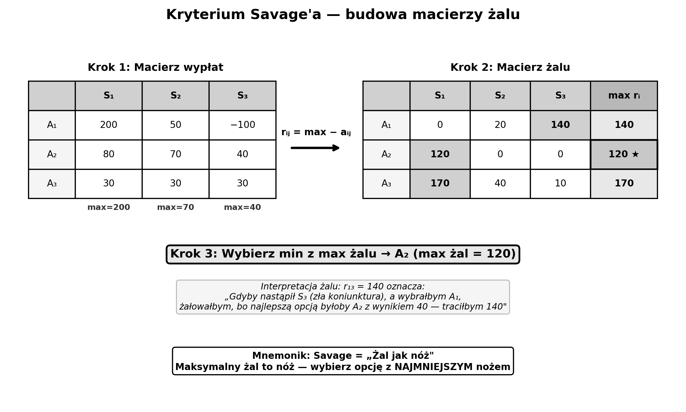

---

**Porównanie kryteriów — tabela zbiorcza:**

    Kryterium       Postawa         Formuła               Wymaga od decydenta
    ──────────────────────────────────────────────────────────────────────────────
    Wart. oczekiw.  racjonalna      Σ pⱼ·aᵢⱼ              podanie prawdopodobieństw
    Laplace         neutralna       średnia wypłat         akceptacja równych p
    Optymistyczne   optymista       max z max              nic (automatyczne)
    Pesymistyczne   pesymista       max z min              nic (automatyczne)
    Hurwicza        kompromis       α·max + (1−α)·min      podanie α ∈ [0,1]
    Savage'a        minimalizacja   min z max żalu          nic (automatyczne)
                    żalu

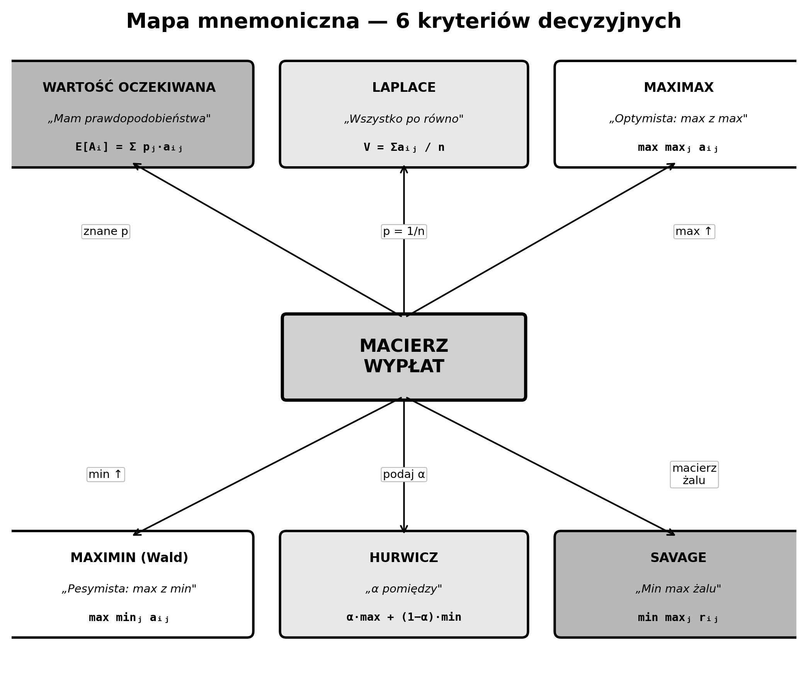

---

### Warunki: pewność (determinizm) → **ryzyko** (znane prawdopodobieństwa) → niepewność (brak prawdopodobieństw)

### Interaktywność = dialog z decydentem → odkrycie preferencji (funkcji użyteczności)

### Metody (kryteria decyzyjne)

**0. Kryterium wartości oczekiwanej (E[X]):** WYMAGA prawdopodobieństw stanów (warunki RYZYKA). Oblicz E[Aᵢ] = Σⱼ pⱼ·aᵢⱼ. Wybierz max. Ograniczenie: ignoruje rozrzut/ryzyko.

**1. Kryterium Laplace'a:** Załóż równe prawdopodobieństwa stanów (warunki NIEPEWNOŚCI). Oblicz średnią wypłat per alternatywa. Wybierz max średniej. Formuła: V(Aᵢ) = (1/n) × Σⱼ aᵢⱼ.

**2. Kryterium optymistyczne (maximax):** Dla każdej alternatywy weź max wypłatę. Wybierz alternatywę z max z tych max. Formuła: max maxⱼ aᵢⱼ.

**3. Kryterium pesymistyczne (maximin / Walda):** Dla każdej alternatywy weź min wypłatę. Wybierz alternatywę z max z tych min. Formuła: max minⱼ aᵢⱼ.

**4. Kryterium Hurwicza:** Kompromis: V(Aᵢ) = α × maxⱼ aᵢⱼ + (1−α) × minⱼ aᵢⱼ. Decydent podaje α ∈ [0,1]. α=1 → maximax, α=0 → maximin.

**5. Kryterium Savage'a (minimax regret):** Zbuduj macierz żalu (rᵢⱼ = maxₖ aₖⱼ − aᵢⱼ). Dla każdej alternatywy weź max żal. Wybierz alternatywę z min max żalu.

### Etymologia

**Wartość oczekiwana** — pojęcie z XVII w., Blaise Pascal i Pierre de Fermat (1654), formalizacja hazardu; „ile przeciętnie wygrasz?". **Laplace** — Pierre-Simon de Laplace (1749–1827), francuski matematyk; zasada niedostatecznej racji (principle of insufficient reason) — jeśli nie mamy powodu faworyzować żadnego stanu, traktujemy je jako równie prawdopodobne. **Wald** — Abraham Wald (1902–1950), matematyk z Wiednia; kryterium maximin = strategia minimax z teorii gier. **Hurwicz** — Leonid Hurwicz (1917–2008), laureat Nobla z ekonomii 2007 (z Myersonem i Maskinem, za mechanism design); zaproponował kompromis z parametrem α. **Savage** — Leonard Jimmie Savage (1917–1971), amerykański statystyk; kryterium minimax regret — minimalizacja żalu (1951, „The Foundations of Statistics").

### Jak zapamiętać

- **E[X] = „średnia ważona prawdopodobieństwami"** → jak średnia ocen w dzienniku, ale wagi to szanse
- **Laplace = „wszystko po równo"** → średnia arytmetyczna wypłat (Loteria — ALE Po równo)
- **Maximax = „marzyciel → max z max"** → najlepszy z najlepszych, ignoruje ryzyko
- **Maximin = „mur obronny → max z min"** → najlepszy z najgorszych (Wald = Wall = Mur)
- **Hurwicz = „huśtawka — α pomiędzy"** → α·max + (1−α)·min, kręcisz pokrętłem optymizmu
- **Savage = „szał żalu → min max żalu"** → macierz żalu → minimalizuj maksymalny żal (trzymaj żal na smyczy)

\newpage

## PYTANIE 32: Dominacja stochastyczna

**FSD i SSD. Jak mogą być użyte w modelach wyboru?**

---

### Tło pojęciowe — słowniczek

**Rozkład (distribution)** — opis WSZYSTKICH możliwych wartości, jakie może przyjąć zmienna losowa, wraz z informacją jak prawdopodobne jest każda z nich. To „mapa" losowości — mówi nam: „co może się zdarzyć i z jakim prawdopodobieństwem".

    Rzut kostką — rozkład dyskretny:
    Wartość:          1     2     3     4     5     6
    Prawdopodobieństwo: 1/6   1/6   1/6   1/6   1/6   1/6

    Wzrost ludzi — rozkład ciągły (normalny):
    Średnia μ = 175 cm, odchylenie σ = 7 cm
    → większość ludzi 168–182 cm, mało kto >195 cm

**Prawdopodobieństwo (probability)** — liczba z przedziału [0, 1] wyrażająca szansę zajścia zdarzenia. P=0 → niemożliwe, P=1 → pewne, P=0.5 → „rzut monetą".

    P(orzeł) = 0.5 = 50%
    P(6 na kostce) = 1/6 ≈ 0.167 = 16.7%
    P(deszcz jutro) = 0.3 = 30%   ← subiektywne, ale nadal p ∈ [0,1]

**Rozkład prawdopodobieństwa (probability distribution)** — kompletny opis zmiennej losowej: jakie wartości może przyjąć + jakie jest prawdopodobieństwo każdej z nich. Dwa sposoby opisu:

    1. PDF (gęstość) — dla rozkładów ciągłych: f(x), pole pod krzywą = prawdopodobieństwo
    2. CDF (dystrybuanta) — F(x) = P(X ≤ x), rośnie od 0 do 1

    Przykład: inwestycja A ma rozkład zwrotów:
    -10% z p=0.2,  +5% z p=0.5,  +15% z p=0.3
    → To jest rozkład prawdopodobieństwa inwestycji A

---

**Decydent (decision maker)** — osoba lub podmiot, który MUSI wybrać jedną z dostępnych alternatyw. W praktyce: inwestor wybierający portfel, menedżer wybierający projekt, pacjent wybierający leczenie. Kluczowe: decydent ma PREFERENCJE (np. boi się ryzyka lub je lubi), których my nie znamy dokładnie.

**Funkcja użyteczności U(x) (utility function)** — matematyczna funkcja przypisująca każdemu wynikowi $x$ (np. kwocie pieniędzy) liczbę $U(x)$ odzwierciedlającą SUBIEKTYWNĄ wartość tego wyniku dla decydenta. Wyższa U(x) = lepiej. Kluczowe: kształt U(x) koduje stosunek do ryzyka.

    U(x) = √x  (typowa risk-averse):
    U(0) = 0,  U(100) = 10,  U(400) = 20,  U(900) = 30

    Osoba A (risk-averse):  U(x) = √x    → wklęsła ∩
    Osoba B (risk-neutral): U(x) = x     → liniowa /
    Osoba C (risk-seeking): U(x) = x²    → wypukła ∪

    U(x)
    │    ╭── risk-averse (√x) — wolni wzrost, „nasycenie"
    │  ╱─── risk-neutral (x)  — stały wzrost
    │╱ ╱─── risk-seeking (x²) — przyspieszający wzrost
    └──────── x

**Dokładna funkcja użyteczności decydenta** — w idealnym świecie znalibyśmy DOKŁADNY wzór U(x) konkretnego decydenta (np. U(x) = ln(x+1) z parametrami). Wtedy wystarczy policzyć E[U(A)] i E[U(B)] i wybrać wyższe. Problem: w praktyce NIGDY nie znamy dokładnej U(x) — ludzie nie potrafią podać precyzyjnego wzoru swoich preferencji. Dlatego dominacja stochastyczna jest tak cenna — działa BEZ znajomości dokładnej U!

---

**Metoda (method)** — sformalizowany algorytm prowadzący od danych do wyniku. W tym kontekście: algorytm porównywania dwóch alternatyw (inwestycji, portfeli, decyzji).

**Metoda porównywania rozkładów (method of comparing distributions)** — sposób na odpowiedź „czy rozkład A jest lepszy od B?". Proste metody porównują JEDNĄ liczbę (np. średnią E[X] lub wariancję Var[X]) — ale to za mało, bo gubią informację o kształcie rozkładu. Dominacja stochastyczna porównuje CAŁY kształt dystrybuanty — dlatego daje silniejsze wnioski.

    Porównanie po średniej: E[A]=10%, E[B]=8% → A lepsza? Ale może A ma ogromny rozrzut!
    Porównanie po wariancji: Var[A]<Var[B] → A bezpieczniejsza? Ale może E[A] ≪ E[B]!
    Dominacja stochastyczna: porównuje CAŁY rozkład → wniosek jest uniwersalny

---

**Dominacja (dominance)** — relacja „A jest co najmniej tak dobre jak B" (a w pewnych aspektach lepsze). Pochodzi od łac. „dominari" = panować. Gdy A dominuje B, to A „panuje" nad B — nie ma powodu, żeby wybrać B. W teorii decyzji dominacja oznacza: ŻADEN racjonalny decydent (z danej klasy) nie wybrałby B, skoro A jest dostępne.

**Stochastyczna (stochastic)** — znaczy „losowa, probabilistyczna" (grec. „stochastos" = zdolny do celowania/zgadywania). Mówmy „stochastyczna" zamiast „losowa" w kontekście formalnym. Dominacja stochastyczna = dominacja między rozkładami losowymi (a nie między pojedynczymi liczbami).

    Dominacja „zwykła" (deterministyczna): A=100, B=80 → A > B (oczywiste)
    Dominacja stochastyczna: A ~ N(10%, 15%), B ~ N(8%, 20%) → A > B?
    → Nie jest oczywiste! Trzeba porównać CAŁE rozkłady, nie tylko średnie.

**Co znaczy „rozkład A dominuje rozkład B"?** — że dla KAŻDEGO racjonalnego decydenta (z odpowiedniej klasy) oczekiwana użyteczność z A jest ≥ niż z B:

    A ≥ B  ⟺  E[U(A)] ≥ E[U(B)]  dla KAŻDEGO U z danej klasy

    Nie muszę znać Twojej dokładnej U(x).
    Wystarczy, że wiem DO JAKIEJ KLASY należysz:
    - FSD: klasa U' ≥ 0 (preferujesz więcej) → WSZYSCY racjonalni
    - SSD: klasa U' ≥ 0, U'' ≤ 0 (więcej + mniej ryzyka) → risk-averse

---

**Klasa decydentów (class of decision makers)** — zbiór WSZYSTKICH decydentów, których funkcje użyteczności spełniają pewne warunki. To nie jest grupa konkretnych osób — to matematyczny zbiór WSZYSTKICH MOŻLIWYCH funkcji U(x) z danymi własnościami.

**Racjonalny decydent (rational decision maker)** — decydent, którego preferencje są SPÓJNE (np. jeśli woli A od B i B od C, to woli A od C) i który preferuje więcej niż mniej ($U'(x) \geq 0$ — monotoniczność). To minimalne założenie — prawie każdy człowiek je spełnia.

**Klasa racjonalnych decydentów** — zbiór WSZYSTKICH funkcji U(x) takich, że $U'(x) \geq 0$. Jest ich NIESKOŃCZENIE wiele (√x, ln(x), x, x², 2x+7, ...). FSD mówi: jeśli A dominuje B, to DLA KAŻDEJ z tych nieskończenie wielu funkcji E[U(A)] ≥ E[U(B)]. Dlatego dominacja jest tak silnym twierdzeniem!

**Dlaczego cała klasa wybierze A?** — Twierdzenie (Hardy-Littlewood-Polya): A ≥_FSD B ⟺ E[U(A)] ≥ E[U(B)] dla KAŻDEGO monotonicznie rosnącego U. To nie jest opinia — to dowiedzione matematyczne twierdzenie. Jeśli dystrybuanta A leży pod B, to nie istnieje żadna rosnąca funkcja U, dla której B byłoby lepsze.

---

**U(x) — notacja** — $U$ to nazwa funkcji (od ang. „utility" = użyteczność), $x$ to argument (wynik, np. kwota pieniędzy). $U(x)$ to wartość użyteczności wyniku $x$ dla danego decydenta.

    U(x) = √x
    U(100) = √100 = 10   ← „100 zł daje mi 10 jednostek użyteczności"
    U(400) = √400 = 20   ← „400 zł daje 20 — tylko 2× więcej, choć to 4× pieniędzy"

**Dlaczego „preferujesz więcej" = FSD?** — FSD wymaga TYLKO $U'(x) \geq 0$, czyli że funkcja użyteczności jest niemalejąca. To jedyne założenie: „wolisz 101 zł niż 100 zł". Nie mówi NIC o ryzyku — to mogą być osoby kochające ryzyko, neutralne, czy z awersją. Dlatego FSD to najszersza klasa: WSZYSCY, którzy wolą „więcej".

**Dlaczego „mniej ryzyka" = SSD?** — SSD dodaje warunek $U''(x) \leq 0$ (wklęsłość). To oznacza malejącą użyteczność krańcową: „każda kolejna złotówka daje mi coraz mniej radości". Konsekwencja: taki decydent PREFERUJE pewność od loterii o tej samej średniej → jest risk-averse. Dlatego SSD obejmuje węższą klasę: tylko tych, co preferują więcej I mniej ryzyka.

    FSD: U'≥0              → „więcej = lepiej" (szeroka klasa, wszyscy racjonalni)
    SSD: U'≥0 i U''≤0      → „więcej = lepiej" + „ryzyko = złe" (węższa, risk-averse)

    FSD: {√x, ln(x), x, x², 2x+7, ...}     ← KAŻDA rosnąca U
    SSD: {√x, ln(x), ...}                    ← tylko wklęsłe rosnące U (bez x²!)

**Co znaczy A > B (A dominuje B)?** — formalnie: „A jest co najmniej tak dobre jak B dla KAŻDEGO decydenta z danej klasy, i ŚCIŚLE lepsze dla co najmniej jednego". Praktyczne znaczenie: jeśli masz do wyboru A i B, i A dominuje B, to B jest IRRACJONALNE — nie ma żadnego powodu, by je wybrać. Można je bezpiecznie wyeliminować z rozważań.

    A ≥_FSD B znaczy:
    ∀ U : U'≥0 → E[U(A)] ≥ E[U(B)]
    „Każdy kto woli więcej, wybierze A (lub jest mu obojętnie)"

    A ≥_SSD B znaczy:
    ∀ U : U'≥0, U''≤0 → E[U(A)] ≥ E[U(B)]
    „Każdy risk-averse wybierze A (lub jest mu obojętnie)"

---

**Dystrybuanta F(x) (CDF — Cumulative Distribution Function)** — prawdopodobieństwo, że zmienna losowa X przyjmie wartość ≤ x. F(x) = P(X ≤ x). Rośnie od 0 do 1.

    Przykład: rzut kostką
    F(1) = 1/6,  F(2) = 2/6,  F(3) = 3/6,  F(4) = 4/6,  F(5) = 5/6,  F(6) = 1

    Graficznie (ciągły rozkład):
    F(x)
    1 ┤            ──────────
      │          ╱
      │        ╱
      │      ╱
    0 ┤────╱
      └─────────────────── x

**Dlaczego dystrybuanta?** Dominacja stochastyczna porównuje KSZTAŁT dystrybuant, nie pojedyncze liczby jak średnia czy wariancja. To daje silniejsze wnioski.

---

**FSD (First-order Stochastic Dominance, dominacja stochastyczna I rzędu)** — A dominuje B w sensie FSD, gdy dystrybuanta A leży ZAWSZE poniżej (lub jest równa) dystrybuancie B:

    F_A(x) ≤ F_B(x)  dla każdego x

Intuicja: „Dla DOWOLNEGO progu x, szansa, że A daje wynik ≤ x jest mniejsza lub równa niż dla B." A daje zawsze co najmniej tyle samo „dobrych wyników".

    F(x)
    1 ┤         ╱── B (gorsza — wyższa CDF)
      │       ╱╱── A (lepsza — niższa CDF)
      │     ╱╱
      │   ╱╱
    0 ┤──╱╱
      └──────────── x
    A ≥_FSD B: F_A zawsze pod F_B

**Warunek na klasę U:** U'(x) ≥ 0 — monotoniczność, czyli „więcej = lepiej". WSZYSCY racjonalni (nienasyceni) decydenci wybiorą A.

Przykład liczbowy:

    Inwestycja A: wynik = {20, 30, 40} każdy z p=1/3
    Inwestycja B: wynik = {10, 30, 40} każdy z p=1/3

    F_A(10)=0, F_B(10)=1/3 → F_A ≤ F_B ✓
    F_A(20)=1/3, F_B(20)=1/3 → F_A ≤ F_B ✓
    F_A(30)=2/3, F_B(30)=2/3 → F_A ≤ F_B ✓
    A ≥_FSD B → każdy racjonalny wybierze A

**FSD jest rzadka w praktyce** — wystarczy JEDEN punkt, w którym F_A(x) > F_B(x), i dominacja nie zachodzi.

---

**SSD (Second-order Stochastic Dominance, dominacja II rzędu)** — A dominuje B w sensie SSD, gdy skumulowana całka z dystrybuanty A jest ≤ niż z B:

    ∫_{-∞}^{x} F_A(t)dt  ≤  ∫_{-∞}^{x} F_B(t)dt   dla każdego x

Dystrybuanty MOGĄ się przecinać (A nie musi być wszędzie lepsza), ale „pole pod F_A" jest zawsze mniejsze lub równe.

**Warunek na klasę U:** U'(x) ≥ 0 i U''(x) ≤ 0 — monotoniczność + wklęsłość = **risk-averse** decydenci.

    F(x)                    ∫F(x)dx
    1 ┤    ╱B               │     ╱B (większe pole)
      │  ╱X╱                │   ╱╱
      │╱╱A                  │  ╱╱A (mniejsze pole)
    0 ┤                     │╱
      └───── x              └───── x
    CDF mogą się krzyżować! Ale skumulowane pole A ≤ B → A ≥_SSD B

---

**Relacja między FSD a SSD:**

    FSD ⟹ SSD ⟹ TSD ⟹ ...  (ale NIE odwrotnie!)

Jeśli A dominuje B w sensie FSD, to automatycznie dominuje w SSD. Ale SSD może zachodzić nawet gdy FSD nie — bo SSD „przebacza" chwilowe przekroczenia F_A nad F_B, jeśli kompensowane gdzie indziej.

---

**Mean-Preserving Spread (MPS)** — operacja, która zwiększa rozrzut (wariancję) rozkładu, zachowując tę samą średnią. B = A + ε, gdzie E[ε|A]=0.

    A: zawsze 50 zł                    → E[A] = 50, Var = 0
    B: 50% szans na 20 zł, 50% na 80 zł → E[B] = 50, Var = 900
    B jest MPS wobec A: ta sama średnia, większy rozrzut
    → A ≥_SSD B (risk-averse wolą A!)

**Kluczowe twierdzenie Rothschilda-Stiglitza:** A SSD-dominuje B ⟺ B jest mean-preserving spread A (przy jednakowej średniej).

---

**Funkcja wklęsła (concave)** — „krzywa w dół", U''(x) ≤ 0. Każdy dodatkowy złotówka daje coraz mniej użyteczności (malejąca użyteczność krańcowa). Modeluje risk aversion.

    U(x) = √x → U(0)=0, U(100)=10, U(400)=20
    Różnica 0→100: +10 użyteczności
    Różnica 100→400: +10 użyteczności  (mimo 3× więcej pieniędzy!)

**Funkcja wypukła (convex)** — „krzywa w górę", U''(x) ≥ 0. Modeluje risk seeking.

---

**Portfolio selection (wybór portfela)** — zastosowanie dominacji: porównaj rozkłady zwrotów portfeli. Eliminuj zdominowane stochastycznie portfele BEZ znania dokładnej U inwestora.

    Portfel A: N(10%, 15%)  (średnia 10%, odch. std. 15%)
    Portfel B: N(8%, 20%)   (średnia 8%, odch. std. 20%)
    E[A] > E[B] i σ[A] < σ[B] → A SSD B
    Każdy risk-averse inwestor wybierze A.

---

### Idea: Porównaj rozkłady BEZ znajomości dokładnej U. Jeśli A dominuje B → KAŻDY (z danej klasy) wybierze A.

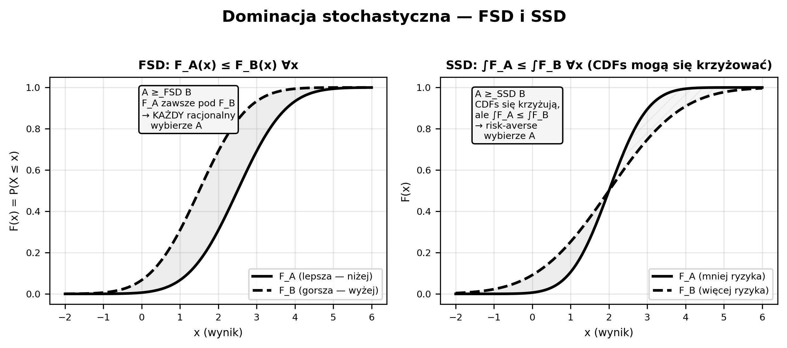

### FSD (First-order Stochastic Dominance)

    A ≥_FSD B  ⟺  F_A(x) ≤ F_B(x) ∀x

- Warunek na U: U'(x) ≥ 0 (monotoniczność — „więcej = lepiej")
- Klasa: WSZYSCY racjonalni (nienasyceni)
- Interpretacja: A ma zawsze ≥ prawdopodobieństwo przekroczenia dowolnego progu
- **Rzadka** w praktyce

### SSD (Second-order Stochastic Dominance)

    A ≥_SSD B  ⟺  ∫_{-∞}^{x} F_A(t)dt ≤ ∫_{-∞}^{x} F_B(t)dt ∀x

- Warunek na U: U' ≥ 0 i U'' ≤ 0 (monotoniczne + wklęsłe)
- Klasa: **Risk-averse** (awersja do ryzyka)
- Dystrybuanty mogą się przecinać, ale skumulowane pole nie
- **Częstsza** niż FSD
- Mean-Preserving Spread: B = A + ε (E[ε|A]=0) → A SSD B

### Relacja: FSD ⟹ SSD ⟹ TSD... (ale nie odwrotnie)

### Jak FSD i SSD mogą być użyte w modelach wyboru?

**Odpowiedź abstrakcyjna:** Dominacja stochastyczna służy jako **kryterium eliminacji** — pozwala odrzucić zdominowane alternatywy z puli rozważanych opcji, BEZ konieczności znania dokładnej funkcji użyteczności decydenta. Zamiast pytać „jaki jest Twój dokładny wzór preferencji?", wystarczy wiedzieć, czy decydent jest racjonalny (FSD) lub ma awersję do ryzyka (SSD).

**Trzy sposoby użycia w modelach wyboru:**

**1. Filtracja zbioru efektywnego (Efficient Set Screening)**

W modelu wyboru portfela inwestor ma N portfeli. Zamiast analizować wszystkie N, eliminuj te zdominowane stochastycznie. TYLKO niezdominowane trafiają do dalszej analizy (np. optymalizacji Markowitza). To redukuje przestrzeń decyzyjną.

    Portfele: {A, B, C, D, E, F}
    FSD screening:  A ≥_FSD C,  D ≥_FSD F
    → Eliminuj C i F → Efficient set = {A, B, D, E}
    SSD screening:  A ≥_SSD B
    → Eliminuj B → Efficient set = {A, D, E}
    Inwestor wybiera spośród 3 zamiast 6 portfeli

**2. Ranking alternatyw bez znajomości U(x)**

Gdy znasz rozkłady zwrotów kilku inwestycji, możesz je CZĘŚCIOWO uszeregować:

    Inwestycja A: N(12%, 10%)   (średnia 12%, odch. std. 10%)
    Inwestycja B: N(12%, 15%)   (ta sama średnia, WIĘKSZY rozrzut)
    Inwestycja C: N(8%, 10%)    (niższa średnia, ten sam rozrzut)

    A ≥_SSD B:  Ta sama średnia, ale B to mean-preserving spread A
                → Każdy risk-averse woli A (mniej ryzyka, ten sam zwrot)
    A ≥_FSD C:  F_A(x) ≤ F_C(x) ∀x (bo A ma wyższą średnią, ten sam kształt)
                → KAŻDY racjonalny woli A (więcej w każdym scenariuszu)
    B vs C:     B ma wyższą średnię (12% vs 8%), ale większy rozrzut (15% vs 10%)
                → SSD może NIE zachodzić → zależy od konkretnej U(x) decydenta

    Ranking: A > B i A > C (pewne), ale B vs C → ZALEŻY OD DECYDENTA

**3. Kryterium fair ubezpieczenia (insurance decision)**

    Sytuacja: masz majątek 100 000 zł.
    Ryzyko: 10% szans na stratę 80 000 zł.
    Fair ubezpieczenie: składka = oczekiwana strata = 0.10 × 80 000 = 8 000 zł/rok

    BEZ ubezpieczenia: {100 000 z p=0.9,  20 000 z p=0.1}  → E=92 000
    Z ubezpieczeniem:  {92 000 z p=1.0}                      → E=92 000

    Ta sama średnia (92k), ale ubezpieczenie = PEWNOŚĆ.
    „Bez ubezpieczenia" to mean-preserving spread „z ubezpieczeniem"
    → „Z ubezpieczeniem" ≥_SSD „bez ubezpieczenia"
    → KAŻDY risk-averse kupi fair ubezpieczenie (nie musisz znać jego U!)

**Konkretny przykład obliczeniowy — FSD w wyborze portfela:**

    Portfel A: zwroty = {-5%, +10%, +15%} z prawdopodobieństwami {0.2, 0.5, 0.3}
    Portfel B: zwroty = {-10%, +10%, +15%} z prawdopodobieństwami {0.2, 0.5, 0.3}

    Dystrybuanty (CDF):
    x       F_A(x)    F_B(x)    F_A ≤ F_B?
    -10%    0.0       0.2       0.0 ≤ 0.2 ✓
    -5%     0.2       0.2       0.2 ≤ 0.2 ✓ (równe)
    +10%    0.7       0.7       0.7 ≤ 0.7 ✓ (równe)
    +15%    1.0       1.0       1.0 ≤ 1.0 ✓ (równe)

    F_A(x) ≤ F_B(x) ∀x, i F_A(-10%) < F_B(-10%) → A ≥_FSD B
    → Portfel A dominuje B w sensie FSD
    → ŻADEN racjonalny inwestor nie wybierze B, bo A jest ściśle lepszy w najgorszym scenariuszu
    → Eliminuj B z dalszej analizy portfelowej

### Zastosowania

- **Portfolio selection:** eliminuj zdominowane portfele bez znajomości U
- **Ubezpieczenia:** fair ubezpieczenie SSD-dominuje brak ubezpieczenia (dla risk-averse)
- **Ocena inwestycji:** A: N(10%,15%), B: N(8%,20%) → E[A]>E[B], σ[A]<σ[B] → A SSD B

| Cecha      | FSD                    | SSD                          |
|------------|------------------------|------------------------------|
| Warunek    | F_A(x) ≤ F_B(x) ∀x    | ∫F_A ≤ ∫F_B ∀x              |
| Na U       | U' ≥ 0                | U' ≥ 0, U'' ≤ 0             |
| Decydenci  | Wszyscy racjonalni     | Risk-averse                  |
| Częstość   | Rzadka                 | Częstsza                     |

### Etymologia

**Stochastyczna** — grec. „stochastos" = zdolny do celowania, od „stochazein" = mierzyć; w probabilistyce: losowy. **FSD/SSD** — Hadar & Russell (1969); Rothschild & Stiglitz (1970) niezależnie. **Mean-Preserving Spread** — Rothschild & Stiglitz: ten sam średni wynik, ale większy rozrzut = gorsze dla risk-averse. **Dominacja** — łac. „dominari" = panować; A dominuje B gdy jest zawsze co najmniej tak dobre.

### Jak zapamiętać

- **FSD = „F always below"** — dystrybuanta A zawsze ≤ B
- **SSD = „Second = Sum (integral)"** — całka z F_A ≤ całka z F_B
- **FSD → wszyscy; SSD → risk-averse**
- FSD implikuje SSD, ale nie odwrotnie
