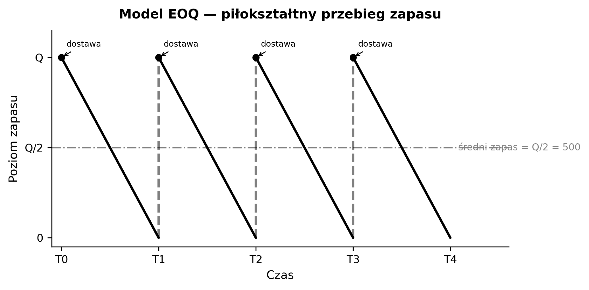
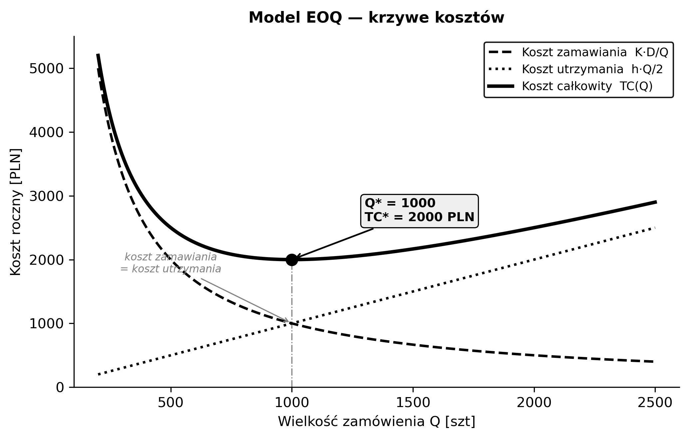

## PYTANIE 18: Zarządzanie zapasami w łańcuchu dostaw

**Problemy i przykładowy model.**

---

### Tło pojęciowe — słowniczek

**Łańcuch dostaw (supply chain)** — sieć organizacji od surowca do klienta końcowego: dostawcy → producenci → dystrybutorzy → detaliści → klienci. Zarządzanie zapasami na każdym ogniwie ma ogromny wpływ na koszty i poziom obsługi.

    Dostawca → [Magazyn] → Producent → [Magazyn] → Dystrybutor → [Magazyn] → Sklep → Klient
                                    zapasy na każdym etapie!

**Zapasy (inventory)** — produkty/materiały przechowywane „na wszelki wypadek" lub w oczekiwaniu na sprzedaż/produkcję. Za dużo = zamrożony kapitał, koszty magazynowania, ryzyko przeterminowania. Za mało = brak towaru (stockout), utrata klientów.

---

**Bullwhip Effect (efekt byczego bicza)** — zjawisko amplifikacji wahań popytu w górę łańcucha dostaw. Mała zmiana popytu u detalisty (np. +5%) powoduje coraz większe wahania zamówień u dystrybutorów (+10%), producentów (+20%), dostawców (+40%).

    Klient: popyt +5% → Detalista zamawia +10% → Dystrybutor +20% → Producent +40%
    Jak bicz: mały ruch ręki → ogromny ruch na końcu

Przyczyny: prognozowanie (forecasting), zamawianie partiami (batching), promocje cenowe, racjonowanie przy niedoborach.

**Stockout (brak towaru)** — sytuacja gdy produkt jest niedostępny. Koszt: utrata sprzedaży, utrata klienta, kary umowne.

**Overstock (nadmiar zapasów)** — za dużo towaru. Koszt: magazynowanie, zamrożony kapitał, obsolescence (przeterminowanie/utrata aktualności).

---

**Koszty zapasów — trzy kategorie:**

**Koszt utrzymania (holding cost, h)** — koszt przechowywania towaru per jednostka per rok. Obejmuje: magazyn, ubezpieczenie, koszt kapitału, utrata wartości. Typowo: 15-30% wartości towaru rocznie.

**Koszt zamawiania (ordering cost, K)** — stały koszt złożenia jednego zamówienia. Obejmuje: transport, administracja, kontrola jakości. Niezależny od ilości zamówionej.

**Koszt braku (shortage cost, p)** — koszt gdy nie mamy towaru: utrata sprzedaży, ekspresowe dostawy, kary.

---

**EOQ (Economic Order Quantity)** — model Harrisa-Wilsona (1913). Najstarszy i najważniejszy model zarządzania zapasami. Odpowiada na pytanie: **ile sztuk zamawiać jednorazowo**, żeby suma kosztów zamawiania i utrzymania była minimalna.

**Intuicja — analogia z zakupami papieru toaletowego:**

    Strategia A: kupujesz 1 paczkę co tydzień
      → dużo wizyt w sklepie (wysoki koszt zamawiania)
      → mało miejsca w domu (niski koszt utrzymania)

    Strategia B: kupujesz 100 paczek raz na 2 lata
      → rzadko chodzisz do sklepu (niski koszt zamawiania)
      → potrzebujesz magazynu (wysoki koszt utrzymania)

    EOQ: ile paczek kupować, żeby SUMA obu kosztów była najniższa?

**Założenia EOQ (ważne — na obronie mogą zapytać o ograniczenia!):**
1. Popyt stały i znany: D sztuk/rok (np. sprzedaż jest przewidywalna)
2. Lead time = 0 (dostawa natychmiastowa)
3. Brak braków (nie dopuszczamy stockoutów)
4. Zamówienie przychodzi w całości (nie częściami)
5. Koszt zamówienia K — stały, niezależny od wielkości
6. Koszt utrzymania h — liniowo zależy od ilości w magazynie

---

**Wyprowadzenie wzoru EOQ krok po kroku:**

Krok 1 — Funkcja kosztu całkowitego:

    TC(Q) = K · D/Q  +  h · Q/2
              ↑              ↑
         ile zamówień    średni zapas
         rocznie?        w magazynie
         (D/Q sztuk)     (Q/2 sztuk)

Dlaczego D/Q? Bo potrzebujemy D sztuk rocznie, zamawiamy po Q → robimy D/Q zamówień.
Dlaczego Q/2? Zapas waha się od Q (tuż po dostawie) do 0 (tuż przed następną) → średnio Q/2.

Krok 2 — Szukamy minimum (pochodna = 0):

    dTC/dQ = -K·D/Q²  +  h/2  =  0

    h/2 = K·D/Q²

    Q² = 2·K·D / h

    Q* = √(2KD/h)     ← wzór EOQ!

Krok 3 — Weryfikacja: druga pochodna d²TC/dQ² = 2KD/Q³ > 0 → to jest minimum (nie maksimum).

**Dlaczego √?** Bo rozwiązujemy równanie kwadratowe — punkt, w którym malejąca hiperbola (koszt zamawiania K·D/Q) przecina rosnącą prostą (koszt utrzymania h·Q/2).

---

**Przykład liczbowy (krok po kroku):**

    Dane:
      D = 10 000 szt/rok (popyt roczny)
      K = 100 PLN/zamówienie (koszt złożenia zamówienia)
      h = 2 PLN/szt/rok (koszt trzymania jednej sztuki przez rok)

    Q* = √(2 × 100 × 10000 / 2)
       = √(2 000 000 / 2)
       = √1 000 000
       = 1000 szt ← zamawiaj po 1000 sztuk

    Ile zamówień rocznie? D/Q* = 10000/1000 = 10 zamówień
    Co ile? 365/10 ≈ co 36-37 dni
    Średni zapas: Q*/2 = 500 szt

    Koszt roczny:
      Zamawianie: K·D/Q* = 100 × 10 = 1000 PLN
      Utrzymanie: h·Q*/2 = 2 × 500  = 1000 PLN  ← ZAWSZE równe!
      Suma: TC* = 2000 PLN/rok

**Kluczowa własność:** w punkcie optymalnym koszt zamawiania = koszt utrzymania. To wynika z matematyki i jest świetnym testem kontrolnym.

    TC* = √(2KDh) = √(2 × 100 × 10000 × 2) = √4 000 000 = 2000 PLN

---

**Analiza wrażliwości — co jeśli Q nie jest optymalne?**

EOQ jest odporny na błędy (robustness) — nawet 20% błąd w Q daje tylko ~2% wzrost kosztu:

    Q         TC(Q)       vs TC*=2000    % wzrost
    ─────────────────────────────────────────────
    500        2500         +500          +25%
    800        2050         +50           +2.5%
    1000       2000         ±0            optimum
    1200       2033         +33           +1.7%
    1500       2117         +117          +5.8%
    2000       2500         +500          +25%

Wniosek: lepiej zaokrąglić Q* do wygodnej liczby (np. do pełnej palety) niż trzymać się dokładnej wartości. Koszty rosną powoli wokół optimum.

---

**Ograniczenia EOQ (częste pytanie na obronie: „kiedy model NIE działa?"):**

    Założenie EOQ          Rzeczywistość
    ──────────────────────────────────────────────────
    Popyt stały            Popyt zmienny/sezonowy
    Lead time = 0          Lead time > 0 i zmienny
    Brak braków            Braki się zdarzają
    Jeden produkt          Wiele produktów konkuruje o magazyn
    Brak rabatów           Rabaty ilościowe (za większe partie)
    Koszt h stały          h zależy od ilości (schodkowo)

Dlatego EOQ jest punktem startowym — w praktyce stosuje się jego rozszerzenia (EOQ z rabatami, EOQ z backorders, dynamiczny lot sizing).

---

**Lead time (czas realizacji, L)** — czas od złożenia zamówienia do otrzymania dostawy. Np. 5 dni. Kluczowy dla punktu zamawiania.

**ROP (Reorder Point / punkt zamawiania)** — poziom zapasu, przy którym składamy nowe zamówienie:

    ROP = d × L + SS
    d = popyt dzienny, L = lead time, SS = safety stock

**Safety stock (zapas bezpieczeństwa, SS)** — dodatkowy bufor na wypadek wahań popytu lub opóźnień dostawy:

    SS = z × σ_L
    z = kwantyl rozkładu normalnego (np. 1.65 dla 95% poziomu obsługi)
    σ_L = odchylenie standardowe popytu w lead time

    Przykład: d=30 szt/dzień, L=5 dni, SS=50 szt
    ROP = 30×5 + 50 = 200 szt
    Gdy stan spada do 200 → zamawiaj!

---

**Modele zaawansowane:**
- **(s, Q)** — gdy stan spadnie do s, zamów dokładnie Q sztuk. (s = ROP, Q = EOQ)
- **(s, S)** — gdy stan spadnie do s, zamów „do poziomu S" (order-up-to). Wielkość zamówienia zmienna.
- **(R, S)** — co R dni (stały cykl) zamów „do poziomu S". Prostsze administracyjnie.
- **VMI (Vendor Managed Inventory)** — dostawca zarządza zapasami klienta (np. Walmart + P&G). Dostawca widzi dane sprzedażowe i sam decyduje kiedy dostarczyć.

---

### Problemy

- **Bullwhip Effect** — amplifikacja wahań popytu w górę łańcucha (detaliści → dystrybutorzy → producenci → dostawcy). Przyczyny: forecasting, batching, promocje.
- Stockouts vs Overstock, obsolescence, lead time variability, demand uncertainty

### Koszty: Utrzymania (h) + Zamawiania (K) + Braku (p)

### Model EOQ (Economic Order Quantity) — Harris-Wilson

**Założenia:** popyt stały D, lead time = 0, koszt zamówienia K, koszt utrzymania h.

    TC(Q) = K·D/Q + h·Q/2

    Optymalna wielkość: Q* = √(2KD/h)
    Opt. koszt: TC* = √(2KDh)

**Przykład:** D=10000, K=100, h=2 → Q*=1000, TC*=2000 PLN/rok

### Punkt zamawiania (ROP)

    ROP = d × L + SS     (popyt dzienny × lead time + safety stock)
    SS = z × σ_L          (z z tablic normalnych, np. 1.65 dla 95%)

### Modele zaawansowane: (s,Q), (s,S), (R,S), VMI (Vendor Managed Inventory)

### Etymologia

**EOQ** — Economic Order Quantity; Ford W. Harris (1913, „How Many Parts To Make At Once") — jedno z najstarszych zastosowań badań operacyjnych. **Bullwhip Effect** — Procter & Gamble (1990s) nadali nazwę; Jay Forrester (MIT, 1961) pierwszy opisał jako „demand amplification"; „bullwhip" = bicz pasterski. **ROP** — Reorder Point. **VMI** — Vendor Managed Inventory (Walmart + P&G, lata 80.). **Safety stock** — zapas bezpieczeństwa na wypadek wahań popytu/dostaw.

### Jak zapamiętać

- **EOQ = √(2KD/h)** — zapamiętaj formułę!
- **ROP = d×L + SS** — kiedy zamawiać
- **Bullwhip = bicz** — małe wahania na końcu → duże na początku łańcucha

